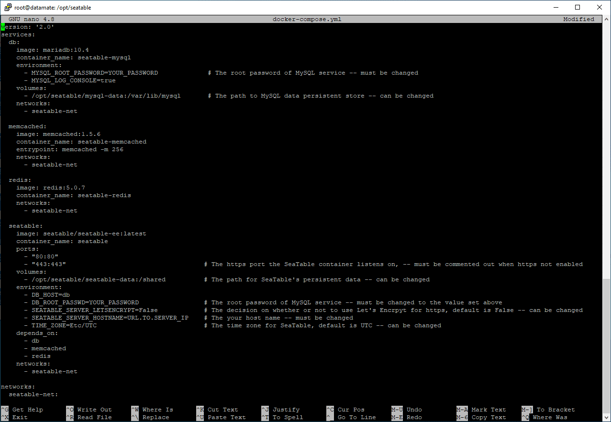
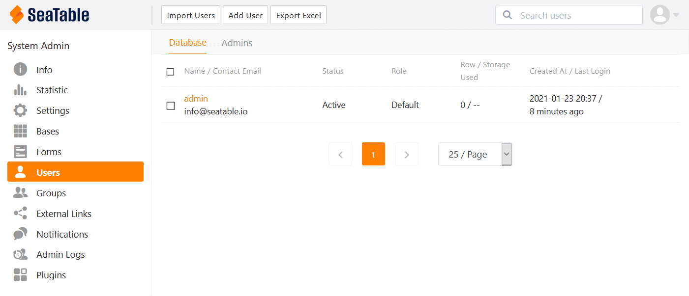

Gracias a Docker , la instalación de SeaTable Enterprise Edition es muy sencilla y puede realizarse en unos instantes. Ubuntu Server, como sistema operativo Linux ampliamente utilizado y bien documentado, es una base excelente para SeaTable. Si ya tienes un servidor Ubuntu, puedes descubrir aquí cómo instalar SeaTable en él en 10 minutos.



## Requisitos

Para que la configuración de SeaTable sea tan fluida como se describe aquí, deben cumplirse algunos requisitos previos. Estos son:

- Servidor VServer / Dedicado con 4 núcleos, 8GB de RAM y alrededor de 10GB de memoria para el sistema operativo Ubuntu, SeaTable y otros requerimientos.
- Acceso de raíz al servidor (a través de SSH o de la consola)
- Subdominio que hace referencia a la dirección IP del servidor mediante el registro A (IPv4) o el registro AAAA (IPv6).
- Servidor accesible en los puertos 80 y 443 a través del subdominio
- Ningún otro servicio escucha en los puertos 80 y 443

Por supuesto, debería prever más espacio en el disco duro que el mencionado para poder almacenar sus propios datos en el soporte de datos, además del sistema operativo y de SeaTable. En particular, si tiene la intención de organizar los archivos en SeaTable, debe planificar muy generosamente el espacio de almacenamiento adicional.

No es un requisito previo, pero sí útil, que se pueda acceder al servidor a través de una dirección IPv4 estática. Esto maximiza la accesibilidad del servidor durante los desplazamientos. En Europa, todavía hay [redes móviles que no soportan IPv6](https://www.datamate.org/status-der-ipv6-implementierung-in-mobilfunknetzen-in-dach/). No se puede acceder a su servidor SeaTable a través de una red de este tipo si no tiene una dirección IPv4.

En caso de que los puertos 80 y/o 443 ya estén ocupados en su servidor, encontrará todo lo que necesita saber para la instalación en su situación en el artículo [Instalación de SeaTable Enterprise en su propio servidor detrás de un servidor web]().

¿Estás listo? ¡Vamos! Suponemos que tiene un shell de root abierto en su servidor.

## Preparación

Primero actualizamos el sistema para tener todos los paquetes al día:

`apt update   apt upgrade -y`

Por supuesto, estos y todos los siguientes comandos deben ser ejecutados con derechos de root a menos que se especifique lo contrario.

SeaTable utiliza docker-compose y es necesario instalar este paquete. Como está disponible a través de las fuentes de paquetes de Ubuntu, el comando es suficiente:

`apt install docker-compose -y`

Los paquetes docker.io y containerd, así como numerosas bibliotecas de Python3, forman parte de las dependencias de docker-compose. Por lo tanto, se instalan al mismo tiempo. El sistema está listo para SeaTable.

## Descargar SeaTable Enterprise

La imagen Docker de SeaTable Enterprise Edition se encuentra en un repositorio en Docker Hub. Utilice el siguiente comando para iniciar la descarga de la imagen de SeaTable:

`docker pull seatable/seatable-ee:latest`

Pasemos al único tema algo más difícil en la configuración de SeaTable. Sin embargo, con las explicaciones ampliadas, este paso también resulta fácil de realizar.

## Individualización de docker-compose.yml

Para introducir esta sección, un poco de conocimiento básico sobre la instalación de SeaTable: SeaTable proporciona sus servicios a través de varios [contenedoresDocker](https://www.docker.com/resources/what-container) . Además del propio contenedor SeaTable, en el que se ejecuta el servidor SeaTable, hay otros tres contenedores implicados. En concreto, se trata de la base de datos MariaDB, el servicio de caché Memcached y el servidor de diccionario redis.

El archivo docker-compose.yml, que se discutirá en un momento, es la receta utilizada por Docker para la instalación y configuración de SeaTable y los otros contenedores. Contiene la configuración central de seguridad (por ejemplo, la contraseña de la base de datos) y le permite adaptar la instalación a sus propios deseos y necesidades (por ejemplo, la configuración de SSL/TLS).

Primero crea el directorio seatable en /opt. Desde la instalación de containerd, el directorio /opt ya contiene el directorio con el mismo nombre. A continuación, descargue el archivo docker-compose.yml en este directorio y abra el archivo con un editor de texto. El siguiente ejemplo de código describe el procedimiento en detalle. Utilizamos el editor de texto nano para editar el docker-compose.yml. Lógicamente, sin embargo, vim o cualquier otro editor de texto también funcionará.

`mkdir /opt/seatable   cd /opt/seatable   wget -O "docker-compose.yml" "https://manual.seatable.io/docker/Enterprise-Edition/docker-compose.yml"   nano docker-compose.yml`

Este es el aspecto del archivo YAML después de la descarga:  

A primera vista, se pueden ver los cuatro contenedores que Docker configura cuando se ejecuta la receta: db, memcached, redis y seatable. Para cada contenedor se declara la imagen que se va a utilizar ("image") y el nombre del contenedor ("container_name"). El nombre del contenedor es el nombre que puede utilizarse posteriormente para gestionar el contenedor a través de la consola Docker .

Además, cada contenedor tiene algunos ajustes individuales, algunos de los cuales necesitan su atención ahora.

En el **contenedor db** tienes que cambiar la contraseña de la base de datos. Sustituye "YOUR_PASSWORD" por una contraseña alfanumérica de varios dígitos. Además, puede ajustar la ruta bajo la cual el directorio /opt/seatable/mysql-data/ está disponible en el contenedor seatable-mysql. Por defecto, es la ruta /var/lib/mysql. Esto no es necesario.

El **contenedor memcached** y el **contenedor redis** no requieren ningún ajuste. Si ya estás ejecutando memcached o redis, puedes eliminar estos dos contenedores del archivo Compose. Sin embargo, para que SeaTable funcione, tendrá que hacer ajustes manuales en los archivos de configuración más adelante.

Los ajustes más extensos deben realizarse en el **contenedor seatable**: En primer lugar, la MYSQL_ROOT_PASSWORD debe introducirse allí. De lo contrario, SeaTable no podrá comunicarse con la base de datos. Así que introduzca la contraseña especificada anteriormente para el contenedor db en "DB_ROOT_PASSWD".

Entonces es cuestión de decidir si Let's Encrypt debe solicitar un certificado SSL para usted e incluirlo en la configuración del servidor web. Si desea hacer esto - que es probablemente la recomendación para la mayoría de los usuarios - a continuación, cambie el valor de la clave SEATABLE_SERVER_LETSENCRYPT a "True" e introduzca el subdominio que está utilizando para SEATABLE_SERVER_HOSTNAME. El Certbot de Let's Encrypt solicitará entonces un certificado SSL como parte de la configuración y lo tendrá en cuenta en la configuración del servidor web.

Puedes dejar la zona horaria en Etc/UTC para Europa Central. Si se encuentra fuera de Europa Central, utilice los códigos de zona horaria habituales.

## Inicialización de la base de datos

Una vez adaptado el archivo YAML a sus necesidades, el siguiente paso es inicializar la base de datos. Para ello, introduzca los siguientes comandos:

`cd /opt/seatable   docker-compose up`

El comando docker-compose ejecuta la receta contenida en el archivo YAML: Se descargan varias imágenes de Docker desde Docker Hub y se extraen. Primero MariaDB, luego Memcached, luego redis y finalmente el propio SeaTable - en el orden prescrito en el docker-compose.yml. Tras la descarga, se inicia el contenedor de base de datos seatable-mysql. Puedes seguir las actividades en la pantalla (ver más abajo). Cuando el contenedor seatable finalmente toma el control y el mensaje "This is an idle script (infinite loop) to keep container running." aparece en la pantalla, puede cancelar el proceso con la combinación de teclas CTRL + C.

¿Ha funcionado hasta ahora? Entonces está muy cerca de tener su propia instancia de SeaTable. Si no es así, consulte los consejos de solución de problemas al final de este artículo.

## Lanzamiento de SeaTable

Ejecute de nuevo docker-compose.yml. A diferencia del paso anterior, docker-compose se ejecuta ahora en segundo plano o "separado". Después de esto, el servidor SeaTable también se puede iniciar seatably en el contenedor Docker . Por último, sólo tiene que crear un usuario administrador. ¡Su servidor SeaTable está entonces listo para sus tareas!

`docker-compose up -d   docker exec -d seatable /shared/seatable/scripts/seatable.sh start   docker exec -it seatable /shared/seatable/scripts/seatable.sh superuser`

Después del último comando, se le pedirá que introduzca una dirección de correo electrónico y una contraseña. Bravo, ha creado el primer usuario en su sistema SeaTable on-premise.

## Puesta en marcha

Ahora llame a la URL que especificó en el docker-compose.yml bajo SEATABLE_SERVER_HOSTNAME. Llegará a la página de inicio de sesión de su servidor SeaTable. Instalación realizada con éxito.

Si has votado por utilizar Let's Encrypt en el docker-compose.yml, entonces tu petición debería ser redirigida directamente a https y por lo tanto la comunicación con tu servidor debería estar encriptada. Si no es así, ahora debe insertar su propio certificado SSL. Copie el certificado en la carpeta /opt/seatable/ssl/ y ajuste la configuración del servidor web nginx. También hay que cambiar las direcciones de http a https en los archivos de configuración ccnet.conf, dtable_web_seetings.py y el dtable_server_config.json. Después, hay que reiniciar nginx, SeaTable y Memcached. Esto se hace con estos tres comandos:

`docker exec -it seatable /shared/seatable/scripts/seatable.sh restart   docker restart seatable-memcached   docker exec -it seatable /usr/sbin/nginx -s reload`

Puede encontrar más información sobre la integración de su propio certificado SSL en el [manual de SeaTable](https://manual.seatable.io/docker/Enterprise-Edition/Deploy%20SeaTable-EE%20with%20Docker/#ssltls).

## Activación de la licencia SeaTable

Puede utilizar SeaTable Enterprise Edition con todas las funciones sin necesidad de una licencia de pago con un máximo de tres usuarios, tanto de forma privada como comercial y también de forma permanente. Por esta razón, no necesitas una licencia para empezar.

Sin embargo, si quiere crear más de tres usuarios en SeaTable, éste se negará a hacerlo. Puede obtener una licencia en [nuestro departamento de ventas](). Puede encontrar más información sobre los precios de SeaTable Enterprise en nuestra [página de precios]().

Para activar la licencia, guarde el archivo de licencia, un archivo TXT, en la carpeta /opt/seatable/seatable-data/seatable y reinicie SeaTable:

`docker exec -d seatable /shared/seatable/scripts/seatable.sh restart`

Los usuarios adicionales estarán inmediatamente disponibles y se mostrarán en el panel de control.

## Solución de problemas

Si algo salió mal durante la instalación, simplemente borre el directorio /opt/seatable y comience de nuevo. Pero tenga cuidado: los datos almacenados en SeaTable se perderán.

Si ha olvidado su contraseña de administrador, ejecute el comando

`docker exec -it seatable /shared/seatable/scripts/seatable.sh superuser`

de nuevo. El comando crea otro usuario con derechos de administrador. Si el comando produce un error, entonces su licencia de SeaTable no permite la creación de más usuarios. (Esto también se aplica al modo de prueba con un máximo de tres usuarios). En este caso, debe establecer un usuario como inactivo en la base de datos MySQL y luego ejecutar el comando de nuevo.
