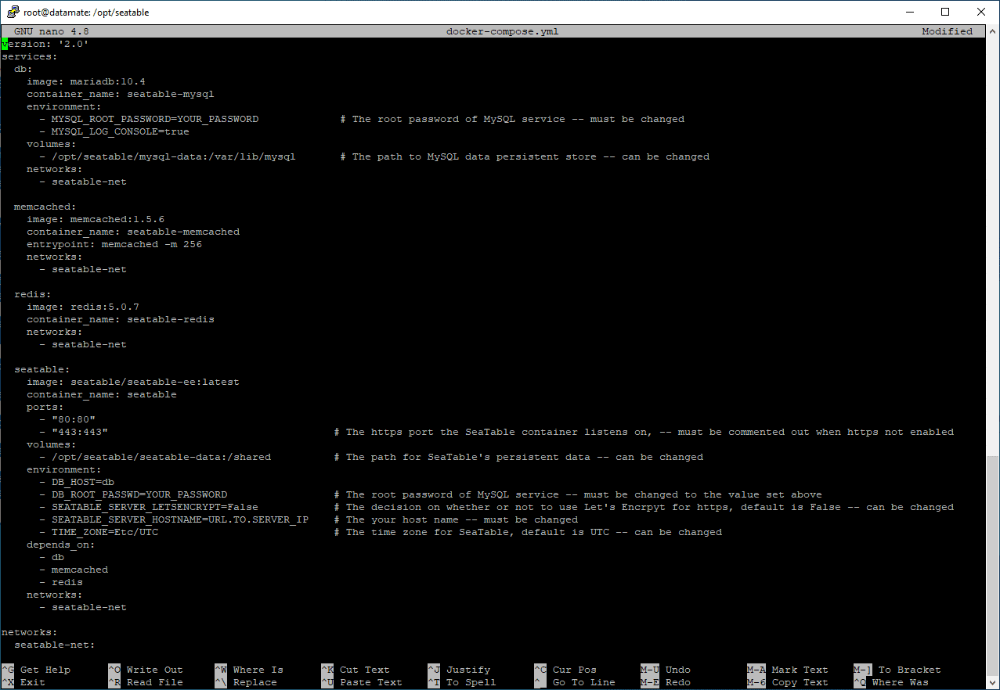

Grâce à Docker, l’installation de SeaTable Enterprise Edition est très simple et se fait en quelques instants. Ubuntu Server, en tant que système d’exploitation Linux largement répandu et bien documenté, constitue une excellente base pour SeaTable. Si vous disposez déjà d’un serveur Ubuntu, découvrez ici comment installer SeaTable dessus en 10 minutes.



Veuillez noter que ce manuel est obsolète. Reportez-vous aux instructions d’installation à jour disponibles sur [https://manual.seatable.io](https://manual.seatable.io).



## Prérequis

Pour que l’installation de SeaTable se déroule aussi facilement que décrit ici, certaines conditions doivent être remplies :

- Serveur virtuel ou dédié avec 4 cœurs, 8 Go de RAM et environ 10 Go d’espace disque pour le système Ubuntu, SeaTable et les autres dépendances
- Accès root au serveur (par SSH ou console)
- Sous-domaine pointant vers l’adresse IP du serveur via un enregistrement A (IPv4) ou AAAA (IPv6)
- Serveur accessible sur les ports 80 et 443 via le sous-domaine
- Aucun autre service n’écoute sur les ports 80 et 443

Bien sûr, il est conseillé de prévoir plus d’espace disque que le minimum indiqué, afin de stocker vos propres données en plus du système et de SeaTable. Si vous prévoyez de gérer aussi des fichiers dans SeaTable, prévoyez un espace de stockage supplémentaire généreux.

Ce n’est pas une obligation, mais il est utile que le serveur soit accessible via une adresse IPv4 statique. Cela maximise l’accessibilité du serveur à distance. En Europe, il existe encore des [réseaux mobiles qui ne prennent pas en charge IPv6.](https://www.datamate.org/status-der-ipv6-implementierung-in-mobilfunknetzen-in-dach/) Sur un tel réseau, votre serveur SeaTable ne sera pas accessible sans adresse IPv4.

Si les ports 80 et/ou 443 sont déjà utilisés sur votre serveur, consultez l’article [Installer SeaTable Enterprise sur son propre serveur derrière un serveur web]() pour tout ce qu’il faut savoir dans ce cas.

Prêt ? C’est parti ! Nous partons du principe que vous avez un accès root ouvert sur votre serveur.

## Préparation

Commencez par mettre à jour le système pour avoir tous les paquets à jour :

`apt update   apt upgrade -y`

Bien entendu, ces commandes et toutes les suivantes doivent être exécutées avec les droits root, sauf indication contraire.

SeaTable utilise docker-compose, qu’il faut installer. Comme il est disponible dans les dépôts Ubuntu, la commande suivante suffit :

`apt install docker-compose -y`

Les paquets docker.io, containerd ainsi que de nombreuses bibliothèques Python3 font partie des dépendances de docker-compose et seront installés automatiquement. Le système est prêt pour SeaTable !

## Télécharger SeaTable Enterprise

L’image Docker de SeaTable Enterprise Edition se trouve dans un dépôt sur Docker Hub. Utilisez la commande suivante pour télécharger l’image :

`docker pull seatable/seatable-ee:latest`

Passons au seul point un peu plus complexe de l’installation de SeaTable. Mais avec les explications détaillées, cette étape reste accessible.

## Personnalisation du docker-compose.yml

Pour introduire cette section, un peu de base sur l’installation de SeaTable : SeaTable fournit ses services via plusieurs [conteneurs Docker](https://www.docker.com/resources/what-container). Outre le conteneur principal SeaTable, trois autres conteneurs sont utilisés : la base de données MariaDB, le service de cache Memcached et le serveur de dictionnaire redis.

Le fichier docker-compose.yml, dont il sera question, est la recette que Docker utilise pour l’installation et la configuration de SeaTable et des autres conteneurs. Il contient des paramètres de sécurité essentiels (ex. : mot de passe de la base de données) et permet d’adapter l’installation à vos besoins (ex. : configuration SSL/TLS).

Commencez par créer le dossier seatable dans /opt. Dans /opt, il existe déjà un dossier du même nom depuis l’installation de containerd. Téléchargez ensuite le fichier docker-compose.yml dans ce dossier et ouvrez-le avec un éditeur de texte. L’exemple ci-dessous décrit la démarche en détail. Nous utilisons nano, mais vim ou tout autre éditeur convient aussi.

```
mkdir /opt/seatable
cd /opt/seatable
wget -O "docker-compose.yml" "https://manual.seatable.io/docker/Enterprise-Edition/docker-compose.yml"
nano docker-compose.yml
```

Voici à quoi ressemble le fichier YAML après le téléchargement :



On voit d’emblée les quatre conteneurs que Docker crée lors de l’exécution : db, memcached, redis et seatable. Pour chaque conteneur, l’image à utiliser (“image”) et le nom du conteneur (“container_name”) sont déclarés. Le nom du conteneur est celui sous lequel il sera géré via la console Docker.

De plus, chaque conteneur a quelques paramètres individuels qui nécessitent votre attention.

Dans le **conteneur db**, vous devez modifier le mot de passe de la base de données. Remplacez “YOUR_PASSWORD” par un mot de passe alphanumérique robuste. Vous pouvez aussi ajuster le chemin où le dossier /opt/seatable/mysql-data/ est monté dans le conteneur seatable-mysql (par défaut : /var/lib/mysql). Ce n’est pas obligatoire.

Les **conteneurs memcached** et **redis** ne nécessitent aucune modification. Si vous exploitez déjà memcached ou redis, vous pouvez retirer ces deux conteneurs du fichier Compose. Pour que SeaTable fonctionne, il faudra alors modifier manuellement les fichiers de configuration.

Dans le **conteneur seatable**, les adaptations sont les plus nombreuses : vous devez d’abord renseigner le MYSQL_ROOT_PASSWORD. Sinon, SeaTable ne pourra pas communiquer avec la base de données. Indiquez donc dans “DB_ROOT_PASSWD” le mot de passe défini pour le conteneur db.

Ensuite, décidez si Let’s Encrypt doit demander un certificat SSL pour vous et l’intégrer à la configuration du serveur web. Si oui – ce qui est recommandé pour la plupart des utilisateurs –, changez la clé SEATABLE_SERVER_LETSENCRYPT sur “True” et renseignez dans SEATABLE_SERVER_HOSTNAME le sous-domaine que vous utilisez. Le Certbot de Let’s Encrypt demandera alors un certificat SSL et l’ajoutera à la configuration du serveur web.

Vous pouvez laisser le fuseau horaire sur Etc/UTC pour l’Europe centrale. Si vous êtes ailleurs, utilisez le code de fuseau horaire approprié.

## Initialisation de la base de données

Une fois le fichier YAML adapté à vos besoins, initialisez la base de données avec :

```
cd /opt/seatable
docker-compose up
```

La commande docker-compose exécute la recette du fichier YAML : plusieurs images Docker sont téléchargées et extraites depuis Docker Hub. D’abord MariaDB, puis Memcached, ensuite redis et enfin SeaTable – dans l’ordre défini dans docker-compose.yml. Après le téléchargement, le conteneur seatable-mysql démarre. Vous pouvez suivre les activités à l’écran (voir ci-dessous). Lorsque le conteneur seatable prend la main et que le message “This is an idle script (infinite loop) to keep container running.” s’affiche, vous pouvez interrompre le processus avec CTRL + C.

Tout s’est bien passé ? Vous êtes alors tout proche de votre propre instance SeaTable auto-hébergée ! Sinon, consultez les conseils de dépannage à la fin de l’article.

## Démarrage de SeaTable

Relancez le docker-compose.yml. Contrairement à l’étape précédente, docker-compose s’exécute maintenant en arrière-plan (“detached”). Ensuite, le serveur SeaTable peut être démarré dans le conteneur seatable. Pour finir, il ne reste plus qu’à créer un utilisateur admin. Votre serveur SeaTable est prêt !

```
docker-compose up -d
docker exec -d seatable /shared/seatable/scripts/seatable.sh start
docker exec -it seatable /shared/seatable/scripts/seatable.sh superuser
```

Après la dernière commande, vous serez invité à saisir une adresse e-mail et un mot de passe. Bravo, vous venez de créer le premier utilisateur sur votre système SeaTable on-premises.

## Mise en service

Rendez-vous sur l’URL que vous avez indiquée dans docker-compose.yml sous SEATABLE_SERVER_HOSTNAME. Vous arrivez sur la page de connexion de votre serveur SeaTable. Installation réussie !

Si vous avez choisi Let’s Encrypt dans docker-compose.yml, votre requête sera directement redirigée vers https et la communication avec votre serveur sera chiffrée. Sinon, il vous faudra ajouter votre propre certificat SSL. Copiez le certificat dans le dossier /opt/seatable/ssl/ et adaptez la configuration du serveur web nginx. Il faudra aussi modifier dans les fichiers ccnet.conf, dtable_web_seetings.py et dtable_server_config.json les adresses de http vers https. Ensuite, redémarrez nginx, SeaTable et Memcached avec ces trois commandes :

```
docker exec -it seatable /shared/seatable/scripts/seatable.sh restart
docker restart seatable-memcached
docker exec -it seatable /usr/sbin/nginx -s reload
```

Plus d’informations sur l’intégration d’un certificat SSL personnalisé dans le [manuel SeaTable](https://manual.seatable.io/docker/Enterprise-Edition/Deploy%20SeaTable-EE%20with%20Docker/#ssltls).


## Activation de la licence SeaTable

Vous pouvez utiliser SeaTable Enterprise Edition avec toutes ses fonctionnalités sans licence payante pour jusqu’à trois utilisateurs – à titre privé ou professionnel, et sans limite de durée. Vous n’avez donc pas besoin de licence pour la mise en service.

Si vous souhaitez créer plus de trois utilisateurs dans SeaTable, cela sera refusé. Vous pouvez obtenir une licence via [notre service commercial](). Plus d’informations sur les tarifs de SeaTable Enterprise sont disponibles sur notre [page des prix]().

Pour activer la licence, enregistrez le fichier de licence (un fichier TXT) dans le dossier /opt/seatable/seatable-data/seatable et redémarrez SeaTable :

`docker exec -d seatable /shared/seatable/scripts/seatable.sh restart`

Les utilisateurs supplémentaires seront alors disponibles immédiatement et affichés dans l’administration système.

## Dépannage

Si quelque chose s’est mal passé lors de l’installation, supprimez simplement le dossier /opt/seatable et recommencez depuis le début. Attention : toutes les données enregistrées dans SeaTable seront perdues.

Si vous avez oublié le mot de passe de l’administrateur, exécutez simplement la commande

`docker exec -it seatable /shared/seatable/scripts/seatable.sh superuser`

à nouveau. Cette commande crée un nouvel utilisateur avec des droits admin. Si la commande affiche une erreur, votre licence SeaTable n’autorise pas la création d’utilisateurs supplémentaires (cela vaut aussi pour le mode test à trois utilisateurs maximum). Dans ce cas, il faut désactiver un utilisateur dans la base MySQL, puis relancer la commande.
