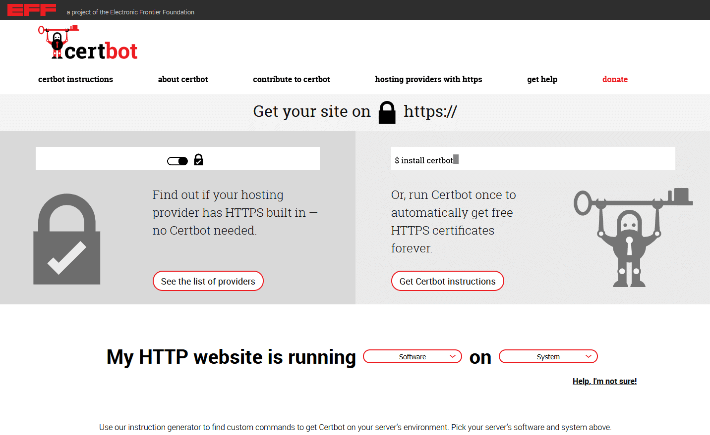

En el artículo [Instalación de SeaTable Enterprise Edition en Ubuntu Server 20.04 LTS]() explicamos la instalación estándar de SeaTable Enterprise en un servidor con Ubuntu Linux. En la instalación estándar, SeaTable se instala en un servidor en el que no se ejecutan otras aplicaciones web. ¿Pero qué pasa si los puertos 80 y 443 ya están ocupados por otro servicio como un servidor web nginx o Apache? En este artículo responderemos a esta pregunta. Como verás, la respuesta es deliciosamente sencilla.

## Requisitos

Los requisitos para instalar SeaTable detrás de un servidor web existente son idénticos a los de la instalación estándar:

- Servidor VServer / Dedicado con al menos 4 núcleos, 8GB de RAM y 10GB de memoria
- Acceso de raíz al servidor (a través de SSH o de la consola)
- Subdominio que hace referencia a la dirección IP del servidor mediante el registro A (IPv4) o el registro AAAA (IPv6).
- Servidor accesible en los puertos 80 y 443 a través del subdominio

## Preparación y descarga

No sólo los requisitos previos, sino también los primeros pasos son idénticos a los de la instalación estándar: primero la instalación de docker-compose, luego la extracción de la imagen de SeaTable de Docker Hub y finalmente el guardado del archivo docker-compose en formato YAML en el directorio /opt/seatable.

Con estos comandos se realizan estas acciones:  
`apt update   apt upgrade -y   apt install docker-compose -y   docker pull seatable/seatable-ee:latest   mkdir /opt/seatable   cd /opt/seatable   wget -O "docker-compose.yml" "https://manual.seatable.io/docker/Enterprise-Edition/docker-compose.yml"`

SeaTable también puede crearse en una ubicación distinta al directorio /opt/seatable. Sin embargo, si quiere hacer esto, también debería almacenar todos los demás archivos de SeaTable en esta otra ubicación por razones de consistencia. Dado que esto puede conducir fácilmente a errores, lo desaconsejamos.

## Individualización de docker-compose.yml

Las instrucciones de la instalación estándar explican la estructura y el funcionamiento del archivo docker-compose. Esto no debe repetirse aquí. Utilice [este enlace]() para ir directamente a la parte correspondiente del artículo sobre la instalación estándar.

En el archivo YAML, ahora es necesario hacer algunos ajustes, por un lado para tener en cuenta sus propios requisitos, y por otro lado para permitir el funcionamiento detrás de un servidor web.

Los ajustes necesarios incluyen, en particular, la contraseña de la base de datos, que debe cambiarse en el contenedor db (MYSQL_ROOT_PASSWORD) y en el contenedor seatable (DB_ROOT_PASSWD). También hay que cambiar la URL bajo la que se puede acceder a SeaTable. Para ello se utiliza el valor SEATABLE_SERVER_HOSTNAME. Introduzca el dominio sin http:// o https://.

Además de estas modificaciones, que también hay que hacer para la instalación estándar, también hay que adaptar el puerto HTTP y HTTPS. La configuración de los puertos del contenedor sentable se encuentra en la sección del mismo nombre. Los valores por defecto en SeaTables docker-compose.yml son:  
 `- "80:80" #HTTP port   - "443:443" #HTTPS port`  
El valor que precede a los dos puntos es el puerto del contenedor en el host Docker , es decir, el puerto al que escucha el proxy Docker y que se reenvía al contenedor. El segundo valor después de los dos puntos es el puerto dentro del contenedor Docker al que se reenvían las peticiones. Estos dos puertos no tienen por qué ser idénticos y hacemos uso de esta propiedad.

Como los puertos 80 y 443 ya están ocupados en el servidor, hay que cambiar los puertos en el host Docker . Sin embargo, los puertos del contenedor pueden y deben permanecer inalterados. Esto evita cambios innecesarios en los archivos de configuración de SeaTable. Una configuración alternativa de los puertos podría ser la siguiente:

 `- "880:80" #HTTP port   - "4443:443" #HTTPS port`

Los puertos 880 y 4443 elegidos aquí son puertos alternativos populares para los puertos 80 y 443. También se pueden utilizar otros números de puerto en su lugar. En cambio, hay que tenerlas en cuenta a la hora de configurar el servidor web en el host (véase más adelante).

Deje el valor SEATABLE_SERVER_LETSENCRYPT en False. Esta función sólo puede utilizarse con la instalación estándar.

## Inicialización de la base de datos

Con el docker adaptado -compose.yml la base de datos de SeaTable puede ahora ser inicializada. Los pasos -como no podía ser de otra manera- son los de la instalación estándar:

`cd /opt/seatable   docker-compose up`

Ahora puede seguir en directo en la pantalla cómo Docker procesa las instrucciones del archivo YAML. Al cabo de un rato, las actividades se detienen. El último mensaje es "This is an idle script (infinite loop) to keep container running". Detén el proceso en este punto con la combinación de teclas CTRL + C.

## Configuración del acceso HTTP

Para asegurar que las llamadas a la URL de SeaTable también terminen en el contenedor de SeaTable, el archivo de configuración del servidor web en el host debe ser adaptado. En concreto, las peticiones que llegan a través de la URL de SeaTable y el puerto 80 deben ser reenviadas al proxy Docker . Esto escucha - como se define en el docker-compose - en el puerto 880.

Por ejemplo, una directiva que hace esto para nginx tiene el siguiente aspecto:

`server {   listen 80;   listen [::]:80;   server_name seatable.example.com;`

location / {  
proxy_pass http://127.0.0.1:880;  
}  
}

(Proporcionaremos un bloque de código para Apache a su debido tiempo).

Después de ajustar la configuración del servidor web, reinicie el servidor web para que el cambio sea efectivo.

Dado que la comunicación dentro del contenedor Docker seatable no cambia, no hay que hacer ningún ajuste en los distintos archivos de configuración de la carpeta /opt/seatable/seatable-data/seatable/conf.

## Lanzamiento de SeaTable

Ahora SeaTable está listo para funcionar. En primer lugar, inicie de nuevo todos los contenedores Docker ejecutando docker-compose.yml, esta vez en el llamado modo "detached", luego llame al script SH para iniciar SeaTable en el contenedor seatable y finalmente cree el primer usuario administrador.

`docker-compose up -d   docker exec -d seatable /shared/seatable/scripts/seatable.sh start   docker exec -it seatable /shared/seatable/scripts/seatable.sh superuser`

Ahora ya puedes acceder a Seatable a través del puerto 80. Llamando al dominio de SeaTable (aquí en el ejemplo seatable.example.com) llegará a la página de acceso de su servidor SeaTable.

Llamar a https://seatable.example.com no funciona todavía. Ahora hay que configurar el acceso cifrado como último paso.

## Configuración del acceso HTTPS

El procedimiento para configurar el acceso HTTPS depende del certificado SSL/TLS utilizado. Si ya dispone de un certificado correspondiente, siga las instrucciones de la autoridad de certificación a la que compró el certificado SSL.

Si formas parte de la mayoría y quieres gestionar tu certificado HTTPS con Let's Encrypt, sólo tienes que seguir las instrucciones del [sitio web Certbot de la Electronic Frontier Foundation](https://certbot.eff.org/).

En el caso de nginx en Ubuntu 20.04, sólo son necesarios cuatro comandos para solicitar e incluir un certificado SSL de Let's Encrypt:  
`sudo snap install core; sudo snap refresh core   sudo snap install --classic certbot   sudo ln -s /snap/bin/certbot /usr/bin/certbot   sudo certbot --nginx`

Después de llamar al último comando, se accede al menú interactivo de Certbot. Sigue las instrucciones y toma las decisiones necesarias. Si se cumplen los requisitos de Let's Encrypt, se solicita e integra el certificado. La próxima vez que se llame a la URL de SeaTable, la conexión se establecerá a través del puerto 443 y HTTPS.

Si le indicas a Certbot que cambie automáticamente la configuración del servidor web para incluir el certificado SSL solicitado, se verá así (o similar) después en el caso de nginx:

`server {   listen 443 ssl; # managed by Certbot   listen [::]:443 ssl; # managed by Certbot   server_name seatable.example.com;`

ssl_certificate /etc/letsencrypt/live/seatable.example.com/fullchain.pem; # gestionado por Certbot  
ssl_certificate_key /etc/letsencrypt/live/seatable.example.com/privkey.pem; # gestionado por Certbot  
include /etc/letsencrypt/options-ssl-nginx.conf; # gestionado por Certbot  
ssl_dhparam /etc/letsencrypt/ssl-dhparams.pem; # gestionado por Certbot

location / {  
proxy_pass http://127.0.0.1:880;  
}  
}

En caso de que haya decidido no cambiar la configuración del servidor web por parte de Let's Encrypt, deberá realizar esta modificación manualmente. Importante: No olvide el reinicio obligatorio del servidor web después.

Por último, la conversión a HTTPS también debe tenerse en cuenta en dos archivos de configuración de SeaTable. En concreto, estos dos archivos de configuración se encuentran en la carpeta /opt/seatable/seatable-data/seatable/conf:

- ccnet.conf
- dtable_web_settings.py

En ccnet.conf, la SERVICE_URL debe cambiarse de "http://" a "https://".

En dtable_web_settings.py, todas las URL deben ser adaptadas. Añada una "s" después de "http" en DTABLE_SERVER_URL, DTABLE_SOCKET_URL, DTABLE_WEB_SERVICE_URL y FILE_SERVER_ROOT para que todas las URL empiecen por "https".

Reinicia SeaTable ahora y diviértete con SeaTable!
