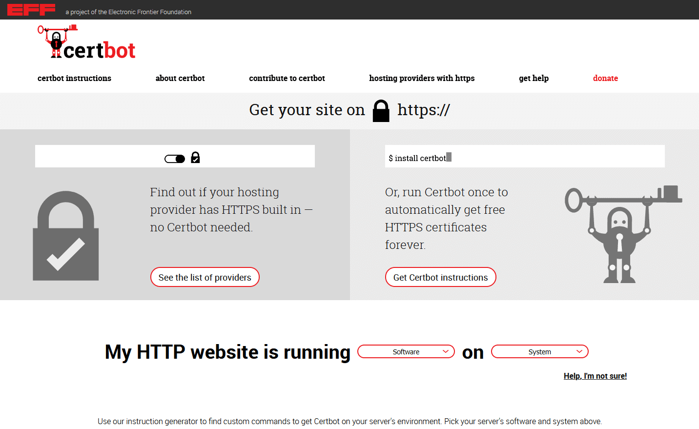

Dans l'article [Installation de SeaTable Enterprise Edition sous Ubuntu Server 20.04 LTS](/fr/seatable-enterprise-edition-unter-ubuntu-20-04-lts-installieren/?lang=auto) nous avons expliqué l'installation standard de SeaTable Enterprise sur un serveur avec Ubuntu Linux. Dans l'installation standard, SeaTable est installé sur un serveur sur lequel aucune autre application web ne tourne. Mais que faire si les ports 80 et 443 sont déjà occupés par un autre service tel qu'un serveur web nginx ou Apache ? Nous allons répondre à cette question dans cet article. Comme vous le verrez, la réponse est délicieusement simple.

## Exigences

Les conditions requises pour installer SeaTable derrière un serveur web existant sont identiques à celles de l'installation standard :

- VServer / Serveur dédié avec au moins 4 cœurs, 8 Go de RAM et 10 Go de mémoire.
- Accès racine au serveur (via SSH ou console)
- Sous-domaine qui fait référence à l'adresse IP du serveur via un enregistrement A (IPv4) ou un enregistrement AAAA (IPv6).
- Serveur accessible sur les ports 80 et 443 via le sous-domaine

## Préparation et téléchargement

Non seulement les conditions préalables, mais aussi les premières étapes sont identiques à celles de l'installation standard : d'abord l'installation de docker-compose, puis le pull de l'image SeaTable depuis Docker Hub et enfin l'enregistrement du fichier docker-compose au format YAML dans le répertoire /opt/seatable.

Ces commandes vous permettent d'effectuer les actions suivantes :  
`apt update   apt upgrade -y   apt install docker-compose -y   docker pull seatable/seatable-ee:latest   mkdir /opt/seatable   cd /opt/seatable   wget -O "docker-compose.yml" "https://manual.seatable.io/docker/Enterprise-Edition/docker-compose.yml"`

SeaTable peut également être créé dans un emplacement autre que le répertoire /opt/seatable. Si vous voulez faire cela, cependant, vous devriez également stocker tous les autres fichiers SeaTable dans cet autre emplacement pour des raisons de cohérence. Comme cela peut facilement conduire à des erreurs, nous vous le déconseillons.

## Individualisation de docker-compose.yml

Les instructions pour l'installation standard expliquent la structure et le fonctionnement du fichier docker-compose. Il n'est pas nécessaire de le répéter ici. [Ce lien](/fr/seatable-enterprise-edition-unter-ubuntu-20-04-lts-installieren/#Individualisierung_der_docker-composeyml?lang=auto) vous permet de passer directement à la partie pertinente de l'article sur l'installation standard.

Dans le fichier YAML, il est maintenant nécessaire de procéder à quelques ajustements, d'une part pour tenir compte de vos propres besoins, et d'autre part pour permettre un fonctionnement derrière un serveur web.

Les ajustements nécessaires concernent notamment le mot de passe de la base de données, qui doit être modifié dans le conteneur db (MYSQL_ROOT_PASSWORD) et dans le conteneur seatable (DB_ROOT_PASSWD). L'URL sous laquelle SeaTable doit être accessible doit également être modifiée. La valeur SEATABLE_SERVER_HOSTNAME est utilisée à cet effet. Entrez le domaine sans http:// ou https://.

En plus de ces modifications, qui doivent également être effectuées pour l'installation standard, les ports HTTP et HTTPS doivent également être adaptés. La configuration des ports du conteneur seatable est décrite dans la section du même nom. Les valeurs par défaut dans SeaTables docker-compose.yml sont les suivantes :  
 `- "80:80" #HTTP port   - "443:443" #HTTPS port`  
La valeur avant les deux points est le port du conteneur sur l'hôte Docker , c'est-à-dire le port sur lequel le proxy Docker écoute et qui est transmis au conteneur. La deuxième valeur après les deux points est le port à l'intérieur du conteneur Docker vers lequel les requêtes sont transmises. Ces deux ports ne doivent pas être identiques et c'est cette propriété que nous utilisons.

Comme les ports 80 et 443 sont déjà occupés sur le serveur, il faut changer les ports sur l'hôte Docker . En revanche, les ports du conteneur peuvent et doivent rester inchangés. De cette manière, on évite de modifier inutilement les fichiers de configuration de SeaTable. Une configuration alternative des ports pourrait ressembler à ceci :

 `- "880:80" #HTTP port   - "4443:443" #HTTPS port`

Les ports 880 et 4443 choisis ici sont des ports alternatifs populaires pour les ports 80 et 443. D'autres numéros de port peuvent également être utilisés à leur place. Il faut alors plutôt en tenir compte lors de la configuration du serveur web sur l'hôte (voir ci-dessous).

Laissez la valeur SEATABLE_SERVER_LETSENCRYPT définie sur False. Cette fonction ne peut être utilisée qu'avec l'installation standard.

## Initialisation de la base de données

La base de données de SeaTable peut maintenant être initialisée à l'aide de la version adaptée docker-compose.yml. Les étapes - comment pourrait-il en être autrement - sont celles de l'installation standard :

`cd /opt/seatable   docker-compose up`

À l'écran, vous pouvez maintenant suivre en direct comment Docker traite les instructions dans le fichier YAML. Après un certain temps, les activités s'arrêtent. Le dernier message est "This is an idle script (infinite loop) to keep container running". Interrompez le processus à ce stade avec la combinaison de touches CTRL + C.

## Configuration de l'accès HTTP

Pour que les appels à l'URL SeaTable aboutissent également au conteneur SeaTable, le fichier de configuration du serveur web doit être adapté sur l'hôte. Concrètement, les demandes qui arrivent via l'URL SeaTable et le port 80 doivent être transmises au proxy Docker . Celui-ci écoute - comme cela a été défini dans docker-compose - sur le port 880.

Par exemple, une directive qui fait cela pour nginx ressemble à ceci :

`server {   listen 80;   listen [::]:80;   server_name seatable.example.com;`

location / {  
proxy_pass http://127.0.0.1:880;  
}  
}

(Nous fournirons un bloc de code pour Apache en temps voulu).

Après avoir ajusté la configuration du serveur Web, redémarrez le serveur Web pour que la modification soit effective.

Comme la communication au sein du conteneur Docker seatable est inchangée, aucune adaptation ne doit être apportée aux divers fichiers de configuration dans le dossier /opt/seatable/seatable-data/seatable/conf.

## Lancement de SeaTable

SeaTable est maintenant prêt pour la mise en production. Tout d'abord, démarrez à nouveau tous les conteneurs Docker en exécutant docker-compose.yml, cette fois en mode dit "détaché", puis appelez dans le conteneur seatable le script SH pour démarrer SeaTable et enfin créez le premier utilisateur admin.

`docker-compose up -d   docker exec -d seatable /shared/seatable/scripts/seatable.sh start   docker exec -it seatable /shared/seatable/scripts/seatable.sh superuser`

Maintenant, vous pouvez déjà atteindre Seatable via le port 80. En appelant le domaine SeaTable (ici dans l'exemple seatable.example.com) vous arriverez à la page de connexion de votre serveur SeaTable.

L'appel à https://seatable.example.com ne fonctionne pas encore. L'accès crypté doit maintenant être mis en place comme dernière étape.

## Configuration de l'accès HTTPS

La procédure de configuration de l'accès HTTPS dépend du certificat SSL/TLS utilisé. Si vous disposez déjà d'un certificat correspondant, veuillez suivre les instructions de l'autorité de certification auprès de laquelle vous avez acheté le certificat SSL.

Si vous faites partie de la majorité et souhaitez gérer votre certificat HTTPS à l'aide de Let's Encrypt, il vous suffit de suivre les instructions du [site Certbot de l'Electronic Frontier Foundation](https://certbot.eff.org/).

Dans le cas de nginx sur Ubuntu 20.04, seules quatre commandes sont nécessaires pour demander et inclure un certificat SSL Let's Encrypt :  
`sudo snap install core; sudo snap refresh core   sudo snap install --classic certbot   sudo ln -s /snap/bin/certbot /usr/bin/certbot   sudo certbot --nginx`

Après avoir appelé la dernière commande, le menu interactif de Certbot est appelé. Suivez les instructions et prenez les décisions nécessaires. Si les conditions requises pour Let's Encrypt sont remplies, le certificat est demandé et intégré. Lors du prochain appel de l'URL de SeaTable, la connexion est établie via le port 443 et HTTPS.

Si vous demandez à Certbot de modifier automatiquement la configuration du serveur web pour inclure le certificat SSL demandé, cela ressemblera à ceci (ou à quelque chose de similaire) par la suite dans le cas de nginx :

`server {   listen 443 ssl; # managed by Certbot   listen [::]:443 ssl; # managed by Certbot   server_name seatable.example.com;`

ssl_certificate /etc/letsencrypt/live/seatable.example.com/fullchain.pem ; # géré par Certbot  
ssl_certificate_key /etc/letsencrypt/live/seatable.example.com/privkey.pem ; # géré par Certbot  
include /etc/letsencrypt/options-ssl-nginx.conf ; # géré par Certbot  
ssl_dhparam /etc/letsencrypt/ssl-dhparams.pem ; # géré par Certbot

location / {  
proxy_pass http://127.0.0.1:880;  
}  
}

Dans le cas où vous avez décidé de ne pas modifier la configuration du serveur web par Let's Encrypt, vous devez effectuer cette modification manuellement. Important : n'oubliez pas le redémarrage obligatoire du serveur web par la suite.

Enfin, la conversion à HTTPS doit également être prise en compte dans deux fichiers de configuration de SeaTable. Plus précisément, ces deux fichiers de configuration sont situés dans le dossier /opt/seatable/seatable-data/seatable/conf :

- ccnet.conf
- dtable_web_settings.py

Dans le fichier ccnet.conf, l'URL SERVICE_URL doit passer de "http://" à "https://".

Dans le fichier dtable_web_settings.py, toutes les URL doivent être adaptées. Pour DTABLE_SERVER_URL, DTABLE_SOCKET_URL, DTABLE_WEB_SERVICE_URL et FILE_SERVER_ROOT, ajoutez un "s" après le "http", de sorte que toutes les URL commencent par "https".

Redémarrez SeaTable maintenant et amusez-vous avec SeaTable !
