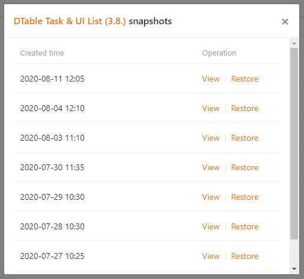

SeaTable ist die ultimative Lösung für Datenmanagement und Online-Zusammenarbeit. Mit seinen vielfältigen Feldtypen, Organisations-, Gruppen-, Teammanagement- und Kollaborationsfunktionen sowie zahlreichen Vorlagen und Plugins entfesselt SeaTable die volle Produktivität Ihres Teams.

Wir freuen uns, SeaTable in der Version 1.2 in den Produktivbetrieb zu übernehmen. SeaTable 1.2 hält einige wichtige Aktualisierungen in Bezug auf Funktionalität und Benutzererfahrung für Sie bereit. Die vollständige Liste der Änderungen finden Sie im [Changelog](). In diesem Release Note stellen wir Ihnen einige der aufregendsten neuen Funktionen vor.

## Mehr Farben und Symbole auf der Startseite

Die Startseite sah in der Vergangenheit etwas langweilig aus. Das ist nun vorbei! In der neuen Version können Sie das Symbol und die Farbe jeder Base ändern. Ihnen stehen insgesamt 12 Farben und mehr als 25 Symbole zur Verfügung. Klicken Sie einfach auf das Stift-Symbol rechts neben dem Basenamen und gestalten Sie das Aussehen Ihrer Bases ganz nach Ihren Wünschen.

Das Anpassen von Base-Symbolen und -farben hilft Ihnen dabei, Ihre Bases besser zu organisieren und schneller wiederzufinden, insbesondere wenn Sie viele Bases in SeaTable haben. In einer zukünftigen Version wird die Farbe des Base-Headers in der Tabellenansicht mit der Farbe des Base-Symbols synchronisiert.

## Batch-Export von Dateien und Bildern

Es wird der Zeitpunkt kommen, an dem Sie die in Ihrer Tabelle enthaltenen Dateien und Bilder herunterladen möchten. Wenn Sie beispielsweise daran gehen, eine Base zu archivieren, kann die neue Batch-Exportfunktion nützlich werden. Beim Batch-Export werden alle Dateien oder Bilder in einer Spalte in eine ZIP-Datei komprimiert, die sich dann bequem als Paket auf die Festplatte herunterladen lässt.

In den Kontextmenüs der Spaltentypen Datei und Bild finden Sie die Funktion “Alle herunterladen”. Mit einem Klick auf diese zeigt SeaTable die resultierende ZIP-Datei und auch die Anzahl der herunterzuladenden Elemente in einem Pop-up an. Ein weiterer Klick auf das Download-Icon startet den Download des Archivs.

## Reise in die Vergangenheit – Snapshots

In SeaTable haben Sie immer den Überblick über die Vorgänge in Ihren Bases. Das Log listet alle Änderungen, Ergänzungen und Löschungen von Datensätzen sowie alle anderen Vorgänge in einer Base auf. Darüber hinaus erstellt SeaTable automatisch alle 24 Stunden [Snapshots von Bases](), in denen aktiv gearbeitet wird.

Ein Snapshot erfasst den Zustand einer Base zum Zeitpunkt seiner Erstellung. Mit anderen Worten: Snapshots sind im Grunde Maschinen, um in die Vergangenheit zu reisen. Sie möchten sehen, wie eine Base vor drei Tagen aussah? Vergessen Sie das Log, benutzen Sie einen Snapshot!

Sie können die verfügbaren Snapshots einer Base in der Tabellenansicht oder über die erweiterten Optionen der Base auf der Startseite aufrufen. (Beachten Sie, dass die Dauer, für die SeaTable Ihre Snapshots speichert, von Ihrem Abonnement abhängig ist.) Beim Wiederherstellen eines Snapshots wird eine neue Base erstellt. Machen Sie sich also keine Sorgen, dass Sie Ihre aktuelle Base bei der Wiederherstellung eines Snapshots überschreiben.

## Duplizierung von Ansichten

Die vielseitigen Ansichten sind eine der besten Funktionen von SeaTable. Sortieren, gruppieren und filtern Sie Ihre Datensätze nach Ihren Wünschen, blenden Sie nicht benötigte Spalten aus, sperren Sie Ansichtseinstellungen gegen Änderungen und speichern Sie diese Einstellungen als individuelle Ansicht. Wenn Sie diesen Blick auf die Daten wieder benötigen, ist er nur einen Klick entfernt.

Die Ansichtsfunktion ist jetzt noch stärker geworden! In der Vergangenheit war das Erstellen einer neuen Ansicht, die einer vorhandenen Ansicht ähnlich war, etwas aufwändiger. Alle Sortier-, Gruppier- und Filterbedingungen mussten von Grund auf neu eingerichtet werden. Dieser Frustfaktor ist nun weg. Mit SeaTable 1.2 lassen sich Ansichten duplizieren.

Im Ansichtsmenü finden Sie den Menüpunkt ‘Ansicht duplizieren’. Mit einem Klick wird eine neue Ansicht basierend auf der vorhandenen erstellt. Die Anpassungen an den Sortier-, Gruppier- und Filterbedingungen in dieser neuen Ansicht sind dann schnell vorgenommen.

## Mehr Freigabeberechtigungen (nur für Enterprise Abos)

Eine SeaTable Base lässt sich mühelos mit anderen Benutzern teilen. Dank der Freigabeberechtigungen hat der freigebende Benutzer auch die volle Kontrolle darüber, wer die Daten in einer freigegebenen Base ändern kann oder wer nur Lesezugriff hat. Enterprise-Abonnenten erhalten jetzt noch mehr Kontrolle über gemeinsam genutzte Bases. Verantwortlich dafür sind die neuen Funktionen Ansichtsfreigabe, Zeilensperrung und Spaltenberechtigungen.

### Ansichtsfreigabe

Anstatt eine gesamte Base zu teilen, haben Enterprise-Abonnenten jetzt die Möglichkeit, nur bestimmte Ansichten auf die Daten einer Base zu teilen. Filtern Sie die Daten, blenden Sie Spalten aus, sortieren und gruppieren Sie die Datensätze so, dass die Ansicht die gewünschte Botschaft laut und deutlich spricht, und stellen Sie nur diese Ihren Kollegen zur Verfügung. Dafür ist die neue Funktion ‘Ansicht teilen’ gedacht.

Wenn Sie eine Base freigeben – auch wenn dies schreibgeschützt erfolgt – legen Sie alle in der Base gespeicherten Daten offen. Bei einer geteilten Ansicht haben die Empfänger nur Zugriff auf die Daten, die sie sehen sollen.

### Zeilensperrung

Sie wollen eine Base mit anderen Teammitgliedern teilen, möchten aber verhindern, dass diese den Inhalt einer oder mehrerer Zeilen ändern? Dann hat SeaTable 1.2 genau das, was Sie brauchen: die neue Funktion zum Sperren von Zeilen.

Ein Rechtsklick auf eine Zelle ruft das Kontextmenü der Zeile auf, wo Sie die neue Option ‘Zeile sperren’ finden. Sobald eine Zeile gesperrt ist, wird in der oberen rechten Ecke der Zeilennummer ein rotes Dreieck angezeigt. Wiederholen Sie den Vorgang zum Entsperren. Base-Administratoren (Basebesitzer sowie Gruppenadministratoren) können jede Zeile entsperren; andere Benutzer können nur von sich selbst gesperrte Zeilen entsperren.

### Spaltenberechtigungen

Neben der Zeilensperrung können Base-Administratoren auch den Zugriff auf bestimmte Spalten beschränken. Mit SeaTable 1.2 können Sie entscheiden, wer Einträge in einer Spalte bearbeiten darf: niemand, nur Admins oder bestimmte Benutzer. Unnötig zu erwähnen: Spaltenberechtigungen können natürlich mit Zeilensperren kombiniert werden.

Spaltenberechtigungen sind für alle Spaltentypen verfügbar. Öffnen Sie das Spaltenkontextmenü und wählen Sie ‘Spaltenberechtigungen bearbeiten’. Der Assistent, der auftaucht, führt Sie durch den Rest.

## Allgemeine Verbesserungen

Neben den neuen Funktionen haben die SeaTable Entwickler auch fleißig daran gearbeitet, vorhandene Funktionen zu verbessern und die Benutzererfahrung zu optimieren. Ein besonderer Schwerpunkt lag auf der Verwendung von SeaTable auf verschiedenen Bildschirmen, insbesondere auf Mobilgeräten. Die verschiedenen Ansichten sollten nun auf Mobilgeräten genauso gut funktionieren wie auf Desktop-Bildschirmen.
