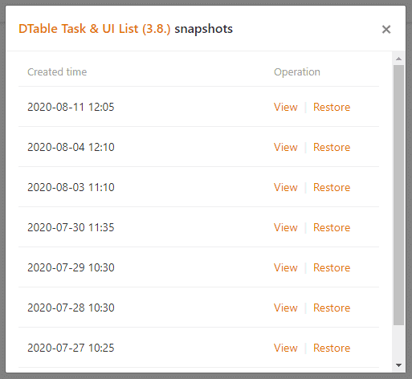
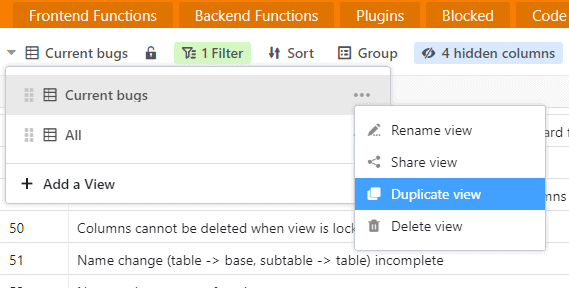
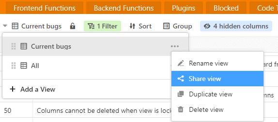
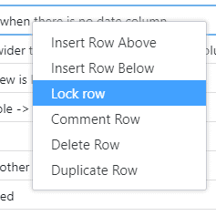
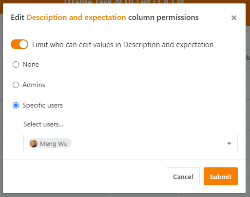

SeaTable is the ultimate solution for data management and online collaboration. With its rich field types, organization / group / team management and collaboration functions as well as various templates and plugins, SeaTable unleashes your team's full productive power with its automated data processing and workflow.

We are thrilled to announce the official release of SeaTable Version 1.2. SeaTable 1.2 has some major updates in functionality and user experience in store for you. For the full list of changes, check the [changelog](https://seatable.io/en/docs/changelog/version-1-2/). In this release note, we present some of the most exciting new features to you.

## More colors and icons on the home page

The home page looked a bit boring in the past. This is over now! In the new version you can change the icon and color of each base. You have a total of 12 colors and more than 25 icons at your disposal. Just click on the pencil icon to the right of the base name and customize the look of your bases according to your wishes.

Customizing base icons and colors will help you organize your bases better and find them faster, especially if you have many bases in SeaTable. In a future version, the base header color in the table view will be synchronized with the base icon color.

## Batch export of files or images

There will come a time when you will want to download the files and images contained in your spreadsheet. For example, when you go to archive a base, the new batch export feature can become useful. Batch export compresses all the files or images in a column into a ZIP file, which can then be conveniently downloaded to your hard drive as a package.

In the context menus of the File and Image column types you will find the "Download All" function. With a click on this, SeaTable displays the resulting ZIP file and also the number of items to be downloaded in a pop-up. Another click on the download icon starts the download of the archive.

## Journey into the past - Snapshots

In SeaTable you always have an overview of the processes in your bases. The log lists all changes, additions and deletions of records as well as all other processes in a base. In addition, SeaTable automatically creates [snapshots](https://seatable.io/en/docs/historie-und-versionen/speichern-der-aktuellen-base-als-snapshot/) every 24 hours of bases that are actively being worked on.

A snapshot captures the state of a base at the time it was created. In other words, snapshots are basically machines for traveling back in time. You want to see what a base looked like three days ago? Forget the log, use a snapshot!

You can access the available snapshots of a Base in the Table view or from the Base advanced options on the Home page. (Note that the length of time SeaTable stores your snapshots depends on your subscription). When you restore a snapshot, a new Base is created. So don't worry about overwriting your current Base when restoring a Snapshot.

## Duplication of views

The versatile views are one of the best features of SeaTable. Sort, group and filter your data sets as you wish, hide columns you don't need, lock view settings against changes and save these settings as an individual view. When you need that view of the data again, it's just a click away.

The view function is now even more powerful! In the past, creating a new view that was similar to an existing view was a bit more involved. All sorting, grouping and filtering conditions had to be set up from scratch. This frustration factor is now gone. With SeaTable 1.2, views can be duplicated.

In the view menu you will find the menu item 'Duplicate view'. With one click, a new view is created based on the existing one. The adjustments to the sorting, grouping and filtering conditions in this new view are then quickly made.

## Fine-grained sharing permissions (Enterprise subscribers only)

A SeaTable Base can be easily shared with other users. Sharing permissions also give the sharing user full control over who can modify the data in a shared base or who has read-only access. Enterprise subscribers now get even more control over shared bases. Responsible for this are the new view sharing, row locking, and column permissions features.

### View sharing

Instead of sharing an entire base, Enterprise subscribers now have the ability to share only specific views on a base's data. Filter the data, hide columns, sort and group the records so that the view speaks the desired message loud and clear, and share only that with your colleagues. That's what the new 'Share View' feature is for.

When sharing a base - even when read-only - you expose the entire data in the base. With shared views, the recipients only have access to the data you want them to see.

### Row locking

You want to share a base with other team members, but you want to prevent them from changing the content of one or more rows ? Then SeaTable 1.2 has exactly what you need: the new feature to lock rows.

A right click on a cell calls the context menu of the row where you can find the new option 'row lock'. Once a row is locked, a red triangle will be displayed in the upper right corner of the row number. Repeat the process to unlock it. Base administrators (base owners as well as group administrators) can unlock any row ; other users can only unlock rows locked by themselves.

### Column permissions

Besides row locking, Base administrators can also restrict access to certain columns. With SeaTable 1.2 you can decide who is allowed to edit entries in a column: nobody, only admins or specific users. Needless to say: column permissions can of course be combined with row locking.

column permissions are available for all column types. Open the column context menu and select 'column permissions edit'. The wizard that pops up will guide you through the rest.

## General improvements

In addition to the new features, SeaTable developers have also been working diligently to improve existing features and optimize the user experience. A particular focus has been on the use of SeaTable on different screens, especially mobile devices. The different views should now work as well on mobile devices as they do on desktop screens.
