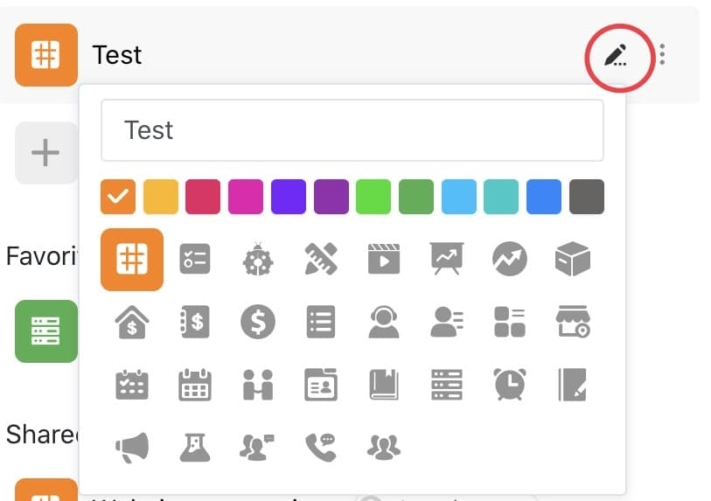

SeaTable é a solução final para a gestão de dados e colaboração online. Com os seus múltiplos tipos de campo, organização, grupo, gestão de equipas e características de colaboração, bem como numerosos modelos e plugins, o SeaTable liberta a produtividade total da sua equipa.

Temos o prazer de anunciar que a versão 1.2 do SeaTable entrou em funcionamento. SeaTable 1.2 contém algumas actualizações importantes para si em termos de funcionalidade e experiência do utilizador. Consulte o [changelog]() para obter a lista completa das alterações. Nesta nota de lançamento, apresentamos-lhe algumas das novidades mais excitantes.

## Mais cores e símbolos na página inicial

A página inicial parecia um pouco aborrecida no passado. Isso agora acabou! Na nova versão, podes alterar o ícone e a cor de cada base. Tens um total de 12 cores e mais de 25 símbolos à tua disposição. Basta clicar no ícone do lápis à direita do nome da base e desenhar o aspecto das suas bases de acordo com os seus desejos.

Personalizar os ícones e as cores das bases ajuda-o a organizar melhor as suas bases e a encontrá-las mais rapidamente, especialmente se tiver muitas bases no SeaTable. Numa versão futura, a cor do cabeçalho da base na vista de tabela será sincronizada com a cor do símbolo da base.

## Exportação em lote de ficheiros e imagens

Chegará um momento em que vai querer descarregar os ficheiros e imagens contidos na sua tabela. Por exemplo, quando está prestes a arquivar uma base, a nova função de exportação em lote pode tornar-se útil. A exportação em lote comprime todos os ficheiros ou imagens de uma coluna num ficheiro ZIP, que pode então ser convenientemente transferido para o seu disco rígido como um pacote.

Nos menus de contexto dos tipos de coluna Ficheiro e Imagem, encontrará a função "Descarregar tudo". Com um clique nesta função, o SeaTable apresenta o ficheiro ZIP resultante e também o número de itens a transferir numa janela pop-up. Outro clique no ícone de transferência inicia a transferência do arquivo.

## Viagem ao passado - Instantâneos

Em SeaTable tem sempre uma visão geral dos processos nas suas bases. O registo lista todas as alterações, adições e eliminações de registos, bem como todos os outros processos numa base. Além disso, o SeaTable cria automaticamente [instantâneos]() a cada 24 horas de bases que estão a ser trabalhadas activamente.

Um instantâneo captura o estado de uma base no momento em que foi criada. Por outras palavras, os instantâneos são basicamente máquinas que permitem viajar no tempo. Quer ver como era uma base há três dias? Esqueça o registo, use um instantâneo!

Pode aceder aos instantâneos disponíveis de uma base na vista de tabela ou através das opções avançadas da base na página inicial. (Note que o período de tempo que o SeaTable armazena os seus instantâneos depende da sua subscrição). Quando restaura um instantâneo, é criada uma nova base. Portanto, não se preocupe em sobrescrever sua Base atual ao restaurar um instantâneo.

## Duplicação de pontos de vista

As vistas versáteis são uma das melhores características do SeaTable. Ordene, agrupe e filtre os seus conjuntos de dados como desejar, oculte as colunas de que não necessita, bloqueie as definições da vista contra alterações e guarde estas definições como uma vista individual. Quando voltar a precisar dessa vista dos dados, está apenas a um clique de distância.

A função de visualização tornou-se agora ainda mais poderosa! No passado, criar uma nova vista semelhante a uma vista existente era um pouco mais complicado. Todas as condições de ordenação, agrupamento e filtragem tinham de ser configuradas de raiz. Este factor de frustração desapareceu. Com o SeaTable 1.2, as vistas podem ser duplicadas.

No menu de vistas, encontra o item de menu "Duplicar vista". Com um clique, é criada uma nova vista com base na existente. Os ajustamentos às condições de ordenação, agrupamento e filtragem nesta nova vista são então rapidamente efectuados.

## Mais permissões de partilha (apenas para assinaturas de empresas)

Uma Base SeaTable pode ser facilmente partilhada com outros utilizadores. As permissões de partilha também dão ao utilizador que partilha o controlo total sobre quem pode alterar os dados numa base partilhada ou quem tem acesso apenas de leitura. Os subscritores Enterprise têm agora ainda mais controlo sobre as bases partilhadas. As responsáveis por isso são as novas funcionalidades de partilha de vistas, bloqueio de linhas e permissões de colunas.

### Ver lançamento

Em vez de partilhar uma base completa, os assinantes Enterprise têm agora a opção de partilhar apenas vistas específicas dos dados de uma base. Filtre os dados, oculte colunas, ordene e agrupe os registos de modo a que a vista transmita a mensagem pretendida em alto e bom som e partilhe-a apenas com os seus colegas. É para isso que serve a nova função "Partilhar vista".

Quando partilha uma base - mesmo que seja apenas de leitura - expõe todos os dados armazenados na base. Com uma visão dividida, os destinatários só têm acesso aos dados que supostamente devem ver.

### Bloqueio de linha

Pretende partilhar uma base com outros membros da equipa, mas quer impedir que estes alterem o conteúdo de uma ou mais linhas? Então o SeaTable 1.2 tem exactamente o que precisa: a nova função de bloqueio de linhas.

Clicar com o botão direito do rato numa célula abre o menu de contexto da linha, onde se encontra a nova opção "Bloquear linha". Assim que uma linha é bloqueada, é apresentado um triângulo vermelho no canto superior direito do número da linha. Repita o processo para desbloquear. Os administradores da base (proprietários da base e administradores de grupos) podem desbloquear qualquer linha; outros utilizadores só podem desbloquear linhas bloqueadas por eles próprios.

### Permissões de coluna

Para além do bloqueio de linhas, os administradores da Base também podem restringir o acesso a determinadas colunas. Com o SeaTable 1.2, pode decidir quem tem permissão para editar entradas numa coluna: ninguém, apenas administradores ou determinados utilizadores. Escusado será dizer que as permissões de coluna podem, naturalmente, ser combinadas com bloqueios de linha.

As permissões de coluna estão disponíveis para todos os tipos de coluna. Abra o menu de contexto da coluna e seleccione "Editar permissões de coluna". O assistente que aparece guiá-lo-á ao longo de todo o processo.

## Melhorias gerais

Para além das novas funcionalidades, os criadores do SeaTable também trabalharam diligentemente para melhorar as funcionalidades existentes e optimizar a experiência do utilizador. Foi dada especial atenção à utilização do SeaTable em diferentes ecrãs, especialmente em dispositivos móveis. As diferentes vistas devem agora funcionar tão bem em dispositivos móveis como em ecrãs de computador.
