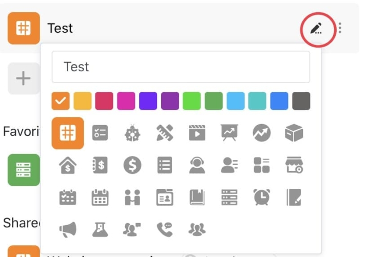
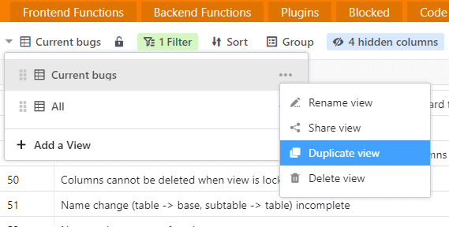
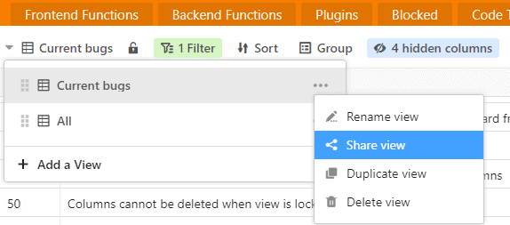
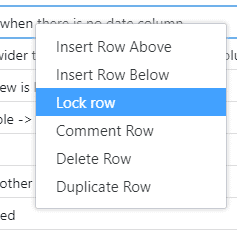
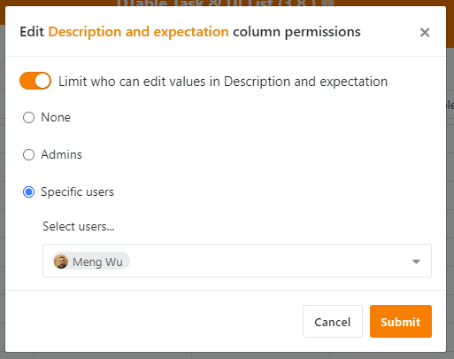

SeaTable - это оптимальное решение для управления данными и совместной работы в режиме онлайн. Благодаря множеству типов полей, функциям организации, управления группами, командами и совместной работы, а также многочисленным шаблонам и плагинам, SeaTable раскрывает всю продуктивность вашей команды.

Мы рады сообщить, что SeaTable версии 1.2 запущен в эксплуатацию. SeaTable 1.2 содержит несколько важных обновлений для вас с точки зрения функциональности и пользовательского опыта. Полный список изменений можно найти в [журнале изменений](https://seatable.io/ru/docs/changelog/version-1-2/). В этом выпуске мы знакомим вас с некоторыми из наиболее интересных новых функций.

## Больше цветов и символов на главной странице

Раньше стартовая страница выглядела скучновато. Теперь с этим покончено! В новой версии вы можете изменить значок и цвет каждой базы. В вашем распоряжении в общей сложности 12 цветов и более 25 символов. Просто нажмите на значок карандаша справа от названия базы и создайте внешний вид ваших баз в соответствии с вашими пожеланиями.

Настройка значков и цветов баз поможет вам лучше организовать свои базы и быстрее их находить, особенно если у вас много баз в SeaTable. В будущей версии цвет заголовка базы в представлении таблицы будет синхронизирован с цветом символа базы.

## Пакетный экспорт файлов и изображений

Придет время, когда вы захотите загрузить файлы и изображения, содержащиеся в вашей таблице. Например, когда вы собираетесь архивировать базу, новая функция пакетного экспорта может оказаться полезной. Пакетный экспорт сжимает все файлы или изображения в колонке в ZIP-файл, который затем можно удобно загрузить на жесткий диск в виде пакета.

В контекстных меню типов колонок File и Image находится функция "Загрузить все". При нажатии на нее SeaTable отображает во всплывающем окне результирующий ZIP-файл, а также количество элементов, подлежащих загрузке. Еще один щелчок на значке загрузки запускает загрузку архива.

## Путешествие в прошлое - Снимки

В SeaTable у вас всегда есть обзор процессов в ваших базах. В журнале указываются все изменения, добавления и удаления записей, а также все другие процессы в базе. Кроме того, SeaTable автоматически создает [моментальные снимки]() каждые 24 часа баз, над которыми ведется активная работа.

Снимок фиксирует состояние базы на момент ее создания. Другими словами, моментальные снимки - это, по сути, машины для путешествия в прошлое. Хотите посмотреть, как выглядела база три дня назад? Забудьте про журнал, используйте моментальный снимок!

Доступ к доступным снимкам базы можно получить в представлении таблицы или через расширенные опции базы на стартовой странице. (Обратите внимание, что продолжительность хранения снимков в SeaTable зависит от вашей подписки). Когда вы восстанавливаете снимок, создается новая база. Поэтому не беспокойтесь о перезаписи текущей базы при восстановлении моментального снимка.

## Дублирование взглядов

Универсальные представления - одна из лучших особенностей SeaTable. Сортируйте, группируйте и фильтруйте наборы данных по своему усмотрению, скрывайте ненужные колонки, блокируйте настройки представления от изменений и сохраняйте эти настройки как индивидуальное представление. Когда вам снова понадобится этот вид данных, он будет доступен всего одним щелчком мыши.

Теперь функция представления стала еще более мощной! Раньше создание нового представления, похожего на существующее, было более сложной задачей. Все условия сортировки, группировки и фильтрации нужно было настраивать с нуля. Теперь этот фактор разочарования исчез. В SeaTable 1.2 представления можно дублировать.

В меню видов находится пункт меню "Дублировать вид". Одним щелчком мыши создается новое представление на основе существующего. После этого можно быстро настроить условия сортировки, группировки и фильтрации в этом новом представлении.

## Больше разрешений на совместное использование (только для подписок Enterprise)

Совместное использование базы SeaTable с другими пользователями не требует особых усилий. Разрешения на совместный доступ также дают пользователю полный контроль над тем, кто может изменять данные в общей базе, а кто имеет доступ только для чтения. Корпоративные подписчики теперь имеют еще больше контроля над общими базами. За это отвечают новые функции совместного использования представлений, блокировки строк и разрешений на столбцы.

### Просмотр выпуска

Вместо того чтобы делиться всей базой, подписчики Enterprise теперь имеют возможность делиться только определенными представлениями данных базы. Фильтруйте данные, скрывайте столбцы, сортируйте и группируйте записи так, чтобы их вид выражал нужную мысль громко и четко, и делитесь с коллегами только этим. Для этого и предназначена новая функция "Поделиться представлением".

Когда вы предоставляете общий доступ к базе - даже если она доступна только для чтения - вы раскрываете все данные, хранящиеся в базе. При раздельном просмотре получатели имеют доступ только к тем данным, которые они должны видеть.

### Блокировка линии

Вы хотите поделиться базой с другими членами команды, но хотите, чтобы они не могли изменить содержимое одной или нескольких строк? Тогда в SeaTable 1.2 есть именно то, что вам нужно: новая функция блокировки строк.

Щелчок правой кнопкой мыши на ячейке вызывает контекстное меню строки, в котором появляется новая опция "Заблокировать строку". Если строка заблокирована, то в правом верхнем углу номера строки появляется красный треугольник. Для разблокировки повторите процедуру. Администраторы базы (владельцы базы, а также администраторы групп) могут разблокировать любую строку; другие пользователи могут разблокировать только строки, заблокированные ими самими.

### Разрешения колонок

Помимо блокировки строк, администраторы базы могут ограничить доступ к определенным колонкам. В SeaTable 1.2 вы можете решить, кому разрешено редактировать записи в колонке: никому, только администраторам или определенным пользователям. Излишне говорить, что разрешения на редактирование колонок можно комбинировать с блокировкой строк.

Права доступа к столбцам доступны для всех типов столбцов. Откройте контекстное меню колонки и выберите пункт 'Редактировать права доступа к колонке'. Появившийся мастер подскажет, что делать дальше.

## Общие улучшения

В дополнение к новым функциям разработчики SeaTable также усердно работали над улучшением существующих функций и оптимизацией пользовательского опыта. Особое внимание было уделено использованию SeaTable на различных экранах, особенно на мобильных устройствах. Теперь различные представления должны работать на мобильных устройствах так же хорошо, как и на экранах настольных компьютеров.
