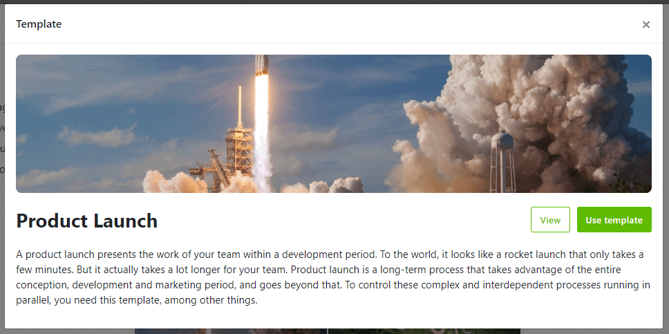
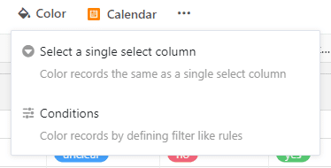
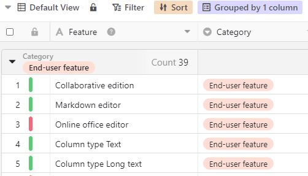
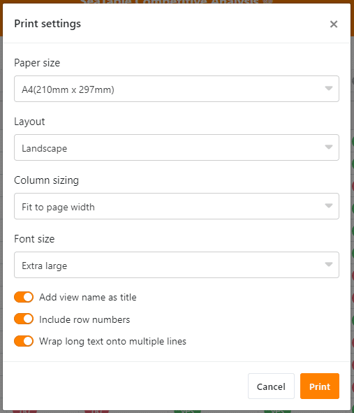
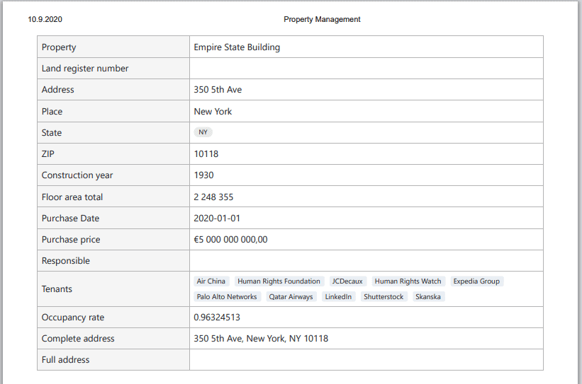
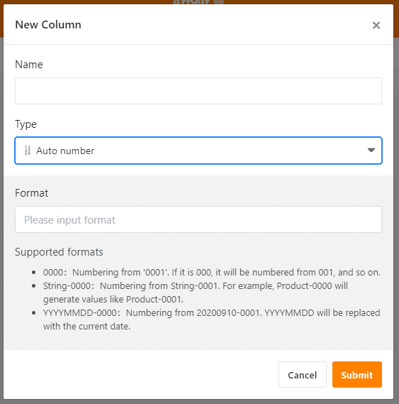

The September release, uploaded on September 14, brings plenty of new features, functionalities and user experience improvements to ALL users. The hottest new addition is SeaTable’s scripting engine. Other great new features are the seamless integration of templates, conditional row formatting, a new print function and the new column type auto number. And this is by far not all. For the full list of changes, check our [Changelog](https://seatable.io/en/docs/changelog/version-1-3/). Living up to its name, SeaTable offers an ocean of possibilities. [Register now]() and hit the waves.

## Automate data processing with scripts

Experienced users with a bit of coding experience will love SeaTable’s new script support. You can build your own scripts to automate activities just the way you need it. Generating new data, manipulating existing data, sending emails, … – SeaTable scripts use JavaScript making the possibilities nearly endless. For those who are not really programmers, they can import existing scripts that they found on the internet (for instance in the Seafile Forum), or acquired from colleagues. Have a look at the [SeaTable Scripts Programming Manual](https://seatable.github.io/seatable-scripts/) to get you started.

SeaTable’s scripts are related to the well-known SeaTable plugins such as the calendar, gallery and map plugin. But there are important differences: While plugins are developed and maintained by the official developers, everyone can write scripts as the need arises. You need a automation to send an email when a new record is created? Don’t wait for the developers to write a plugin. Go ahead and write your own script! Another difference: You install plugins from the plugin store; scripts emerge from SeaTable’s script editor which is integrated in SeaTable’s table view.

## Get work done faster with templates

Many users already know our [carefully created templates](https://seatable.io/en/docs/templates/). With the new release, it is now even easier to create new bases directly based on these templates, without the hassle of manual copy and export procedures. Using a template is now as easy as it gets! Create a new base, select your preferred template and off you go.

When creating a new base in your base library, you’ll be offered three options: Create a blank base, import from file, or create from a template. The latter option will load the [SeaTable Market](https://market.seatable.io), where you can browse all available templates. Pick the one that fits your needs and the template's data will be copied into your new base.

## Analyze your data with conditional formatting

Conditional formatting has been a staple in Microsoft Excel and Google Sheets. As a consequence, it’s been high up on our priority list. So we are pleased to announce the arrival of conditional row formatting in SeaTable 1.3!

Conditional formatting is just as easy to use as the other data analysis functions of sorting, grouping and filtering. And it can also be invoked in the same way: via an icon in the view settings. Click on the "Format" icon and a small wizard will help you achieve your goal as quickly as possible.

At first, you choose if you want to color-code rows based on a particular value in a single-select column or based on individual rules. When using rules, you can select a color for each rule, and under each rule, you can set up multiple logical filter conditions to define exactly which rows should be given this particular color.

## New print function to take SeaTable’s power offline

You have been looking for a way to print all the data you and your team have meticulously organized in SeaTable? SeaTable’s new print function allows great printouts for your team's jour fixes, customer meetings and field work.

Select the view that you wish to print and click the “…” icon on the view control panel to open the print settings. Adjust the parameters to your liking and hit the print button. SeaTable then renders the view and passes it on to the print manager of your device. If you want to save time, just hit Ctrl+P to open the print settings.

Apart from printing the table or a view, you can also print just the details of one row. Open the row details you wish to print and click on the print icon. You have two choices here: “as it is” and “compact” format.

## New column type auto number

The auto number column type is a great supplement to SeaTable’s existing database functionalities and helps you keep your data in order. In an auto number column, SeaTable automatically generates a serial number when adding a new row.

The auto number column supports three different number formats:

- Serial number with any number of leading zeros (e.g., 0001, 0002, 0003, ...)
- Serial number with any number of leading zeros prepended by a string (e.g., Product-001, Product-002, Product-003, ...)
- Serial number with any number of leading zeros prepended by a date (e.g., 20200914-01, 20200914-02, 20200914-03, ...)

## Even better user experiences, like always

We have updated the map plugin. Now, you can set colors to the locations on your map with a single select column, look at the map in full screen mode, and export the map as an image.

Besides these new functionalities, the developers have also worked hard to make SeaTable 1.3 the user-friendliest SeaTable ever. SeaTable now supports autofill in forms, URLs in long texts fields are clickable in the table view, groupbys can be collapsed and expanded with one click, improved navigation in the bases library with a list of groups and sharing links, batch picture upload, and so on.

We are very grateful to the users who continuously support us by providing valuable feedback and reporting issues. If you want to contribute to SeaTable’s continuous improvement, visit our [SeaTable Forum](https://forum.seatable.io) frequently and raise any questions, ideas or discussions. We are looking forward to seeing you there!
