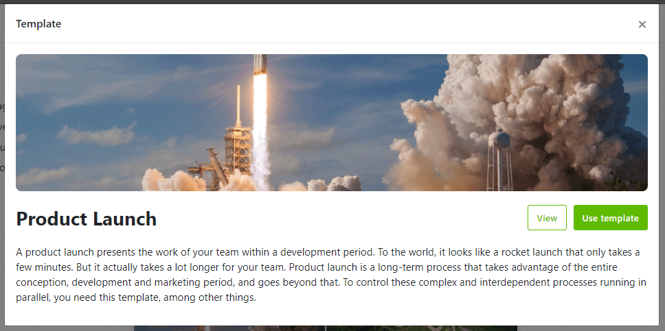
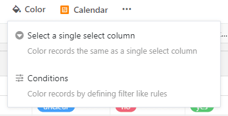
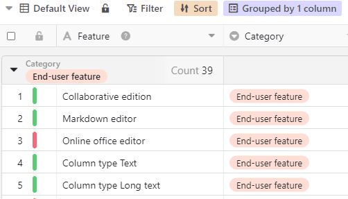
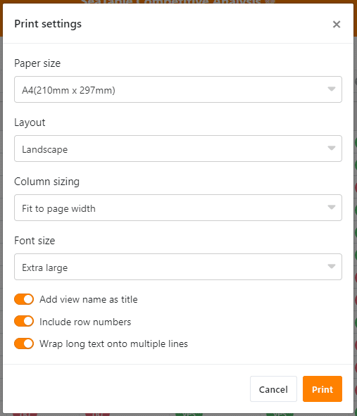
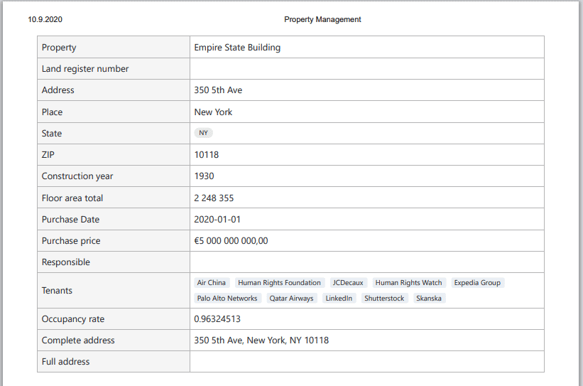
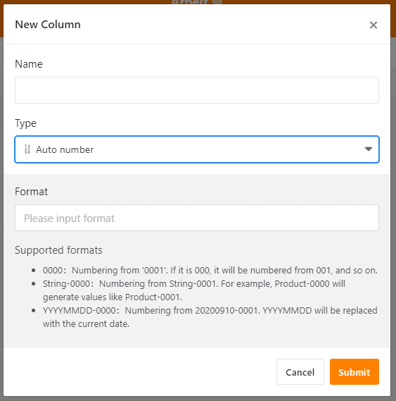

O lançamento de Setembro, que carregámos a 14 de Setembro, oferece um conjunto impressionante de novas funcionalidades, funcionalidades e melhorias para TODOS os utilizadores. A adição mais quente é o motor de scripting do SeaTable. Outras grandes novidades incluem a integração sem problemas dos nossos modelos, a formatação condicional de linhas, uma nova funcionalidade de impressão e o novo tipo de coluna de número automático. E isso não é de longe tudo! A lista completa das alterações está disponível no [changelog](). SeaTable mantém-se fiel ao seu nome e oferece um mar de possibilidades. [Comece agora]() e brinque com as ondas.

## Processamento automatizado de dados com scripts

Utilizadores experientes com um pouco de experiência em codificação irão adorar o novo suporte de guião do SeaTable. Com o seu próprio guião, pode automatizar actividades ao seu gosto. Criar novos dados, processar dados existentes, enviar emails, ... - Os scripts do SeaTable utilizam JavaScript e por isso as possibilidades são quase ilimitadas. Aqueles que não se sentem chamados a ser um programador podem facilmente importar scripts descarregados da Internet (por exemplo, o Fórum Seafile) ou recebidos de colegas. O [SeaTable Scripts Programming Manual](https://developer.seatable.com/scripts/) tem toda a informação de que necessita para começar. Dêem uma vista de olhos. (O Manual de Programação de Scripts está disponível apenas em inglês).

Os guiões do SeaTable são semelhantes aos conhecidos plugins SeaTable (por exemplo, calendário, galeria, mapa), mas existem também diferenças importantes: os plugins são desenvolvidos e mantidos pela equipa de desenvolvimento do SeaTable; os guiões podem ser criados e adaptados por qualquer pessoa, conforme necessário. Por outras palavras, precisa de um automatismo que envie um e-mail quando é criada uma nova fila? Não espere por um plugin dos programadores. Escreva um guião que faça isto! Outra diferença importante: os plugins são instalados a partir da Loja Plugin; os scripts são criados no editor de scripts SeaTable integrado.

## Trabalhar mais rapidamente com os modelos

Muitos utilizadores já conhecem os nossos [modelos cuidadosamente criados](). Com a nova versão, é agora ainda mais fácil criar novas bases directamente baseadas nestes modelos, sem o incómodo da cópia manual e dos procedimentos de exportação. Usar um modelo é agora tão fácil quanto possível! Crie uma nova base, seleccione o seu modelo preferido e pronto a usar.

Sempre que criar uma nova base, pode escolher entre três opções: Criar Base Vazia, Criar Base a partir de Arquivo ou Criar Base a partir de Modelo. Esta última opção carrega o [Mercado SeaTable](https://market.seatable.io), onde se pode navegar facilmente através dos modelos disponíveis. Escolha o modelo que melhor lhe convier e o seu conteúdo será copiado directamente para a nova base.

## Avaliação de dados gráficos com formatação condicional

A função Formatação Condicionada existe no Microsoft Excel e Google Sheets desde tempos imemoriais. A integração desta função no SeaTable estava, portanto, no topo da nossa lista de prioridades. Agora chegou finalmente o momento! Com SeaTable 1.3, a formatação de linhas condicionais está disponível para todos os utilizadores.

A formatação condicional é tão fácil de utilizar como as outras funções de análise de dados de ordenação, agrupamento e filtragem. E também pode ser acedida da mesma forma: através de um ícone nas definições da vista. Clique no ícone "Formatar" e um pequeno assistente ajudá-lo-á a atingir o seu objetivo o mais rapidamente possível.

Primeiro selecciona-se como a coloração da linha deve ser determinada. Pode escolher entre formatação de linha através de ligação com uma única coluna de selecção e formatação baseada em regras. Com uma formatação baseada em regras, atribui-se uma cor a cada regra. Se a(s) condição(ões) de uma regra estiver(em) preenchida(s), a célula recebe a cor seleccionada.

## A nova função de impressão traz os pontos fortes do SeaTable para o mundo analógico

Tem procurado uma forma de imprimir todos os dados que recolheu e preparou cuidadosamente no SeaTable? Com a nova função de impressão SeaTable, obtém impressões de alta qualidade para as reuniões da sua equipa e clientes, bem como para o trabalho de campo.

Seleccione a vista que pretende imprimir e clique no ícone de três pontos nas definições de vista. No assistente de impressão que se abre, ajuste os parâmetros às suas necessidades e complete o processo com um trabalho de impressão. O SeaTable torna então a sua vista e transfere o resultado para o gestor de impressão do seu dispositivo. Se preferir trabalhar com o teclado, pode também chamar o assistente de impressão com o atalho de teclado CTRL + P.

Claro que, para além de tabelas e vistas inteiras, também se pode imprimir os detalhes de uma única fila. Abra os detalhes da fila desejada e clique no ícone de impressão. Com os dois tipos de impressão Normal e Compacto é possível definir o tamanho da impressão.

## Novo tipo de coluna número automático

O tipo de coluna Número Automático é uma grande extensão das capacidades da base de dados SeaTable e ajuda-o a manter os seus dados em ordem nas suas tabelas. Em tal coluna, SeaTable gera automaticamente um número de série para cada nova linha.

Este novo tipo de coluna suporta três formatos de números diferentes:

- Número de série com qualquer número de zeros à cabeça (ex. 0001, 0002, 0003, ...)
- Número de série com qualquer número de zeros e prefixo de cordel (por exemplo, produto001, produto002, produto003, ...)
- Número de série com qualquer número de zeros e prefixo de data (por exemplo 20200914-01, 20200914-02, 20200914-03, ...)

## Melhoria da experiência do utilizador - melhorias contínuas

Actualizámos o plugin do mapa e integrámos várias melhorias de detalhe: A cor do marcador de posição pode agora ser ligada a um único campo de selecção, permitindo que diferentes cores sejam aplicadas ao mapa. Há também um modo ecrã inteiro e o mapa pode ser exportado como uma imagem.

Para além destas novas características, os programadores também trabalharam arduamente para a versão 1.3 para tornar o SeaTable ainda mais fácil e melhor de utilizar. O resultado: SeaTable agora suporta auto-completamento nos formulários web; links embutidos em campos de texto de várias linhas podem ser chamados directamente da vista de tabela; a navegação na biblioteca de Bases foi tornada mais rápida e fácil com uma lista de grupos e links; todos os agrupamentos na vista de tabela podem ser minimizados e maximizados com um clique; foi adicionado suporte para o carregamento de imagens em lote; e e e e

Estamos gratos aos muitos utilizadores pelo seu feedback e relatórios de bugs. Se quiser contribuir para o desenvolvimento futuro do SeaTable, por favor visite o [Fórum SeaTable](https://forum.seatable.com) e levante a sua voz - para perguntas, ideias e discussões. Aguardamos com expectativa a sua presença no fórum.
