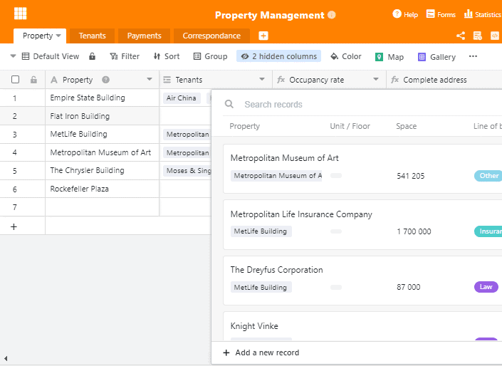
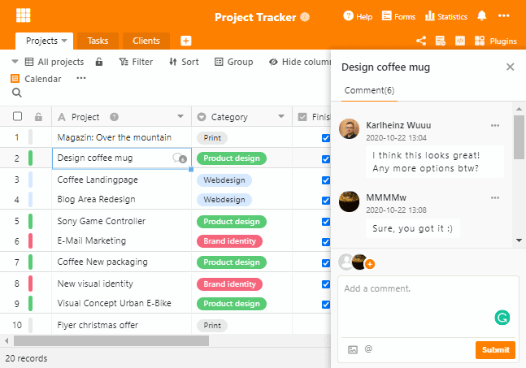
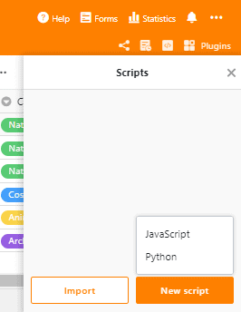

We are pleased to announce the release of SeaTable 1.4! We've packed a new column type, improved database features, realtime chat and many more improvements into this new release. Organising data and collaborating in a team has never been so easy and convenient! And best of all, every user benefits from the new features, including the free subscription.

For a full list of changes, visit the [SeaTable Changelog](https://seatable.io/en/docs/changelog/version-1-4/). This release note summarizes the biggest and most exciting updates of SeaTable 1.4. So let’s get going!

## Introducing column type #18

SeaTable 1.4 adds one more column type: The URL column. It is similar to the text column, but its contents are interpreted as links to network resources: https://seatable.io, www.seafile.com, 192.168.178.1 and localhost:8000 are all meaningful entries.

When saved in a URL column, a network resource is just two clicks away: Click on a cell and a link-icon appears on the right in the cell. Make another click on this icon and the resource is called in a new browser tab. http(s) gets automatically added as a prefix. If you are asking yourself why one click does not do the trick, here is the reason: Two clicks prevent accidental visits of the links’ target when navigating in a table, which might happen often especially on mobile devices.

## More powerful, yet simpler database functions

Database afficionados will love the new wizard for linking records and the possibility to run queries across indirectly linked tables. SeaTable makes databases as simple as they should be!

### Simplifying linking records

In version 1.3, selecting a linked record was a bit tedious. An in-cell dropdown displayed the content of the first column in the linked table – not ideal when there were two or more rows with the same content. In SeaTable 1.4: This problem is solved!

The dropdown has made way for a new, detailed and context-sensitive wizard. Double-clicking on a cell opens it. If the cell is empty, the wizard displays the first columns of the linked table. Confusion about which entry in the target table is the correct one is now a thing of the past. When double-clicking on a cell with already linked entries, the wizard shows the details of the linked entries. Additional entries can be linked via the "Add new link" button in the upper right corner.

The new wizard greatly facilitates the creation of links between tables, but that’s not all it can do. You can also create new records in the linked table right from the wizard. No need for switching tables. No awkward clicking sessions. No time lost. You basically work in two different tables from one.

### Leveraging the full potential of database queries

Running queries across multiple tables is part of the magic of databases. While previous versions of SeaTable limited queries to directly linked fields, this restriction is no more with the newest release. As long as records are logically linked, SeaTable can walk down the link chain and retrieve the target value – no matter the number of tables it has to cross. The intuitive implementation in SeaTable ensures that not only database experts can benefit from the database magic.

Imagine you manage your IT assets with SeaTable. In Table 1 you manage the users, Table 2 contains the rooms and Table 3 lists the hardware. Each user is linked to a room by a 1:1 relationship and to the IT assets by a 1:n relationship. The user thus represents the link between room and asset. With SeaTable 1.4, creating a list of IT assets per room is a matter of a few clicks.

## Chat with coworkers in real-time

Good communication within the team is key for efficient online collaboration. With the new real-time chat, SeaTable 1.4 introduces exactly what you need to stay in touch with your teammates! Bouncing off ideas, commenting on new data entries or discussing modifications – you can do it where it is easiest: right with the data.

If you are not yet familiar with the comment function, select a row and press the space bar to call up the line details. In the upper right corner you will find the comment column. SeaTable's improved backend notifies users of new comments without delay. If the users are online, then the group chat can start. Otherwise, users are informed by [notification](https://seatable.io/en/docs/handbuch/zusammenarbeit/benachrichtigungen/). Share your ideas and impressions with colleagues when they are fresh.

## More automation with webhooks

What is better than SeaTable? SeaTable integrated with some of your other favorite applications! This is why it was important for us to put SeaTable on [Zapier](https://zapier.com/apps/seatable/integrations) as quickly as possible.

But Zapier was only the first step. Webhooks, introduced with this version, are the second. SeaTable's webhooks make it easy to trigger event-based actions in external applications. Here are two simple examples: A counter is incremented by one when a new entry is created or an email is sent when a value exceeds a critical threshold.

## Python support for SeaTable scripts

Last but not least, SeaTable 1.4 also has something in store for developers. This time, we have good news for all those fond of Python.

After adding JavaScript support in SeaTable 1.3, SeaTable 1.4 adds Python support to SeaTable scripts. Import your Python script or write it in SeaTable’s script editor to automate data processing and make SeaTable your custom application. To learn more about SeaTable scripts, read our [SeaTable Scripts Programming Manual](https://seatable.github.io/seatable-scripts/).

Spoiler alert: In one of the next releases, we’ll add time triggers for executing scripts.

## Many more improvements

Not all of SeaTable’s team of roughly 30 work on the big new features individually mentioned above. A lot of resources also go into countless smaller, incremental improvements. Here just a few.

We have reorganized the navigation on the left side in the Base Library. The new navigation contains two categories: Workspace contains Bases, Web Forms, and Activity Overview. Help and Resources provides direct links to our growing template collection as well as the User Guide.

On the topic of activity overview: This menu itself is hardly recognizable with its new design. In the past, all activities were listed here in chronological order without any further structure. With increasing usage intensity, this quickly became confusing. The new activity overview keeps the basic chronological structure, but groups the activities base by base and thus creates a much better overview. A click on a base opens the details of the changes on the selected day.

Small, impactful changes have also been brought upon the table view! When opening a base for the first time, its description will automatically push to the front. This is extremely helpful when sharing bases with others. Before diving into the data, they will be confronted with the instructions that you want them to read.

Feel inspired or interested? Allow us to remind you that registering is incredibly easy and SeaTable is permanently free of charge. If you have any questions or doubts, feel free to reach out to us via the [SeaTable Forum](https://forum.seatable.io).
