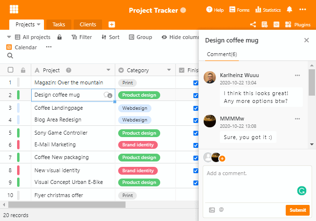

Nos complace anunciar el lanzamiento de SeaTable 1.4. En esta nueva versión hemos incluido un nuevo tipo de columna, características mejoradas de la base de datos, chat en tiempo real y muchas más mejoras. Organizar los datos y colaborar en equipo nunca ha sido tan fácil y cómodo. Y lo mejor de todo es que todos los usuarios se benefician de las nuevas funciones, incluida la suscripción gratuita.

Para ver la lista completa de cambios, consulte el [registro de cambios de SeaTable](). Esta nota de lanzamiento representa los cambios más importantes y emocionantes de SeaTable 1.4. ¡Vamos!

## Bienvenido al Equipo Tipo Columna #18

SeaTable 1.4 contiene otro tipo de columna: la [columna URL](#url). Se comporta como una columna de texto, pero el contenido de la celda se interpreta como una referencia a un recurso de red. Internet y las direcciones IP como https://seatable.com, www.seafile.com, 192.168.178.1 y localhost:8000 están en buenas manos en la columna URL.

La dirección de un recurso de red se puede llamar desde una columna URL con dos clics. Con el primer clic, aparece un icono de enlace en el borde derecho de la celda. Con un segundo clic en este icono, la dirección se llama en una nueva pestaña del navegador; se añade automáticamente http(s) como prefijo. Si ahora se pregunta por qué son necesarios dos clics, esta es la razón: los dos clics protegen contra las llamadas erróneas a la página web cuando se navega en la tabla, lo que puede ocurrir fácilmente, especialmente en los dispositivos móviles.

## Funciones de base de datos más potentes y sencillas

El nuevo asistente para la columna de enlace y las opciones de consulta ampliadas harán las delicias de los aficionados a las bases de datos en particular, pero no sólo. SeaTable hace que las bases de datos sean tan sencillas como deberían serlo.

### Enlaces muy sencillos

En la versión 1.3, la vinculación de las entradas seguía siendo algo tediosa. Un menú desplegable enumeraba las entradas de las primeras columnas de la tabla vinculada. Compacto, pero poco práctico si la tabla vinculada tiene dos o más filas con los mismos valores en la columna 1. Este problema está resuelto en SeaTable 1.4.

El desplegable ha dejado sitio a un nuevo asistente detallado y sensible al contexto. Un doble clic en una celda la abre. Si la celda está vacía, el asistente muestra las primeras columnas de la tabla vinculada. La confusión sobre qué entrada de la tabla de destino es la correcta es ahora cosa del pasado. Si hace doble clic en una celda con entradas ya vinculadas, el asistente muestra los detalles de las entradas vinculadas. Se pueden enlazar más entradas mediante el botón "Añadir nuevo enlace" situado en la esquina superior derecha.

El nuevo asistente simplifica la vinculación de las tablas, pero no es lo único que puede hacer. También se pueden crear nuevas entradas en la tabla vinculada directamente desde el asistente. Sin cambiar de mesa, sin orgías de clics y sin perder el tiempo. Con el nuevo asistente, se trabaja en dos mesas diferentes al mismo tiempo.

### Potencia total de la base de datos

Hay algo mágico en las consultas a bases de datos a través de múltiples tablas. En las versiones anteriores de SeaTable, las consultas sólo eran posibles en las tablas directamente vinculadas. Esta restricción se ha eliminado en SeaTable 1.4. Mientras las entradas estén enlazadas, SeaTable puede seguirlas y dar salida al valor objetivo, independientemente del número de enlaces que tenga que seguir SeaTable. La implementación intuitiva de esta función en SeaTable garantiza que no sólo los expertos en bases de datos puedan disfrutar de este toque de magia.

Imagine que gestiona sus activos informáticos con SeaTable. En la Tabla 1 se gestionan los usuarios, en la Tabla 2 se encuentran las salas y en la Tabla 3 el hardware. Cada usuario está vinculado a una sala por una relación 1:1 y a los activos informáticos por una relación 1:n. El usuario representa así el vínculo entre la sala y el activo. Con SeaTable 1.4, crear una lista de activos informáticos por sala es cuestión de unos pocos clics.

## Chatea con tus colegas en tiempo real

La colaboración eficaz en línea no es posible sin una buena comunicación dentro del equipo. La versión 1.4 presenta ahora la solución que le mantiene en estrecho contacto con los miembros de su equipo. Debatir ideas, comentar nuevos registros y discutir cambios, todo esto es fácilmente posible y ocurre donde debe ocurrir: directamente en los datos.

Si aún no está familiarizado con la función de comentario, seleccione una línea y pulse la barra espaciadora para llamar a los detalles de la línea. En la esquina superior derecha encontrará la columna de comentarios. El backend mejorado de SeaTable notifica a los usuarios los nuevos comentarios sin demora. Si los usuarios están conectados, el chat de grupo puede comenzar. En caso contrario, se informa a los usuarios mediante [una notificación](). Comparta sus ideas e impresiones con sus colegas cuando estén frescas.

## Webhooks para una mejor automatización

¿Qué es mejor que SeaTable? SeaTable en interacción con tus otras aplicaciones favoritas! Por este motivo, nos hemos esforzado por ofrecer una opción de integración cómoda con [Zapier](https://zapier.com/apps/seatable/integrations) lo antes posible.

Pero Zapier fue sólo el primer paso. Los webhooks, introducidos con esta versión, son los segundos. Los webhooks de SeaTable facilitan la activación de acciones basadas en eventos en aplicaciones externas. He aquí dos ejemplos sencillos: Un contador se incrementa en uno cuando se crea una nueva entrada o se envía un correo electrónico cuando un valor supera un umbral crítico.

## Los scripts de SeaTable ahora también en Python

Por último, pero no menos importante, SeaTable 1.4 también ofrece una innovación para los desarrolladores. Esta vez es una buena noticia para los amantes de Python.

SeaTable 1.3 introdujo el motor de scripting de SeaTable. JavaScript era el lenguaje de scripting soportado. Con SeaTable 1.4, ahora se pueden desarrollar y ejecutar scripts en Python. Importe su script de Python o desarróllelo directamente en el Editor de Script de SeaTables para automatizar el procesamiento de datos y construir su aplicación personalizada. Para más información sobre los scripts de SeaTables, consulte el [Manual de programación de scripts de SeaTable](https://developer.seatable.com/scripts/).

Spoiler: En una de las próximas versiones añadiremos la posibilidad de ejecutar scripts con control de tiempo.

## Muchas más mejoras

No todo el equipo de desarrollo de SeaTable, compuesto por unas 30 personas, trabaja en estos grandes desarrollos. También se dedica mucho trabajo y pasión a las innumerables y pequeñas mejoras de SeaTable que realizamos con cada versión, haciendo que SeaTable mejore poco a poco. Aquí están las mejoras más importantes entre estas pequeñas.

Hemos reorganizado la navegación en el lado izquierdo en la biblioteca base. La nueva navegación contiene dos categorías: El espacio de trabajo contiene Bases, Formularios Web y Resumen de Actividades. Ayuda y recursos ofrece enlaces directos a nuestra creciente colección de plantillas, así como a la Guía del usuario.

En cuanto al resumen de actividades: este menú apenas se reconoce con su nuevo diseño. En el pasado, todas las actividades se enumeraban aquí en orden cronológico sin ninguna otra estructura. Con el aumento de la intensidad de uso, esto se volvió rápidamente confuso. El nuevo resumen de actividades mantiene la estructura cronológica básica, pero agrupa las actividades base por base, creando así una visión general mucho mejor. Un clic en una base abre los detalles de los cambios en el día seleccionado.

También se han introducido pequeñas pero finas mejoras en la vista de la tabla. Cuando se abre una base por primera vez, se llama automáticamente la descripción de la base. Esto es muy útil cuando se comparten bases con otros. De esta manera, sus colegas reciben la información que usted quiere que vean antes de que se metan en los datos.

¿Está interesado o incluso inspirado? Entonces, ¿a qué esperas? El registro se hace en un abrir y cerrar de ojos y SeaTable es permanentemente gratuito. Si tiene alguna pregunta o duda, ideas o comentarios, escríbanos o deje un comentario en el [foro](https://forum.seatable.com).
