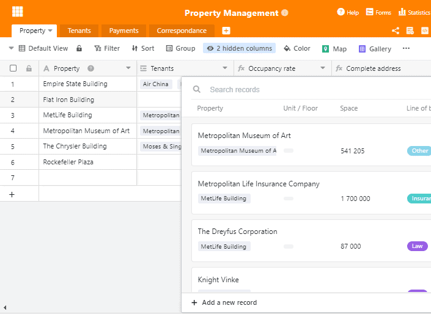
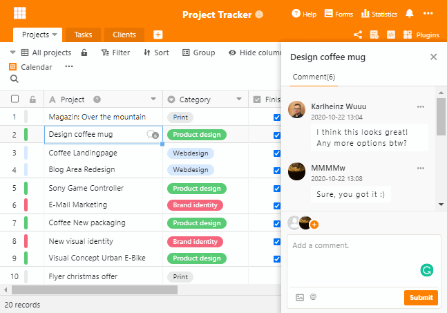
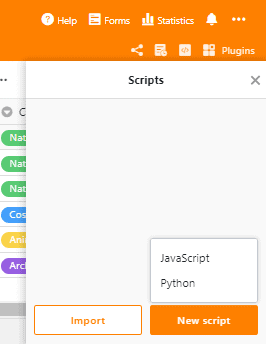

Temos o prazer de anunciar a libertação da SeaTable 1.4! Empacotámos um novo tipo de coluna, características melhoradas da base de dados, chat em tempo real e muitos mais melhoramentos nesta nova versão. Organizar dados e colaborar em equipa nunca foi tão fácil e conveniente! E o melhor de tudo, cada utilizador beneficia das novas funcionalidades, incluindo a subscrição gratuita.

Para uma lista completa das alterações, por favor ver o [SeaTable Changelog](). Esta nota de lançamento representa as mudanças mais importantes e excitantes na SeaTable 1.4. Vamos lá!

## Bem-vindo à Equipa Tipo de Coluna #18

SeaTable 1.4 contém outro tipo de coluna: a [coluna URL](#url). Isto comporta-se como uma coluna de texto, mas o conteúdo da célula é interpretado como uma referência a um recurso da rede. Os endereços Internet e IP tais como https://seatable.com, www.seafile.com, 192.168.178.1 e localhost:8000 estão em boas mãos na coluna URL.

O endereço de um recurso da rede pode ser chamado a partir de uma coluna URL com dois cliques. Com o primeiro clique, aparece um ícone de ligação na margem direita da célula. Com um segundo clique neste ícone, o endereço é chamado num novo separador do navegador; http(s) é automaticamente adicionado como um prefixo. Se agora se pergunta por que razão são necessários dois cliques, eis a razão: dois cliques protegem contra chamadas erradas de páginas web quando se navega na tabela, o que pode facilmente acontecer especialmente em dispositivos móveis.

## Funções de base de dados mais poderosas e mais simples

O novo assistente para a coluna de ligação e as opções de consulta alargada farão as delícias dos fãs das bases de dados em particular, mas não só! SeaTable torna as bases de dados tão simples como deveriam ser!

### Ligações muito simples

As entradas de ligação ainda eram algo enfadonhas na versão 1.3. Um menu pendente listou as entradas das primeiras colunas da tabela ligada. Compacto, mas impraticável se a tabela ligada tivesse duas ou mais filas com os mesmos valores na coluna 1. Este problema é resolvido no SeaTable 1.4!

O menu pendente deu lugar a um novo assistente, detalhado e sensível ao contexto. Um duplo clique numa célula abre-a. Se a célula estiver vazia, o assistente apresenta as primeiras colunas da tabela ligada. A confusão sobre qual a entrada correcta na tabela de destino é agora uma coisa do passado. Se fizer duplo clique numa célula com entradas já ligadas, o assistente apresenta os detalhes das entradas ligadas. Outras entradas podem ser ligadas através do botão "Adicionar nova ligação" no canto superior direito.

O novo assistente simplifica a ligação de tabelas, mas isso não é a única coisa que pode fazer. Também podem ser criadas novas entradas na tabela ligada directamente a partir do mago. Sem mudar de mesa, sem orgias de clique e sem perda de tempo. Com o novo assistente, trabalha-se em duas mesas diferentes ao mesmo tempo.

### Potência total da base de dados

Há algo de mágico nas consultas de bases de dados através de múltiplas tabelas. Nas versões anteriores do SeaTable, as consultas só eram possíveis através de tabelas directamente ligadas. Esta restrição foi removida no SeaTable 1.4! Desde que as entradas estejam ligadas, SeaTable pode segui-las e emitir o valor-alvo - independentemente do número de ligações que SeaTable tem de seguir. A implementação intuitiva desta funcionalidade no SeaTable garante que não só os especialistas em bases de dados podem desfrutar deste toque de magia.

Imagine que gere o seu património informático com o SeaTable. Na Tabela 1 gerem os utilizadores, a Tabela 2 contém as salas e a Tabela 3 lista o hardware. Cada utilizador está ligado a uma sala por uma relação 1:1 e aos activos de TI por uma relação 1:n. O utilizador representa assim a ligação entre o quarto e o bem. Com o SeaTable 1.4, criar uma lista de activos de TI por sala é uma questão de alguns cliques.

## Conversar com colegas em tempo real

Uma colaboração eficiente em linha não é possível sem uma boa comunicação dentro da equipa. A versão 1.4 apresenta agora a solução que o mantém em estreito contacto com os membros da sua equipa! Discutir ideias, comentar novos registos e discutir alterações, tudo isto é facilmente possível e acontece onde deveria acontecer: directamente nos dados.

Se ainda não estiver familiarizado com a função de comentário, seleccione uma linha e prima a barra de espaço para chamar os detalhes da linha. No canto superior direito encontrará a coluna de comentários. O backend melhorado do SeaTable notifica os utilizadores de novos comentários sem demora. Se os utilizadores estiverem online, então o chat em grupo pode começar. Caso contrário, os utilizadores são informados através de [notificação](). Partilhe as suas ideias e impressões com os seus colegas quando estes estão frescos.

## Gancho da Web para melhor automatização

O que é melhor do que o SeaTable? SeaTable em interacção com as suas outras aplicações favoritas! Por esta razão, esforçámo-nos por oferecer uma opção de integração conveniente com o [Zapier](https://zapier.com/apps/seatable/integrations) o mais rapidamente possível.

Mas Zapier foi apenas o primeiro passo. Os ganchos da Web, introduzidos com este lançamento, são o segundo. Os ganchos da SeaTable facilitam o desencadeamento de acções baseadas em eventos em aplicações externas. Aqui estão dois exemplos simples: Um contador é incrementado por um quando uma nova entrada é criada ou um e-mail é enviado quando um valor excede um limiar crítico.

## SeaTable scripts agora também em Python

Por último, mas não menos importante, a SeaTable 1.4 também oferece uma inovação para os criadores. Desta vez é uma boa notícia para os amantes de Python.

SeaTable 1.3 introduziu o motor de guião de SeaTable. JavaScript era a linguagem de scripting suportada. Com SeaTable 1.4, os guiões podem agora ser desenvolvidos e executados em Python. Importe o seu script Python ou desenvolva-o directamente no SeaTables Script Editor para automatizar o processamento de dados e construir a sua aplicação personalizada. Para mais informações sobre scripts SeaTables, ver o [SeaTable Scripts Programming Manual](https://seatable.github.io/seatable-scripts/).

Spoiler: Numa das próximas versões, acrescentaremos a possibilidade de executar scripts com controlo de tempo.

## Muitas mais melhorias

Nem toda a equipa de desenvolvimento da SeaTable, com cerca de 30 pessoas, trabalha nestes grandes desenvolvimentos. Muito trabalho e paixão também vai para as inúmeras pequenas e incrementais melhorias de SeaTable que fazemos com cada versão, tornando a SeaTable melhor, pouco a pouco. Aqui estão apenas as melhorias mais importantes entre estas pequenas melhorias.

Reorganizámos a navegação do lado esquerdo na biblioteca da base. A nova navegação contém duas categorias: O espaço de trabalho contém Bases, Formulários Web e Síntese de Actividades. Ajuda e Recursos fornece ligações directas à nossa crescente colecção de modelos, bem como ao Guia do Utilizador.

Sobre o tema da síntese de actividades: Este menu em si é dificilmente reconhecível com o seu novo design. No passado, todas as actividades eram aqui listadas por ordem cronológica, sem qualquer outra estrutura. Com o aumento da intensidade de utilização, isto rapidamente se tornou confuso. A nova síntese de actividades mantém a estrutura cronológica básica, mas agrupa as actividades base por base, criando assim uma síntese muito melhor. Um clique sobre uma base abre os detalhes das alterações no dia seleccionado.

Foram também feitas pequenas mas finas melhorias na vista da mesa. Quando se abre uma base pela primeira vez, a descrição da base é automaticamente chamada. Isto é muito útil quando se partilham bases com outros. Desta forma, os seus colegas recebem a informação que deseja que eles vejam antes de saltarem para os dados.

Está interessado ou mesmo inspirado? Então de que é que está à espera? O registo é feito em pouco tempo e o SeaTable é permanentemente gratuito! Se tiver quaisquer perguntas ou dúvidas, ideias ou feedback, por favor escreva-nos ou deixe um comentário no [fórum](https://forum.seatable.com).
