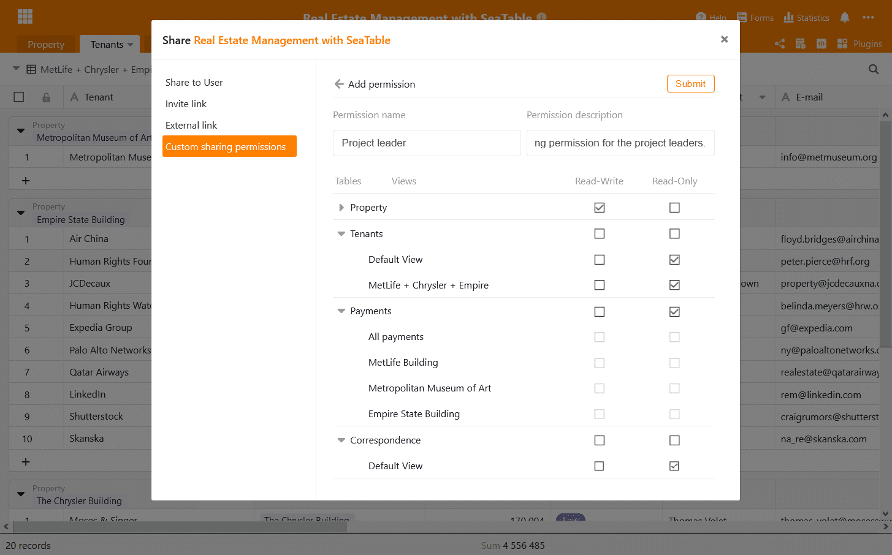

Wir haben heute cloud.seatable.io auf die Version 1.5 von SeaTable aktualisiert. Mit dem nächsten Login profitieren alle Nutzer von spannenden neuen Features und einer Reihe von Verbesserungen an Interface und bestehenden Funktionen. Auf den ersten Blick werden die zahlreichen kleineren und größeren Änderungen am Tabelleneditor auffallen, die zu einer höheren Workfloweffizienz und verbesserten Benutzererfahrung führen. Die neuen benutzerdefinierten Freigabeberechtigungen bieten mehr Kontrolle und Flexibilität bei der gemeinsamen Arbeit an Bases. Erweiterte Individualisierungsoptionen machen SeaTables Webformulare ein noch vielseitigeres Werkzeug für die Datenerfassung.

The vollständige Liste der Änderungen findet sich, wie immer, in [SeaTables Changelog](https://seatable.io/docs/changelog/version-1-5/). Diese Release Note stellt die wichtigsten und spannendsten Änderungen dieser neuen Version vor.

## Verbesserter Tabelleneditor

Angesichts der Tatsache, dass die Mehrheit der Nutzer die meiste Zeit im Tabelleneditor verbringt, verwenden wir viel Aufmerksamkeit und Mühe mit der Suche nach Möglichkeiten, um die vielen Menüs, Assistenten und Ansichten des Editors noch benutzerfreundlicher zu machen. Wir glauben, dass wir mit der Version 1.5 große Schritte in diese Richtung gemacht haben. Wir haben Modals durch Inline Menüs ersetzt, wir haben das Menüdesign verbessert und die Softwarebibliothek für die Statistikansicht auf die neuste Version aktualisiert. Darüber hinaus haben wir die Ansichtsplugins verbessert. In Summe macht die Erfassung und Bearbeitung von Daten im Tabelleneditor von SeaTable 1.5 nun deutlich mehr Spaß!

### Adieu Modals

Modals waren in früheren Versionen von SeaTable häufiger anzutreffen. Beispielsweise die Dialoge für ‘Spalte einfügen’ und ‘Spaltentyp anpassen’ waren solche [Modals](https://en.wikipedia.org/wiki/Modal_window), bei denen die Steuerelemente im Vordergrund erscheinen und der Hintergrund ausgeblendet wird. Auch wenn sie uns bisher gute Dienste geleistet haben, so bieten Modals doch Raum für Verbesserungen hinsichtlich Leichtigkeit und Arbeitseffizienz: Wenn sich das Modal in der Mitte des Bildschirms öffnet, veranlasst es den Benutzer dazu, sich mit der Maus dorthin zu begeben. Noch schwerwiegender ist die Tatsache, dass durch die Deaktivierung der Bildlaufleisten relevante Informationen nicht hinter einem Modal hervorgebracht werden können, wenn ein Modal diese verdeckt. Was haben wir also getan? Wir haben die Modals durch nicht-modale Menüs ersetzt, die alle Funktionen ihrer Vorgänger ohne deren Nachteile bieten.

### Vereinfachte Menüs

Das Optionenmenü der Einfach- und Mehrfachauswahlspalten ist ein weiteres Modal, dass wir in ein nicht-modales Menü umgewandelt haben. Dabei haben wir es aber nicht belassen. Wir haben auch das bestehende, etwas umständliche mehrstufige Menü durch ein viel komfortableres, flaches Menü ersetzt. Optionen können nun in einem übersichtlichen Fenster erstellt, geändert und gelöscht werden. Die Anzahl der notwendigen Klicks wurde auf ein Minimum reduziert.

### Gleichzeitige Bearbeitung mehrerer Tabellen

[SeaTable 1.4]() führte einen neuen Assistenten ein, der die Verknüpfung von Einträgen erleichtert. Dieser Assistent öffnet sich mit einem Klick auf eine Verknüpfungszelle und stellt dann alle Einträge in der verknüpften Spalte in einem übersichtlichen Fenster dar. Ein weiterer Klick auf einen Eintrag erstellt die Verknüpfung zum Eintrag in der Zelle. Anders ausgedrückt: Mit dem neuen Assistenten wurde die Verknüpfung von Einträgen so einfach wie die Auswahl eines Werts aus einem Dropdown-Menü.

SeaTable 1.5 macht diesen Assistenten nun noch leistungsfähiger: Einträge in der verknüpften Spalte lassen sich nun nicht nur anzeigen, sondern auch direkt editieren. Ein Klick auf einen verlinkten Eintrag öffnet dessen Details und alle hier vorgenommenen Änderungen werden direkt in die verlinkte Tabelle gespeichert. Wenn Sie in die verlinkte Tabelle abspringen wollen, dann können Sie dies mit dem Direktlink am oberen Ende der Details tun.

### Noch genauer

Nicht nur die Auswahl- und Verknüpfungsspalten, sondern auch die Zahl und Formel Spalten haben ein Update bekommen. In der Zahlenspalte lässt sich nun die Dezimalpräzision definieren. Die Nachkommastellen können in jeder solchen Spalte individuell auf einen Wert von 0 bis 8 gesetzt werden. Selbstverständlich gilt das unabhängig vom Format (Zahl, Prozent und Währung) und dem gewählten Dezimaltrennzeichen.

Wenn ein Formelergebnis eine Zahl ist (z.B. bei den Formeln sum, roundup und average), dann stehen alle Formatierungsoptionen der Zahlspalte auch in der Formelspalte zur Verfügung. Für maximale Flexibilität ist die Formatierung in der Formelspalte unabhängig von den in der Formel verwendeten Spalten.

### Bessere Statistiken

SeaTables Statistikmodul verwendet die [quelloffene Datenvisualisierungssoftwarebibliothek G2](https://g2.antv.vision/en). G2 macht es möglich, in SeaTable eine Vielzahl webbasierter Auswertungen interaktiv und dynamisch zu erzeugen.

In SeaTable 1.5 haben wir G2 auf die aktuelle Version 4.0 aktualisiert. Diese wurde im Frühjahr 2020 vom Datenvisualisierungsteam der Ant Group veröffentlicht. Zusammen mit ein paar Verbesserungen hinsichtlich Integration erhöht dieses Upgrade die generelle Zuverlässigkeit und Stabilität des Statistikmoduls.

### Verbesserte Ansichtsplugins

Das Karten und Timeline Plugin wurde auch nicht vernachlässigt. Das Karten Plugin merkt sich nun die letzte Position der Nutzer. Wenn Sie nun die Kartenansicht erneut öffnen, dann können Sie direkt dort weitermachen, wo Sie zuletzt aufgehört haben. Im Timeline Plugin haben wir die Scrollgeschwindigkeit reduziert, die von vielen Nutzern als zu schnell empfunden wurde.

## Benutzerdefinierte Freigaben

Stellen Sie sich vor, Sie wollen eine Base an Ihre Teammitgliedern mit unterschiedlichen Zugriffsrechten freigeben: Alle Kollegen sollen mindestens Lesezugriff erhalten, einige Kollegen aber auch Lese-Schreibzugriff auf ein paar wenige Tabellen und ein paar handverlesene Kollegen Vollzugriff auf alle Tabellen. Klingt kompliziert in der Umsetzung und tatsächlich war es das auch. Eine Base musste in mehrere Bases zerlegt und dann mit unterschiedlichen Rechten mit den unterschiedlichen Gruppen geteilt werden. Bis jetzt!

In der neuen Version führen wir benutzerdefinierte Freigabeberechtigungen ein. Dank ihnen ist das gerade erwähnte Szenario ohne großes Kopfzerbrechen möglich. Eine benutzerdefinierte Freigabeberechtigung besteht aus individuellen Zugriffsrechten für alle Tabellen und Ansichten in einer Base. Mit einer benutzerdefinierten Freigabeberechtigung können Sie beispielsweise Lesezugriff auf eine Tabelle, aber erweiterten Lese-Schreibzugriff auf eine andere Tabelle der Base einräumen. Das ist aber nicht alles: Benutzerdefinierte Freigaben können auch auf Ansichtsebene spezifiziert werden. Sie können folglich Lese-Schreibzugriff auf eine spezifische Ansicht einer Tabelle einräumen, aber ausschließlich Lesezugriff auf die Default View. Wenn Sie gar keinen Zugriff auf eine Tabelle oder Ansicht erteilen wollen, dann ist auch das möglich. Erteilen Sie einfach weder Lese- noch Lese-Schreibzugriff. Und das Beste zum Schluss: Sie können für jede Base so viele benutzerdefinierte [Freigabeberechtigungen]() definieren, wie Sie wollen. Sie haben sich nach einer granulareren Berechtigungsverwaltung in SeaTable gesehnt? Jetzt haben Sie sie!

## Flexiblere Webformulare

SeaTables leistungsfähige Webformulare haben sich in den letzten Monaten reger Nachfrage erfreut. Wir freuen uns, dass zahllose Restaurants, Cafés und Bars in ganz Europa mit SeaTable eine unkomplizierte Lösung gefunden haben, um die Anforderungen an die Gästeregistrierung während der Corona Pandemie umzusetzen.

Basierend auf Kundenfeedback und in der Hoffnung, diese leidende Branche zu unterstützen, haben wir drei Optionen zur Individualisierung der Webformulare ergänzt: Erstens können nun individuelle “Danke für Ihre Teilnahme” Nachrichten erstellt werden. Sie wollen ein besonderes Dankeschön an Ihre Gäste senden oder weiterführende Informationen nach der Beantwortung der Fragen geben, mit SeaTable 1.5 ist genau das möglich. Zweitens war die automatische Weiterleitung eine vielfach erwünschte Funktion. Es ist uns eine Freude, diese ebenfalls in dieser neuen Version umzusetzen. Wenn eine Weiterleitungsadresse angegeben ist, dann leitet SeaTable automatisch an diese Adresse weiter. Drittens haben wir auch die Hinweisfunktionen flexibilisiert. Ergänzend zum Formularhinweis am Fuß des Formulars gibt es nun auch die Möglichkeit, vor den Formularfeldern einen Hinweis anzuzeigen.

Wir drücken die Daumen, dass die Corona Pandemie schon bald etwas für die Geschichtsbücher ist. Andererseits ist es unsere Hoffnung, dass diese Verbesserungen die SeaTable Nutzer in den stark betroffenen Industrien in ihrer Arbeit unterstützen, wenn die Pandemie noch länger bleibt.

## Weitere Verbesserungen

Diese Release Note thematisiert nur die wichtigsten Änderung im Detail. Das Changelog enthält die vollständige Änderungshistorie. Schauen Sie dort vorbei! Zu den erwähnenswerten kleineren Verbesserungen zählen die Zeitauslöser für Python Skripte (siehe [Release Note von SeaTable 1.4]()) und die Beseitigung von Performance Problemen bei der Verwaltung größerer Zeilenmengen im Tabelleneditor.

Besorgen Sie sich ein SeaTable Konto für Ihr Team und nutzen Sie SeaTable dauerhaft kostenfrei! Wir freuen uns über Ihr Feedback und Kommentare im [Forum](https://forum.seatable.com/).
