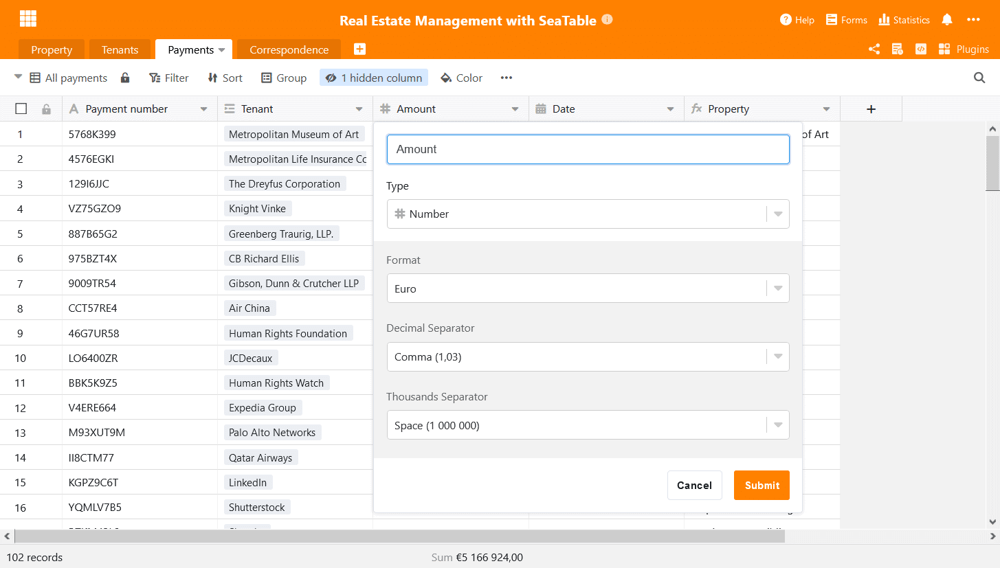
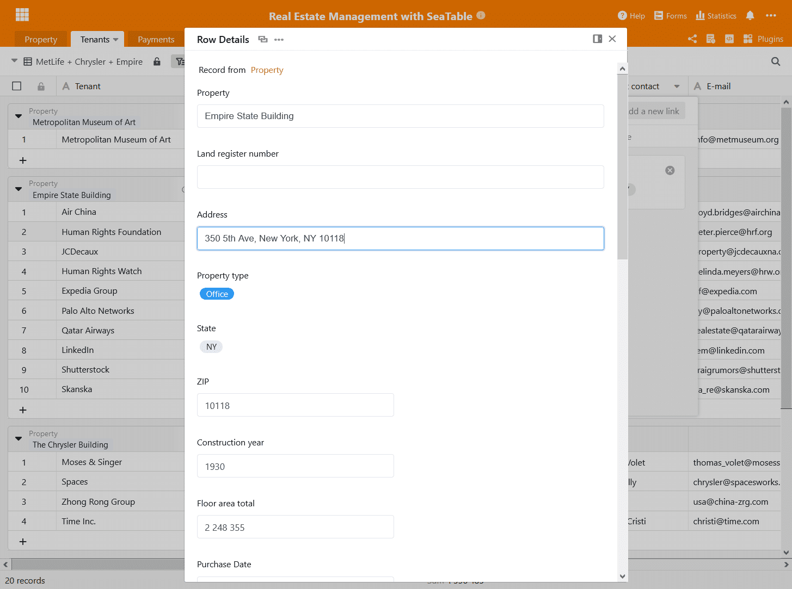
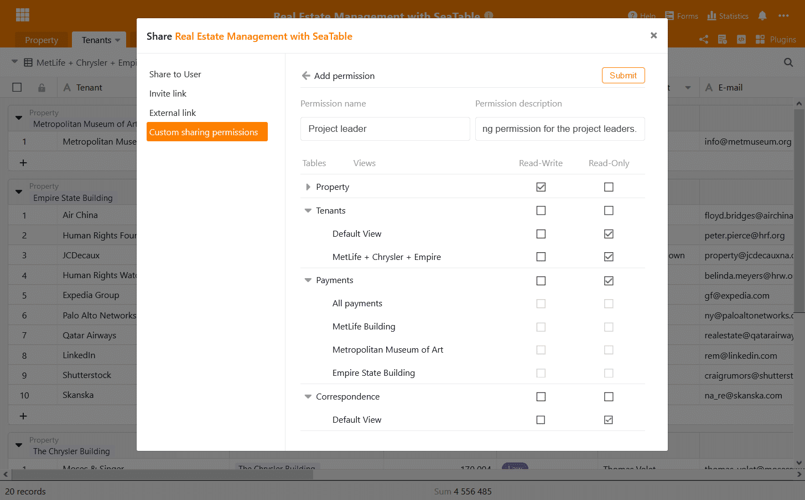
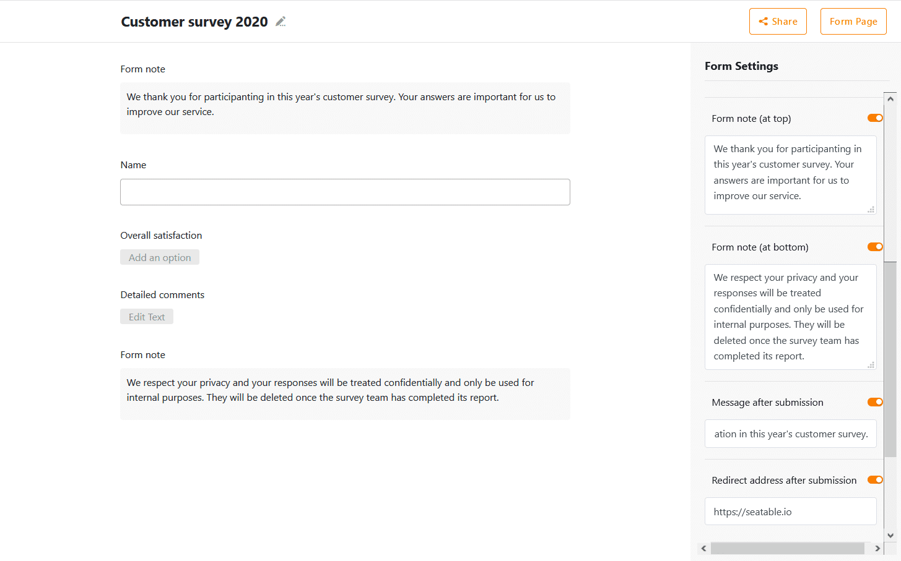

Today we have updated cloud.seatable.io to version 1.5 of SeaTable. With the next login, all users will benefit from exciting new features and a number of interface and existing functionality improvements. At first glance, you will notice the numerous minor and major changes to the table editor, resulting in increased workflow efficiency and improved user experience. The new custom sharing permissions provide more control and flexibility when working collaboratively on bases. Enhanced customization options make SeaTable's web forms an even more versatile tool for data collection.

The full list of changes is, as always, available in [SeaTable's Changelog](https://seatable.io/docs/changelog/version-1-5/?lang=auto). This release note presents the new version's biggest and most exciting changes.

## Sleeker table editor

Given that most users spend most of their time in SeaTable in the table editor, we spend a lot of time thinking up ways to make its many menus, wizards and views more user friendly. We believe we have made great strides in this regard by replacing modals through inline menus, improving menu design as well as upgrading the graphics library for the statistics views. On top of that we have improved our view plugins. In summary, capturing and crunching data has become quite a bit more fun in SeaTable 1.5's table editor!

### Goodbye modals

Modals were more common in earlier versions of SeaTable. For example, the dialogs for 'Insert Column' and 'Adjust Column Type' were such [modals](https://en.wikipedia.org/wiki/Modal_window), where the controls appear in the foreground and the background is hidden. Although they have served us well so far, modals offer room for improvement in terms of ease and work efficiency: when the modal opens in the middle of the screen, it causes the user to move there with the mouse. More seriously, disabling scrollbars means that relevant information cannot be brought out from behind a modal when a modal covers it. So what did we do? We replaced the modals with non-modal menus that provide all the functionality of their predecessors without their drawbacks.

### Simplified menus

The options menu in single and multiple select columns is another menu that we converted into a non-modal menu. But we didn't stop there. We also replaced the existing, somewhat cumbersome cascading menu with a much more convenient single window menu. Options can now be created, modified and deleted in one menu with as few clicks as possible.

### Co-editing on tables

[SeaTable 1.4]() introduced a new wizard to facilitate the linking of records. The wizard opens with a double-click in a cell with a link and presents all records in the linked column in an overlay. Clicking a record from the list posts it in the cell. The wizard made linking a record as simple as selecting a value from a dropdown menu.

SeaTable 1.5 now makes the wizard even more powerful by adding an edit to the existing display function! A click on a linked record opens the record's row details. Any edits made there are written to the linked table. If the linked table needs to be accessed, a link atop the record's details provides one-click access.

### Let's get precise

In addition to the select and link column types, the number and formula columns also got an update. The format settings of the number column now allow the definition of the decimal precision. The number of decimal places can be individually set at anything between 0 and 8. Of course, these settings can be applied to number, percent and currency values and independent of the decimal separator sign.

When a formula result is numerical (e.g., sum, roundup, average), all format settings available in the number column are now also available in the formula column. For maximum flexibility, a result's formatting in the formula column is independent from the formula's input fields.

### Statistics upgrade

SeaTable's statistics module makes use of the open-source [data visualization library G2](https://g2.antv.vision/en). G2 allows SeaTable to generate a multitude of web-based views interactively and dynamically.

In SeaTable 1.5, we have updated G2 to the current version 4.0 which had been released earlier in 2020 by the data visualization team from the Ant Group. Together with some changes in its integration in SeaTable, this upgrade improves the general reliability and stability of the statistics module.

### Better view plugins

The map and the timeline plugin have also seen their fair share of improvements. The map plugin, for example, now remembers the user's last position. When you open up the map plugin, you can pick up your work right where you left off. In the timeline plugin, we reduced the scrolling speed which many customers found too fast.

## Custom sharing permissions

Imagine you want to share a base with your team members with different access rights: All colleagues should have at least read access, but some colleagues should have read-write access to a few tables, and a few hand-picked colleagues should have full access to all tables. Sounds complicated to implement and in fact it was. One base had to be split into several bases and then shared with the different groups with different rights. Until now!

In the new version we introduce user-defined release permissions. Thanks to them, the scenario just mentioned is possible without much headache. A custom share permission consists of individual access rights for all tables and views in a base. With a custom share permission, you can, for example, grant read access to one table but extended read-write access to another table in the base. But that's not all: custom shares can also be specified at the view level. You can therefore grant read-write access to a specific view of a table, but read-only access to the default view. If you do not want to grant access to a table or view at all, that is also possible. Simply grant neither read nor read-write access. And best of all, you can define as many custom [share permissions](https://seatable.io/en/docs/handbuch/zusammenarbeit/freigaben/) as you want for each base. Have you been longing for more granular permission management in SeaTable? Now you have it!

## More flexible forms

SeaTable's powerful web forms have proven to be a very sought after feature in recent months. We are proud that countless restaurants, coffee shops and bars all across Europe have started using SeaTable for registering guest contact information during the Corona pandemic.

Based on customer feedback and in hopes of helping this suffering industry, we have added three options to customize the web forms: First, custom "Thank you for your participation" messages can now be created. You want to send a special thank you to your guests or provide further information after they have answered the questions, SeaTable 1.5 allows you to do just that. Secondly, automatic forwarding has been a much requested feature. It is our pleasure to implement it in this new version as well. If a forwarding address is specified, SeaTable will automatically forward to that address. Thirdly, we have also made the hint functions more flexible. In addition to the form hint at the bottom of the form, there is now also the possibility to display a hint in front of the form fields.

We are crossing our fingers that the Corona pandemic will be something for the history books very soon. Yet, if the pandemic is with us for longer, we hope that these improvements will help SeaTable users in the hard-hit restaurant industry.

## More improvements

This release note only covers the most important improvements in greater detail. The Changelog contains the complete list of modifications. Check it out! Among the noteworthy smaller improvements are time triggers for Python scripts (see the [release note of SeaTable 1.4]()) and the removal of performance issues when handling a larger number of rows in the table editor.

Register your team account now and use SeaTable permanently free-of-charge! For feedback and comments, we are looking forward to hearing from you in the  [SeaTable Forum](https://forum.seatable.com/).
