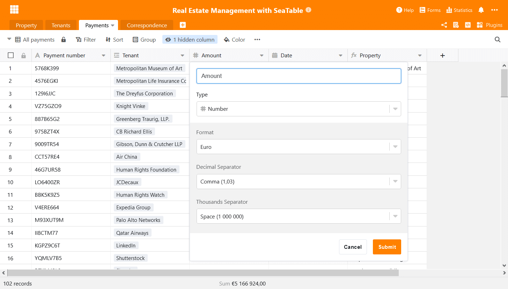
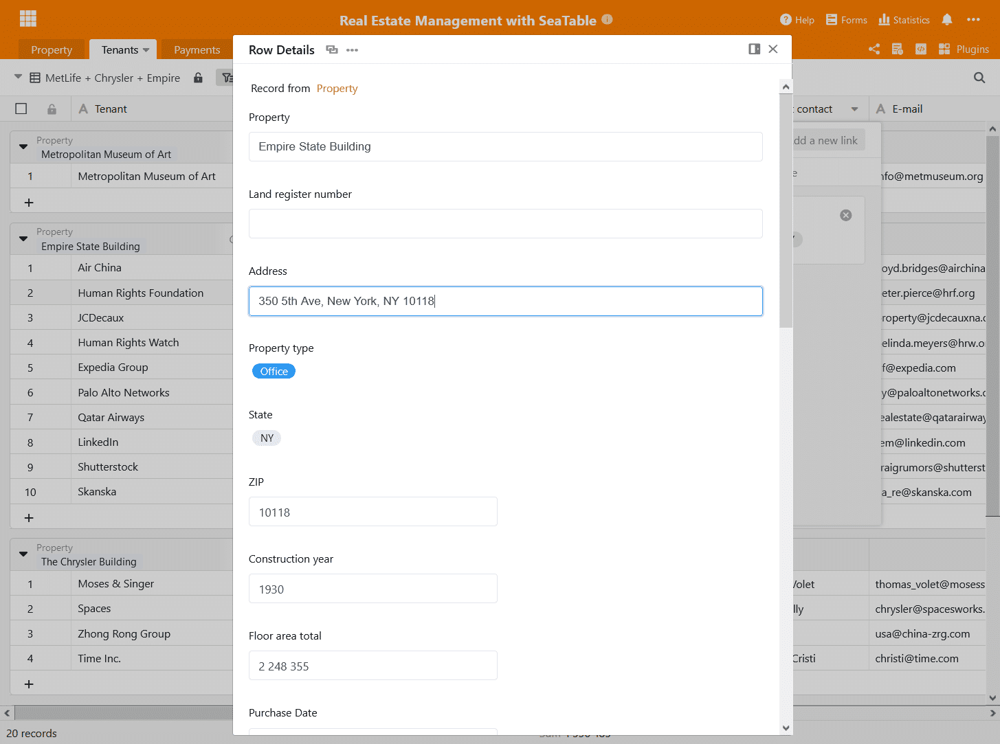
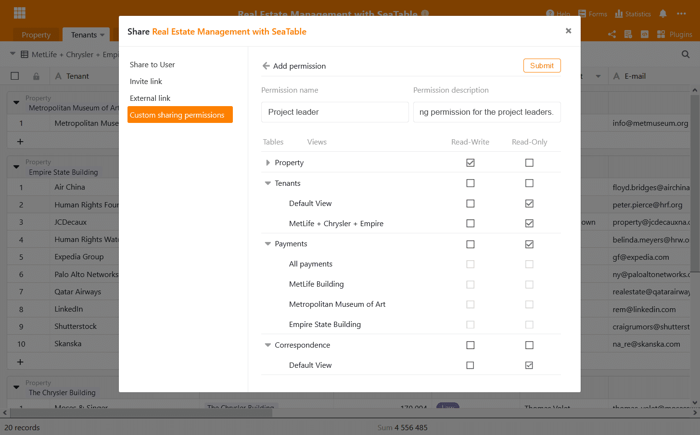
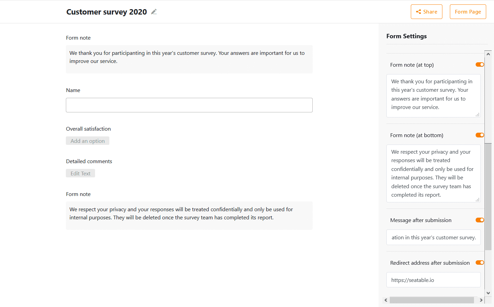

Aujourd'hui, nous avons mis à jour cloud.seatable.io vers la version 1.5 de SeaTable. Avec la prochaine connexion, tous les utilisateurs bénéficieront de nouvelles fonctionnalités passionnantes et d'une série d'améliorations de l'interface et des fonctions existantes. Au premier coup d'œil, vous remarquerez les nombreuses modifications, petites et grandes, apportées à l'éditeur de tableaux, qui se traduisent par une plus grande efficacité du flux de travail et une meilleure expérience utilisateur. Les nouvelles autorisations de partage définies par l'utilisateur offrent un contrôle et une flexibilité accrus pour le travail collaboratif sur les bases. Les options de personnalisation avancées font des formulaires Web de SeaTables un outil encore plus polyvalent pour la saisie de données.

La liste complète des changements peut être trouvée, comme toujours, dans [le journal des changements de SeaTable](). Cette note de mise à jour présente les changements les plus importants et les plus intéressants de cette nouvelle version.

## Amélioration de l'éditeur de tableaux

Étant donné que la majorité des utilisateurs passent la plupart de leur temps dans l'éditeur de tableaux, nous consacrons beaucoup d'attention et d'efforts à la recherche de moyens de rendre les nombreux menus, assistants et vues de l'éditeur encore plus conviviaux. Nous pensons avoir fait de grands progrès dans cette direction avec la version 1.5. Nous avons remplacé les fenêtres modales par des menus en ligne, nous avons amélioré la conception des menus et nous avons mis à jour la bibliothèque de logiciels de visualisation des statistiques à la dernière version. En outre, nous avons amélioré les plug-ins de visualisation. Dans l'ensemble, la saisie et l'édition de données dans l'éditeur de tableaux de SeaTable 1.5 est maintenant beaucoup plus amusante !

### Adieu Modals

Les modales étaient plus fréquentes dans les versions précédentes de SeaTable. Par exemple, les boîtes de dialogue 'Insérer une colonne' et 'Ajuster le type de colonne' étaient de tels [modals](https://en.wikipedia.org/wiki/Modal_window), où les contrôles apparaissaient au premier plan et où l'arrière-plan était masqué. Même s'ils nous ont rendu de bons services jusqu'à présent, les modaux offrent une marge d'amélioration en termes de facilité et d'efficacité du travail : lorsque le modal s'ouvre au milieu de l'écran, il incite l'utilisateur à s'y rendre avec la souris. Plus grave encore, en désactivant les barres de défilement, des informations pertinentes ne peuvent pas apparaître derrière un modal si un modal les cache. Qu'avons-nous donc fait ? Nous avons remplacé les modals par des menus non modals qui offrent toutes les fonctions de leurs prédécesseurs sans leurs inconvénients.

### Des menus simplifiés

Le menu d'options des colonnes de sélection unique et multiple est une autre modale que nous avons convertie en menu non modal. Cependant, nous n'en sommes pas restés là. Nous avons également remplacé le menu à plusieurs niveaux existant, quelque peu encombrant, par un menu plat beaucoup plus confortable. Les options peuvent désormais être créées, modifiées et supprimées dans une fenêtre claire. Le nombre de clics nécessaires a été réduit au minimum.

### Modification simultanée de plusieurs tableaux

[SeaTable 1.4]() a introduit un nouvel assistant qui facilite la liaison des entrées. Cet assistant s'ouvre par un clic sur une cellule de lien et affiche ensuite toutes les entrées de la colonne liée dans une fenêtre claire. Un autre clic sur une entrée crée le lien vers l'entrée dans la cellule. En d'autres termes, avec le nouvel assistant, lier des entrées est devenu aussi facile que de sélectionner une valeur dans un menu déroulant.

SeaTable 1.5 rend cet assistant encore plus puissant : les entrées dans la colonne liée peuvent maintenant être non seulement affichées mais aussi éditées directement. Un clic sur une entrée liée ouvre ses détails et toutes les modifications apportées ici sont enregistrées directement dans le tableau lié. Si vous voulez passer au tableau lié, vous pouvez le faire avec le lien direct en haut des détails.

### Encore plus précis

Non seulement les colonnes de sélection et de liens, mais aussi les colonnes de nombres et de formules ont été mises à jour. La précision décimale peut maintenant être définie dans la colonne des nombres. Les décimales peuvent être réglées individuellement sur une valeur de 0 à 8 dans chacune de ces colonnes. Bien entendu, cela s'applique quel que soit le format (nombre, pourcentage et devise) et le séparateur décimal sélectionné.

Si le résultat d'une formule est un nombre (par exemple, pour les formules somme, arrondi et moyenne), toutes les options de formatage de la colonne nombre sont également disponibles dans la colonne formule. Pour une flexibilité maximale, le formatage de la colonne de formule est indépendant des colonnes utilisées dans la formule.

### De meilleures statistiques

Le module de statistiques de SeaTable utilise la [bibliothèque de logiciels de visualisation de données open source G2](https://g2.antv.vision/en). G2 permet de générer une variété d'évaluations basées sur le web de manière interactive et dynamique dans SeaTable.

Dans SeaTable 1.5 nous avons mis à jour G2 à la version actuelle 4.0. Celle-ci a été publiée au printemps 2020 par l'équipe de visualisation des données du groupe Ant. Avec quelques améliorations concernant l'intégration, cette mise à jour augmente la fiabilité et la stabilité globales du module de statistiques.

### Amélioration des plugins d'affichage

Le plugin cartes et chronologie n'a pas été négligé non plus. Le plugin de la carte se souvient désormais de la dernière position de l'utilisateur. Si vous ouvrez à nouveau la vue de la carte, vous pouvez continuer directement là où vous vous êtes arrêté. Dans le plugin timeline, nous avons réduit la vitesse de défilement, que de nombreux utilisateurs trouvaient trop rapide.

## Actions définies par l'utilisateur

Imaginez que vous souhaitiez partager une base avec les membres de votre équipe avec des droits d'accès différents : Tous les collègues doivent avoir au moins un accès en lecture, certains collègues un accès en lecture/écriture à quelques tables et quelques collègues triés sur le volet un accès complet à toutes les tables. Cela semble compliqué à mettre en œuvre et c'était effectivement le cas. Une base devait être divisée en plusieurs bases et ensuite partagée avec les différents groupes avec des droits différents. Jusqu'à présent !

Dans la nouvelle version, nous introduisons des autorisations de partage définies par l'utilisateur. Grâce à elles, le scénario que nous venons d'évoquer est possible sans trop de casse-tête. Une autorisation de partage personnalisée consiste en des droits d'accès individuels pour toutes les tables et vues d'une base. Avec une autorisation de partage personnalisée, vous pouvez par exemple accorder un accès en lecture à une table, mais un accès en lecture-écriture étendu à une autre table de la base. Mais ce n'est pas tout : les partages personnalisés peuvent également être spécifiés au niveau de la vue. Vous pouvez donc accorder un accès en lecture/écriture à une vue spécifique d'une table, mais uniquement un accès en lecture à la vue par défaut. Si vous ne souhaitez pas accorder d'accès à une table ou à une vue, c'est également possible. Il suffit de ne pas accorder d'accès en lecture ou en écriture. Et le meilleur pour la fin : vous pouvez définir autant [d'autorisations de partage]() personnalisées que vous le souhaitez pour chaque base. Vous rêviez d'une gestion plus granulaire des autorisations dans SeaTable ? Vous l'avez maintenant !

## Des formulaires web plus flexibles

Les puissants formulaires web de SeaTable ont été très demandés au cours des derniers mois. Nous sommes ravis que d'innombrables restaurants, cafés et bars à travers l'Europe aient trouvé en SeaTable une solution simple pour mettre en œuvre les exigences d'enregistrement des clients pendant la pandémie de Corona.

En nous basant sur les commentaires de nos clients et dans l'espoir de soutenir ce secteur qui souffre, nous avons ajouté trois options de personnalisation des formulaires web : premièrement, il est désormais possible de créer des messages individuels "Merci pour votre participation". Vous voulez envoyer un remerciement spécial à vos invités ou donner des informations plus détaillées après avoir répondu aux questions, c'est exactement ce que vous pouvez faire avec SeaTable 1.5. Deuxièmement, la redirection automatique était une fonction très demandée. C'est un plaisir pour nous de la mettre en œuvre dans cette nouvelle version. Si une adresse de redirection est indiquée, SeaTable redirige automatiquement vers cette adresse. Troisièmement, nous avons également assoupli les fonctions de remarque. En plus de la note de formulaire au bas du formulaire, il est désormais possible d'afficher une note avant les champs de formulaire.

Nous croisons les doigts pour que la pandémie de Corona n'apparaisse bientôt plus que dans les livres d'histoire. D'autre part, nous espérons que ces améliorations aideront les utilisateurs de SeaTable dans les secteurs fortement touchés dans leur travail si la pandémie se prolonge.

## Nouvelles améliorations

Cette note de mise à jour ne traite en détail que des changements les plus importants. Le journal des modifications contient l'historique complet des modifications. Jetez-y un coup d'œil ! Parmi les améliorations mineures qui méritent d'être mentionnées figurent les déclencheurs temporels pour les scripts Python (voir la [note de mise à jour de SeaTable 1.4]() et l'élimination des problèmes de performance lors de la gestion de grands ensembles de lignes dans l'éditeur de tableaux.

Obtenez un compte SeaTable pour votre équipe et utilisez SeaTable gratuitement de façon permanente ! Vos réactions et commentaires sont les bienvenus sur le [forum](https://forum.seatable.com/).
