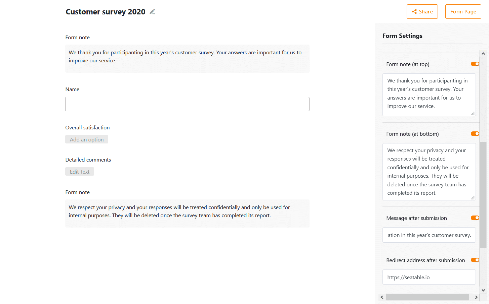

Hoje actualizámos cloud.seatable.io para a versão 1.5 de SeaTable. Com o próximo login, todos os utilizadores beneficiarão de novas e excitantes funcionalidades e de uma série de melhorias na interface e nas funções existentes. À primeira vista, notará as numerosas alterações menores e maiores no editor de tabelas, resultando numa maior eficiência do fluxo de trabalho e numa melhor experiência do utilizador. As novas permissões de partilha personalizadas proporcionam mais controlo e flexibilidade quando se trabalha em colaboração sobre bases. Opções de personalização melhoradas fazem dos formulários da SeaTable uma ferramenta ainda mais versátil para a recolha de dados.

A lista completa das alterações pode ser encontrada, como sempre, no [changelog do SeaTable](?lang=auto). Esta nota de lançamento apresenta as mudanças mais importantes e excitantes desta nova versão.

## Editor de mesa melhorado

Dado que a maioria dos utilizadores passa a maior parte do seu tempo no editor de mesa, dedicamos muita atenção e esforço à procura de formas de tornar os muitos menus, feiticeiros e vistas do editor ainda mais fáceis de utilizar. Acreditamos ter feito grandes progressos nesta direcção com a versão 1.5. Substituímos os modais por menus em linha, melhorámos o design do menu e actualizámos a biblioteca de software de visualização de estatísticas para a versão mais recente. Além disso, melhorámos os plug-ins de visualização. No geral, introduzir e editar dados no editor de tabela do SeaTable 1.5 é agora muito mais divertido!

### Modalidades Adieu

Os modais eram mais comuns nas versões anteriores do SeaTable. Por exemplo, as caixas de diálogo "Inserir coluna" e "Ajustar tipo de coluna" eram [modais](https://en.wikipedia.org/wiki/Modal_window), em que os controlos apareciam em primeiro plano e o fundo estava oculto. Embora nos tenham servido bem até agora, os modais podem ser melhorados em termos de facilidade e eficiência de trabalho: quando o modal se abre no meio do ecrã, pede ao utilizador para ir até lá com o rato. Mais grave ainda, ao desativar as barras de deslocamento, as informações relevantes não podem ser retiradas de trás de um modal quando este as cobre. O que fizemos então? Substituímos os modais por menus não modais que oferecem todas as funções dos seus antecessores sem os seus inconvenientes.

### Menus simplificados

O menu de opções das colunas de selecção única e múltipla é outro modal que convertemos num menu não modal. No entanto, não ficámos por aqui. Substituímos também o menu multinível existente, algo pesado e pesado, por um menu muito mais confortável e plano. As opções podem agora ser criadas, alteradas e apagadas numa janela transparente. O número de cliques necessários foi reduzido ao mínimo.

### Edição simultânea de várias tabelas

[SeaTable 1.4]() introduziu um novo mago que facilita a ligação das entradas. Este assistente abre-se com um clique numa célula de ligação e depois mostra todas as entradas na coluna ligada numa janela transparente. Outro clique sobre uma entrada cria o link para a entrada na célula. Por outras palavras, com o novo assistente, ligar entradas tornou-se tão fácil como seleccionar um valor a partir de um menu drop-down.

SeaTable 1.5 torna agora este feiticeiro ainda mais poderoso: As entradas na coluna ligada podem agora não só ser exibidas mas também editadas directamente. Um clique numa entrada ligada abre os seus detalhes e todas as alterações feitas aqui são guardadas directamente na tabela ligada. Se quiser saltar para a tabela ligada, pode fazê-lo com a ligação directa na parte superior dos detalhes.

### Ainda mais preciso

Não só as colunas de selecção e ligação, mas também as colunas de número e fórmula foram actualizadas. A precisão decimal pode agora ser definida na coluna de números. As casas decimais podem ser definidas individualmente para um valor de 0 a 8 em cada uma dessas colunas. Naturalmente, isto aplica-se independentemente do formato (número, percentagem e moeda) e do separador decimal seleccionado.

Se um resultado de fórmula for um número (por exemplo, para a soma das fórmulas, arredondamento e média), todas as opções de formatação da coluna de números estão também disponíveis na coluna de fórmulas. Para a máxima flexibilidade, a formatação na coluna da fórmula é independente das colunas utilizadas na fórmula.

### Melhores estatísticas

O módulo estatístico do SeaTable utiliza a [biblioteca de software de visualização de dados de código aberto G2](https://g2.antv.vision/en). G2 torna possível gerar uma variedade de avaliações baseadas na web de forma interactiva e dinâmica em SeaTable.

No SeaTable 1.5 actualizámos G2 para a versão actual 4.0. Isto foi divulgado na Primavera de 2020 pela equipa de visualização de dados do Grupo das Formigas. Juntamente com algumas melhorias relativas à integração, esta actualização aumenta a fiabilidade global e a estabilidade do módulo estatístico.

### Plugins de visualização melhorados

Os mapas e o plugin da linha do tempo também não foram negligenciados. O plugin do mapa lembra-se agora da última posição do utilizador. Se agora voltar a abrir a vista do mapa, pode continuar directamente onde parou por último. No plugin da linha do tempo, reduzimos a velocidade de rolagem, que muitos utilizadores consideraram demasiado rápida.

## Acções definidas pelo utilizador

Imagine que quer partilhar uma base com os membros da sua equipa com diferentes direitos de acesso: Todos os colegas deveriam ter pelo menos acesso de leitura, mas alguns colegas deveriam também ter acesso de leitura-escrita a algumas mesas e alguns colegas escolhidos a dedo deveriam ter acesso total a todas as mesas. Parece complicado de implementar e, de facto, foi. Uma base teve de ser dividida em várias bases e depois partilhada com os diferentes grupos com direitos diferentes. Até agora!

Na nova versão, introduzimos permissões de lançamento definidas pelo utilizador. Graças a eles, o cenário agora mencionado é possível sem muita dor de cabeça. Uma permissão de partilha personalizada consiste em direitos de acesso individuais para todas as tabelas e vistas numa base. Com uma permissão de partilha personalizada, pode, por exemplo, conceder acesso de leitura a uma tabela mas acesso de leitura-escrita alargado a outra tabela na base. Mas isso não é tudo: as acções personalizadas também podem ser especificadas ao nível da vista. Pode, portanto, conceder acesso de leitura-escrita a uma visão específica de uma tabela, mas apenas acesso de leitura à visão por defeito. Se não quiser conceder acesso a uma mesa ou vista, isso também é possível. Simplesmente não conceder acesso de leitura nem de leitura-escrita. E o melhor de tudo, pode definir tantas [permissões de partilha]() personalizadas quantas quiser para cada base. Tem ansiado por uma gestão de permissões mais granular em SeaTable? Agora já o tem!

## Formulários web mais flexíveis

Os poderosos formulários da SeaTable têm tido uma grande procura nos últimos meses. Estamos encantados por inúmeros restaurantes, cafés e bares em toda a Europa terem encontrado no SeaTable uma solução simples para implementar os requisitos de registo de convidados durante a Pandemia da Corona.

Com base no feedback dos clientes e na esperança de apoiar este sector em sofrimento, adicionámos três opções para personalizar os formulários Web: Em primeiro lugar, podem agora ser criadas mensagens individuais de "Obrigado pela sua participação". Se quiser enviar um agradecimento especial aos seus convidados ou fornecer mais informações depois de terem respondido às perguntas, o SeaTable 1.5 permite-lhe fazer isso mesmo. Em segundo lugar, o reencaminhamento automático tem sido uma funcionalidade muito solicitada. Temos o prazer de a implementar também nesta nova versão. Se for especificado um endereço de reencaminhamento, o SeaTable reencaminha automaticamente para esse endereço. Em terceiro lugar, também tornámos as funções de sugestão mais flexíveis. Para além da sugestão de formulário na parte inferior do formulário, existe agora também a possibilidade de apresentar uma sugestão à frente dos campos do formulário.

Estamos a fazer figas que a Pandemia de Corona será em breve algo para os livros de história. Por outro lado, é nossa esperança que estas melhorias apoiem os utilizadores do SeaTable nas indústrias fortemente afectadas no seu trabalho, se a pandemia se mantiver por mais tempo.

## Outras melhorias

Esta nota de lançamento discute apenas em pormenor as alterações mais importantes. O changelog contém o histórico completo das mudanças. Dê uma olhadela lá! Entre as pequenas melhorias que vale a pena mencionar estão o tempo de activação dos scripts Python (ver [nota de lançamento do SeaTable 1.4]()) e a eliminação de problemas de desempenho ao gerir conjuntos maiores de filas no editor de tabelas.

Obtenha uma conta SeaTable para a sua equipa e use o SeaTable permanentemente sem custos! Agradecemos o vosso feedback e comentários no [fórum](https://forum.seatable.com/).
