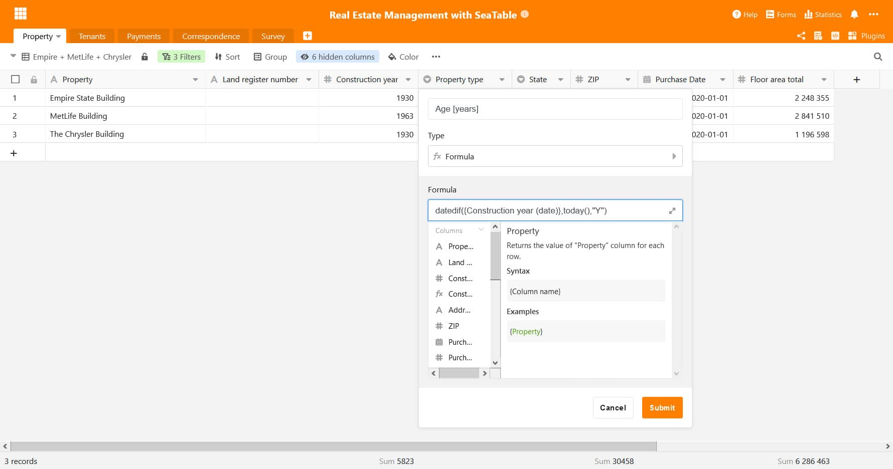

Wir beginnen das neue Jahr mit einem neuen SeaTable Release: Version 1.6 wurde heute auf [https://cloud.seatable.io](https://cloud.seatable.io) ausgerollt. Die Veröffentlichung auf Docker Hub wird in Kürze erfolgen. Die neue Version ist wieder mal voll mit neuen Funktionen und Verbesserungen. Auf den ersten Blick werden Ihnen die zwei neuen Spaltentypen und das überarbeitete Menü für die Spaltenkonfiguration auffallen. Bei genauerem Blick werden Sie eine Vielzahl weiterer User Interface Verbesserungen finden. In dieser Version haben wir auch große Anstrengungen in den Formelassistenten investiert. Neue Funktionen, Designverbesserungen und erweiterte Fehlermeldungen heben den Assistenten auf eine ganz neue Ebene.

In dieser Release Note stellen wir die bedeutendsten und relevantesten Änderungen der neuen Version vor. Eine vollständige Auflisting der Änderungen finden Sie – wie immer – im [SeaTable Changelog](https://seatable.io/docs/changelog/version-1-6/).

## Spaltentyp #19: Dauer

Der Spaltentyp Dauer ist ideal für all diejenigen, die SeaTable nutzen, um Zeitmessungen und -spannen wie z.B. Arbeitszeiten zu organisieren und zu speichern.

Der Spaltentyp speichert alle Eingaben in Sekunden, stellt die Eingaben aber in den benutzerfreundlichen Formaten h:mm:ss und h:mm dar. Sie haben auch die Wahl, Dauern entweder in der Doppelpunkt-separierten Schreibweise oder als Zahl einzugeben. SeaTable konvertiert jede numerische Eingabe automatisch in das gewünschte Format. Ganzzahlen wie Dezimalzahlen werden gleichermaßen unterstützt. Wie die numerische Eingabe interpretiert wird, hängt vom gewählten Format ab. Ist das h:mm:ss Format gewählt, wird die eingegebene Zahl als Sekundenangabe interpretiert; im h:mm Fall als Minuten. (Beispiel: Die Eingabe 235 wird in 0:03:55 umgewandelt, wenn die Spalte das Format h:mm:ss verwendet. Die gleiche Eingabe resultiert in 3:55 in einer Zelle mit h:mm Format.)

Und das ist noch nicht alles! Wir haben auch die Formatoptionen der Formelspalte erweitert, sodass sich numerische Ergebnisse als Dauer entweder im h:mm oder dem h:mm:ss Format darstellen lassen.

## Spaltentyp # 20: E-Mail

Der neue Spaltentyp E-Mail speichert E-Mail-Adressen. Ein Klick auf eine gefüllte Zelle öffnet automatisch die Mail-App und kopiert die Adresse wird in die An: Zeile. Man kann also direkt zum Verfassen der E-Mail übergehen. Zellen in der E-Mail Spalte verhalten sich also ganz ähnlich wie Zellen in der Spalte vom Typ URL, die in [SeaTable 1.4]() eingeführt wurde.

Die echte Stärke der E-Mail Spalte tritt in Webformularen in Erscheinung. Mit der im E-Mail Feld integrierten Validierung lässt sich sicherstellen, dass eine Eingabe einer gültigen E-Mail-Adresse entspricht. Versehentliche Schreibfehler, die eine E-Mail-Adresse unnutzbar machen, gibt es damit nicht mehr.

## Verbesserter Formelassistent

SeaTable 1.6 führt fünf neue Funktionen ein: date(), datedif(), eomonth(), months() und ifs(). Die ersten vier vereinfachen und verbessern die Organisation und Verwaltung von Datumswerten in SeaTable. Die date() Funktion berechnet für ein Datum die Zahl, die dem Datum in Microsoft Excels Datum-Uhrzeitformat entspricht. datedif(), kurz für das englische date difference, berechnet die Differenz zwischen zwei Daten. eomonth(), eine Abkürzung für das englische end of month, ermittelt den letzten Tag desjenigen Monats, der im Datum angegeben ist. Optional können Monate hinzugefügt werden. months() ermittelt die Anzahl der vollen Monate zwischen zwei Daten. ifs() prüft mehrere Bedingungen.

Eine weitere Verbesserung der Funktionalität des Assistenten haben wir erreicht, indem Formeln nun auch Formelspalten aus anderen Tabellen berücksichtigen können. Ganz konkret: Eine Formel in Tabelle B kann eine Formelspalte aus Tabelle A enthalten. Bisher ließen sich nur nicht-berechnete Spalten aus anderen Tabellen verwenden.

Der Assistent hat auch eine graphische Überarbeitung erfahren. Die wichtigste Neuerung: Der Assistent ist nun ein Pop-over Fenster und kein Modal mehr. Abgesehen von dem eleganteren Design bringt dies auch funktionale Vorteile: Das Modal schob sich in den Vordergrund und blockierte den Hintergrund; mit dem Pop-over ist der Hintergrund nicht gesperrt und in der Tabelle lässt sich auch mit geöffnetem Assistenten scrollen. Der Assistent überlagert nun auch nicht mehr die Spaltenüberschriften. Das heißt, man kann bequem alle Spaltenüberschriften direkt ablesen, während man seine Formel spezifiziert. Wenn eine Spalte nicht angezeigt wird, scrollt man einfach dorthin.

Last but not least, haben wir noch die Rückmeldungen des Assistenten überarbeitet. “Die Formel ist ungültig” war die Standardfehlermeldung in der Vergangenheit, wenn die Formelsyntax nicht befolgt oder eine nicht existierende Spalte referenziert wurde. Nun ist die Rückmeldung viel spezifischer und bietet eine pragmatische Hilfestellung für die Korrektur der Formel.

## Verwaltung von Anhängen

SeaTable ist nicht nur ein großartiges Tool, um strukturierte, tabellarische Daten zu erfassen, sondern auch um unstrukturierte Daten in Form von Dateien und formatierten Text zu organisieren und zu verwalten. Denken Sie an die Bilder, die Sie in einer Zelle vom Typ mehrzeiliger Text einfügen, oder die Dokumente, die Sie in eine Base hochladen können. All diese Anhänge speichert SeaTable in seinem Speicher-Backend.

Mit SeaTable 1.6 ist es nun möglich, auf dieses Speicher-Backend über das Webinterface zuzugreifen. Sie können durch die gespeicherten Dateien navigieren und einzelne Objekte aus dem Speicher löschen. Führen Sie dazu einfach in der Bases Bibliothek den Mauszeiger auf eine Base, klicken Sie dann auf das Dreipunkte-Icon für die erweiterten Optionen und wählen Sie abschließend “Verwaltung der Anhänge” unter “Erweitert”. Bilder und Dateien werden in separaten Ordnern mit den Namen Images und Files gespeichert.

Und nicht nur Anhänge lassen sich mit SeaTable 1.6 besser verwalten. Benutzer können nun auch auf den Papierkorb zugreifen, in dem SeaTable gelöschte Bases speichert, bevor Sie nach Ablauf von 30 Tagen aus dem System entfernt werden. Wenn eine Base aus Versehen gelöscht wurde oder der Nutzer einen Sinneswandel hat, dann kann die Base von dort inklusive aller Snapshots wiederhergestellt werden.

## Viele andere Verbesserungen

SeaTable 1.6 bietet noch viele andere Verbesserungen. Eine große Anzahl darunter haben zum Ziel, das Interface zu verbessern und die Benutzerfreundlichkeit zu erhöhen. Dieses Mal lag ein besonderes Augenmerk außerdem auf der Druckfunktion.

In Sachen User Interface haben wir das Galerie Plugin in ein nicht-modales Design überführt. Gleiches gilt für das Menü, um eine Ansicht umzubenennen. Dies folgt unserer allgemeinen Bestrebung, die Anzahl der Modals zu reduzieren. Wir haben auch ein Defizit der Suchfunktion beseitigt. Wenn Sie jetzt STRG + F drücken, dann wandert der Cursor-Fokus immer in die Suchzeile. Im Formulareditor haben wir die Hinweis-Eingabefelder in das Formular gerückt. Dies macht es einfacher, längere Hinweise zu schreiben, und macht den Editor grundsätzlich mehr WYSIWYG. In Sachen Benutzerfreundlichkeit haben wir die Auto-Ausfüllfunktion um ein praktisches Feature erweitert: SeaTable erkennt nun numerische Muster in alphanumerischen Strings und berücksichtigt diese beim Auto-Ausfüllen. Das neue Feature ’embedded code’ macht es einfacher, SeaTable Bases in Webseiten zu integrieren.

Zwei bekannte Probleme der Druckvorschau wurden ebenfalls beseitigt: Das Ausblenden einer Spalte in der Tabellenansicht führte nicht dazu, dass die Spalte auch aus der Zeilendetail-Ansicht entfernt wurden und damit auch nicht aus der Druckvorschau. Ein ähnliches Problem gab es beim Druck von gruppierten Daten. In der Druckvorschau wurden die Gruppennamen nicht angezeigt, wenn Einfach- bzw. Mehrfachauswahl- oder Verknüpfungsspalten für die Gruppierung verwendet wurden. Mit SeaTable 1.6 sind diese beiden Probleme ein Ding der Vergangenheit.
