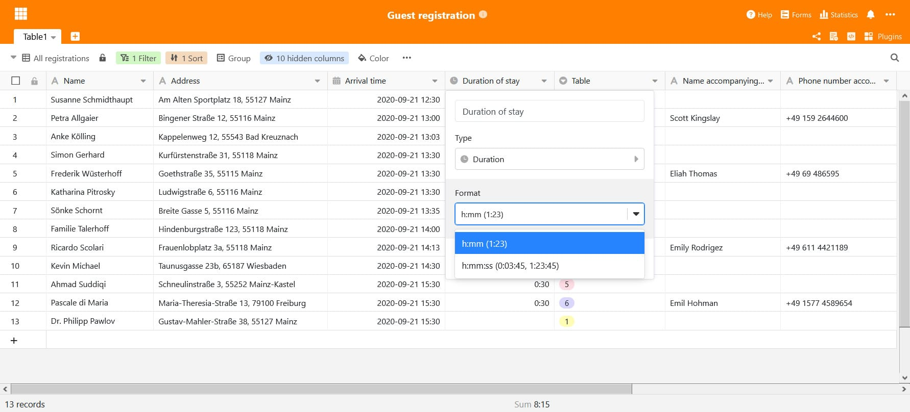
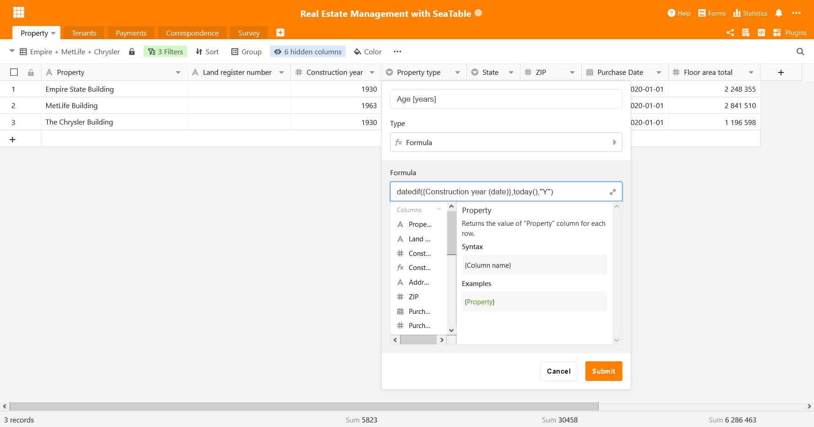
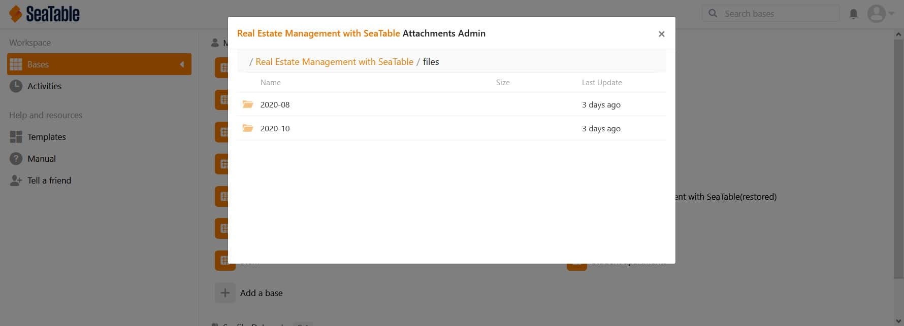
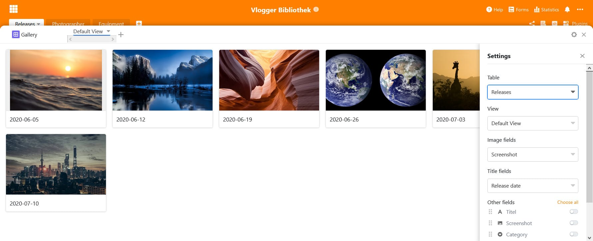

Nous commençons la nouvelle année avec une nouvelle version de SeaTable : la version 1.6 a été déployée aujourd'hui sur [https://cloud.seatable.io](https://cloud.seatable.io). La publication sur Docker Hub aura lieu prochainement. Cette nouvelle version est une fois de plus pleine de nouvelles fonctionnalités et d'améliorations. Au premier coup d'œil, vous remarquerez les deux nouveaux types de colonnes et le menu de configuration des colonnes remanié. En y regardant de plus près, vous trouverez une multitude d'autres améliorations de l'interface utilisateur. Dans cette version, nous avons également investi de gros efforts dans l'assistant de formules. De nouvelles fonctions, des améliorations du design et des messages d'erreur étendus élèvent l'assistant à un tout nouveau niveau.

Dans cette note de version, nous présentons les changements les plus importants et les plus pertinents de la nouvelle version. Comme toujours, vous pouvez trouver une liste complète des changements dans le [SeaTable Changelog]().

## Type de colonne n° 19 : durée

Le type de colonne Durée est idéal pour ceux qui utilisent SeaTable pour organiser et stocker des mesures de temps et des durées telles que les heures de travail.

Le type de colonne enregistre toutes les entrées en secondes, mais présente les entrées dans les formats conviviaux h:mm:ss et h:mm. Vous avez également le choix de saisir les durées soit en notation séparée par deux points, soit sous forme de chiffres. SeaTable convertit automatiquement toute entrée numérique dans le format souhaité. Les nombres entiers et décimaux sont également pris en charge. La façon dont l'entrée numérique est interprétée dépend du format sélectionné. Si le format h:mm:ss est sélectionné, le nombre saisi est interprété comme des secondes ; dans le cas h:mm, comme des minutes. (Exemple : L'entrée 235 est convertie en 0:03:55 si la colonne utilise le format h:mm:ss. La même entrée donne 3:55 dans une cellule au format h:mm).

Et ce n'est pas tout ! Nous avons également étendu les options de format de la colonne de formule afin que les résultats numériques puissent être affichés sous forme de durées au format h:mm ou h:mm:ss.

## Type de colonne n° 20 : E-mail

Le nouveau type de colonne E-mail permet de stocker les adresses électroniques. Un clic sur une cellule remplie ouvre automatiquement l'application Mail et copie l'adresse dans la ligne À :. Vous pouvez donc passer directement à la composition de l'e-mail. Les cellules de la colonne Email se comportent de manière très similaire à celles de la colonne Type d'URL introduite dans [SeaTable 1.4.]()

La véritable force de la colonne de courrier électronique apparaît dans les formulaires web. Grâce à la validation intégrée dans le champ e-mail, il est possible de s'assurer qu'une entrée correspond à une adresse e-mail valide. Les fautes d'orthographe accidentelles qui rendent une adresse électronique inutilisable ne sont plus possibles.

## Assistant de formule amélioré

SeaTable 1.6 introduit cinq nouvelles fonctions : date(), datedif(), eomonth(), months() et ifs(). Les quatre premières simplifient et améliorent l'organisation et la gestion des dates dans SeaTable. La fonction date() calcule pour une date le nombre correspondant à la date dans le format date-heure de Microsoft Excel. datedif(), abréviation de date difference, calcule la différence entre deux dates. eomonth(), abréviation de end of month, détermine le dernier jour du mois spécifié dans la date. En option, des mois peuvent être ajoutés. months() détermine le nombre de mois complets entre deux dates. ifs() vérifie plusieurs conditions.

Nous avons encore amélioré la fonctionnalité de l'assistant en permettant aux formules de prendre en compte les colonnes de formule d'autres tableaux. Concrètement : une formule du tableau B peut contenir une colonne de formule du tableau A. Auparavant, seules les colonnes non calculées provenant d'autres tables pouvaient être utilisées.

L'assistant a également fait l'objet d'une refonte graphique. L'innovation la plus importante : l'assistant est désormais une fenêtre pop-over et non plus une modale. Outre un design plus élégant, cette solution présente également des avantages fonctionnels : La modale se plaçait au premier plan et bloquait l'arrière-plan ; avec le pop-over, l'arrière-plan n'est pas bloqué et il est possible de faire défiler le tableau même si l'assistant est ouvert. L'assistant ne recouvre plus les titres des colonnes. Cela signifie que vous pouvez confortablement lire directement tous les titres de colonne tout en spécifiant votre formule. Si une colonne n'est pas affichée, il suffit de la faire défiler jusqu'à elle.

Last but not least, nous avons également revu les messages de retour de l'assistant. "La formule n'est pas valable" était le message d'erreur standard dans le passé, lorsque la syntaxe de la formule n'était pas respectée ou qu'une colonne inexistante était référencée. Désormais, le feedback est beaucoup plus spécifique et offre une aide pragmatique pour la correction de la formule.

## Gestion des pièces jointes

SeaTable n'est pas seulement un outil formidable pour saisir des données structurées sous forme de tableau, mais aussi pour organiser et gérer des données non structurées sous forme de fichiers et de texte formaté. Pensez aux images que vous insérez dans une cellule de type texte multiligne ou aux documents que vous pouvez télécharger dans une base. Toutes ces pièces jointes sont stockées par SeaTable dans son backend de stockage.

Avec SeaTable 1.6, il est désormais possible d'accéder à ce backend de stockage via l'interface web. Vous pouvez naviguer dans les fichiers stockés et supprimer des objets de la mémoire. Pour cela, il suffit de passer le curseur de la souris sur une base dans la bibliothèque des bases, puis de cliquer sur l'icône à trois points pour les options avancées et enfin de sélectionner "Gestion des pièces jointes" sous "Avancé". Les images et les fichiers sont enregistrés dans des dossiers séparés appelés Images et Files.

Et ce ne sont pas seulement les pièces jointes qui peuvent être mieux gérées avec SeaTable 1.6. Les utilisateurs peuvent maintenant aussi accéder à la corbeille, où SeaTable stocke les bases supprimées avant qu'elles ne soient retirées du système après 30 jours. Si une base est accidentellement supprimée ou si l'utilisateur change d'avis, la base peut être restaurée à partir de là, y compris tous les instantanés.

## De nombreuses autres améliorations

SeaTable 1.6 offre de nombreuses autres améliorations. Un grand nombre d'entre elles visent à améliorer l'interface et à accroître la convivialité. Cette fois, une attention particulière a également été accordée à la fonction d'impression.

En ce qui concerne l'interface utilisateur, nous avons transformé le plugin Galerie en un design non modal. Il en va de même pour le menu permettant de renommer une vue. Cela suit notre volonté générale de réduire le nombre de modaux. Nous avons également éliminé une lacune de la fonction de recherche. Désormais, lorsque vous appuyez sur CTRL + F, le curseur se déplace toujours vers la ligne de recherche. Dans l'éditeur de formulaires, nous avons déplacé les champs de saisie des remarques dans le formulaire. Cela facilite l'écriture de notes plus longues et rend l'éditeur fondamentalement plus WYSIWYG. En ce qui concerne la convivialité, nous avons ajouté une fonctionnalité pratique à la fonction d'auto-remplissage : SeaTable reconnaît désormais les modèles numériques dans les chaînes alphanumériques et les prend en compte lors de l'auto-remplissage. La nouvelle fonctionnalité 'code intégré' facilite l'intégration des bases SeaTable dans les pages web.

Deux problèmes connus de l'aperçu avant impression ont également été éliminés : Le fait de masquer une colonne dans la vue tableau ne supprimait pas les colonnes de la vue détaillée de la ligne et donc de l'aperçu avant impression. Un problème similaire se posait lors de l'impression de données groupées. Dans l'aperçu avant impression, les noms des groupes n'étaient pas affichés si des colonnes de sélection ou de liaison uniques ou multiples étaient utilisées pour le regroupement. Avec SeaTable 1.6, ces deux problèmes font partie du passé.
