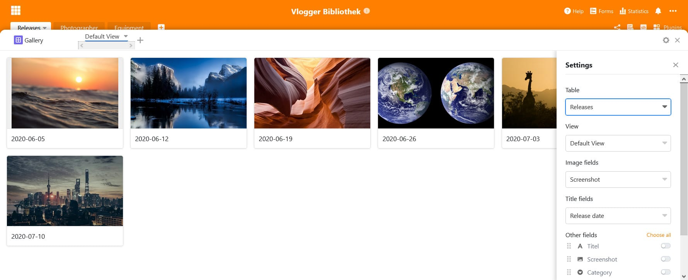

Começamos o novo ano com um novo lançamento SeaTable: a versão 1.6 foi lançada hoje em [https://cloud.seatable.io](https://cloud.seatable.io). O lançamento em Docker Hub seguir-se-á em breve. A nova versão está mais uma vez cheia de novas funcionalidades e melhorias. À primeira vista, notará os dois novos tipos de colunas e o menu de configuração de colunas revisto. Numa inspecção mais atenta, encontrará uma série de outras melhorias na interface do utilizador. Nesta versão, também investimos muito esforço no mago da fórmula. Novas funções, melhorias no design e mensagens de erro alargadas levam o assistente a um nível totalmente novo.

Nesta nota de lançamento, apresentamos as alterações mais significativas e relevantes da nova versão. Como sempre, é possível encontrar uma lista completa de alterações no [SeaTable Changelog](https://seatable.io/docs/changelog/version-1-6/?lang=auto).

## Tipo de coluna #19: Duração

O tipo de coluna Duração é ideal para aqueles que utilizam o SeaTable para organizar e armazenar medições e intervalos de tempo como, por exemplo, horas de trabalho.

O tipo de coluna armazena todas as entradas em segundos, mas apresenta as entradas nos formatos de fácil utilização h:mm:ss e h:mm. Tem também a opção de introduzir durações em notação separada por cólon ou como um número. O SeaTable converte automaticamente qualquer entrada numérica para o formato desejado. Os números inteiros e decimais são igualmente suportados. A forma como a entrada numérica é interpretada depende do formato seleccionado. Se o formato h:mm:ss for seleccionado, o número introduzido é interpretado como segundos; no caso h:mm como minutos. (Exemplo: A entrada 235 é convertida para 0:03:55 se a coluna utilizar o formato h:mm:ss. A mesma entrada resulta em 3:55 numa célula com formato h:mm).

E isso não é tudo! Também alargámos as opções de formato da coluna de fórmula para que os resultados numéricos possam ser exibidos como durações em formato h:mm ou h:mm:ss.

## Tipo de coluna # 20: E-mail

O novo tipo de coluna E-mail armazena endereços de e-mail. Um clique numa célula cheia abre automaticamente a aplicação Mail e copia o endereço para a linha Para:. Pode, portanto, proceder directamente à composição do e-mail. As células da coluna Email comportam-se de forma muito semelhante às células da coluna do tipo URL introduzida no [SeaTable 1.4](/pt/seatable-release-1-4/).

A verdadeira força da coluna de correio electrónico aparece em formulários web. Com a validação integrada no campo de correio electrónico, é possível assegurar que uma entrada corresponde a um endereço de correio electrónico válido. Já não são possíveis erros de ortografia acidentais que inutilizem um endereço de correio electrónico.

## Assistente de fórmula melhorada

SeaTable 1.6 introduz cinco novas funções: data(), datif(), eomonth(), meses() e ifs(). Os quatro primeiros simplificam e melhoram a organização e gestão dos valores de datas no SeaTable. A função date() calcula para uma data o número correspondente à data no formato data/hora do Microsoft Excel. dateif(), abreviatura de date difference, calcula a diferença entre duas datas. eomonth(), abreviatura de end of month, determina o último dia do mês especificado na data. Opcionalmente, podem ser adicionados meses. meses() determina o número de meses completos entre duas datas. ifs() verifica várias condições.

Conseguimos uma melhoria adicional na funcionalidade do assistente, na medida em que as fórmulas podem agora também ter em conta colunas de fórmulas de outras tabelas. Em termos concretos: Uma fórmula na tabela B pode conter uma coluna de fórmula da tabela A. Anteriormente, só podiam ser utilizadas colunas não calculadas de outras tabelas.

O feiticeiro foi também submetido a uma revisão gráfica. A inovação mais importante: o assistente é agora uma janela pop-over e já não um modal. Para além do design mais elegante, isto também traz vantagens funcionais: O modal empurrou-se para o primeiro plano e bloqueou o fundo; com o pop-over, o fundo não é bloqueado e é possível rolar na mesa mesmo com o assistente aberto. O assistente já não se sobrepõe aos títulos das colunas. Isto significa que pode ler confortavelmente todos os títulos de coluna directamente enquanto especifica a sua fórmula. Se uma coluna não for exibida, basta deslocar-se para lá.

Por último, mas não menos importante, revimos o feedback do assistente. "A fórmula é inválida" era a mensagem de erro padrão no passado, quando a sintaxe da fórmula não era seguida ou uma coluna inexistente era referenciada. Agora, o feedback é muito mais específico e fornece assistência pragmática para corrigir a fórmula.

## Gestão de anexos

SeaTable não é apenas uma grande ferramenta para capturar dados estruturados e tabulares, mas também para organizar e gerir dados não estruturados sob a forma de ficheiros e texto formatado. Pense nas imagens que insere numa célula do tipo texto multilinha, ou nos documentos que pode carregar para uma base. A SeaTable armazena todos estes anexos no seu backend de armazenamento.

Com o SeaTable 1.6, é agora possível aceder a este backend de armazenamento através da interface Web. É possível navegar pelos ficheiros armazenados e eliminar objectos individuais da memória. Para tal, basta passar o rato sobre uma base na Biblioteca de Bases, clicar no ícone de três pontos para opções avançadas e, por fim, selecionar "Gestão de anexos" em "Avançado". As imagens e os ficheiros são guardados em pastas separadas chamadas Imagens e Ficheiros.

E não só os anexos podem ser melhor geridos com o SeaTable 1.6. Os utilizadores podem agora também aceder ao contentor de reciclagem, onde o SeaTable armazena as bases eliminadas antes de serem removidas do sistema após 30 dias. Se uma base for acidentalmente apagada ou o utilizador tiver uma mudança de coração, a base pode ser restaurada a partir daí, incluindo todas as fotografias.

## Muitas outras melhorias

A SeaTable 1.6 oferece muitas outras melhorias. Um grande número deles visa melhorar a interface e aumentar a facilidade de utilização. Desta vez, foi também dada uma atenção especial à função de impressão.

Em termos de interface de utilizador, convertemos o plugin da galeria num design não modal. O mesmo se aplica ao menu para mudar o nome de uma vista. Isto segue o nosso esforço geral para reduzir o número de modais. Também eliminámos uma falha da função de pesquisa. Agora, se premir CTRL + F, o foco do cursor desloca-se sempre para a linha de pesquisa. No editor de formulários, deslocámos os campos de introdução de sugestões para o formulário. Isto facilita a escrita de notas mais longas e basicamente torna o editor mais WYSIWYG. Em termos de usabilidade, adicionámos uma funcionalidade útil à função de preenchimento automático: o SeaTable reconhece agora padrões numéricos em cadeias alfanuméricas e tem-nos em conta no preenchimento automático. A nova funcionalidade "código incorporado" facilita a integração das bases SeaTable em páginas Web.

Dois problemas conhecidos da pré-visualização da impressão foram também eliminados: Esconder uma coluna na vista de tabela não removeu as colunas também da vista de detalhe da linha e, portanto, da pré-visualização da impressão. Houve um problema semelhante ao imprimir dados agrupados. Na pré-visualização da impressão, os nomes dos grupos não eram exibidos se fossem utilizadas colunas de selecção única ou múltipla ou de ligação para agrupamento. Com o SeaTable 1.6, estes dois problemas são coisa do passado.
