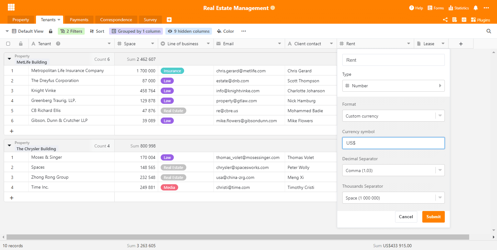
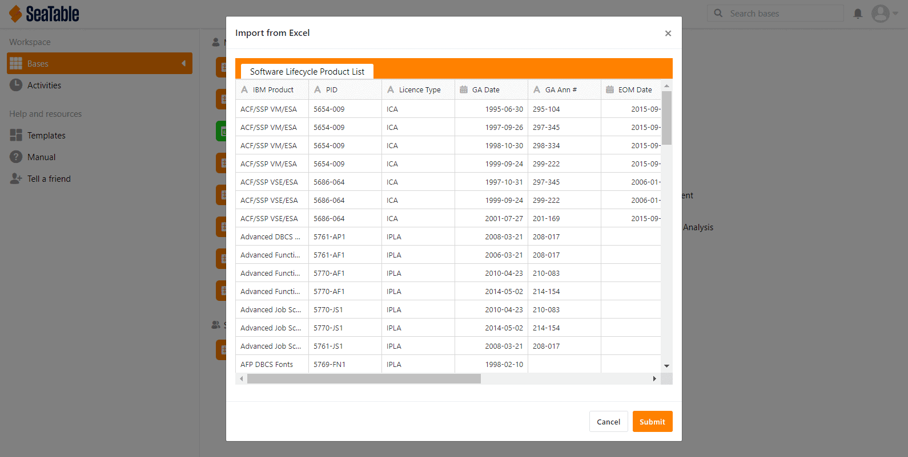
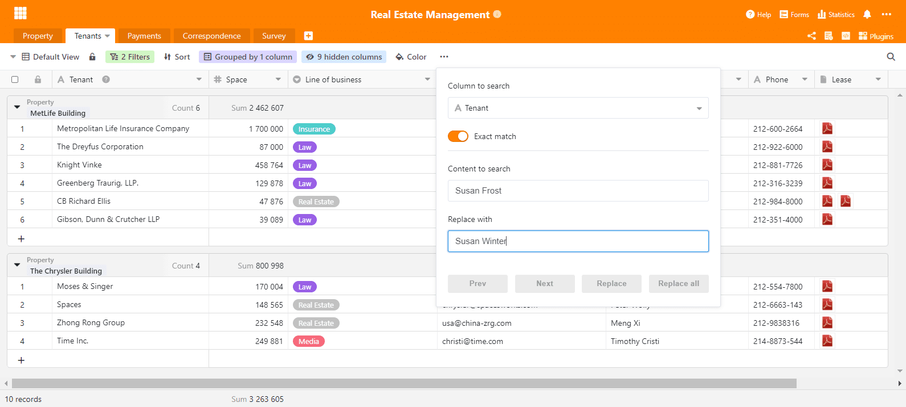

Rund ein Monat ist seit dem Release von SeaTable 1.6 vergangen und so es wird Zeit für eine Neues. Gesagt, getan! Wir freuen uns, die Version 1.7 von SeaTable hiermit vorzustellen! Die neue Version wurde heute auf https://cloud.seatable.io ausgerollt. SeaTable Cloud User haben also schon angefangen, damit zu arbeiten. Nutzer der selbstgehosteten Version werden die neuste Version in Kürze von Docker Hub runterladen können.

Für dieses neue Release haben wir große Anstrengungen unternommen, um SeaTables Optik zu verbessern und die Einfachheit des Webinterfaces zu erhöhen. Dafür haben wir uns einer großen Anzahl kleiner Themen angenommen. Wir sind überzeugt, dass, auch wenn nicht unbedingt auf den ersten Blick sichtbar, sie maßgeblich zu einer positiven Benutzererfahrung beitragen. All diejenigen, die auf eine Reihe neuer Features gehofft haben, müssen sich noch etwas auf SeaTable 1.8 gedulden. Bitte genießt aber schon mal den erhöhten Komfort von Version 1.7.

In dieser Release Note fokussieren wir uns auf die wichtigsten Aspekte der neuen Version. Die vollständige Änderungsliste befindet sich – wie immer – im [Changelog](/docs/changelog/version-1-7/).

## Dynamisches Benutzerinterface

Animationen sind ein bisschen wie das Salz in der Suppe. Solange nicht übermäßig genutzt, machen sie die Erfahrung einfach besser. Wir glauben, dass wir genau die richtige Menge erwischt haben. Wenn Du Dein Augenmerk darauf richtest, dann wirst Du die Animationen bemerken, die wir hier und da eingefügt haben (z.B. zum Seitenmenü oder einigen Spaltenmenüs). Wenn Du Sie nicht bemerkst, weil sie sich nahtlos einfügen oder natürlich wirken, dann fühlen wir uns bestätigt: Nicht zu viel, nicht zu wenig.

Zusätzlich haben wir auch die Suchfunktion verbessert. Wenn die Suche einen Treffer in einer reduzierten Gruppe findet, dann wird diese Gruppe nun automatisch erweitert. Das Suchergebnis wird also direkt angezeigt. Darüber hinaus haben wir noch den Editor für die Spalten mit formatiertem Text verbessert und zwei kleinere Issues in der gruppierten Ansicht behoben.

## Benutzerdefinierte Währung

In früheren Versionen hat SeaTable nur drei Währungen unterstützt: Euro, Dollar und Yuan. Damit waren all die Benutzer, die aus Ländern stammen, wo keine dieser Währungen verwendet wird, genötigt, sich bei Verwendung einer Währungsspalte für eine dieser drei zu entscheiden. Entschuldigung dafür! Aber wir haben gute Neuigkeiten: Mit SeaTable 1.7 kann man jede erdenkliche Währung in der Währungsspalte verwenden.

Die Zahlspalte verfügt nun über eine weitere Formatoption: “Benutzerdefinierte Währung”. Wenn Sie diese wählen, dann können Sie die Währung Ihrer Wahl definieren. Sie können Abkürzungen (z.B. CHF, SEK) genauso verwenden wie Währungssymbole (z.B. £, ₺ ). Ab sofort ist es ganz Ihre Wahl. Der Vollständigkeit halber sei erwähnt: Natürlich kann die Währung in jeder Spalte individuell eingestellt werden. Die eine Spalte soll $ und die andere CHF sein? Nur zu!

## Einfache Erfassung von Datumswerten

Mit der Maus ist die Eingabe eines Datums spielend einfach: Ein paar Klicks und schon ist das Datum im Kalender ausgewählt und in der Zelle eingetragen. SeaTable konvertiert das Datum automatisch in das richtige Format. Demgegenüber war die Eingabe von Daten per Tastatur nicht ganz so bequem. SeaTable bestand auf die korrekte und vollständige Syntax und duldete keine Abweichung.

Mit der neuen Version wird SeaTable toleranter hinsichtlich Syntax und erlaubt so die schnellere Erfassung von Datumswerten per Tastatur. Die Eingabe “2021-02-8” wird korrekt als 2021-02-08 interpretiert. Ein Datum eingegeben als “2020-1-1” wird von SeaTable ohne weitere Nachfrage als 2020-01-01 gespeichert. Das gleiche gilt natürlich auch für Europäische und US-Datumsformate: SeaTable konvertiert den Eintrag “1/1/2020” korrekt zu 01/01/2020 und speichert ihn.

## Excel Import

Einige wenige neue Funktionen gibt es dann doch in SeaTable 1.7. Eine davon ist die Importfunktion für Excel. Mit dieser lassen sich neue Bases auf Basis von bestehenden XLSX-Dateien erstellen. Wählen Sie einfach “Base importieren (XLSX, CSV, DTABLE)” und navigieren zur gewünschten XLSX-Datei. Eine Vorschau stellt daraufhin dar, wie SeaTable die Daten interpretiert. Mit einem Klick auf “Speichern” wird die Base erstellt und die Daten sind in SeaTable gespeichert.

Der Import von XLSX-Dateien ist eine Ergänzung zu den bestehenden Importfunktionen für CSV- und DTABLE-Dateien. Gegenüber dem Import aus einer CSV-Datei hat der Excel Import einen entscheidenden Vorteil: Alle Tabellenblätter einer Excel Arbeitsmappe werden in einem Rutsch importiert. Eine Textdatei, was eine CSV ist, kann nur Daten für ein und dasselbe Datenblatt enthalten. Aus diesem Grund enthält jede Base, die durch den Import einer Datei mit kommaseparierten Werten erstellt wird, immer nur eine Tabelle. Darüber hinaus gibt es noch ein weiteres Plus: Beim Import einer CSV-Datei werden alle Werte in Textspalten importiert. Nicht so beim XLSX-Import. SeaTable interpretiert die Inhalte der importierten Dateien und fügt die Daten in die passenden Spaltentypen ein. Spalten mit ausschließlich Zahlen werden in Zahlenspalten importiert; die Werte in einer Spalte, in der sich nur Datumswerten befinden, landen in einer Datumsspalte. In der Zukunft werden wir die Importfunktion dahin erweitern, dass auch Spalten mit Formeln automatisch importiert werden.

## Suchen und Ersetzen

Haben Sie in SeaTable eine Funktion vermisst, mit der sich Werte einfach ersetzen lassen? So ging es zumindest uns und darum freuen wir uns umso mehr, jetzt sagen zu können: Jetzt gibt es sie! Suchen und Ersetzen sucht in einer Spalte nach einem String – ein Wort, eine Zahl, ein Symbol – und ersetzt ihn durch einen anderen String. Die Suche kann entweder einfach oder exakt erfolgen. In letzterem Fall sucht SeaTable nach Zellen, in denen der Zellwert exakt dem Suchstring entspricht. Kurz gesagt: SeaTables Suchen und Ersetzen funktioniert quasi genauso wie sein Gegenstück in Excel.

Suchen und Ersetzen ist tatsächlich kein neues Feature von SeaTable 1.7, sondern kam bereits mit SeaTable 1.6.3 vor etwas mehr als zwei Wochen. Unsere Entwickler haben es ein paar Tage nach dem Release von SeaTable 1.6 fertiggestellt und wir wollten nicht knapp einen Monat warten, um es den SeaTable Cloud Benutzern zur Verfügung zu stellen.
