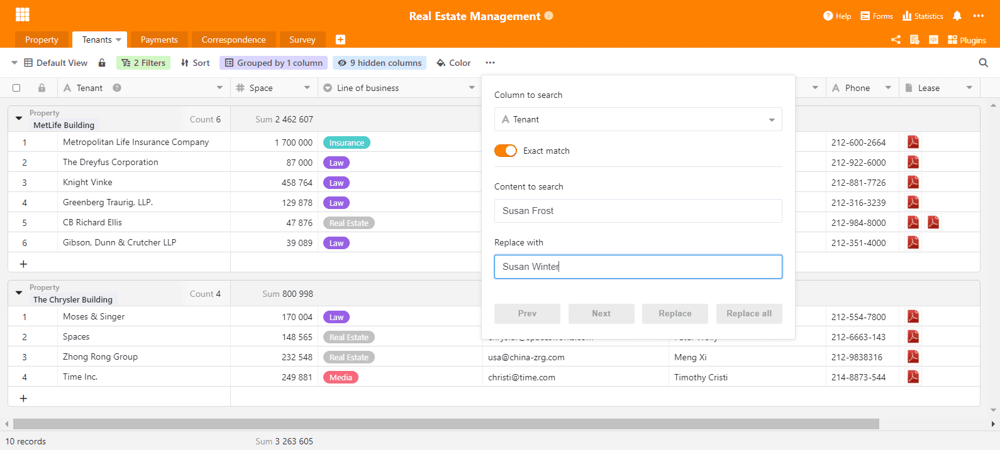

A month has passed since the release of SeaTable 1.6, so it's about time for a new release. Here it is: We proudly present SeaTable 1.7! It was rolled out today, so SeaTable Cloud users have already started using it. On-premises users will be able to download the newest version from Docker Hub shortly.

For this new release, we have spent a lot of effort on making SeaTable look nicer and increasing the interface's usability. We have taken care of a lot of smaller details and, while not necessarily visible at first sight, we are confident that it adds to a positive user experience. Those hoping for a lot of new features will just have to sit tight until SeaTable 1.8, but in the meantime enjoy all the added comforts of 1.7.

In this release note we focus on the most important aspects of the new version. The complete list of changes can be found - as always - in the [changelog](https://seatable.io/docs/changelog/version-1-7/?lang=auto).

## Dynamic user interface

Animations are a bit like the salt in the soup. As long as not used excessively, they add to the experience. We think we got just the right amount. If you pay attention, you may take note of the animations that we added here and there (e.g., to the side panel or some menus). But you may just as well not notice because it blends in naturally. In this case, we feel confirmed: Not too much, not too little.

Additionally, we improved the search function. When the search finds a match in a collapsed group, it will automatically expand the group to show the result. Similarly, we improved the markdown editor for the long text field and fixed two issues in a grouped view.

## Custom currency

In previous versions, SeaTable only supported three currencies: Euro, Dollar and Yuan. This meant that all those users who came from countries where none of these currencies were used were forced to choose one of these three when using a currency column. Sorry about that! But we have good news: With SeaTable 1.7 you can use any currency you can think of in the currency column.

The payment column now has another format option: "Custom currency". If you select this, then you can define the currency of your choice. You can use abbreviations (e.g. CHF, SEK) as well as currency symbols (e.g. £, ₺ ). From now on, it is entirely your choice. For the sake of completeness, it should be mentioned: of course, the currency in each column can be set individually. One column should be $ and the other CHF? Go ahead!

## Simple recording of date values

When using the mouse, inputting data in a date column is straightforward: A few clicks and a date is captured in the cell. SeaTable converts the date in the right format. Entering a date with the keyboard has not been quite so convenient. SeaTable insisted on the correct format and did not tolerate any deviations.

With the new version SeaTable becomes more tolerant regarding syntax and thus allows faster entry of date values via keyboard. The input "2021-02-8" is correctly interpreted as 2021-02-08. A date entered as "2020-1-1" will be stored by SeaTable as 2020-01-01 without further prompting. Of course, the same is true for European and US date formats: SeaTable correctly converts the entry "1/1/2020" to 01/01/2020 and saves it.

## Excel Import

There are a few new features in SeaTable 1.7, one of which is the import function for Excel. With this you can create new bases based on existing XLSX files. Simply select "Import Base (XLSX, CSV, DTABLE)" and navigate to the desired XLSX file. A preview will then show how SeaTable interprets the data. With a click on "Save" the base is created and the data is stored in SeaTable.

The XLSX import adds to the existing CSV and DTABLE import functions. Compared to the CSV import, which has been around since SeaTable 1.0, importing from an Excel file has one major advantage: All the worksheets in a workbook are imported in one go. A text file, which CSV is, can only contain data for one and the same sheet. Any base created from a comma-separated file can therefore only contain one table. And there is another benefit: When importing a CSV file, all values are imported into text columns. Not so when importing an XLSX file! SeaTable interprets the contents of the columns in the source file and imports them in the corresponding column types. Columns with numbers only are imported in number columns; a column that contains only dates is imported into a date column. In the future, we'll add an automatic import of formula columns.

## Search and replace

You've been missing a search and replace function in SeaTable? So have we and this is why we are happy to say now: Not anymore! Batch replacement searches for a particular string - term, character, or symbol - in a target column and replaces it with any other value. The search can be either a simple search or an exact search, meaning the search string must match the content of the entire cell. In short, it works like its counterpart in Word and Excel for all practical purposes.

Batch replacement is actually not a new feature of SeaTable 1.7, but SeaTable 1.6.3. Our developers finalized it a few days after the release of SeaTable 1.6. Because we didn't want you to wait for it for almost one month, we added it to the SeaTable Cloud after completion where it has been available for more than two weeks now.
