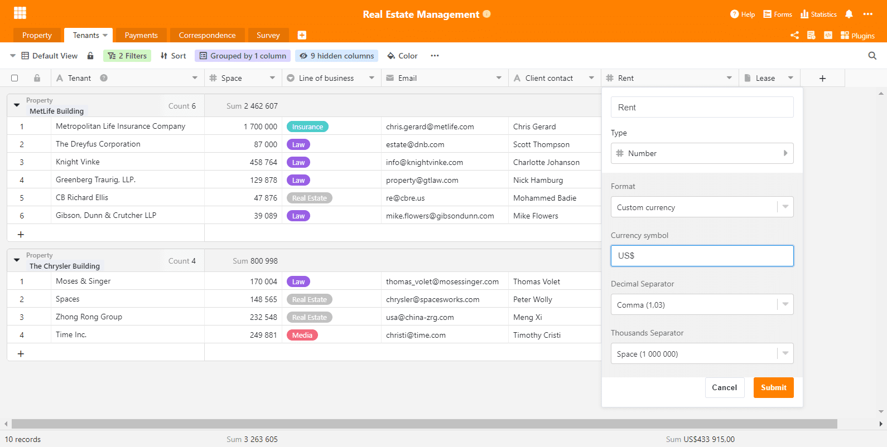
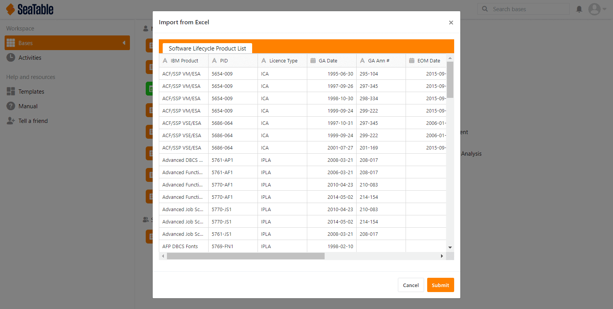
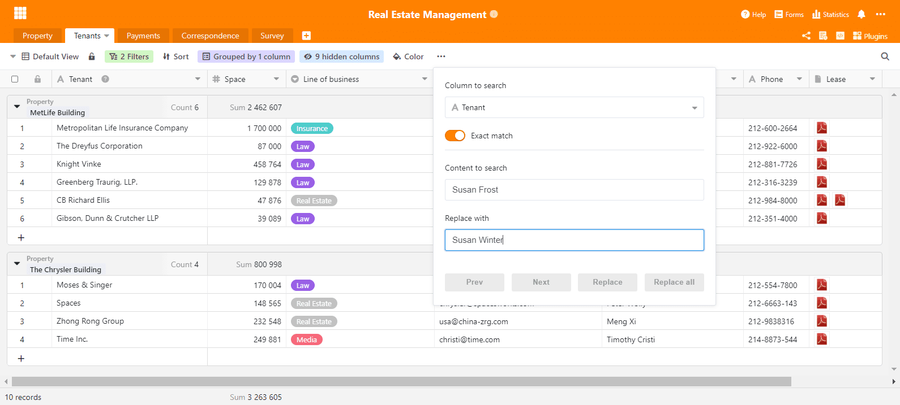

Ha pasado aproximadamente un mes desde el lanzamiento de SeaTable 1.6 y ya es hora de algo nuevo. ¡Dicho y hecho! Nos complace presentar la versión 1.7 de SeaTable. La nueva versión se ha desplegado hoy en https://cloud.seatable.io. Los usuarios de SeaTable Cloud ya han comenzado a trabajar con ella. Los usuarios de la versión autohospedada podrán descargar la última versión pronto desde Docker Hub.

Para este nuevo lanzamiento, hemos realizado grandes esfuerzos para mejorar la apariencia de SeaTable y aumentar la simplicidad de la interfaz web. Para ello, hemos abordado una gran cantidad de pequeños temas. Estamos convencidos de que, aunque no sean visibles a primera vista, contribuyen significativamente a una experiencia de usuario positiva. Aquellos que esperaban una serie de nuevas funciones deberán esperar un poco más para SeaTable 1.8. Pero por favor, disfruten ya de la mayor comodidad que ofrece la versión 1.7.

En esta nota de lanzamiento nos centramos en los aspectos más importantes de la nueva versión. La lista completa de cambios está disponible, como siempre, en el [Changelog]().

## Interfaz de usuario dinámica

Las animaciones son como la sal en la sopa. Mientras no se usen en exceso, mejoran la experiencia. Creemos que hemos encontrado la cantidad justa. Si prestas atención, notarás las animaciones que hemos añadido aquí y allá (por ejemplo, en el menú lateral o en algunos menús de columnas). Si no las notas porque se integran de forma fluida y natural, nos sentimos confirmados: ni demasiado, ni demasiado poco.

Además, hemos mejorado la función de búsqueda. Cuando la búsqueda encuentra un resultado en un grupo reducido, este grupo se expande automáticamente. El resultado se muestra directamente. También hemos mejorado el editor para columnas con texto formateado y corregido dos pequeños problemas en la vista agrupada.

## Moneda personalizada

En versiones anteriores, SeaTable solo admitía tres monedas: euro, dólar y yuan. Esto obligaba a los usuarios de países con otras monedas a elegir una de estas tres en las columnas de moneda. ¡Disculpen por eso! Pero tenemos buenas noticias: con SeaTable 1.7 puedes usar cualquier moneda en la columna de moneda.

La columna numérica ahora tiene una opción de formato adicional: "Moneda personalizada". Si la eliges, puedes definir la moneda que prefieras. Puedes usar abreviaturas (por ejemplo, CHF, SEK) o símbolos monetarios (por ejemplo, £, ₺). A partir de ahora, la elección es tuya. Por supuesto, la moneda puede configurarse individualmente en cada columna. ¿Una columna en $ y otra en CHF? ¡Adelante!

## Entrada sencilla de valores de fecha

Con el ratón, ingresar una fecha es muy fácil: unos clics y la fecha queda seleccionada en el calendario y registrada en la celda. SeaTable convierte la fecha automáticamente al formato correcto. Sin embargo, la entrada por teclado no era tan cómoda. SeaTable exigía la sintaxis correcta y completa sin desviaciones.

Con la nueva versión, SeaTable es más tolerante con la sintaxis y permite ingresar fechas más rápido por teclado. Por ejemplo, "2021-02-8" se interpreta correctamente como 2021-02-08. Una fecha como "2020-1-1" se guarda sin preguntar como 2020-01-01. Lo mismo aplica para formatos europeos y estadounidenses: "1/1/2020" se convierte y guarda correctamente como 01/01/2020.

## Importación desde Excel

SeaTable 1.7 incluye algunas funciones nuevas, entre ellas la importación desde Excel. Con esta función puedes crear nuevas bases a partir de archivos XLSX existentes. Simplemente elige "Importar base (XLSX, CSV, DTABLE)" y navega hasta el archivo XLSX deseado. Se mostrará una vista previa de cómo SeaTable interpreta los datos. Con un clic en "Guardar" se crea la base y los datos se almacenan en SeaTable.

La importación de archivos XLSX complementa las funciones existentes para importar archivos CSV y DTABLE. A diferencia de CSV, que solo contiene datos para una hoja, la importación desde Excel importa todas las hojas de un libro de una vez. Por eso, cada base creada a partir de un archivo CSV tiene solo una tabla. Además, la importación desde XLSX interpreta los contenidos y asigna los datos a los tipos de columna adecuados: columnas solo con números se importan como numéricas; columnas con fechas se importan como columnas de fecha. En el futuro, ampliaremos esta función para importar también columnas con fórmulas automáticamente.

## Buscar y reemplazar

¿Echabas de menos una función para reemplazar valores fácilmente en SeaTable? Nosotros sí, por eso nos alegra decir que ¡ya está disponible! Buscar y reemplazar busca en una columna un texto, número o símbolo y lo sustituye por otro. La búsqueda puede ser simple o exacta. En este último caso, SeaTable busca celdas cuyo valor coincida exactamente con el texto buscado. En resumen: Buscar y reemplazar funciona casi igual que en Excel.

Buscar y reemplazar no es realmente una función nueva en SeaTable 1.7, sino que llegó con SeaTable 1.6.3 hace poco más de dos semanas. Nuestros desarrolladores la terminaron pocos días después del lanzamiento de SeaTable 1.6 y no quisimos esperar casi un mes para ponerla a disposición de los usuarios de SeaTable Cloud.
