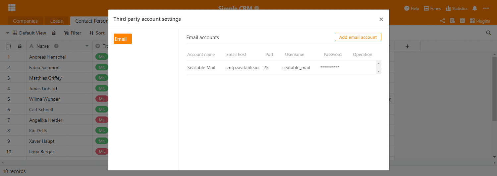

Am heutigen Tag haben wir SeaTable 1.8 auf [SeaTable Cloud](https://cloud.seatable.io) zur Verfügung gestellt und wir sind davon überzeugt, dass Sie uns zustimmen werden: SeaTable 1.8 ist großartig! Es ist vollgepackt mit neuen Funktionen und Funktionsergänzungen sowie einer großen Anzahl kleinerer Verbesserungen. Wie auch schon in der Vergangenheit stellen wir in der Release Note die wichtigsten Neuerungen vor. Dieses Mal war es besonders schwer, uns auf die fünf Highlights zu fokussieren. Sie finden Sie vollständige Änderungsliste – wie immer – im Changelog. Das Docker Image werden wir in den nächsten Tag auf Docker Hub hochladen.

## Variable Zeilenhöhe

Die höhenverstellbaren Zeilen sind im wahrsten Sinne des Wortes das auffälligste neue Feature in SeaTable 1.8. Vier Zeilenhöhen stehen nur zur Auswahl: Einfach, zweifach, dreifach, vierfach. Die vergrößerten Zeilen machen Raum für größere Datei-Miniaturansichten und schaffen mehr Platz für die Darstellung des Inhalts in Spalten mit formatiertem Text. Eine Zeile mit doppelter Höhe zeigt zwei Textzeilen, eine mit dreifacher Höhe vier und eine mit vierfacher Höhe sechs Textzeilen.

Die alte (einfache) Zeilenhöhe ist die neue Standardzeilenhöhe. Beim Öffnen einer neuen Base oder beim Erstellen einer neuen Tabelle wird diese angewendet. Die Zeilenhöheneinstellung verbirgt sich hinter dem neuen Icon im Ansichtstoolbar, rechts der Formatierungsoptionen. Testen Sie es und finden Sie heraus, welche Zeilenhöhe für Ihre Anwendung am besten passt!

## Spaltentyp #21: Schaltfläche

Der neue Spaltentyp “Schaltfläche” ist der Sonderling unter den knapp zwei Dutzend Spaltentypen in SeaTable. (Spoiler: Wir machen die zwei Dutzend Spaltentypen schon sehr bald voll. Seien Sie gespannt!) In einer Spalte vom Typ Schaltenfläche speichern Sie keine Informationen; die Spalte Schaltfläche nutzen Sie für die Automatisierung von Aktionen. Mit der Einführung des neuen Spaltentyps in diesem Release können Sie per Schaltfläche ein Skript ausführen. Schon sehr bald werden Sie mit einem Klick auch E-Mails (mehr weiter unten) und Chat-Nachrichten versenden können. Im Lauf des Jahres 2021 werden wir nach und nach weitere Aktionen ergänzen, die sich über eine Schaltfläche auslösen lassen.

Bei der Erstellung einer Schalftfläche-Spalte definieren Sie das Aussehen und die Funktion der Schaltfläche. Dies umfasst neben der auszuführenden Aktion auch die Beschriftung der Schaltfläche und deren Farbe. Werfen Sie einen Blick in das [SeaTable Script Manual](https://seatable.github.io/seatable-scripts/) (nur in Englisch verfügbar), wenn Sie Ihre eigenen Skripte schreiben und per Schaltfläche in Ihre Tabelle integrieren möchten.

## Sammelformular

Stellen Sie sich vor, Sie sind Vertriebsleiter und wollen Ihre Produktmanager dazu bewegen, die Informationen im Produktkatalog zu aktualisieren. Bis heute müssen Sie dafür allen Managern eine Freigabe auf die Produktkatalog-Base (oder Ansicht) geben und diese dann bitten, die Aktualität der Daten zu prüfen. Tatsächlich kann dies viel Arbeiten bedeuten, wenn Sie individuelle Ansichten erstellen und diese einzeln versenden. Mit SeaTable 1.8 gibt es nun einen besseren und einfacheren Weg! Wir stellen vor: Das Sammelformular.

Das Sammelformular ist eine Tabellenansicht einer Base, die dem Benutzer ausschließlich die Zeilen anzeigt, die dieser selbst erstellt hat. Wenn der Benutzer in keiner Zeile als Ersteller eingetragen ist, dann präsentiert sich das Sammelformular als leere Tabelle. Der Benutzer kann also nur neue Einträge anlegen, aber keine bestehenden bearbeiten. Das Sammelformular ist damit Mittel der Wahl bei groß angelegten Datenaktualisierungsaufgaben, die zahlreiche Personen involvieren. Es ist einfacher zu handhaben als Freigaben, da für den Zugriff auf das Sammelformular keine Freigabe notwendig ist. Der Benutzer benötigt nur ein Benutzerkonto.

Für Sie als Vertriebsleiter ist die Aktualisierung des Produktkatalogs folglich schnell erledigt: Erstellen Sie ein Sammelformular, schicken Sie den Link an Ihre Produktmanager und lassen Sie diese die Arbeit machen.

## Externe Links für Ansichten (nur für Plus und Enterprise Abos)

Externe Links für Bases gehören schon seit der Version 1.0 von SeaTable zu den zentralen Sharing-Funktionen. Die nun neu eingeführten externen Links für Ansichten sind deren logische Erweiterung und erlauben einen granulareren Datenaustausch mit externen Dritten. Wie der Name sagt, ein externer Link für eine Ansicht ist eine URL, die – unabhängig vom einer SeaTable Anmeldung – Lesezugriff auf eine bestimmte Ansicht einer Tabelle gewährt. Die Zeilen und Spalten, die durch die Ansichtseinstellungen ausgeblendet werden, sowie die anderen Tabellen in der Base bleiben von den Besuchern des externen Links verborgen.

Sie erstellen einen externen Link für eine Ansicht über das Kontextmenü einer Ansicht. Klicken Sie auf das Dreipunkte-Icon neben des Namens der Ansicht. Im “Ansicht teilen” Dialog können Sie den Link an Ihre Bedürfnisse anpassen. Mit “Erstellen” wird der Link erzeugt. Den Link können Sie auf jede erdenkliche Art teilen: per E-Mail, per Chat oder durch die Einbettung in einer Webseite (wie wir das beispielsweise auf unserer Seite [Newsroom]() gemacht haben).

## E-Mail Versand

In Version 1.8 haben wir aber nicht nur bestehende Sharing Features erweitert; SeaTable hat auch ein ganz neues Sharing Feature erhalten: SeaTable kann jetzt E-Mails versenden! Benutzer können die Zugangsdaten für einen oder mehrere SMTP-Server in einer Base speichern und diese dann in Python und JS Skripten verwenden. Dafür steht die base.sendMail() Methode zur Verfügung.

Die Zugangsdaten werden mit symmetrischen Token verschlüsselt und in der Backend-Datenbank gespeichert. In einer der nächsten Versionen werden wir eine Verbindungstest-Funktion ergänzen. Ebenso ist in Planung, die E-Mail-Accounts über die neuen Schaltflächen direkt nutzbar zu machen.

## SAML-Support

Schließlich haben wir auch noch ein besonderes Schmankerl für all die Benutzer, die SeaTable auf Ihrem eigenen Server betreiben: SeaTable 1.8 unterstützt nun die Security Assertion Markup Language, besser bekannt als SAML. SAML ist ein populäres Protokoll, um Single Sign-On umzusetzen. Zusammen mit der Authentifizierung via Active Directory und LDAP gewinnt SeaTable enorm an Einsatzflexibilität und macht die Integration insbesondere in größere Infrastrukturen deutlich einfacher. Quasi all bekannten Identity Management Systeme (z.B., okta, Keycloak, Auth0, OneLogin, SiteMinder, …) unterstützen SAML.

Die vollständige Dokumentation für die Einrichtung von SAML finden Sie im [SeaTable Manual](https://manual.seatable.io/config/enterprise/saml/).

## Und noch viel mehr

Diese Release Note würde auf eine unhandliche Länge anschwellen, wenn wir jeder Neuerung den Platz spendieren würden, den sie verdienen. Drum lassen wir das. Nichtsdestotrotz wollen wir sie hier wenigstens kursorisch erwähnen:

- In SeaTable kann man nun ganz einfach mit simplen Operatoren mit Datums- und Dauerspalten rechnen: Addition eines Datums und einer Dauer? Nichts einfacher als das! Erstellen Sie eine Formel-Spalte, wählen Sie die beiden gewünschten Spalten aus und ergänzen Sie ein ”+” dazwischen. Fertig. Natürlich geht das auch mit ”-”.
- Ein Webformular kann nun zeitlich befristet werden. Einreichungen nach Ablauf der Frist sind nicht möglich.
- Ab sofort können neue Optionen in Einfach- und Mehrfachauswahlfeldern ganz einfach durch das Einfügen aus der Zwischenablage (z.B. STRG + V) erstellt werden. Der eingefügte Inhalt wird als Option automatisch erstellt und als Wert in der Zelle abgespeichert.
- Wenn eine Spaltenberechtigung verhindert, dass ein Benutzer Daten in einer Spalte ändern kann, dann wird die Spalte farblich hervorgehoben, um auf einen Blick die bestehende Einschränkung zu signalisieren.
- Eine neue Funktion countlinks() berechnet die Anzahl der verknüpften Datensätze in einer Verknüpfungsspalte.
- Erweiterte Spaltentypen, wie z. B. die Spalte “Verknüpfung zu anderen Datensätzen”, können jetzt auch auf mobilen Geräten erstellt werden.
- Benachrichtigungen können Inhalte aus der die Benachrichtigung auslösenden Zeile enthalten. Fügen Sie einfach den Spaltennamen in geschweiften Klammern (z. B. {Name}) als Platzhalter in die Benachrichtigungsvorlage ein.
- Es wurde eine neue Filterbedingung “ist die ID des aktuellen Benutzers” ergänzt. In Organisationen, in denen die Benutzer-IDs eindeutig definiert sind (z. B. Studenten-IDs), kann diese Filterbedingung verwendet werden, um eine Ansicht zu erstellen, die für jeden Benutzer unterschiedliche Informationen anzeigt.

Und natürlich haben wir auch noch ein paar Bugs beseitigt:

- Die Filterbedingungen der Einfachauswahlspalte wurden an die der Mehrfachauswahlspalte angepasst.
- Checkbox und Mehrfachauswahlspalten lassen sich nun sortieren.
- Die Suchfunktion inkludiert nun auch Mitarbeiter sowie Einfach- und Mehrfachauswahlspalten.
- Die FREEZE_USER_ON_LOGIN_FAILED Option, die dafür sorgt, dass Benutzerkonten nach einer bestimmten Anzahl nicht autorisierte Anmeldeversuche gesperrt wird, funktioniert nun wieder. [Einen Dank an den Benutzer mtmail für den Hinweis.](https://forum.seatable.com/t/v1-7-1-freeze-account-and-fail2ban/296)
