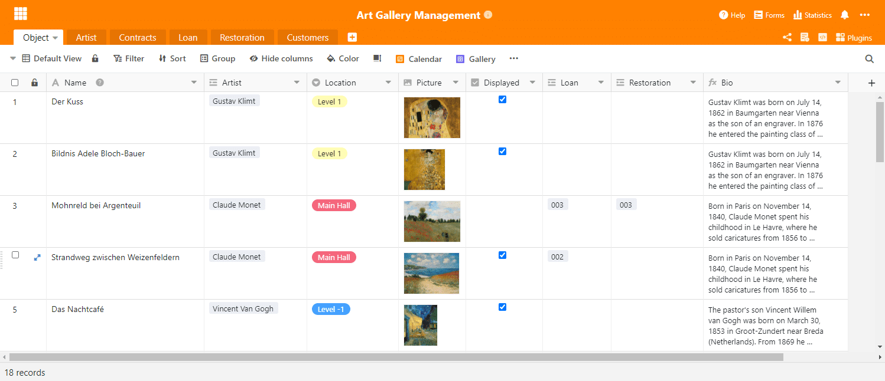

Hoy hemos puesto a disposición SeaTable 1.8 en [SeaTable Cloud](https://cloud.seatable.io) y estamos convencidos de que estará de acuerdo: ¡SeaTable 1.8 es genial! Está repleto de nuevas características y funcionalidades, así como de un gran número de pequeñas mejoras. Como en el pasado, presentamos las novedades más importantes en la nota de la versión. Esta vez fue especialmente difícil centrarse en los cinco puntos más destacados. Encontrará la lista completa de cambios -como siempre- en el registro de cambios. Subiremos la imagen de Docker a Docker Hub en los próximos días.

## Altura de fila variable

Las filas ajustables en altura son, literalmente, la novedad más llamativa de SeaTable 1.8. Sólo hay cuatro alturas de fila para elegir: Individual, doble, triple y cuádruple. Las filas ampliadas dejan espacio para las miniaturas de archivos más grandes y crean más espacio para mostrar el contenido en columnas de texto formateado. Una fila de doble altura muestra dos líneas de texto, una fila de triple altura muestra cuatro líneas de texto y una fila de cuádruple altura muestra seis líneas de texto.

La antigua altura de fila (única) es la nueva altura de fila por defecto. Cuando se abre una nueva base o se crea una nueva tabla, esto se aplica. El ajuste de la altura de la fila está oculto tras el nuevo icono de la barra de herramientas de la vista, a la derecha de las opciones de formato. Pruébelo y descubra qué altura de fila se adapta mejor a su aplicación.

## Tipo de columna #21: Botón

El nuevo tipo de columna "Botón" es el más extraño entre las casi dos docenas de tipos de columna de SeaTable. (Spoiler: Pronto completaremos las dos docenas de tipos de columna. Sea curioso). Usted no almacena ninguna información en una columna del tipo Área de Interruptores; usted utiliza la columna Botón para automatizar acciones. Con la introducción del nuevo tipo de columna en esta versión, puede ejecutar un script a través de un botón. Muy pronto también podrá enviar correos electrónicos (más abajo) y mensajes de chat con un solo clic. A lo largo de 2021, iremos añadiendo gradualmente más acciones que puedan activarse con un botón.

Al crear una columna de botones, se define el aspecto y la función del botón. Incluye la acción a realizar, la etiqueta del botón y su color. Echa un vistazo al [Manual de Script de SeaTable](https://seatable.github.io/seatable-scripts/) si quieres escribir tus propios scripts e integrarlos en tu tabla a través de botones.

## Formulario de recogida

Imagínese que es un director de ventas y quiere que sus gestores de productos actualicen la información del catálogo de productos. Hasta ahora, esto requería que usted diera a todos los gestores una publicación en la base del catálogo de productos (o vista) y luego les pidiera que comprobaran que los datos estaban actualizados. De hecho, esto puede suponer mucho trabajo si se crean vistas personalizadas y se envían de una en una. Con SeaTable 1.8 ahora hay una manera mejor y más fácil! Presentando: El formulario de recogida.

El formulario de recogida es una vista de tabla de una base que muestra al usuario sólo las filas que él mismo ha creado. Si el usuario no se introduce como creador en ninguna fila, el formulario de recogida se presenta como una tabla vacía. Por lo tanto, el usuario sólo puede crear nuevas entradas, pero no editar las existentes. El formulario colectivo es, por tanto, la herramienta preferida para las tareas de actualización de datos a gran escala en las que participan numerosas personas. Es más fácil de manejar que las liberaciones, ya que no se requiere ninguna liberación para acceder a la forma colectiva. El usuario sólo necesita una cuenta de usuario.

Para usted, como gestor de ventas, la actualización del catálogo de productos se realiza consecuentemente de forma rápida: cree un formulario de recogida, envíe el enlace a sus gestores de productos y deje que ellos hagan el trabajo.

## Enlaces externos para las vistas (sólo para las suscripciones Plus y Enterprise)

Los enlaces externos para las bases forman parte de las funciones centrales de intercambio desde la versión 1.0 de SeaTable. Los nuevos enlaces externos para las vistas son su extensión lógica y permiten un intercambio de datos más granular con terceros externos. Como su nombre indica, un enlace externo para una vista es una URL que -independientemente de un inicio de sesión en SeaTable- otorga acceso de lectura a una vista específica de una tabla. Las filas y columnas ocultas por la configuración de la vista, así como las demás tablas de la base, permanecen ocultas para los visitantes del enlace externo.

Puede crear un enlace externo para una vista a través del menú contextual de una vista. Haga clic en el icono de tres puntos situado junto al nombre de la vista. En el cuadro de diálogo "Compartir vista" puede adaptar el enlace a sus necesidades. Haga clic en "Crear" para crear el enlace. Puede compartir el enlace como desee: por correo electrónico, por chat o incrustándolo en una página web (como hemos hecho en nuestra página de [la Sala de Prensa](/es/unternehmen/newsroom/), por ejemplo).

## Envío por correo electrónico

En la versión 1.8 no sólo hemos ampliado las funciones de compartición existentes; SeaTable también ha recibido una función de compartición completamente nueva: SeaTable ya puede enviar correos electrónicos! Los usuarios pueden almacenar las credenciales de uno o más servidores SMTP en una base y luego utilizarlas en scripts de Python y JS. Para ello está disponible el método base.sendMail().

Los datos de acceso se cifran con tokens simétricos y se almacenan en la base de datos del backend. En una de las próximas versiones añadiremos una función de prueba de conexión. También tenemos previsto que las cuentas de correo electrónico puedan utilizarse directamente a través de los nuevos botones.

## Soporte de SAML

Por último, tenemos un regalo especial para todos aquellos usuarios que ejecutan SeaTable en su propio servidor: SeaTable 1.8 ahora es compatible con el Lenguaje de Marcado de Aserción de Seguridad, más conocido como SAML. SAML es un protocolo popular para implementar el Single Sign-On. Junto con la autenticación a través de Active Directory y LDAP, SeaTable gana una enorme flexibilidad y facilita mucho la integración, especialmente en las infraestructuras más grandes. Casi todos los sistemas de gestión de identidades conocidos (por ejemplo, okta, Keycloak, Auth0, OneLogin, SiteMinder, ...) soportan SAML.

La documentación completa para configurar SAML se encuentra en el [Manual de SeaTable](https://manual.seatable.io/config/enterprise/saml/).

## Y mucho más

Esta nota de prensa se alargaría mucho si le diéramos a cada innovación el espacio que merece. Así que no lo haremos. No obstante, nos gustaría mencionarlos aquí al menos de forma superficial:

- En SeaTable ahora puede calcular fácilmente con operadores simples con columnas de fecha y duración: ¿Sumar una fecha y una duración? ¡Nada más sencillo! Cree una columna de fórmula, seleccione las dos columnas deseadas y añada un "+" entre ellas. Y ya está. Por supuesto, esto también funciona con "-".
- Ahora un formulario web puede tener una duración limitada. No es posible presentar candidaturas fuera de plazo.
- A partir de ahora, se pueden crear nuevas opciones en los campos de selección simple y múltiple simplemente pegándolas desde el portapapeles (por ejemplo, CTRL + V). El contenido pegado se crea automáticamente como una opción y se guarda como un valor en la celda.
- Si una autorización de columna impide a un usuario modificar los datos de una columna, ésta se resalta en color para señalar la restricción existente de un vistazo.
- Una nueva función countlinks() calcula el número de registros vinculados en una columna de enlaces.
- Los tipos de columna ampliados, como la columna "Enlace a otros registros", ahora también pueden crearse en dispositivos móviles.
- Las notificaciones pueden contener el contenido de la fila que activa la notificación. Simplemente inserte el nombre de la columna entre llaves (por ejemplo, {nombre}) como marcador de posición en la plantilla de notificación.
- Se ha añadido una nueva condición de filtro "es el ID del usuario actual". En las organizaciones en las que los ID de usuario están definidos de forma única (por ejemplo, los ID de estudiante), esta condición de filtro se puede utilizar para crear una vista que muestre información diferente para cada usuario.

Y, por supuesto, también hemos corregido algunos errores:

- Las condiciones de filtrado de la columna de selección simple se adaptaron a las de la columna de selección múltiple.
- Las columnas de casillas de verificación y de selección múltiple ahora se pueden ordenar.
- La función de búsqueda incluye ahora a los miembros del personal, así como columnas de selección simple y múltiple.
- La opción FREEZE_USER_ON_LOGIN_FAILED, que hace que las cuentas de usuario se bloqueen tras un determinado número de intentos de inicio de sesión no autorizados, vuelve a funcionar. [Gracias al usuario mtmail por señalarlo.](https://forum.seatable.io/t/v1-7-1-freeze-account-and-fail2ban/296)
