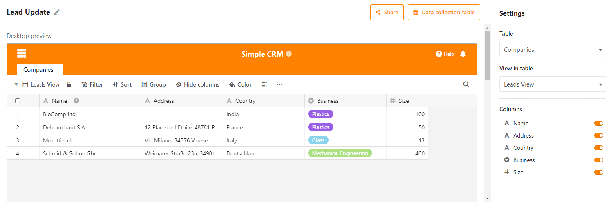

Aujourd'hui, nous avons mis à disposition SeaTable 1.8 sur [SeaTable Cloud](https://cloud.seatable.io) et nous sommes convaincus que vous serez d'accord avec nous : SeaTable 1.8 est génial ! Elle regorge de nouvelles fonctions et d'ajouts de fonctionnalités, ainsi que d'un grand nombre d'améliorations mineures. Comme par le passé, nous présentons les principales nouveautés dans la note de mise à jour. Cette fois-ci, il a été particulièrement difficile de nous concentrer sur les cinq points forts. Comme toujours, vous trouverez la liste complète des modifications dans le changelog. Nous téléchargerons l'image Docker sur Docker Hub dans les prochains jours.

## Hauteur de ligne variable

Les lignes réglables en hauteur sont littéralement la nouvelle fonctionnalité la plus frappante de SeaTable 1.8. Il n'y a que quatre hauteurs de lignes au choix : Simple, double, triple, quadruple. Les lignes agrandies font de la place pour des miniatures de fichiers plus grandes et permettent d'afficher le contenu dans des colonnes de texte formaté. Une ligne double hauteur affiche deux lignes de texte, une ligne triple hauteur quatre lignes de texte et une ligne quadruple hauteur six lignes de texte.

L'ancienne hauteur de ligne (simple) est la nouvelle hauteur de ligne par défaut. Elle est appliquée lors de l'ouverture d'une nouvelle base ou de la création d'un nouveau tableau. Le réglage de la hauteur de ligne se cache derrière la nouvelle icône dans la barre d'outils d'affichage, à droite des options de formatage. Testez-le et découvrez quelle hauteur de ligne convient le mieux à votre application !

## Type de colonne #21 : Bouton

Le nouveau type de colonne "Bouton" est l'excentrique parmi les presque deux douzaines de types de colonnes de SeaTable. (spoiler : Nous atteindrons très bientôt les deux douzaines de types de colonnes. Soyez curieux !) Dans une colonne de type Bouton, vous ne stockez aucune information ; vous utilisez la colonne Bouton pour automatiser des actions. Avec l'introduction du nouveau type de colonne dans cette version, vous pouvez exécuter un script par bouton. Très bientôt, vous pourrez également envoyer des e-mails (plus d'informations ci-dessous) et des messages de chat en un seul clic. Au cours de l'année 2021, nous ajouterons progressivement d'autres actions pouvant être déclenchées par un bouton.

Lors de la création d'une colonne de bouton, vous définissez l'apparence et la fonction du bouton. Cela inclut l'action à effectuer, le libellé du bouton et sa couleur. Consultez le [manuel des scripts SeaTable](https://seatable.github.io/seatable-scripts/) si vous souhaitez écrire vos propres scripts et les intégrer dans votre tableau à l'aide d'un bouton.

## Formulaire de collecte

Imaginez que vous êtes directeur des ventes et que vous voulez inciter vos chefs de produits à mettre à jour les informations du catalogue de produits. Jusqu'à présent, vous deviez pour cela donner à tous les managers une autorisation sur la base (ou la vue) du catalogue de produits, puis leur demander de vérifier si les données étaient à jour. En fait, cela peut représenter beaucoup de travail si vous créez des vues individuelles et les envoyez une par une. Avec SeaTable 1.8, il existe désormais un moyen plus efficace et plus simple ! Nous faisons les présentations : Le formulaire de collecte.

Le formulaire de collecte est une vue de tableau d'une base qui affiche à l'utilisateur uniquement les lignes qu'il a lui-même créées. Si l'utilisateur n'est inscrit sur aucune ligne en tant que créateur, le formulaire de collecte se présente alors comme un tableau vide. L'utilisateur peut donc uniquement créer de nouvelles entrées, mais pas modifier les entrées existantes. Le formulaire collectif est donc le moyen de choix pour les tâches de mise à jour des données à grande échelle qui impliquent de nombreuses personnes. Il est plus facile à gérer que les partages, car l'accès au formulaire groupé ne nécessite pas de partage. L'utilisateur n'a besoin que d'un compte d'utilisateur.

En tant que directeur des ventes, la mise à jour du catalogue de produits est donc rapide : créez un formulaire de collecte, envoyez le lien à vos chefs de produits et laissez-les faire le travail.

## Liens externes pour les vues (uniquement pour les abonnements Plus et Enterprise)

Les liens externes pour les bases font déjà partie des fonctions de partage centrales depuis la version 1.0 de SeaTable. Les nouveaux liens externes pour les vues sont leur extension logique et permettent un échange de données plus granulaire avec des tiers externes. Comme son nom l'indique, un lien externe pour une vue est une URL qui donne un accès en lecture à une vue spécifique d'un tableau, indépendamment de la connexion à SeaTable. Les lignes et les colonnes masquées par les paramètres de la vue, ainsi que les autres tableaux de la base, restent cachés aux visiteurs du lien externe.

Vous créez un lien externe pour une vue via le menu contextuel d'une vue. Cliquez sur l'icône à trois points à côté du nom de la vue. Dans la boîte de dialogue "Partager la vue", vous pouvez adapter le lien à vos besoins. Le lien est créé en cliquant sur "Créer". Vous pouvez partager le lien de toutes les manières possibles : par e-mail, par chat ou en l'intégrant dans une page web (comme nous l'avons fait par exemple sur notre page [Newsroom]() ).

## Envoi d'e-mail

Dans la version 1.8, nous n'avons pas seulement amélioré les fonctions de partage existantes, nous avons également ajouté une toute nouvelle fonction de partage à SeaTable : SeaTable peut désormais envoyer des e-mails ! Les utilisateurs peuvent stocker les données d'accès à un ou plusieurs serveurs SMTP dans une base et les utiliser dans des scripts Python et JS. La méthode base.sendMail() est disponible à cet effet.

Les données d'accès sont cryptées à l'aide de jetons symétriques et stockées dans la base de données backend. Dans une prochaine version, nous ajouterons une fonction de test de connexion. De même, il est prévu de rendre les comptes de messagerie directement utilisables via les nouveaux boutons.

## Assistance SAML

Enfin, nous avons également une surprise pour tous les utilisateurs de SeaTable sur leur propre serveur : SeaTable 1.8 prend désormais en charge le Security Assertion Markup Language, plus connu sous le nom de SAML. SAML est un protocole populaire pour la mise en œuvre de l'authentification unique. Avec l'authentification via Active Directory et LDAP, SeaTable gagne énormément en flexibilité d'utilisation et facilite considérablement l'intégration, notamment dans les grandes infrastructures. Presque tous les systèmes de gestion des identités connus (p. ex. okta, Keycloak, Auth0, OneLogin, SiteMinder, ...) supportent SAML.

Pour une documentation complète sur la configuration de SAML, veuillez consulter le [manuel SeaTable](https://manual.seatable.io/config/enterprise/saml/).

## Et bien plus encore

Cette "release note" serait trop longue si nous accordions à chaque nouveauté la place qu'elle mérite. Nous ne le ferons donc pas. Néanmoins, nous souhaitons les mentionner ici, au moins de manière succincte :

- Dans SeaTable, il est désormais possible de calculer facilement avec des opérateurs simples sur des colonnes de dates et de durées : Additionner une date et une durée ? Rien de plus simple ! Créez une colonne de formules, sélectionnez les deux colonnes souhaitées et ajoutez un "+" entre elles. C'est terminé ! Bien sûr, cela fonctionne aussi avec un "-".
- Un formulaire web peut désormais être limité dans le temps. Les soumissions après la date limite ne sont pas possibles.
- Dès maintenant, il est possible de créer de nouvelles options dans les champs de sélection simples et multiples en les collant simplement à partir du presse-papiers (par ex. CTRL + V). Le contenu collé est automatiquement créé comme option et enregistré comme valeur dans la cellule.
- Si une autorisation de colonne empêche un utilisateur de modifier des données dans une colonne, la colonne est alors mise en évidence en couleur afin de signaler d'un coup d'œil la restriction existante.
- Une nouvelle fonction countlinks() calcule le nombre d'enregistrements liés dans une colonne de liaison.
- Les types de colonnes avancés, comme la colonne "Lien vers d'autres enregistrements", peuvent désormais être créés sur les appareils mobiles.
- Les notifications peuvent contenir des contenus de la ligne qui déclenche la notification. Il suffit d'insérer le nom de la colonne entre accolades (par ex. {nom}) comme caractère de remplacement dans le modèle de notification.
- Une nouvelle condition de filtrage "est l'ID de l'utilisateur actuel" a été ajoutée. Dans les organisations où les identifiants des utilisateurs sont clairement définis (par exemple les identifiants des étudiants), cette condition de filtrage peut être utilisée pour créer une vue qui affiche des informations différentes pour chaque utilisateur.

Et bien sûr, nous avons aussi corrigé quelques bugs :

- Les conditions de filtrage de la colonne de sélection simple ont été alignées sur celles de la colonne de sélection multiple.
- Les cases à cocher et les colonnes à choix multiples peuvent désormais être triées.
- La fonction de recherche inclut désormais les collaborateurs ainsi que les colonnes de sélection simple et multiple.
- L'option FREEZE_USER_ON_LOGIN_FAILED, qui permet de bloquer les comptes d'utilisateurs après un certain nombre de tentatives de connexion non autorisées, fonctionne à nouveau. [Merci à l'utilisateur mtmail pour cette remarque.](https://forum.seatable.com/t/v1-7-1-freeze-account-and-fail2ban/296)
