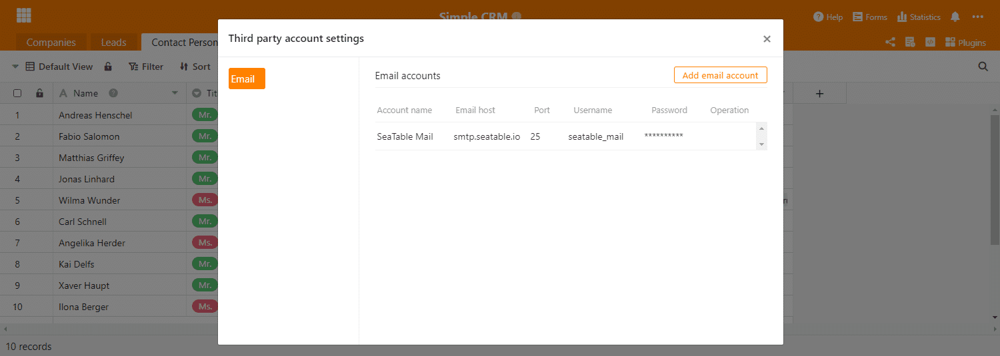
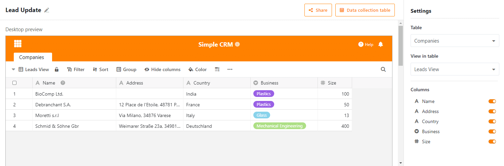

Hoje disponibilizámos o SeaTable 1.8 no [SeaTable Cloud](https://cloud.seatable.io) e estamos convencidos de que concordará: SeaTable 1.8 é óptimo! Está repleto de novas características e adições de funcionalidades, bem como de um grande número de pequenos melhoramentos. Tal como no passado, apresentamos as novidades mais importantes na nota de lançamento. Desta vez foi particularmente difícil concentrarmo-nos nos cinco destaques. Encontrará a lista completa de alterações - como sempre - no changelog. Iremos carregar a imagem Docker para Docker Hub nos próximos dias.

## Altura variável das filas

As filas ajustáveis em altura são literalmente a novidade mais marcante no SeaTable 1.8. Há apenas quatro alturas de fila por onde escolher: Simples, Duplo, Triplo, Quádruplo. As linhas ampliadas dão espaço para miniaturas de ficheiros maiores e criam mais espaço para a exibição de conteúdos em colunas de texto formatado. Uma linha de altura dupla mostra duas linhas de texto, uma linha de altura tripla mostra quatro linhas de texto e uma linha de altura quádrupla mostra seis linhas de texto.

A antiga (única) altura da linha é a nova altura padrão da linha. Quando se abre uma nova base ou se cria uma nova mesa, esta é aplicada. A configuração da altura da linha está escondida atrás do novo ícone na barra de ferramentas de visualização, à direita das opções de formatação. Teste-o e descubra qual a altura da fila que melhor se adequa à sua aplicação!

## Tipo de coluna #21: Botão

O novo tipo de coluna "Botão" é o mais estranho entre as quase duas dúzias de tipos de colunas no SeaTable. (Spoiler: Iremos preencher as duas dúzias de tipos de colunas muito em breve. Seja curioso!) Não se armazena qualquer informação numa coluna do tipo Área de Troca; utiliza-se a coluna Botão para automatizar acções. Com a introdução do novo tipo de coluna nesta versão, pode executar um script através de um botão. Muito em breve, também poderá enviar e-mails (mais abaixo) e mensagens de chat com um clique. Ao longo de 2021, adicionaremos gradualmente mais acções que podem ser desencadeadas com um botão.

Ao criar uma coluna de botão, define-se o aspecto e a função do botão. Isto inclui a acção a realizar, o rótulo do botão e a sua cor. Consulte o [SeaTable Script Manual](https://seatable.github.io/seatable-scripts/) se quiser escrever os seus próprios guiões e integrá-los na sua mesa através de botões.

## Formulário de recolha

Imagine que é um gestor de vendas e que pretende que os seus gestores de produtos actualizem as informações do catálogo de produtos. Até agora, isto exigia que todos os gestores fossem informados sobre a base (ou visão) do catálogo de produtos e depois solicitar-lhes que verificassem se os dados estão actualizados. De facto, isto pode significar muito trabalho se se criar vistas personalizadas e se as enviar uma de cada vez. Com SeaTable 1.8 há agora uma maneira melhor e mais fácil! Apresentando: O formulário de recolha.

O formulário de colecção é uma vista de tabela de uma base que mostra ao utilizador apenas as filas que ele próprio criou. Se o utilizador não for inscrito como criador em qualquer linha, o formulário de recolha apresenta-se como uma tabela vazia. O utilizador só pode, portanto, criar novas entradas, mas não editar as já existentes. A forma colectiva é, portanto, o instrumento de eleição para tarefas de actualização de dados em grande escala que envolvem numerosas pessoas. É mais fácil de manusear do que as libertações, uma vez que não é necessária qualquer libertação para aceder à forma colectiva. O utilizador só precisa de uma conta de utilizador.

Para si, como gestor de vendas, a actualização do catálogo de produtos é consequentemente feita rapidamente: crie um formulário de recolha, envie o link aos seus gestores de produtos e deixe-os fazer o trabalho.

## Ligações externas para visualizações (apenas para assinaturas Plus e Enterprise)

Ligações externas para bases têm feito parte das funções centrais de partilha desde a versão 1.0 do SeaTable. As ligações externas recentemente introduzidas para opiniões são a sua extensão lógica e permitem um intercâmbio de dados mais granular com terceiros externos. Como o nome implica, uma ligação externa para uma vista é um URL que - independentemente de um login SeaTable - concede acesso lido a uma vista específica de uma tabela. As linhas e colunas que estão ocultas pelas configurações de visualização, assim como as outras tabelas na base, permanecem ocultas aos visitantes da ligação externa.

Cria-se uma ligação externa para uma vista através do menu de contexto de uma vista. Clique no ícone de três pontos junto ao nome da vista. Na caixa de diálogo "Partilhar vista", pode adaptar a ligação às suas necessidades. Clique em "Criar" para criar a ligação. Pode partilhar a ligação da forma que desejar: por correio eletrónico, por chat ou incorporando-a numa página Web (como fizemos na nossa página [Newsroom](), por exemplo).

## Envio de e-mail

Na versão 1.8 não só alargámos as funcionalidades de partilha existentes; o SeaTable também recebeu uma funcionalidade de partilha completamente nova: A SeaTable pode agora enviar emails! Os utilizadores podem armazenar as credenciais para um ou mais servidores SMTP numa base e depois utilizá-las em scripts Python e JS. O método base.sendMail() está disponível para este fim.

Os dados de acesso são encriptados com fichas simétricas e armazenados na base de dados back end. Numa das próximas versões iremos adicionar uma função de teste de ligação. Estamos também a planear tornar as contas de e-mail directamente utilizáveis através dos novos botões.

## Apoio SAML

Finalmente, temos um tratamento especial para todos os utilizadores que executam o SeaTable no seu próprio servidor: o SeaTable 1.8 suporta agora a Security Assertion Markup Language, mais conhecida como SAML. O SAML é um protocolo popular para a implementação do Single Sign-On. Juntamente com a autenticação via Active Directory e LDAP, o SeaTable ganha enorme flexibilidade e torna a integração muito mais fácil, especialmente em infra-estruturas maiores. Quase todos os sistemas de gestão de identidade conhecidos (por exemplo, okta, Keycloak, Auth0, OneLogin, SiteMinder, ...) suportam SAML.

A documentação completa para a criação do SAML pode ser encontrada no [SeaTable Manual](https://manual.seatable.io/config/enterprise/saml/).

## E muito mais

Esta nota de lançamento iria inchar a um comprimento difícil se déssemos a cada inovação o espaço que ela merece. Portanto, não o faremos. No entanto, gostaríamos de os mencionar aqui pelo menos com o cursor:

- No SeaTable, pode agora calcular facilmente com operadores simples as colunas de data e duração: Adição de uma data e de uma duração? Nada poderia ser mais simples! Crie uma coluna de fórmula, seleccione as duas colunas pretendidas e adicione um "+" no meio. E já está. Claro que isto também funciona com "-".
- Um formulário web pode agora ser limitado no tempo. Não são possíveis envios após a data limite.
- A partir de agora, podem ser criadas novas opções em campos de selecção únicos e múltiplos simplesmente colando-os da prancheta (por exemplo, CTRL + V). O conteúdo colado é automaticamente criado como uma opção e guardado como um valor na célula.
- Se uma autorização de coluna impedir um utilizador de alterar dados numa coluna, a coluna é destacada a cores para indicar a restrição existente num relance.
- Uma nova função de contagem de links() calcula o número de registos ligados numa coluna de links.
- Os tipos de colunas alargadas, como a coluna "Ligação a outros registos", podem agora também ser criados em dispositivos móveis.
- As notificações podem conter conteúdo da fila que desencadeia a notificação. Basta inserir o nome da coluna entre parênteses rectos (por exemplo, {nome}) como um espaço reservado no modelo de notificação.
- Foi adicionada uma nova condição de filtro "é o ID do utilizador atual". Nas organizações em que os IDs dos utilizadores são definidos de forma única (por exemplo, IDs de estudantes), esta condição de filtro pode ser utilizada para criar uma vista que apresente informações diferentes para cada utilizador.

E, claro, também corrigimos alguns bugs:

- As condições de filtragem da coluna de selecção única foram adaptadas às da coluna de selecção múltipla.
- A caixa de verificação e as colunas de selecção múltipla podem agora ser ordenadas.
- A função de pesquisa inclui agora membros do pessoal, bem como colunas de selecção simples e múltiplas.
- A opção FREEZE_USER_ON_LOGIN_FAILED, que faz com que as contas dos utilizadores sejam bloqueadas após um certo número de tentativas de login não autorizadas, funciona agora novamente. [Graças ao mtmail do utilizador por ter apontado este facto.](https://forum.seatable.com/t/v1-7-1-freeze-account-and-fail2ban/296)
