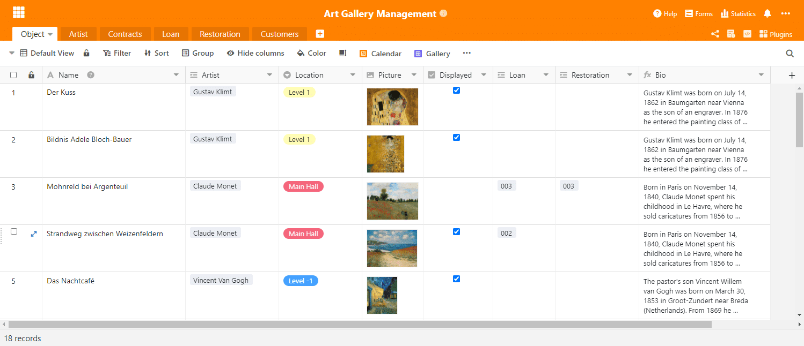
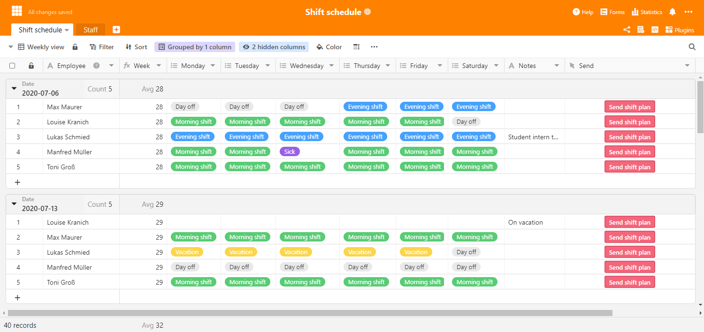
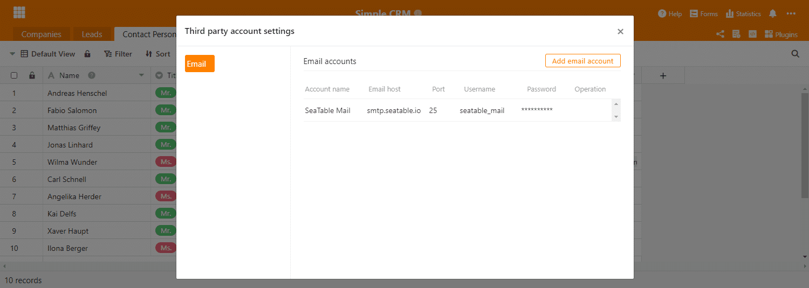
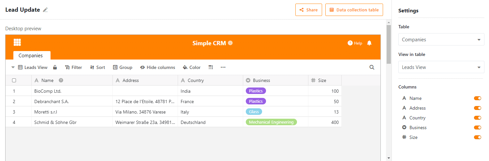

Сегодня мы сделали SeaTable 1.8 доступным на [SeaTable Cloud](https://cloud.seatable.io), и мы уверены, что вы с этим согласитесь: SeaTable 1.8 - это великолепно! Он содержит множество новых функций и функциональных дополнений, а также большое количество мелких улучшений. Как и в прошлом, мы представляем наиболее важные новые функции в примечании к выпуску. В этот раз было особенно трудно сосредоточиться на пяти основных моментах. Полный список изменений - как всегда - вы найдете в журнале изменений. Мы загрузим изображение Docker на сайт Docker Hub в ближайшие несколько дней.

## Переменная высота ряда

Регулируемые по высоте ряды - буквально самая яркая новинка в SeaTable 1.8. На выбор предлагается всего четыре высоты рядов: Одноместный, двухместный, трехместный, четырехместный. Увеличенные строки освобождают место для больших эскизов файлов и создают больше пространства для отображения содержимого в колонках форматированного текста. В строке двойной высоты отображается две строки текста, в строке тройной высоты - четыре строки текста, а в строке четверной высоты - шесть строк текста.

Старая (одинарная) высота строки является новой высотой строки по умолчанию. При открытии новой базы или создании новой таблицы это применяется. Настройка высоты строки скрыта за новым значком на панели инструментов просмотра, справа от параметров форматирования. Испытайте его и узнайте, какая высота ряда лучше всего подходит для вашего применения!

## Тип колонки #21: Кнопка

Среди почти двух десятков типов столбцов SeaTable выделяется новый тип столбца "Button". (Спойлер: Мы очень скоро заполним все два десятка типов колонок. Будьте любопытны!) В колонке типа Switch Area вы не храните никакой информации, а используете колонку Button для автоматизации действий. С появлением в этом релизе нового типа колонки вы сможете выполнять скрипт через кнопку. Очень скоро вы также сможете отправлять электронные письма (подробнее об этом ниже) и сообщения чата одним щелчком мыши. В течение 2021 года мы будем постепенно добавлять все больше действий, которые могут быть вызваны с помощью кнопки.

При создании столбца кнопок вы определяете внешний вид и функцию кнопки. Сюда входит действие, которое должно быть выполнено, метка кнопки и ее цвет. Посмотрите [Руководство по сценариям SeaTable](https://developer.seatable.com/scripts/), если вы хотите написать собственные сценарии и интегрировать их в таблицу с помощью кнопок.

## Форма для инкассации

Представьте, что вы - менеджер по продажам и хотите заставить менеджеров по продукции обновить информацию в каталоге продукции. До сих пор для этого требовалось дать всем менеджерам релиз базы каталога продукции (или представление), а затем попросить их проверить актуальность данных. На самом деле, это может означать большой объем работы, если вы создаете пользовательские представления и рассылаете их по одному. В SeaTable 1.8 теперь есть лучший и более простой способ! Представляем: Форма сбора.

Форма коллекции - это табличное представление базы, которое показывает пользователю только те строки, которые он создал сам. Если пользователь не указан в качестве создателя ни в одной строке, форма коллекции представляется в виде пустой таблицы. Поэтому пользователь может только создавать новые записи, но не редактировать существующие. Поэтому коллективная форма является предпочтительным инструментом для решения масштабных задач по обновлению данных с участием большого количества людей. С ним проще работать, чем с релизами, поскольку для доступа к коллективной форме не требуется релиз. Пользователю нужна только одна учетная запись.

Для вас, как для менеджера по продажам, обновление каталога продукции, следовательно, делается быстро: создайте форму сбора, отправьте ссылку вашим менеджерам по продукции, и пусть они выполняют работу.

## Внешние ссылки для просмотров (только для подписок Plus и Enterprise)

Внешние ссылки на базы являются частью функций централизованного обмена данными, начиная с версии 1.0 SeaTable. Недавно введенные внешние ссылки для представлений являются их логическим продолжением и позволяют осуществлять более детальный обмен данными с внешними третьими сторонами. Как следует из названия, внешняя ссылка для представления - это URL, который - независимо от входа в SeaTable - предоставляет доступ на чтение к определенному представлению таблицы. Строки и столбцы, скрытые настройками просмотра, а также другие таблицы в базе остаются скрытыми от посетителей внешней ссылки.

Создание внешней ссылки для представления осуществляется через контекстное меню представления. Щелкните на значке с тремя точками рядом с названием вида. В диалоге "Поделиться видом" вы можете настроить ссылку в соответствии с вашими потребностями. Для создания ссылки нажмите на кнопку "Создать". Вы можете поделиться ссылкой любым способом: по электронной почте, в чате или вставить ее в веб-страницу (как это сделано, например, на странице " [Отдел новостей"]() ).

## Отправка по электронной почте

В версии 1.8 мы не только расширили существующие возможности совместного использования; SeaTable также получил совершенно новую функцию совместного использования: SeaTable теперь может отправлять электронные письма! Пользователи могут хранить учетные данные для одного или нескольких SMTP-серверов в базе, а затем использовать их в сценариях Python и JS. Для этой цели доступен метод base.sendMail().

Данные доступа шифруются симметричными токенами и хранятся в базе данных бэкенда. В одной из следующих версий мы добавим функцию проверки соединения. Мы также планируем сделать так, чтобы учетные записи электронной почты можно было использовать непосредственно через новые кнопки.

## Поддержка SAML

Наконец, у нас есть особое удовольствие для всех тех пользователей, которые запускают SeaTable на своем собственном сервере: SeaTable 1.8 теперь поддерживает язык Security Assertion Markup Language, более известный как SAML. SAML - это популярный протокол для реализации единого входа в систему. Вместе с аутентификацией через Active Directory и LDAP, SeaTable приобретает огромную гибкость и значительно упрощает интеграцию, особенно в больших инфраструктурах. Почти все известные системы управления идентификацией (например, okta, Keycloak, Auth0, OneLogin, SiteMinder, ...) поддерживают SAML.

Полную документацию по настройке SAML можно найти в [руководстве SeaTable Manual](https://manual.seatable.io/config/enterprise/saml/).

## И многое другое

Эта заметка стала бы непомерно длинной, если бы мы уделили каждой инновации столько места, сколько она заслуживает. Поэтому мы не будем этого делать. Тем не менее, мы хотели бы хотя бы бегло упомянуть их здесь:

- В SeaTable теперь можно легко производить вычисления с помощью простых операторов со столбцами даты и продолжительности: Сложение даты и продолжительности? Нет ничего проще! Создайте столбец с формулой, выделите два нужных столбца и добавьте между ними знак "+". Вот и все. Разумеется, это работает и с "-".
- Теперь веб-форма может быть ограничена по времени. Подача заявок после установленного срока невозможна.
- Отныне новые опции можно создавать в полях одиночного и множественного выбора, просто вставляя их из буфера обмена (например, CTRL + V). Вставленное содержимое автоматически создается как опция и сохраняется как значение в ячейке.
- Если авторизация по столбцу не позволяет пользователю изменять данные в столбце, то столбец выделяется цветом, чтобы с первого взгляда показать существующее ограничение.
- Новая функция countlinks() подсчитывает количество связанных записей в колонке ссылок.
- Расширенные типы колонок, такие как колонка "Ссылка на другие записи", теперь можно создавать и на мобильных устройствах.
- Уведомления могут содержать содержимое строки, вызвавшей уведомление. Просто вставьте имя колонки в фигурных скобках (например, {name}) в качестве заполнителя в шаблон уведомления.
- Добавлено новое условие фильтрации "является идентификатором текущего пользователя". В организациях, где идентификаторы пользователей определяются однозначно (например, студенческие билеты), это условие фильтрации может быть использовано для создания представления, отображающего различную информацию для каждого пользователя.

И, конечно, мы также исправили несколько ошибок:

- Условия фильтрации в колонне с однократным отбором были адаптированы к условиям фильтрации в колонне с многократным отбором.
- Колонки с флажками и множественным выбором теперь можно сортировать.
- Функция поиска теперь включает сотрудников, а также колонки с одиночным и множественным выбором.
- Опция FREEZE_USER_ON_LOGIN_FAILED, которая заставляет блокировать учетные записи пользователей после определенного количества попыток несанкционированного входа, теперь снова работает. [Спасибо пользователю mtmail за то, что указал на это.](https://forum.seatable.com/t/v1-7-1-freeze-account-and-fail2ban/296)
