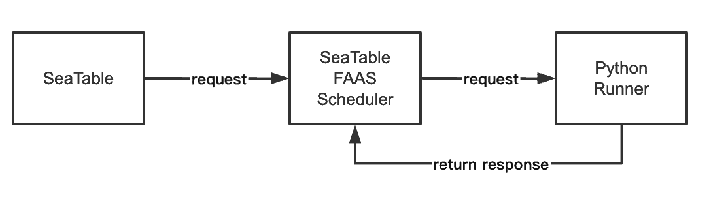

Am 1. Juli 2020 hat SeaTable in der Version 1.0 das Licht der Welt erblickt. Mehr als 100.000 Mal wurde es seitdem von Docker Hub heruntergeladen. Dieses überwältigende Interesse an SeaTable hat uns angetrieben und so sind wir jetzt glücklich und stolz darauf, einen weiteren Meilenstein in der Entwicklung von SeaTable bekannt zu geben: SeaTable 2.0 wurde heute auf [SeaTable Cloud](https://cloud.seatable.io) aufgespielt und auf [Docker Hub](https://hub.docker.com/u/seatable) für private Installationen veröffentlicht.

Optisch unterscheidet sich SeaTable 2.0 kaum von seinem Vorgänger. In Sachen Funktionsumfang, Nutzererfahrung, Stabilität und Integrationsoptionen hat SeaTable seit Juli vergangenen Jahres einen gewaltigen Sprung gemacht. Sie fanden schon die Version 1.x interessant? Dann wird Sie die Version 2.0 begeistern!

SeaTable 2.0 beinhaltet eine enorme Anzahl an Verbesserungen und Neuerungen – die vollständige Dokumentation aller Änderungen finden Sie im [SeaTable Changelog](https://seatable.io/docs/changelog/version-2-0/). Die Highlights der Version 2.0 sind drei neue Spaltentypen, mehrere neuentwickelte Customizing Optionen für bestehende Spaltentypen, zwei völlig neue Plugins sowie viele Detailverbesserungen an SeaTables bestehenden Plugins. Wir haben auch nicht an Verbesserungen in SeaTables Maschinenraum gespart: SeaTable 2.0 verfügt nun über eine neue Ausführungsumgebung für Python Skripte und System Administratoren werden die Überwachungsmöglichkeiten schätzen, die die neue Übersichtsseite für externe Links bietet.

Und das ist noch nicht alles! Dank eines großartigen Beitrags aus der Community können wir nun Russisch als fünfte Benutzersprache neben Englisch, Deutsch, Französisch und Chinesisch anbieten.

## Spaltentyp #22: Formel für Verknüpfungen

Die Fähigkeit, Beziehungen zwischen Einträgen in unterschiedlichen Tabellen abzubilden, ist eine von SeaTables zentralen Unterscheidungskriterien zu klassischen Tabellenkalkulationen wie Excel und Google Sheets. Während letztere nur Zellreferenzen kennen (z.B. für Formeln), lassen sich in SeaTable 1:1, 1:n und n:m Verknüpfungen zwischen Tabellen in einer Base erstellen.

Mit der neuen Formelspalte für Verknüpfungen lassen sich bestehende Verknüpfungen auswerten und Berechnungen ausführen. Fünf unterschiedliche Abfragen werden unterstützt: lookup, countlinks, rollup, findmax und findmin. Wo es Sinn macht, bieten die Abfragen auch Filteroptionen für noch detailliertere Auswertungen (z.B. die Berechnung eines Durchschnitts über verlinkte Einträge, die nicht älter als 6 Monate sind). Dank des graphischen Assistenten ist die Nutzung der Verknüpfungsformelspalte und die Erstellung der Abfragen auch für technisch weniger versierte Nutzer problemlos machbar.

## Mehr Kontrolle über die Verknüpfung von Einträgen

SeaTable schränkt die Art der Beziehung zwischen Tabellen grundsätzlich nicht ein. In einigen Anwendungsfällen macht es jedoch Sinn, eine 1:1 oder eine 1:n Beziehung zu erzwingen. Ein Bestandsverwaltungssystem ist ein einfaches Beispiel: Ein Beamer kann zu jedem Zeitpunkt nur in einem Raum oder bei einem Ausleiher sein. Ebenso kann eine Testmaschine nicht für mehrere Tests gleichzeitig zur Verfügung stehen.

Mit SeaTable 2.0 bieten Verknüpfungsspalten nun die Konfigurationsoption “Verknüpfung zu mehreren Zeilen erlauben”. Standardmäßig aktiviert, führt die Deaktivierung des Schalters dazu, dass ein Eintrag in der aktuellen Tabelle nur mit einem einzigen Eintrag in der verknüpften Tabelle verlinkt werden kann. Für die beiden oben genannten Beispiele bedeutet dies: SeaTable stellt sicher, dass man nicht bei mehreren Personen bzw. in mehreren Räumen nach dem Beamer suchen muss und es verhindert, dass die Testmaschine nicht für zwei gleichzeitige Tests eingeplant wird.

Ergänzend zur Konfigurationsoption zur Einschränkung der _Anzahl der verknüpften Einträge_, erlaubt eine zweite neue Konfigurationsoption die Einschränkung der _Art der Einträge, die sich verknüpfen lassen_. Durch Aktivierung des Schalters “Verknüpfungen auf eine Ansicht einschränken” und Auswahl einer Ansicht können nur solche Einträge in der verknüpften Tabelle verlinkt werden, die Bestandteil der gewählten Ansicht sind. Wenn ein Eintrag durch einen Filter aus einer Ansicht entfernt wird, dann steht dieser nicht für die Verknüpfung zur Verfügung. Wenn es darum geht, die Verknüpfung zwischen bestimmten Einträgen zu verhindern, dann ist diese neue Option von entscheidender Bedeutung. Nochmals zum Beispiel der Testmaschine: Wenn die Testmaschine ihre jährliche Wartung durchläuft, dann sorgt ein entsprechendes Kennzeichen in der Tabelle dafür, dass sie aus der Ansicht der verfügbaren Testgeräte heraus fällt. In der Konsequenz kann Sie in der Testplanung nicht für Testeinsätze verlinkt werden.

## Spaltentyp #23: Rating

SeaTables Webformulare sind unglaublich praktisch für einfache Umfragen. In wenigen Augenblicken ist ein Fragebogen erstellt und fertig gemacht für den Versand. Die Antworten der Umfrageteilnehmer landen in der zugrundeliegenden Base und lassen sich dort mit den diversen Analysewerkzeugen von SeaTable schnell und einfach auswerten.

Die neue Ratingspalte ist eine ideale Ergänzung für solche Umfragen: “Waren Sie mit unserer Leistung zufrieden?” oder “Würden Sie uns Ihren Freunden empfehlen?” Fünf Sterne lassen keinen Raum für Zweifel; zwei Sterne hingegen bieten viel Raum für Verbesserungen. Der neue Spaltentyp eignet sich aber nicht nur für Kundenzufriedenheitsumfragen. Sie wollen in Ihrem Team über einen neuen Produktnamen abstimmen? Neue Leads verlangen eine schnelle Einschätzung für die Priorisierung? Die Rating-Spalte hilft in all diesen Fällen!

Die Ratingskala kann von 1 bis 10 Sterne reichen. Wenn Sie die Standardfarbe Orange nicht mögen, dann finden Sie unter den neun anderen Farben sicher eine, die Ihnen besser gefällt. Auch eine Anpassung der Ratingskala nachträglich ist möglich. Bei einer Erweiterung der Skala bleiben bestehende Ratings unverändert; bei einer Verkürzung werden Ratings auf die neue Maximallänge gekürzt.

## Flexiblere Webformulare: Eigenes Logo, Unterstützung für Verknüpfungsspalten und vorausgefüllte Felder

Die Ratingspalte ist nur eine von mehreren Neuerungen, die SeaTables Webformulare noch besser machen. Die Einbettung eines eigenen Logos ist das auffälligste neue Feature im Formulareditor. Ein in der oberen linken Ecke eingefügtes Logo oder Schriftzug schafft ein individualisiertes Formular mit Wiedererkennungseffekt.

Weniger auffällig, aber umso wichtiger in der Anwendung ist die in SeaTable 2.0 ergänzte Funktion, Verknüpfungsspalten in Formularen zu nutzen. Dieser Spaltentyp bietet deutlich mehr Flexibilität als Einfachauswahlspalten und erlaubt so noch detailliertere Umfragen.

Gänzlich unsichtbar im Editor, dafür aber umso mächtiger in der Anwendung ist die Standardwertfunktion für Formularfelder. Um ein Formularfeld mit einem Standardwert vorauszufüllen, ergänzen Sie ‘?prefill_COLUMNNAME=PREFILLVALUE’ an die Formular-URL. (COLUMNNAME ist der Name der Spalte, dessen Feld auszufüllen ist; PREFILLVALUE ist der einzufügende Wert. Leerzeichen in Spaltennamen sind als “%20” zu schreiben und auf Groß- und Kleinschreibung muss geachtet werden.) Selbstverständlich lassen sich auch mehrere Formularfelder mit Standardwerten versehen. Zu diesem Zweck werden mehrere COLUMNNAME-PREFILLVALUE Paare mit dem kaufmännischen Und-Zeichen (“&”) verbunden.

## Spaltentyp #24: Geoposition

Das Karten-Plugin macht die Darstellung einer geographischen Verteilung eine Sache von Sekunden. Das Plugin interpretiert Adressen und andere Positionsbeschreibungen und plottet diese auf eine Google Map. In einigen Fällen sind Positionsbeschreibungen aber einfach nicht präzise genug. Schlimmer noch: Positionsbeschreibungen können sich über den Lauf der Zeit als veränderlich erweisen. All diese Überlegungen haben uns dazu gebracht, die Geopositionsspalte zum 24. Spaltentyp von SeaTable zu machen.

Die Geopositionsspalte speichert Längen- und Breitengradkoordinaten als Komma-separierte Werte. Biologen und Archäologen, die Fundstellen exakt dokumentieren müssen, oder Photographen, die ihre Schnappschüsse geokodieren wollen, können dies mit dem neuen Spaltentyp einfach machen: Die Geopositionspalte speichert die Position mit der maximalen Präzision, so dass bei zukünftigen Analysen, ggf. auch mit anderen Werkzeugen zur Geoanalyse, keine Fragen offen bleiben.

## Optionale Standardwerte für Spalten

Es gibt diese Spalten, in denen quasi immer der gleiche Wert eingetragen werden muss, wenn ein neuer Eintrag angelegt wird, z.B. eine Status-Spalte im Projektmanagement oder eine Textspalte mit einer einheitlichen führenden Zeichenfolge. Würde es nicht eine Menge Zeit sparen, wenn diese Werte bei neuen Einträgen automatisch gesetzt werden könnten?

Weil das genau so ist, erlaubt SeaTable ab der Version 2.0 bei den drei Spaltentypen Text, Zahl und Einfachauswahl die Definition eines Standardwerts. Ist ein solcher definiert, dann wird in einem neuen Eintrag die dazugehörige Zelle automatisch mit dem Standardwert befüllt. Wenn der neue Eintrag die Ausnahme von der Regel ist und der automatisch gesetzte Wert nicht passt, dann kann dieser zu jeder Zeit manuell überschrieben werden.

## Neues Plugin: Seitendesign

Mit dem Seitendesign-Plugin lassen sich ein- und mehrseitige PDF-Dokumente erstellen, die sich dynamisch Daten aus einer SeaTable Tabelle holen. Wir bei SeaTable generieren mit dem Plugin Lizenzzertifikate. Die Anwendungsfälle gehen aber deutlich darüber hinaus: Sie können für Ihre Geschäftspartner Urkunden oder für die Mitglieder Ihres Tennisclubs Mitgliedskarten erstellen. Wenn Sie Ihr Produktportfolio in SeaTable verwalten, dann können Sie mit wenigen Klicks für alle Ihre Produkte ansehnliche Produktdatenblätter generieren. Im Personalbereich lassen sich PDF-basierte Jobausschreibungen ohne wiederholten Zusatzaufwand einfach und schnell erstellen.

Jedes Dokument basiert auf einer Vorlage. Die Gestaltung einer Vorlage erfolgt in SeaTable selbst. Der WYSIWYG-Editor ist Bestandteil des Plugins, ein externer Editor ist nicht erforderlich. Der Editor stellt eine Auswahl statischer Elemente wie Texte, Tabellen und Bilder zur Verfügung und bietet diverse Bearbeitungsoperationen. So kann ein Bild direkt in der Vorlage gedreht, beschnitten oder ausgerichtet werden. Wenn Ihre Vorlage nicht ansprechend aussieht, dann liegt es nicht am Editor! ;-) Der Editor speichert alle Vorlagen in einem JSON-Format; eine Import- und Exportfunktion garantiert die Portabilität der Vorlagen.

## Neues Plugin: Kanban

Ein Kanban-Board ist ein großartiges Tool, um zahlreiche betriebliche Funktionen und Aufgaben zu visualisieren, zu kontrollieren und zu überwachen (z.B. die Vertriebspipeline). Das Kanban-Prinzip hat sich in der Praxis tatsächlich als so erfolgreich herausgestellt, dass in den letzten Jahren eine Vielzahl an Programmen erschienen ist, die unterschiedliche Spielarten von Kanban-Boards implementieren.

Mit dem neuen Release verfügt auch SeaTable über ein Kanban-Plugin, mit dem sich die Daten in Tabellen auf einem Kanban-Board darstellen lassen. Die Kategorien eines Kanban-Boards sind entweder die Optionen einer Einfachauswahlspalte oder die Benutzer in einer Mitarbeiterspalte. Dadurch lässt sich die Kanban-Ansicht für so unterschiedliche Anwendungsfälle nutzen wie HR Management, Produktion, Vertrieb, Softwareentwicklung, und Projektmanagement. Neue Kategorien und neue Einträge lassen sich direkt in der Kanban-Ansicht erstellen, ohne dass man das Plugin verlassen muss. Intensiven Nutzern wird die Drag & Drop Unterstützung gut gefallen.

## Verbesserte Plugins: Calendar, Timeline, Galerie und Karten

Während wir viel Aufwand und Arbeit in die neuen Plugins investiert haben, haben wir die anderen Plugins nicht aus den Augen verloren. Alle vier großen Plugins erhalten in SeaTable 2.0 Verbesserungen.

Das Calendar Plugin bietet nun zusätzlich zur Monats- und Jahresansicht auch eine Wochen- und Tagesansicht. In der Tages-, Wochen- und Monatsansicht lassen sich Events mit der Maus verschieben und neue Events können mit Click & Pull erstellt werden. Die dritte neue Ansicht, die Agenda Ansicht, listet alle anstehenden Events in einem einwöchigen Zeitraum in chronologischer Reihenfolge auf. Sie ist großartig für den Druck des Kalenders in einem praktischen Format. Zur Abrundung und Vereinheitlichung mit anderen Plugins haben wir auch eine Farboption ergänzt. Die Farbe eines Termins kann nun über ein Einfachfachauswahlfeld festgelegt werden.

Das neue Timeline Plugin bietet ebenfalls eine solche Farboption. Darüber hinaus lässt sich auch ein Label im Gantt-Chart einblenden. So bietet das verbesserte Plugin noch mehr Übersicht bei der Projektplanung.

Die Galerie haben wir für mobile Geräte ertüchtigt, so dass sie auch gut auf kleineren Bildschirmen dargestellt werden kann. Darüber hinaus haben wir das Webinterface an ein paar Stellen geändert, um die Benutzererfahrung und die Datendarstellung zu verbessern.

Um mit der Entwicklung im Bereich Spaltentypen Schritt zu halten, kann das Karten-Plugin in SeaTable 2.0 auch mit der neuen Geopositionsspalte umgehen.

## Manuelle Snapshots

[Snapshots](https://seatable.io/docs/handbuch/seatable-nutzen/versionierung-snapshots/) sind eine Momentaufnahme einer Base. Sie stellen ihren Wert unter Beweis, wenn eine Base nach umfangreichen Änderungen auf einen früheren Zustand zurückgesetzt werden soll.

In der Vergangenheit kannte SeaTable nur automatische Snapshots. Ein solcher wurde täglich vom SeaTable Server angelegt, wenn innerhalb der letzten 24h Änderungen in der Base ausgeführt wurden. In Version 2.0 hat SeaTable dazu gelernt und kennt nun auch manuelle Snapshots: Ein Klick und ein Abbild der Base ist gemacht. Als Versicherung gegen ungewollten Datenverlust ist dieser Klick höchst empfehlenswert, wann immer an der Struktur einer Base gearbeitet wird (insbesondere bei Löschungen von Spalten und Tabellen).

## Ordner für Bases

Bei der täglichen Nutzung von SeaTable sammelt sich die eine oder andere Base an. In SeaTable 2.0 führen wir Ordner ein, in denen sich Bases zusammenfassen und organisieren lassen. Sie bringen Struktur und Übersichtlichkeit zurück, wenn das stetige Wachstum der Bases den Blick aufs Wesentliche versperrt. Neue Bases können in einem Ordner erstellt oder bestehende Bases in einen Ordner per Drag & Drop verschoben werden.

## Schutz vor unerwünschtem Datenabfluss

Wenn eine Base vertrauliche Daten enthält, dann ist der Schutz vor irrtümlichem oder bösartigem Abfluss von Daten von größter Bedeutung. Gesetzliche Datenschutzbestimmungen erfordern darüber hinaus geeignete technische Maßnahmen, um personenbezogene Daten zu schützen. Die Vermeidung von Datenabfluss gehört ganz essentiell zu diesen Maßnahmen.

Um diesen hohen Anforderungen zu bestehen, bietet SeaTable in der Version 2.0 zusätzliche Berechtigungseinstellungen zur Vermeidung von Data Leakage. In diesen neuen Sicherheitseinstellungen kann der Eigentümer einer Base entscheiden, ob andere Benutzer die Base drucken, duplizieren und/oder exportieren dürfen. Diese Berechtigungseinschränkungen können auf alle Benutzer oder nur auf solche, die eine Freigabeberechtigung haben, angewendet werden. Im Falle einer Base im Besitz einer Gruppe dürfen der Gruppenbesitzer und die Gruppenadministratoren diese Einstellungen ändern.

## Python Skript Ausführungsumgebung

Ein Teil der Attraktivität von SeaTable für Entwickler liegt in der Unterstützung von Python und JavaScript (JS) Skripten. (Produkte unserer Wettbewerber unterstützen nur JS Skripte.) Während JS Skripte im Browser ausgeführt werden, laufen Python Skripte auf Seiten des Servers. In Kombination mit der Möglichkeit, deren Ausführung zu automatisieren, eigenen sich Python Skripte insbesondere für anspruchsvollere Datenverarbeitungsszenarien.

Diese Flexibilität hat aber auch ihren Preis: Die Ausführung der Python Skripte auf dem Server bringt Sicherheitsrisiken mit sich. Um diese optimal abzusichern, haben wir mit zwei zusätzlichen Komponenten die Ausführungsumgebung der Python Skripte vom Hauptsystem weitgehend isoliert. Das Team bestehend aus SeaTable FAAS Scheduler und Python Runner sorgt aber nicht nur für Sicherheit, sondern auch für optimale Skalierbarkeit. Beim Aufruf eines Skripts wird ein Docker Container gestartet und das Skript ausgeführt. Das Ergebnis des Skripts wird an SeaTable zurück gegeben und der Docker Container zerstört. Durch den Einsatz mehrerer Python Runner können auch zahlreiche Skripte gleichzeitig ohne Wartezeit ausgeführt werden. (Mehr Informationen finden Sie im [SeaTable Admin Manual](https://manual.seatable.io/docker/Python-Runner/Deploy%20SeaTable%20Python%20Runner/).)

## Übersicht über externe Links

Ein externer Link ist schnell erzeugt, um Informationen mit externen Partnern zu teilen. Über die Option “Automatischer Ablauf” lässt sich die Lebensdauer eines Links auch zeitlich beschränken. In der Realität geschieht dies aber nicht immer und so können externe Links auch nach Ende ihrer Nutzung fortbestehen.

Damit sich der Teamadministrator über die bestehenden externen Links ein Bild machen kann, bietet SeaTable von nun an eine Übersichtsseite der externen Links in der Teamadministration. In zwei Tabs werden die bestehenden externen Links für Bases und Views aufgelistet. Die tabellarische Darstellung bietet Informationen über Ersteller und Erstellungsdatum sowie die Anzahl der Aufrufe. Der Teamadministrator hat aber nicht nur Leserechte. Soll ein Link deaktiviert werden, so kann er dies ebenfalls tun.
