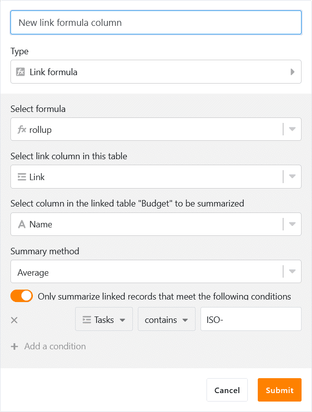
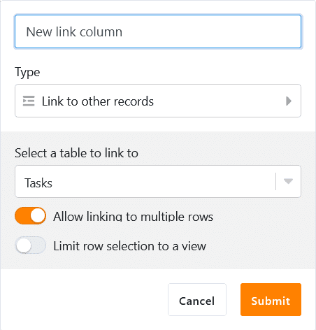
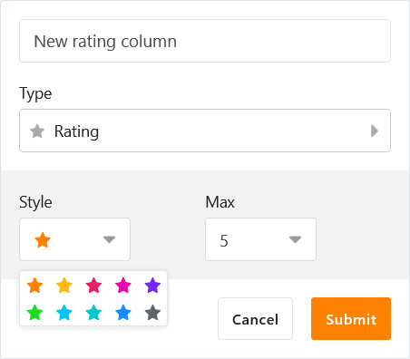
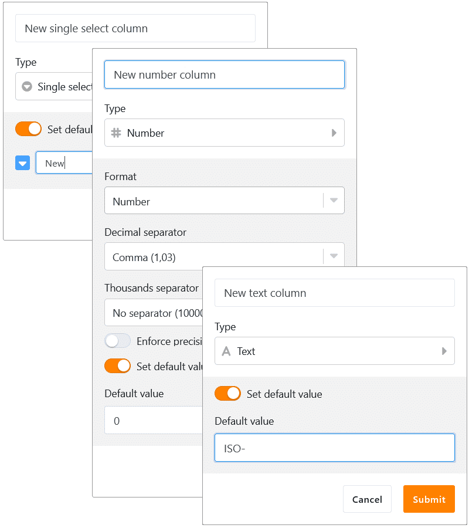
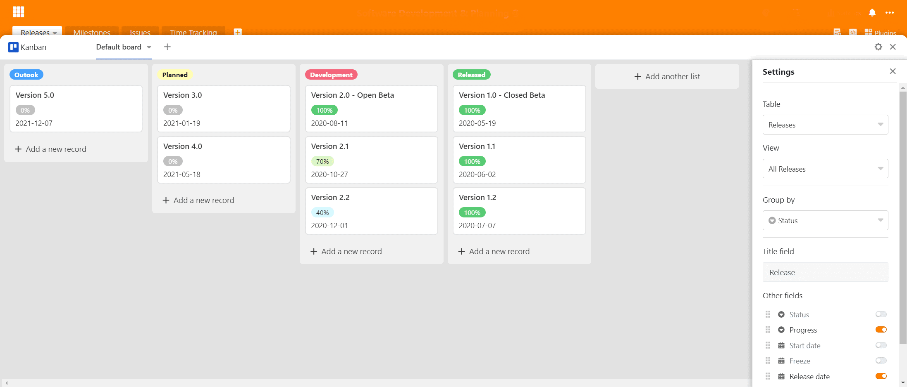
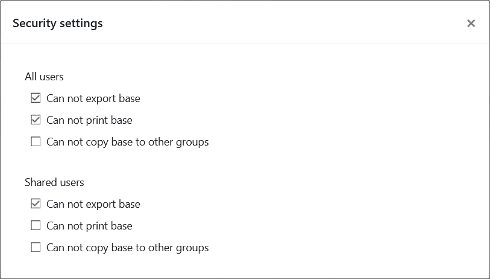
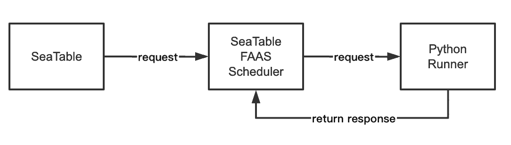

On July 1, 2020, SeaTable 1.0 saw the light of day. Since then, it has been pulled from Docker Hub over 100.000 times. This overwhelming interest in SeaTable has pushed us ahead, and we are happy to announce a major milestone in the development of SeaTable: We rolled out SeaTable 2.0 on [SeaTable Cloud](https://cloud.seatable.io) and published it on [Docker Hub](https://hub.docker.com/u/seatable) for private installations.

At first glance, SeaTable 2.0 has a striking resemblance with SeaTable 1.0. In terms of features, user experience, stability, and integration, however, SeaTable 2.0 has come a long way from version 1.0 in July 2020. If you liked SeaTable 1.x, you'll love our latest release.

SeaTable 2.0 boasts an enormous number of feature additions and improvements - all of which you find documented in SeaTable's [SeaTable Changelog](https://seatable.io/en/docs/changelog/version-2-0/). Highlights of this release are three new column types, several new column customization options, two entirely new plugins and major improvements to SeaTable's existing plugins. There are also important changes under the hood: SeaTable 2.0 ships with a new environment for running Python scripts, and system admins will appreciate the monitoring capability provided by the external link page.

And there is more good news! Thanks to a fantastic community effort, we could add Russian as a fifth interface language besides English, German, French and Chinese.

## Column type #22: Formula for links

The ability to map relationships between entries in different tables is one of SeaTable's key differentiators from classic spreadsheets like Excel and Google Sheets. While the latter only know cell references (e.g. for formulas), SeaTable lets you create 1:1, 1:n and n:m links between tables in a base.

The link formula column is a special column to evaluate existing links and to perform calculations. Five different queries are available: lookup, countlinks, rollup, findmax, and findmin. Where sensible, filter options allow even more detailed calculations (e.g., calculation of an average over records that are not older than 6 months old). Thanks to the graphical wizard, using the link formula column and specifying more complicated queries is effortless even for non-technical users.

## More control over linking records

By default, SeaTable does not limit the kind of relationship between records in columns of type 'link other records'. In some use cases, however, a 1:1 or a 1:n relationship should or must be enforced. An asset management system is just one example: A projector can only be in one room at any time. Similarly, a test machine can only be used for one test at a time.

With SeaTable 2.0, link columns now offer the configuration option "Allow linking to multiple rows ". Enabled by default, disabling the switch will result in an entry in the current table being able to link to only a single entry in the linked table. For the two examples above, this means: SeaTable ensures that you don't have to search for the beamer with multiple people or in multiple rooms, and it prevents the test machine from not being scheduled for two simultaneous tests.

In addition to the configuration option to restrict the _number of linked entries_, a second new configuration option allows to restrict the _type of entries that can be linked_. By activating the "Restrict links to one view" button and selecting a view, only those entries in the linked table that are part of the selected view can be linked. If an entry is removed from a view by a filter, then it is not available for linking. When it comes to preventing linking between certain entries, this new option is crucial. Taking the example of the test machine again, if the test machine is undergoing its annual maintenance, then an appropriate flag in the table will ensure that it drops out of the view of available test equipment. As a consequence, it cannot be linked in the test planning for test operations.

## Column type #23: Rating

SeaTable's web forms are incredibly handy for simple surveys. In just a few moments, a questionnaire is created and ready to be sent out. The answers of the survey participants end up in the underlying base and can be analyzed there quickly and easily with SeaTable's various analysis tools.

The new ratings column is an ideal addition for such surveys: "Were you satisfied with our performance?" or "Would you recommend us to your friends?" Five stars leave no room for doubt; two stars, on the other hand, offer plenty of room for improvement. However, the new column type is not only suitable for customer satisfaction surveys. Do you want your team to vote on a new product name? New leads require a quick assessment for prioritization? The rating column helps in all these cases!

The rating field supports ratings from 1 to 10 stars. If you don't like the stars' default orange, one of the other nine colors will certainly do the job. As the need arises to change the rating scale, you can do this on the fly. When extending the rating scale, the existing ratings are not altered, when shortening the scale, the existing ratings are trimmed to the newly set maximum rating.

## More flexible forms: Custom logo, linked record support, and prefilled fields

The rating column is not the only change in SeaTable 2.0 boosting the versatility of SeaTable's web forms. The custom logo is the most notable new feature in SeaTable's web forms. You can embed a logo of your choice atop the form.

Less visible than the logo, but all the more important: SeaTable 2.0's web forms can now handle link columns. Link columns are more flexible and dynamic than the alternative single select columns and so allow even more detailed surveys.

Completely invisible in the editor, but all the more powerful in the application is the default value function for form fields. To prefill a form field with a default value, add '?prefill_COLUMNAME=PREFILLVALUE' to the form URL. (COLUMNAME is the name of the column whose field is to be prefilled; PREFILLVALUE is the value to be inserted. Spaces in column names are to be written as "%20" and are case sensitive). Of course, several form fields can also be provided with default values. For this purpose, several COLUMNNAME-PREFILLVALUE pairs are connected with the ampersand ("&").

## Column type #24: Geolocation

Thanks to the map plugin, visualizing the geographic distribution of a data collection is a matter of seconds in SeaTable. The plugin interprets and plots addresses as well as other location information on a Google Map. In some cases, however, location descriptions are just not precise enough. Worse, location descriptions may not be precise over time. This is why we decided to add the geolocation column as SeaTable's 24th column type.

A geolocation column stores latitude and longitude coordinates as comma-separated values. So whether you are a biologist tracking the sightings of your object of study or a photographer geocoding your shots, the geolocation column does exactly what you need: it captures the precise, inalterable position for your later analyses.

## Optional default values for columns

There are these columns where quasi always the same value has to be entered when a new entry is created, e.g. a status column in project management or a text column with a uniform leading string. Wouldn't it save a lot of time if these values could be set automatically for new entries?

We think so, and this is why, beginning with SeaTable 2.0, text, number, and single-select columns support default values. If a default value is defined, a new cell is automatically filled when a new record is created. If the new record is the odd one out and the default value is not the right one, the default value can be manually overridden at any time.

## New plugin: Page design

The new page design plugin generates single and multi-page PDF documents using data saved in a SeaTable base. We at SeaTable generate license certificates with the new plugin. Yet, the use cases go way beyond that: You can just as well create partner certificates for your business associates or membership cards for your tennis club. If you manage your product portfolio in SeaTable, datasheets for all your products are just a few clicks away. If you use SeaTable for recruiting purposes, a PDF job posting does not cost you any extra time.

Every document created by the page design plugin is based on a template. The design of a template takes place in a WYSIWYG editor which the plugin ships with - no external editor required. The page design editor offers a variety of static elements such as texts, tables, and images and supports many editing functions (e.g. crop, rotate, align). If your template does not look nice, it's not the editor's fault! ;-) The editor saves the templates as JSON-files; a straightforward import and export function guarantees template portability.

## New plugin: Kanban

A Kanban board is a great tool for visualizing, managing, and supervising projects, lead pipelines and many other business challenges. In fact, Kanban has proven to be so successful in many real-world applications that a great number of programs have been developed with a Kanban board at its core.

With the new release, SeaTable also has a Kanban plugin that can be used to display data in tables on a Kanban board. The categories of a Kanban board are either the options in a single selection column or the users in an employee column. This allows the Kanban view to be used for use cases as diverse as HR management, production, sales, software development, and project management. New categories and new entries can be created directly in the Kanban view without leaving the plugin. Intensive users will like the drag and drop support.

## Improved plugins: Calendar, Timeline, Gallery, and Map

While we have dedicated a lot of time to our two new plugins, we haven't forgotten the existing plugins. All four major plugins have been improved!

The calendar plugin in SeaTable 2.0 now features an agenda, a daily and a weekly view in addition to the existing annual and monthly views. Additionally, the daily, weekly, and monthly views support dragging and dropping, and new events can be created right in the view by clicking and pulling. The agenda view lists off all events in a weekly period and in chronological order. It is great when the content of the calendar needs to be printed. Last but not least, we also added a color option for events. Events can take the color of a single select column.

The new timeline view offers a color and label option for the events shown in the Gantt diagram.

The gallery view is now optimized for mobile devices and the user interface has undergone some changes to improve user experience and data display.

Keeping track with the developments in the column type department, SeaTable 2.0's map plugin now supports the new geolocation column type.

## Manual snapshots

[Snapshots](https://seatable.io/en/docs/handbuch/seatable-nutzen/versionierung-snapshots/) are a snapshot of a base. They prove their value when a base is to be reset to a previous state after extensive changes.

In the past, SeaTable created a snapshot of a base automatically every 24 hours when it recorded activity in the base. SeaTable 2.0 now also knows manual snapshots: One click and a snapshot of the base as-is is made. As insurance against unintended data loss, this click is highly recommended whenever the structure of the base (especially column and table deletions) is to be changed.

## Folders for bases

As you use SeaTable every day for more and more tasks, the number of bases in your base library will start to multiply. In SeaTable 2.0, we introduce folders as an easy way to bring structure to your ever-growing number of bases. You can create new bases inside a folder or you can move existing bases inside a folder by just dragging and dropping.

## Data leakage prevention

When a base contains confidential data, it is imperative to prevent the accidental or malicious leakage of data. Similarly, privacy regulations mandate sensible technical measures to protect personal information. Data leakage prevention is certainly one of those measures.

In order to meet these high standards, SeaTable 2.0 offers additional security settings to safeguard data in bases. In the new security settings, the base owner can decide whether or not a base can be printed, duplicated, and/or exported. The owner can set these permissions independently for all users and users that have a sharing permission to the base. If a base is group-owned, the group owner and the group administrators have the right to set these settings.

## Python script environment

Some part of the appeal of SeaTable for developers is its support for Python in addition to JavaScript (JS) scripts. (Competitive products only support JS scripts.) While JS scripts are executed in the browser, Python scripts run server side. In combination with the ability to execute automatically, Python scripts lend themselves to more complex data processing scenarios.

However, this flexibility also comes at a price: executing the Python scripts on the server entails security risks. In order to secure these optimally, we have largely isolated the execution environment of the Python scripts from the main system with two additional components. However, the team consisting of SeaTable FAAS Scheduler and Python Runner not only ensures security, but also optimal scalability. When a script is called, a Docker container is started and the script is executed. The result of the script is returned to SeaTable and the Docker container is destroyed. By using multiple Python runners, it is also possible to run numerous scripts simultaneously without waiting. (More information can be found in the [SeaTable Admin Manual](https://manual.seatable.io/docker/Python-Runner/Deploy%20SeaTable%20Python%20Runner/)).

## External link page

An external link is quickly created to share information with external partners. The "Automatic expiration" option can also be used to limit the lifetime of a link. In reality, however, this does not always happen and so external links can persist even after their use has ended.

So that the team administrator can get an idea of the existing external links, SeaTable now offers an overview page of the external links in the team administration. The existing external links for bases and views are listed in two tabs. The tabular display offers information about the creator and creation date as well as the number of calls. However, the team administrator does not only have read rights. If a link is to be deactivated, he can do this as well.
