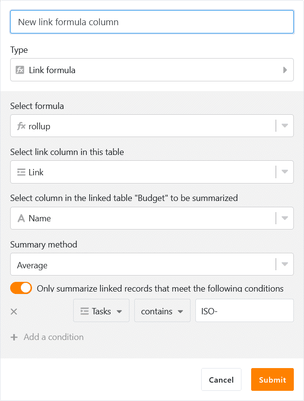
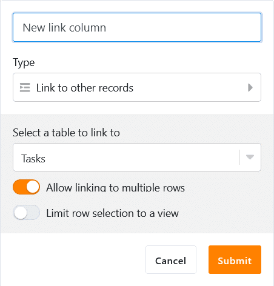
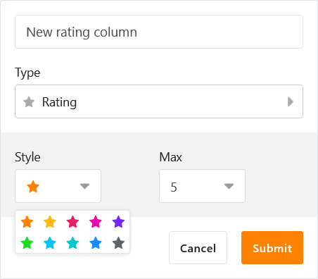
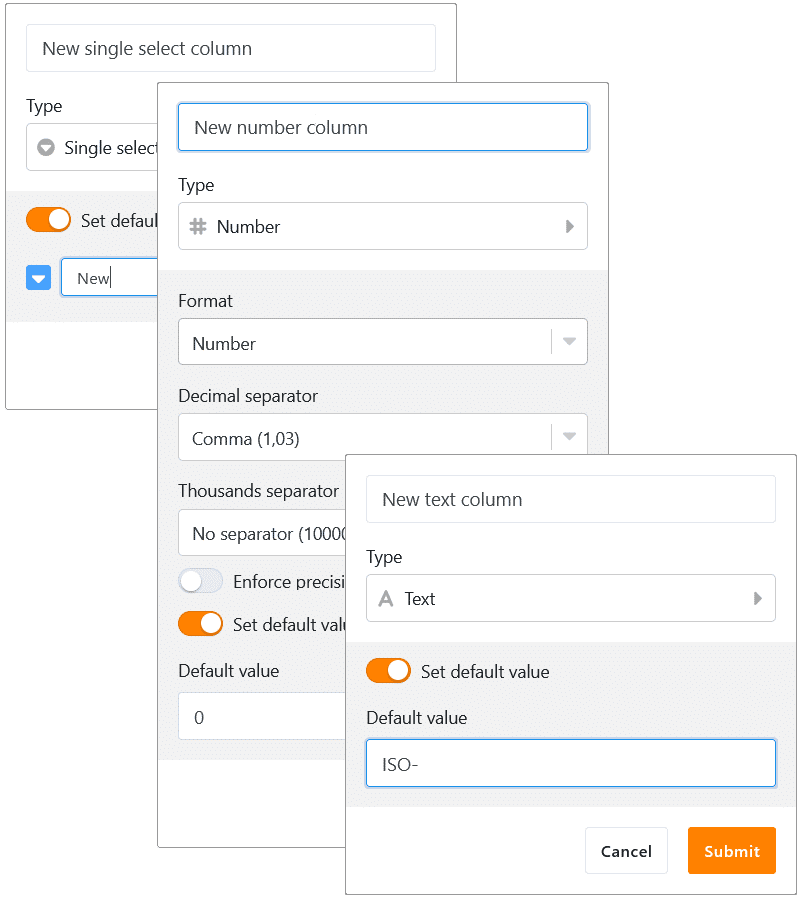
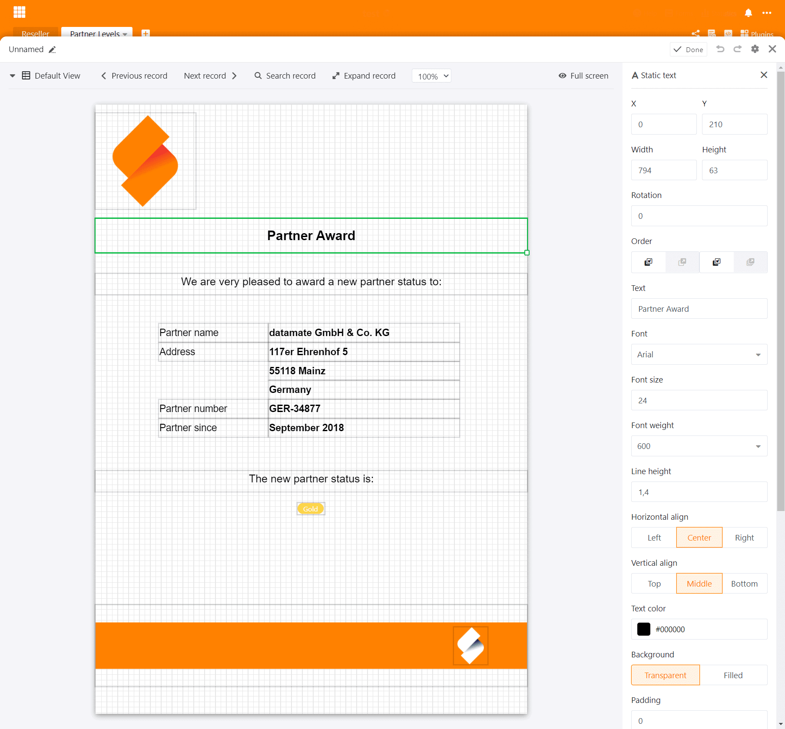
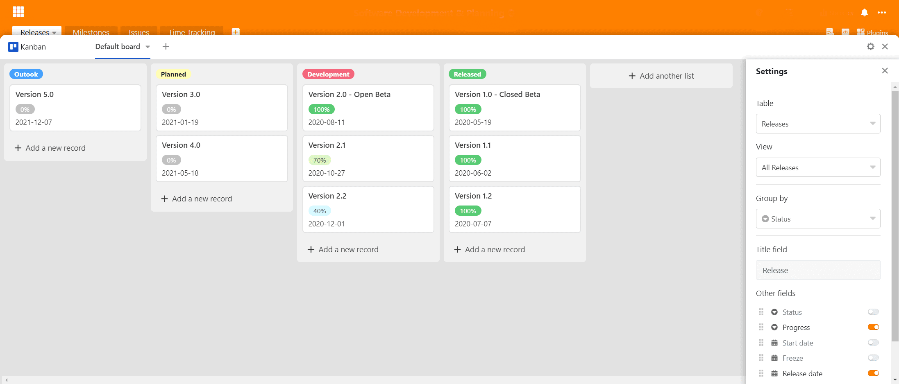
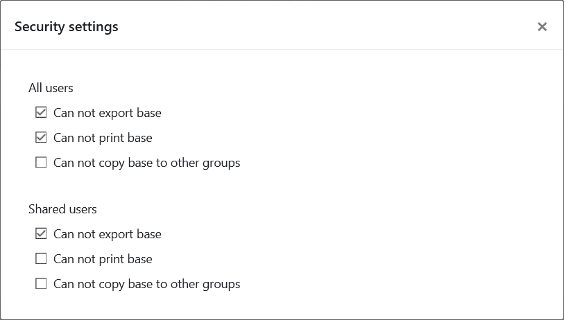
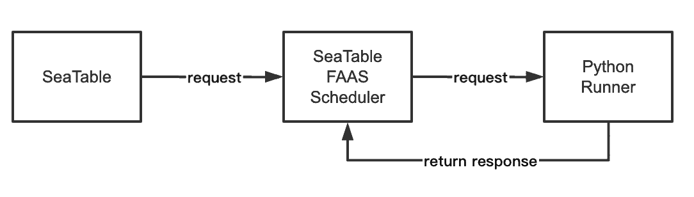

La versión 1.0 de SeaTable vio la luz el 1 de julio de 2020. Desde entonces se ha descargado más de 100.000 veces desde Docker Hub. Este abrumador interés en SeaTable nos ha impulsado y por eso ahora estamos felices y orgullosos de anunciar otro hito en el desarrollo de SeaTable: SeaTable 2.0 se ha subido hoy a [SeaTable Cloud](https://cloud.seatable.io) y se ha publicado en [Docker](https://hub.docker.com/u/seatable) Hub para instalaciones privadas.

Visualmente, SeaTable 2.0 apenas difiere de su predecesor. En términos de funcionalidad, experiencia de usuario, estabilidad y opciones de integración, SeaTable ha dado un gran salto desde julio del año pasado. ¿Ya le pareció interesante la versión 1.x? Entonces, la versión 2.0 le inspirará.

SeaTable 2.0 contiene un enorme número de mejoras e innovaciones - la documentación completa de todos los cambios se puede encontrar en el [Changelog de SeaTable](). Los aspectos más destacados de la versión 2.0 son tres nuevos tipos de columnas, varias opciones de personalización recién desarrolladas para los tipos de columnas existentes, dos plugins completamente nuevos, así como muchas mejoras de detalle en los plugins existentes de SeaTable. Tampoco hemos escatimado en mejoras en la sala de máquinas de SeaTable: SeaTable 2.0 cuenta ahora con un nuevo entorno de ejecución para los scripts de Python y los administradores de sistemas apreciarán las capacidades de supervisión que ofrece la nueva página general de enlaces externos.

Y eso no es todo. Gracias a una gran contribución de la comunidad, ahora podemos ofrecer el ruso como quinta lengua de usuario junto al inglés, el alemán, el francés y el chino.

## Tipo de columna #22: Fórmula para enlaces

La capacidad de establecer relaciones entre las entradas de diferentes tablas es uno de los principales factores de diferenciación de SeaTable con respecto a las hojas de cálculo clásicas, como Excel y Google Sheets. Mientras que estos últimos sólo conocen las referencias de celdas (por ejemplo, para las fórmulas), en SeaTable 1:1, se pueden crear enlaces 1:n y n:m entre las tablas de una base.

Con la nueva columna de fórmulas para los enlaces, se pueden evaluar los enlaces existentes y realizar cálculos. Se admiten cinco consultas diferentes: lookup, countlinks, rollup, findmax y findmin. Cuando tiene sentido, las consultas también ofrecen opciones de filtro para realizar evaluaciones aún más detalladas (por ejemplo, calcular una media sobre las entradas vinculadas que no tengan más de 6 meses de antigüedad). Gracias al asistente gráfico, el uso de la columna de fórmulas de enlace y la creación de las consultas es fácilmente factible incluso para los usuarios con menos experiencia técnica.

## Más control sobre la vinculación de las entradas

En principio, SeaTable no restringe el tipo de relación entre tablas. Sin embargo, en algunos casos de uso tiene sentido imponer una relación 1:1 o 1:n. Un sistema de gestión de inventarios es un ejemplo sencillo: un proyector sólo puede estar en una sala o con un prestatario en un momento dado. Del mismo modo, una máquina de pruebas no puede estar disponible para varias pruebas al mismo tiempo.

Con SeaTable 2.0, las columnas de enlace ofrecen ahora la opción de configuración "Permitir enlace a múltiples filas". Activada por defecto, la desactivación del interruptor hace que una entrada de la tabla actual sólo pueda enlazar con una única entrada de la tabla enlazada. Para los dos ejemplos anteriores, esto significa: SeaTable garantiza que no haya que buscar el proyector con varias personas o en varias salas y evita que la máquina de pruebas no esté programada para dos pruebas simultáneas.

Además de la opción de configuración para limitar el _número de entradas_ vinculadas, una segunda opción de configuración nueva permite limitar el \_tipo de entradas que pueden vincul_arse. Activando el botón "Restringir enlaces a una vista" y seleccionando una vista, sólo se podrán enlazar las entradas de la tabla enlazada que formen parte de la vista seleccionada. Si una entrada se elimina de una vista mediante un filtro, no estará disponible para la vinculación. Cuando se trata de evitar la vinculación entre determinadas entradas, esta nueva opción es crucial. Tomando de nuevo el ejemplo de la máquina de pruebas, si ésta se somete a un mantenimiento anual, el indicador correspondiente de la tabla hará que desaparezca de la vista de equipos de pruebas disponibles. En consecuencia, no podrá vincularse para su uso en la planificación de pruebas.

## Tipo de columna #23: Clasificación

Los formularios web de SeaTable son increíblemente prácticos para realizar encuestas sencillas. En unos instantes, se crea un cuestionario y está listo para ser enviado. Las respuestas de los participantes en la encuesta van a parar a la base subyacente y pueden analizarse rápida y fácilmente con las distintas herramientas de análisis de SeaTable.

La nueva columna de valoración es un complemento ideal para este tipo de encuestas: "¿Ha quedado satisfecho con nuestra actuación?" o "¿Nos recomendaría a sus amigos?". Cinco estrellas no dejan lugar a dudas; dos estrellas, en cambio, ofrecen mucho margen de mejora. Sin embargo, el nuevo tipo de columna no sólo es adecuado para las encuestas de satisfacción del cliente. ¿Quiere votar en su equipo el nombre de un nuevo producto? ¿Nuevos clientes potenciales requieren una evaluación rápida para establecer prioridades? La columna de valoración ayuda en todos estos casos.

La escala de valoración puede ir de 1 a 10 estrellas. Si no te gusta el color naranja estándar, seguro que encuentras uno que te guste más entre los otros nueve colores. También es posible ajustar la escala de valoración a posteriori. Si la escala se amplía, las valoraciones existentes no se modifican; si se acorta, las valoraciones se reducen a la nueva longitud máxima.

## Formularios web más flexibles: Logotipo propio, soporte para columnas de enlace y campos pre-rellenados

La columna de calificaciones es sólo una de las varias innovaciones que hacen que los formularios web de SeaTable sean aún mejores. La incorporación de su propio logotipo es la novedad más llamativa del editor de formularios. Un logotipo o unas letras insertadas en la esquina superior izquierda crean una forma individualizada con efecto de reconocimiento.

Menos llamativa, pero más importante en la aplicación, es la función añadida en SeaTable 2.0 para utilizar columnas de enlace en los formularios. Este tipo de columna ofrece mucha más flexibilidad que las columnas de selección simple y, por tanto, permite realizar encuestas más detalladas.

Completamente invisible en el editor, pero tanto más potente en la aplicación, es la función de valor por defecto para los campos de formulario. Para rellenar previamente un campo de formulario con un valor por defecto, añada '?prefill_COLUMNNAME=PREFILLVALUE' a la URL del formulario. (COLUMNAME es el nombre de la columna cuyo campo debe rellenarse previamente; PREFILLVALUE es el valor que debe insertarse. Los espacios en los nombres de columna deben escribirse como "%20" y distinguen entre mayúsculas y minúsculas). Por supuesto, también se pueden proporcionar valores predeterminados a varios campos del formulario. Para ello, se conectan varios pares COLUMNNAME-PREFILLVALUE con el signo ampersand ("&").

## Tipo de columna #24: Geoposición

El plugin de mapas hace que la visualización de una distribución geográfica sea cuestión de segundos. El plugin interpreta las direcciones y otras descripciones de posición y las traza en un mapa de Google. Sin embargo, en algunos casos, las descripciones de los puestos no son lo suficientemente precisas. Y lo que es peor, las descripciones de los puestos pueden resultar variables con el tiempo. Todas estas consideraciones nos han llevado a convertir la columna de geoposición en el 24º tipo de columna de SeaTable.

La columna de geoposición almacena las coordenadas de longitud y latitud como valores separados por comas. Los biólogos y arqueólogos que necesitan documentar con precisión los yacimientos, o los fotógrafos que quieren geocodificar sus instantáneas, pueden hacerlo fácilmente con el nuevo tipo de columna: La columna de geoposición almacena la posición con la máxima precisión, para que no queden preguntas sin responder en futuros análisis, posiblemente también con otras herramientas de geoanálisis.

## Valores opcionales por defecto para las columnas

Hay columnas en las que siempre hay que introducir prácticamente el mismo valor cuando se crea una nueva entrada, por ejemplo, una columna de estado en la gestión de proyectos o una columna de texto con una cadena inicial uniforme. ¿No se ahorraría mucho tiempo si estos valores pudieran establecerse automáticamente para las nuevas entradas?

Porque este es exactamente el caso, SeaTable a partir de la versión 2.0 permite la definición de un valor por defecto para los tres tipos de columna texto, número y selección simple. Si se define este valor por defecto, la celda correspondiente de una nueva entrada se rellena automáticamente con el valor por defecto. Si la nueva entrada es la excepción a la regla y el valor establecido automáticamente no se ajusta, entonces se puede sobrescribir manualmente en cualquier momento.

## Nuevo plugin: Diseño de páginas

El plugin de diseño de páginas puede utilizarse para crear documentos PDF de una o varias páginas que obtengan datos de forma dinámica de una tabla SeaTable. En SeaTable, generamos certificados de licencia con el plugin. Pero los casos de uso van mucho más allá: puede crear certificados para sus socios comerciales o carnés de socio para los miembros de su club de tenis. Si gestiona su cartera de productos en SeaTable, puede generar atractivas fichas técnicas para todos sus productos con sólo unos clics. En el área de personal, los anuncios de empleo basados en PDF pueden crearse fácil y rápidamente sin necesidad de repetir el esfuerzo adicional.

Cada documento se basa en una plantilla. El diseño de una plantilla se realiza en el propio SeaTable. El editor WYSIWYG forma parte del plug-in, no es necesario un editor externo. El editor proporciona una selección de elementos estáticos como textos, tablas e imágenes y ofrece diversas operaciones de edición. Por ejemplo, una imagen puede girarse, recortarse o alinearse directamente en la plantilla. Si su plantilla no resulta atractiva, no es culpa del editor ;-) El editor guarda todas las plantillas en formato JSON; una función de importación y exportación garantiza la portabilidad de las plantillas.

## Nuevo plugin: Kanban

Un tablero Kanban es una gran herramienta para visualizar, controlar y supervisar numerosas funciones y tareas operativas (por ejemplo, el pipeline de ventas). De hecho, el principio Kanban ha demostrado tener tanto éxito en la práctica que en los últimos años han aparecido diversos programas que aplican distintas variedades de tableros Kanban.

Con la nueva versión, SeaTable también tiene un plugin Kanban que se puede utilizar para mostrar datos en tablas en un tablero Kanban. Las categorías de un tablero Kanban son las opciones en una columna de selección única o los usuarios en una columna de empleados. Esto permite que la vista Kanban se utilice para casos de uso tan diversos como la gestión de recursos humanos, producción, ventas, desarrollo de software y gestión de proyectos. Se pueden crear nuevas categorías y nuevas entradas directamente en la vista Kanban sin tener que salir del plugin. A los usuarios intensivos les gustará el soporte de arrastrar y soltar.

## Plugins mejorados: Calendario, Cronología, Galería y Mapas

Aunque hemos dedicado mucho esfuerzo y trabajo a los nuevos plugins, no hemos perdido de vista los demás. Los cuatro principales plugins reciben mejoras en SeaTable 2.0.

El plugin de calendario ofrece ahora una vista de semana y de día, además de la vista de mes y de año. En la vista del día, la semana y el mes, los eventos se pueden mover con el ratón y se pueden crear nuevos eventos haciendo clic y tirando. La tercera vista nueva, la vista de la Agenda, enumera todos los próximos eventos en un período de una semana en orden cronológico. Es ideal para imprimir el calendario en un formato cómodo. Para redondear las cosas y hacerlas coherentes con otros plugins, también hemos añadido una opción de color. El color de un evento puede ahora establecerse a través de un campo de selección de un tema.

El nuevo plugin Timeline también ofrece esta opción de color. Además, también se puede mostrar una etiqueta en el diagrama de Gantt. De este modo, el plugin mejorado ofrece aún más claridad en la planificación del proyecto.

Hemos mejorado la galería para los dispositivos móviles, de modo que se pueda visualizar bien en las pantallas más pequeñas. Además, hemos cambiado la interfaz web en algunos puntos para mejorar la experiencia del usuario y la presentación de los datos.

Para seguir el desarrollo en el campo de los tipos de columnas, el plugin de mapas de SeaTable 2.0 también puede manejar la nueva columna de geoposición.

## Instantáneas manuales

Las[instantáneas]() son una muestra de una base. Demuestran su valor cuando hay que restablecer una base a un estado anterior después de grandes cambios.

En el pasado, SeaTable sólo conocía las instantáneas automáticas. El servidor de SeaTable creaba diariamente una instantánea de este tipo si se realizaban cambios en la base en las últimas 24 horas. En la versión 2.0 SeaTable ha aprendido y ahora también conoce las instantáneas manuales: Un clic y se hace una imagen de la base. Como seguro contra la pérdida involuntaria de datos, se recomienda encarecidamente hacer este clic siempre que se trabaje en la estructura de una base (especialmente cuando se borran columnas y tablas).

## Carpeta para las bases

Durante el uso diario de SeaTable, se acumula una u otra base. En SeaTable 2.0 introducimos carpetas en las que se pueden agrupar y organizar las bases. Devuelven la estructura y la claridad cuando el crecimiento constante de las bases bloquea la visión de lo esencial. Se pueden crear nuevas bases en una carpeta o se pueden mover las bases existentes a una carpeta arrastrando y soltando.

## Protección contra la fuga de datos no deseada

Si una base contiene datos confidenciales, la protección contra la filtración errónea o maliciosa de datos es de suma importancia. La normativa de protección de datos también exige medidas técnicas adecuadas para proteger los datos personales. La prevención de la fuga de datos es una parte esencial de estas medidas.

Para responder a estas elevadas exigencias, la versión 2.0 de SeaTable ofrece una configuración de permisos adicional para evitar la fuga de datos. En esta nueva configuración de seguridad, el propietario de una base puede decidir si otros usuarios pueden imprimir, duplicar y/o exportar la base. Estas restricciones de permisos pueden aplicarse a todos los usuarios o sólo a los que tienen permiso para compartir. En el caso de una Base propiedad de un grupo, el propietario del grupo y los administradores del grupo pueden cambiar estos ajustes.

## Entorno de ejecución de scripts en Python

Parte del atractivo de SeaTable para los desarrolladores es su compatibilidad con scripts de Python y JavaScript (JS). (Los productos de nuestros competidores sólo admiten scripts JS.) Mientras que los scripts JS se ejecutan en el navegador, los scripts Python se ejecutan en el lado del servidor. Combinados con la posibilidad de automatizar su ejecución, los scripts de Python son especialmente adecuados para los escenarios de procesamiento de datos más exigentes.

Sin embargo, esta flexibilidad también tiene su precio: la ejecución de los scripts Python en el servidor conlleva riesgos de seguridad. Para garantizarla de forma óptima, hemos aislado en gran medida el entorno de ejecución de los scripts Python del sistema principal con dos componentes adicionales. El equipo formado por SeaTable FAAS Scheduler y Python Runner no sólo garantiza la seguridad, sino también una escalabilidad óptima. Cuando se llama a un script, se inicia un contenedor Docker y se ejecuta el script. El resultado del script se devuelve a SeaTable y el contenedor Docker se destruye. Mediante el uso de múltiples Python runners, también se pueden ejecutar numerosos scripts simultáneamente sin esperas. (Puede encontrar más información en el [Manual de administración de Sea](https://manual.seatable.io/docker/Python-Runner/Deploy%20SeaTable%20Python%20Runner/)Table).

## Resumen de enlaces externos

Un enlace externo se crea rápidamente para compartir información con socios externos. La opción "Expiración automática" también puede utilizarse para limitar la vida útil de un enlace. En la realidad, sin embargo, esto no siempre ocurre, por lo que los enlaces externos pueden persistir incluso después de haber finalizado su uso.

Para que el administrador del equipo pueda hacerse una idea de los enlaces externos existentes, SeaTable ofrece ahora una página de resumen de los enlaces externos en la administración del equipo. Los enlaces externos existentes para las bases y las vistas aparecen en dos pestañas. La pantalla tabular ofrece información sobre el creador y la fecha de creación, así como el número de llamadas. Sin embargo, el administrador del equipo no sólo tiene derechos de lectura. Si hay que desactivar un enlace, también puede hacerlo.
