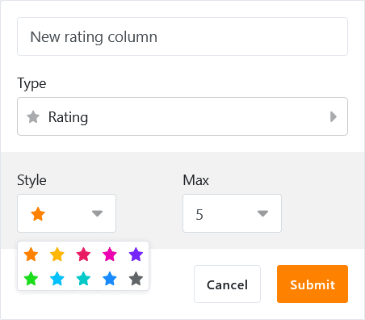
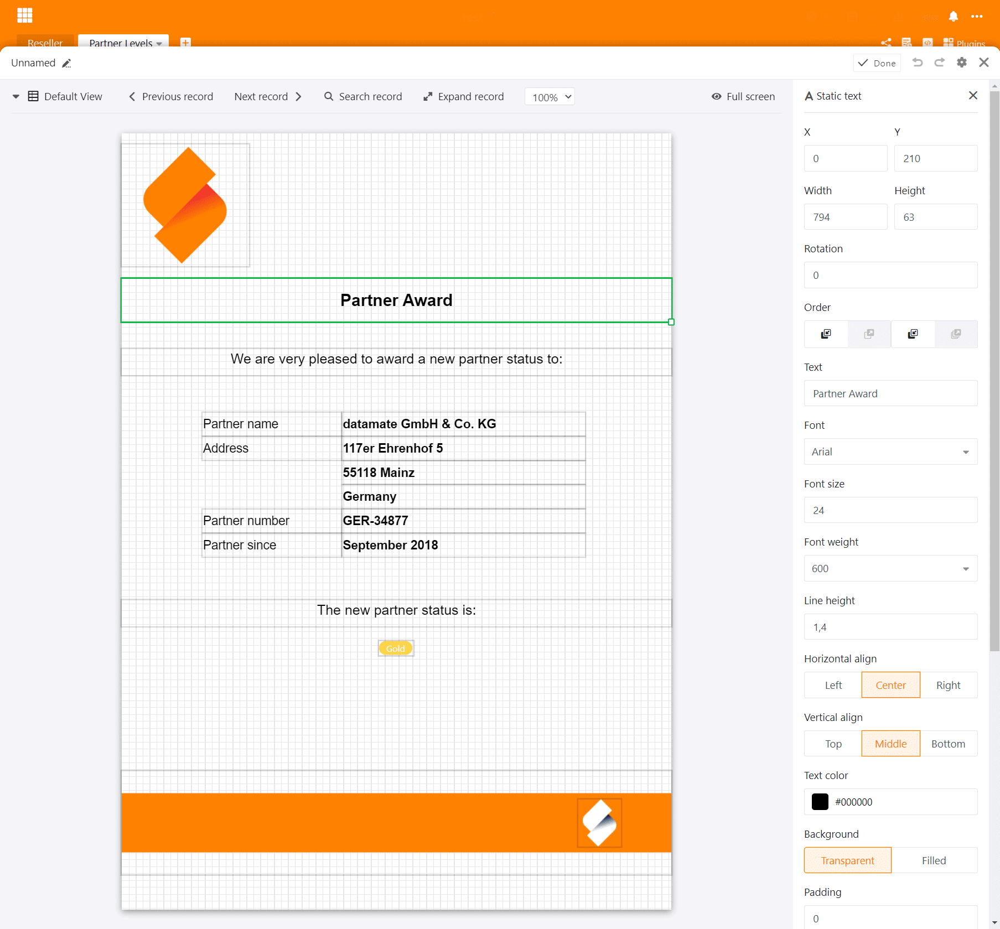

Le 1er juillet 2020, SeaTable a vu le jour dans sa version 1.0. Depuis, il a été téléchargé plus de 100 000 fois sur Docker Hub. Cet intérêt écrasant pour SeaTable nous a poussés à aller de l'avant et nous sommes maintenant heureux et fiers d'annoncer une nouvelle étape dans le développement de SeaTable : SeaTable 2.0 a été mis à jour aujourd'hui sur [SeaTable Cloud](https://cloud.seatable.io) et publié sur [Docker](https://hub.docker.com/u/seatable) Hub pour les installations privées.

Visuellement, SeaTable 2.0 ne diffère guère de son prédécesseur. En termes de fonctionnalité, d'expérience utilisateur, de stabilité et d'options d'intégration, SeaTable a fait un énorme bond en avant depuis juillet de l'année dernière. Vous avez déjà trouvé la version 1.x intéressante ? Alors la version 2.0 vous inspirera !

SeaTable 2.0 contient un nombre énorme d'améliorations et d'innovations - la documentation complète de tous les changements peut être trouvée dans le [SeaTable Changelog](https://seatable.io/fr/docs/changelog/version-2-0/). Les points forts de la version 2.0 sont trois nouveaux types de colonnes, plusieurs options de personnalisation nouvellement développées pour les types de colonnes existants, deux plugins entièrement nouveaux ainsi que de nombreuses améliorations de détail aux plugins existants de SeaTable. Nous n'avons pas lésiné non plus sur les améliorations de la salle des machines de SeaTable : SeaTable 2.0 dispose désormais d'un nouvel environnement d'exécution pour les scripts Python et les administrateurs système apprécieront les capacités de surveillance offertes par la nouvelle page de présentation des liens externes.

Et ce n'est pas tout ! Grâce à une grande contribution de la communauté, nous pouvons désormais proposer le russe comme cinquième langue utilisateur aux côtés de l'anglais, de l'allemand, du français et du chinois.

## Type de colonne #22 : Formule pour les liens

La capacité de représenter des relations entre des entrées dans différents tableaux est l'un des critères de différenciation centraux de SeaTable par rapport aux tableurs classiques comme Excel et Google Sheets. Alors que ces derniers ne connaissent que des références de cellules (par ex. pour les formules), SeaTable permet de créer des liens 1:1, 1:n et n:m entre les tableaux d'une base.

Grâce à la nouvelle colonne de formules pour les liens, les liens existants peuvent être évalués et des calculs effectués. Cinq requêtes différentes sont prises en charge : lookup, countlinks, rollup, findmax et findmin. Lorsque cela s'avère utile, les requêtes offrent également des options de filtrage pour des évaluations encore plus détaillées (par exemple, le calcul d'une moyenne sur les entrées liées qui ne datent pas de plus de 6 mois). Grâce à l'assistant graphique, l'utilisation de la colonne des formules de liaison et la création des requêtes sont facilement réalisables, même pour les utilisateurs moins expérimentés.

## Plus de contrôle sur la liaison des entrées

SeaTable ne restreint pas en principe le type de relation entre les tables. Toutefois, dans certains cas d'utilisation, il est utile d'appliquer une relation 1:1 ou 1:n. Un système de gestion des stocks en est un exemple simple : un projecteur ne peut se trouver que dans une seule pièce ou chez un seul emprunteur à un moment donné. De même, une machine d'essai ne peut pas être disponible pour plusieurs essais en même temps.

Avec SeaTable 2.0, les colonnes de liens offrent désormais une option de configuration "Autoriser le lien vers plusieurs lignes". Activée par défaut, la désactivation de ce bouton a pour effet qu'une entrée du tableau actuel ne peut être liée qu'à une seule entrée du tableau lié. Pour les deux exemples ci-dessus, cela signifie que SeaTable garantit qu'il n'est pas nécessaire de chercher le vidéoprojecteur lorsqu'il y a plusieurs personnes ou plusieurs salles et il évite que la machine de test ne soit pas planifiée pour deux tests simultanés.

En plus de l'option de configuration pour limiter le _nombre d'entrées liées_, une deuxième nouvelle option de configuration permet de limiter le _type d'entrées qui peuvent être liées_. En activant le bouton "Limiter les liens à une vue" et en sélectionnant une vue, seules les entrées du tableau lié qui font partie de la vue sélectionnée peuvent être liées. Si une entrée est supprimée d'une vue par un filtre, elle n'est pas disponible pour le lien. Lorsqu'il s'agit d'empêcher le lien entre certaines entrées, cette nouvelle option est d'une importance capitale. Prenons à nouveau l'exemple de la machine de test : si la machine de test effectue sa maintenance annuelle, un indicateur correspondant dans le tableau fait en sorte qu'elle ne figure plus dans la vue des machines de test disponibles. Par conséquent, elle ne peut pas être liée à des interventions de test dans la planification des tests.

## Type de colonne n° 23 : Classement

Les formulaires Web de SeaTables sont incroyablement pratiques pour des enquêtes simples. En quelques instants, un questionnaire est créé et prêt à être envoyé. Les réponses des participants à l'enquête atterrissent dans la base sous-jacente, où elles peuvent être évaluées rapidement et facilement grâce aux divers outils d'analyse de SeaTable.

La nouvelle colonne de notation est un complément idéal pour de tels sondages : "Avez-vous été satisfait de notre prestation ?" ou "Nous recommanderiez-vous à vos amis ?" Cinq étoiles ne laissent aucune place au doute ; deux étoiles, en revanche, offrent une grande marge d'amélioration. Mais le nouveau type de colonne ne convient pas seulement aux enquêtes de satisfaction des clients. Vous voulez faire voter votre équipe sur un nouveau nom de produit ? De nouveaux leads demandent une évaluation rapide pour la priorisation ? La colonne de notation vous aide dans tous ces cas !

L'échelle de notation peut aller de 1 à 10 étoiles. Si vous n'aimez pas la couleur orange standard, vous êtes sûr de trouver une couleur qui vous plaise davantage parmi les neuf autres couleurs. Il est également possible d'ajuster l'échelle de notation a posteriori. Si l'échelle est étendue, les évaluations existantes restent inchangées ; si elle est raccourcie, les évaluations sont raccourcies à la nouvelle longueur maximale.

## Des formulaires web plus flexibles : Logo propre, prise en charge des colonnes de liens et des champs préremplis

La colonne d'évaluation n'est qu'une des nombreuses innovations qui rendent les formulaires web de SeaTable encore meilleurs. L'intégration de votre propre logo est la nouvelle fonctionnalité la plus frappante de l'éditeur de formulaires. Un logo ou un lettrage inséré dans le coin supérieur gauche crée une forme individualisée avec un effet de reconnaissance.

Moins visible, mais d'autant plus importante dans l'application, est la fonction ajoutée dans SeaTable 2.0 pour utiliser des colonnes de liens dans les formulaires. Ce type de colonne offre beaucoup plus de flexibilité que les colonnes à sélection unique et permet donc des enquêtes encore plus détaillées.

La fonction de valeur par défaut pour les champs de formulaire est totalement invisible dans l'éditeur, mais d'autant plus puissante dans l'application. Pour pré-remplir un champ de formulaire avec une valeur standard, ajoutez '?prefill_COLUMNNAME=PREFILLVALUE' à l'URL du formulaire. (COLUMNAME est le nom de la colonne dont le champ doit être rempli ; PREFILLVALUE est la valeur à insérer. Les espaces dans les noms de colonnes doivent être écrits sous la forme "%20" et les majuscules et minuscules doivent être respectées). Il est bien entendu possible d'attribuer des valeurs par défaut à plusieurs champs de formulaire. Pour ce faire, plusieurs paires COLUMNNAME-PREFILLVALUE sont reliées par le signe commercial et ("&").

## Type de colonne #24 : Géopositionnement

Le plugin de carte permet d'afficher une répartition géographique en quelques secondes. Le plugin interprète les adresses et autres descriptions de position et les trace sur une carte Google Map. Dans certains cas, cependant, les descriptions de poste ne sont tout simplement pas assez précises. Pire encore, les descriptions de poste peuvent s'avérer variables dans le temps. Toutes ces considérations nous ont amenés à faire de la colonne de géo-position le 24ème type de colonne de SeaTable.

La colonne de géopositionnement enregistre les coordonnées de longitude et de latitude sous forme de valeurs séparées par des virgules. Les biologistes et les archéologues qui doivent documenter des sites avec précision, ou les photographes qui veulent géocoder leurs clichés, peuvent le faire facilement grâce à ce nouveau type de colonne : La colonne de géo-position stocke la position avec une précision maximale, de sorte qu'aucune question ne reste sans réponse dans les analyses futures, éventuellement avec d'autres outils de géo-analyse.

## Valeurs par défaut facultatives pour les colonnes

Il existe ces colonnes dans lesquelles la même valeur doit quasiment toujours être saisie lorsqu'une nouvelle entrée est créée, par exemple une colonne de statut dans la gestion de projet ou une colonne de texte avec une chaîne de caractères de tête uniforme. Ne serait-ce pas un gain de temps considérable si ces valeurs pouvaient être définies automatiquement lors de nouvelles entrées ?

Parce que c'est exactement le cas, SeaTable à partir de la version 2.0 permet de définir une valeur par défaut pour les trois types de colonnes : texte, nombre et sélection unique. Si une telle valeur par défaut est définie, la cellule correspondante d'une nouvelle entrée est automatiquement remplie avec la valeur par défaut. Si la nouvelle entrée est l'exception à la règle et que la valeur fixée automatiquement ne convient pas, elle peut être remplacée manuellement à tout moment.

## Nouveau plugin : Page Design

Le plugin de mise en page peut être utilisé pour créer des documents PDF d'une ou plusieurs pages qui récupèrent dynamiquement les données d'une table SeaTable. Chez SeaTable, nous générons des certificats de licence avec le plugin. Mais les cas d'utilisation vont bien au-delà : vous pouvez créer des certificats pour vos partenaires commerciaux ou des cartes de membre pour les membres de votre club de tennis. Si vous gérez votre portefeuille de produits dans SeaTable, vous pouvez générer des fiches produit attrayantes pour tous vos produits en quelques clics. Dans le domaine du personnel, les offres d'emploi au format PDF peuvent être créées facilement et rapidement sans effort supplémentaire répété.

Chaque document est basé sur un modèle. La conception d'un modèle est faite dans SeaTable lui-même. L'éditeur WYSIWYG fait partie du plug-in, un éditeur externe n'est pas nécessaire. L'éditeur offre une sélection d'éléments statiques tels que des textes, des tableaux et des images et propose diverses opérations d'édition. Par exemple, une image peut être tournée, recadrée ou alignée directement dans le modèle. Si votre modèle n'est pas attrayant, ce n'est pas la faute de l'éditeur ;-) L'éditeur enregistre tous les modèles dans un format JSON ; une fonction d'importation et d'exportation garantit la portabilité des modèles.

## Nouveau plugin : Kanban

Un tableau Kanban est un excellent outil pour visualiser, contrôler et suivre de nombreuses fonctions et tâches opérationnelles (par exemple, le pipeline des ventes). En fait, le principe Kanban s'est avéré si efficace dans la pratique qu'une série de programmes ont vu le jour ces dernières années, mettant en œuvre différentes variétés de tableaux Kanban.

Avec la nouvelle version, SeaTable dispose également d'un plug-in Kanban qui permet d'afficher les données dans des tableaux sur un tableau Kanban. Les catégories d'un tableau Kanban sont soit les options d'une colonne de sélection simple, soit les utilisateurs dans une colonne d'employés. Cela permet d'utiliser la vue Kanban pour des applications aussi diverses que la gestion des RH, la production, la vente, le développement de logiciels et la gestion de projets. De nouvelles catégories et de nouvelles entrées peuvent être créées directement dans la vue Kanban, sans devoir quitter le plugin. Les utilisateurs intensifs apprécieront le support du glisser-déposer.

## Plugins améliorés : Calendrier, Timeline, Galerie et Cartes

Si nous avons consacré beaucoup d'efforts et de travail aux nouveaux plugins, nous n'avons pas perdu de vue les autres plugins. Les quatre principaux plugins ont été améliorés dans SeaTable 2.0.

Le plugin Calendrier offre maintenant une vue de la semaine et du jour en plus de la vue du mois et de l'année. Dans les vues jour, semaine et mois, les événements peuvent être déplacés à l'aide de la souris et de nouveaux événements peuvent être créés en cliquant et tirant. La troisième nouvelle vue, l'agenda, répertorie tous les événements à venir sur une période d'une semaine dans l'ordre chronologique. Il est idéal pour imprimer le calendrier dans un format pratique. Pour compléter le tout et le rendre cohérent avec les autres plugins, nous avons également ajouté une option de couleur. La couleur d'un événement peut désormais être définie via un champ de sélection à sujet unique.

Le nouveau plugin Timeline offre également une telle option de couleur. En outre, une étiquette peut également être affichée dans le diagramme de Gantt. Ainsi, le plugin amélioré offre encore plus de clarté dans la planification des projets.

Nous avons amélioré la galerie pour les appareils mobiles afin qu'elle s'affiche bien sur les petits écrans. En outre, nous avons modifié l'interface web à quelques endroits pour améliorer l'expérience utilisateur et la présentation des données.

Pour suivre l'évolution dans le domaine des types de colonnes, le plugin cartographique de SeaTable 2.0 peut également gérer la nouvelle colonne de géopositionnement.

## Instantanés manuels

[Les snapshots](https://seatable.io/fr/docs/handbuch/seatable-nutzen/versionierung-snapshots/) sont un instantané d'une base. Ils prouvent leur valeur lorsqu'une base doit être restaurée à un état antérieur après des modifications importantes.

Dans le passé, SeaTable ne connaissait que les instantanés automatiques. Un tel instantané était créé quotidiennement par le serveur SeaTable si des modifications étaient apportées à la base dans les dernières 24 heures. Dans la version 2.0 SeaTable a appris et connaît maintenant aussi les instantanés manuels : Un clic et une image de la base est réalisée. En tant qu'assurance contre la perte involontaire de données, ce clic est fortement recommandé lorsque l'on travaille sur la structure d'une base (notamment lors de la suppression de colonnes et de tables).

## Dossier pour les bases

Lors de l'utilisation quotidienne de SeaTable, l'une ou l'autre base s'accumule. Dans SeaTable 2.0, nous introduisons des dossiers dans lesquels les bases peuvent être regroupées et organisées. Ils ramènent la structure et la clarté lorsque la croissance constante des bases bloque la vue sur l'essentiel. De nouvelles bases peuvent être créées dans un dossier ou des bases existantes peuvent être déplacées vers un dossier par glisser-déposer.

## Protection contre les fuites de données non souhaitées

Si une base contient des données confidentielles, la protection contre les fuites de données par erreur ou par malveillance est de la plus haute importance. Les dispositions légales en matière de protection des données exigent également des mesures techniques appropriées pour protéger les données personnelles. La prévention des fuites de données est un élément essentiel de ces mesures.

Pour répondre à ces exigences élevées, la version 2.0 de SeaTable offre des paramètres d'autorisation supplémentaires pour éviter les fuites de données. Dans ces nouveaux paramètres de sécurité, le propriétaire d'une base peut décider si d'autres utilisateurs sont autorisés à imprimer, dupliquer et/ou exporter la base. Ces restrictions d'autorisation peuvent être appliquées à tous les utilisateurs ou seulement à ceux qui ont une autorisation de partage. Dans le cas d'une base appartenant à un groupe, le propriétaire du groupe et les administrateurs du groupe peuvent modifier ces paramètres.

## Environnement d'exécution des scripts Python

L'attrait de SeaTable pour les développeurs réside en partie dans sa prise en charge des scripts Python et JavaScript (JS). (Les produits de nos concurrents ne prennent en charge que les scripts JS.) Alors que les scripts JS s'exécutent dans le navigateur, les scripts Python s'exécutent côté serveur. Associés à la possibilité d'automatiser leur exécution, les scripts Python sont particulièrement adaptés aux scénarios de traitement des données les plus exigeants.

Mais cette flexibilité a aussi un prix : l'exécution des scripts Python sur le serveur comporte des risques de sécurité. Afin de les sécuriser au mieux, nous avons largement isolé l'environnement d'exécution des scripts Python du système principal grâce à deux composants supplémentaires. L'équipe composée du SeaTable FAAS Scheduler et du Python Runner n'assure toutefois pas seulement la sécurité, mais aussi une évolutivité optimale. Lorsqu'un script est appelé, un conteneur Docker est lancé et le script est exécuté. Le résultat du script est renvoyé à SeaTable et le conteneur Docker est détruit. L'utilisation de plusieurs Python Runners permet également d'exécuter de nombreux scripts simultanément sans temps d'attente. (Pour plus d'informations, consultez le [manuel d'administration de SeaTable](https://manual.seatable.io/docker/Python-Runner/Deploy%20SeaTable%20Python%20Runner/)).

## Aperçu des liens externes

Un lien externe est rapidement créé pour partager des informations avec des partenaires externes. L'option "Expiration automatique" permet également de limiter la durée de vie d'un lien dans le temps. Dans la réalité, cela n'est pas toujours le cas et les liens externes peuvent donc continuer à exister même après la fin de leur utilisation.

Afin que l'administrateur de l'équipe puisse avoir une idée des liens externes existants, SeaTable offre maintenant une page d'aperçu des liens externes dans l'administration de l'équipe. Les liens externes existants pour les bases et les vues sont répertoriés dans deux onglets. L'affichage tabulaire offre des informations sur le créateur et la date de création ainsi que sur le nombre d'appels. Cependant, l'administrateur de l'équipe n'a pas seulement des droits de lecture. Si un lien doit être désactivé, il peut également le faire.
