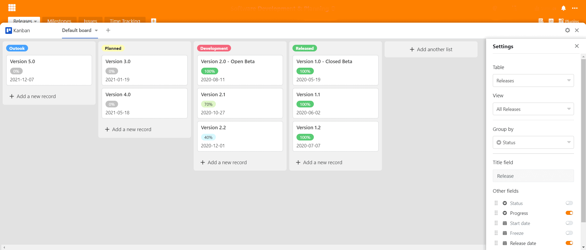
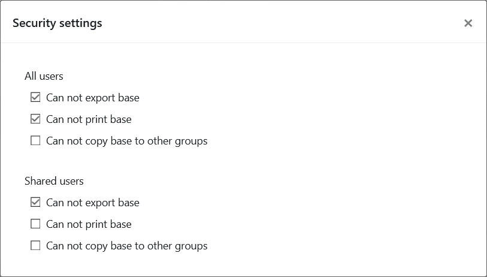

A versão 1.0 do SeaTable viu a luz do dia a 1 de Julho de 2020. Desde então, foi descarregado mais de 100.000 vezes a partir de Docker Hub. Este interesse esmagador no SeaTable levou-nos e por isso estamos agora felizes e orgulhosos de anunciar outro marco no desenvolvimento do SeaTable: O SeaTable 2.0 foi hoje carregado no [SeaTable Cloud](https://cloud.seatable.io) e lançado em [Docker](https://hub.docker.com/u/seatable) Hub para instalações privadas.

Visualmente, SeaTable 2.0 dificilmente difere da sua predecessora. Em termos de funcionalidade, experiência do utilizador, estabilidade e opções de integração, o SeaTable deu um enorme salto desde Julho do ano passado. Já achou a versão 1.x interessante? Então a versão 2.0 irá inspirá-lo!

SeaTable 2.0 contém um enorme número de melhorias e inovações - a documentação completa de todas as alterações pode ser encontrada no [SeaTable Changelog](https://seatable.io/pt/docs/changelog/version-2-0/). Os destaques da versão 2.0 são três novos tipos de colunas, várias opções de personalização recentemente desenvolvidas para tipos de colunas existentes, dois plugins completamente novos, bem como muitas melhorias de detalhe nos plugins existentes do SeaTable. Também ainda não fizemos melhorias na casa das máquinas do SeaTable: o SeaTable 2.0 tem agora um novo ambiente de execução de scripts Python e os administradores do sistema apreciarão as capacidades de monitorização oferecidas pela nova página de síntese de links externos.

E isso não é tudo! Graças a uma grande contribuição da comunidade, podemos agora oferecer o russo como quinta língua de utilizador ao lado do inglês, alemão, francês e chinês.

## Tipo de coluna #22: Fórmula para links

A capacidade de mapear relações entre as entradas em diferentes tabelas é um dos principais diferenciadores do SeaTable em relação às folhas de cálculo clássicas, tais como Excel e Google Sheets. Enquanto estes últimos só conhecem referências de células (por exemplo, para fórmulas), no SeaTable 1:1, 1:n e n:m podem ser criadas ligações entre tabelas numa base.

Com a nova coluna de fórmula para ligações, as ligações existentes podem ser avaliadas e os cálculos podem ser efectuados. São suportadas cinco consultas diferentes: lookup, countlinks, rollup, findmax e findmin. Onde faz sentido, as consultas também oferecem opções de filtragem para avaliações ainda mais detalhadas (por exemplo, calcular uma média sobre entradas ligadas que não tenham mais de 6 meses). Graças ao assistente gráfico, a utilização da coluna da fórmula de ligação e a criação das consultas é facilmente viável mesmo para utilizadores com menos experiência técnica.

## Mais controlo sobre a ligação das entradas

SeaTable não restringe, em princípio, o tipo de relação entre tabelas. Contudo, em alguns casos de utilização faz sentido impor uma relação 1:1 ou 1:n. Um sistema de gestão de inventário é um exemplo simples: um beamer só pode estar numa sala ou com um mutuário em qualquer altura. Da mesma forma, uma máquina de testes não pode estar disponível para múltiplos testes ao mesmo tempo.

Com o SeaTable 2.0, as colunas de ligação oferecem agora a opção de configuração "Permitir ligação a várias linhas". Activada por predefinição, a desativação da opção faz com que uma entrada na tabela atual só possa ser ligada a uma única entrada na tabela ligada. Para os dois exemplos acima, isto significa: O SeaTable garante que não é necessário procurar o projetor com várias pessoas ou em várias salas e impede que a máquina de teste não seja programada para dois testes simultâneos.

Para além da opção de configuração para limitar o _número de entradas ligadas_, uma segunda nova opção de configuração permite limitar o _tipo de entradas que podem ser ligadas_. Ao ativar o botão "Restringir ligações a uma vista" e ao selecionar uma vista, só podem ser ligadas as entradas da tabela ligada que façam parte da vista selecionada. Se uma entrada for removida de uma vista por um filtro, não estará disponível para ligação. Quando se trata de impedir a ligação entre determinadas entradas, esta nova opção é crucial. Tomando de novo o exemplo da máquina de ensaio, se esta estiver a ser submetida a uma manutenção anual, um sinalizador correspondente na tabela assegurará que a máquina sai da vista dos equipamentos de ensaio disponíveis. Consequentemente, não pode ser ligada para utilização no planeamento de ensaios.

## Tipo de coluna #23: Classificação

Os formulários web do SeaTable são incrivelmente práticos para pesquisas simples. Em apenas alguns momentos, um questionário é criado e está pronto a ser enviado. As respostas dos participantes no inquérito acabam na base subjacente e podem ser analisadas rápida e facilmente com as várias ferramentas de análise do SeaTable.

A nova coluna de classificação é um complemento ideal para estes inquéritos: "Ficou satisfeito com o nosso desempenho?" ou "Recomendar-nos-ia aos seus amigos?" Cinco estrelas não deixam margem para dúvidas; duas estrelas, por outro lado, oferecem muito espaço para melhorias. No entanto, o novo tipo de coluna não é apenas adequado para inquéritos de satisfação do cliente. Quer votar na sua equipa sobre o nome de um novo produto? Os novos contactos requerem uma avaliação rápida para definição de prioridades? A coluna de classificação ajuda em todos estes casos!

A escala de classificação pode variar de 1 a 10 estrelas. Se não gostar da cor laranja padrão, certamente encontrará uma que gosta mais entre as outras nove cores. Também é possível ajustar a escala de classificação retrospectivamente. Se a escala for expandida, as classificações existentes permanecem inalteradas; se for encurtada, as classificações são encurtadas para o novo comprimento máximo.

## Formulários web mais flexíveis: Logótipo próprio, suporte para colunas de ligação e campos pré-preenchidos

A coluna de classificações é apenas uma das várias inovações que tornam os formulários da SeaTable ainda melhores. Incorporar o seu próprio logótipo é a nova característica mais marcante no editor de formulários. Um logótipo ou lettering inserido no canto superior esquerdo cria uma forma individualizada com efeito de reconhecimento.

Menos visível, mas ainda mais importante na aplicação, é a função acrescentada no SeaTable 2.0 para utilizar colunas de ligação em formulários. Este tipo de coluna oferece significativamente mais flexibilidade do que colunas de selecção únicas, permitindo assim levantamentos ainda mais detalhados.

Completamente invisível no editor, mas ainda mais poderosa na aplicação, é a função de valor predefinido para campos de formulário. Para preencher previamente um campo de formulário com um valor por defeito, adicione '?prefill_COLUMNNAME=PREFILLVALUE' ao URL do formulário. (COLUMNAME é o nome da coluna cujo campo deve ser pré-preenchido; PREFILLVALUE é o valor a ser inserido. Os espaços nos nomes das colunas devem ser escritos como "%20" e são sensíveis às maiúsculas e minúsculas). Naturalmente, vários campos do formulário podem também ser fornecidos com valores por defeito. Para este efeito, vários pares COLUMNNAME-PREFILLVALUE são ligados com o sinal de E comercial ("&").

## Tipo de coluna #24: Geoposição

O plugin do mapa torna a exibição de uma distribuição geográfica uma questão de segundos. O plugin interpreta endereços e outras descrições de posição e coloca-os num mapa Google. Em alguns casos, porém, as descrições de posição simplesmente não são suficientemente precisas. Pior ainda, as descrições de posição podem revelar-se variáveis ao longo do tempo. Todas estas considerações levaram-nos a fazer da coluna de geo-posição a 24ª coluna tipo de SeaTable.

A coluna de geoposição armazena as coordenadas de longitude e latitude como valores separados por vírgulas. Biólogos e arqueólogos que precisam de documentar os locais com precisão, ou fotógrafos que queiram geocodificar as suas fotografias, podem fazê-lo facilmente com o novo tipo de coluna: A coluna de geo-posição armazena a posição com a máxima precisão, para que nenhuma pergunta fique sem resposta em análises futuras, possivelmente também com outras ferramentas de geoanálise.

## Valores por defeito opcionais para colunas

Existem colunas em que é necessário introduzir sempre praticamente o mesmo valor quando se cria uma nova entrada, por exemplo, uma coluna de estado na gestão de projectos ou uma coluna de texto com uma cadeia inicial uniforme. Não pouparia muito tempo se estes valores pudessem ser definidos automaticamente para as novas entradas?

Porque é exactamente este o caso, o SeaTable da versão 2.0 permite a definição de um valor por defeito para os três tipos de colunas texto, número e selecção única. Se esse valor por defeito for definido, a célula correspondente numa nova entrada é automaticamente preenchida com o valor por defeito. Se a nova entrada for a excepção à regra e o valor definido automaticamente não couber, então isto pode ser manualmente substituído em qualquer altura.

## Novo Plugin: Desenho da página

O plugin de desenho de página pode ser usado para criar documentos PDF de uma e várias páginas que recolhem dinamicamente dados de uma tabela SeaTable. Na SeaTable, geramos certificados de licença com o plugin. Mas os casos de utilização vão muito mais longe: pode criar certificados para os seus parceiros comerciais ou cartões de sócio para os membros do seu clube de ténis. Se gerir a sua carteira de produtos no SeaTable, pode gerar fichas de produtos atractivas para todos os seus produtos com apenas alguns cliques. Na área do pessoal, os anúncios de emprego baseados em PDF podem ser criados fácil e rapidamente sem esforço adicional repetido.

Cada documento é baseado num modelo. O desenho de um modelo é feito no próprio SeaTable. O editor WYSIWYG faz parte do plug-in, não é necessário um editor externo. O editor fornece uma selecção de elementos estáticos tais como textos, tabelas e imagens e oferece várias operações de edição. Por exemplo, uma imagem pode ser rodada, cortada ou alinhada directamente no modelo. Se o seu modelo não parecer apelativo, não é culpa do editor ;-) O editor guarda todos os modelos em formato JSON; uma função de importação e exportação garante a portabilidade dos modelos.

## Novo plugin: Kanban

Uma placa Kanban é uma grande ferramenta para visualizar, controlar e monitorizar numerosas funções e tarefas operacionais (por exemplo, o pipeline de vendas). De facto, o princípio Kanban provou ser tão bem sucedido na prática que nos últimos anos surgiram vários programas que implementam diferentes variedades de conselhos Kanban.

Com a nova versão, o SeaTable também tem um plugin Kanban que pode ser utilizado para apresentar dados em quadros num quadro Kanban. As categorias de um quadro Kanban são as opções numa coluna de seleção única ou os utilizadores numa coluna de empregados. Isto permite que o quadro Kanban seja utilizado para casos de utilização tão diversos como a gestão de RH, a produção, as vendas, o desenvolvimento de software e a gestão de projectos. Podem ser criadas novas categorias e novas entradas diretamente no modo de visualização Kanban sem ter de sair do plugin. Os utilizadores intensivos vão gostar do suporte de arrastar e largar.

## Plugins melhorados: Calendário, Linha do Tempo, Galeria e Mapas

Embora tenhamos colocado muito esforço e trabalho nos novos plugins, não perdemos de vista os outros plugins. Todos os quatro principais plugins recebem melhorias no SeaTable 2.0.

O Plugin do Calendário oferece agora uma vista semanal e diurna, para além da vista do mês e do ano. Na visão do dia, semana e mês, os eventos podem ser movidos com o rato e novos eventos podem ser criados com click & pull. A terceira nova visão, a visão da Agenda, lista todos os próximos eventos num período de uma semana, por ordem cronológica. É óptimo para imprimir o calendário num formato conveniente. Para arredondar as coisas e torná-las consistentes com outros plugins, adicionámos também uma opção de cor. A cor de um evento pode agora ser definida através de um campo de selecção com um único tema.

O novo Plugin da Linha do Tempo também oferece essa opção de cor. Além disso, uma etiqueta também pode ser mostrada no gráfico de Gantt. Desta forma, o plugin melhorado oferece ainda mais clareza no planeamento de projectos.

Actualizámos a galeria para dispositivos móveis de modo a que possa ser bem exibida em ecrãs mais pequenos. Além disso, alterámos a interface web em alguns locais para melhorar a experiência do utilizador e a apresentação dos dados.

Para acompanhar o desenvolvimento no campo dos tipos de colunas, o plugin do mapa no SeaTable 2.0 também pode lidar com a nova coluna de geoposição.

## Instantâneos manuais

[Os instantâneos](https://seatable.io/pt/docs/handbuch/seatable-nutzen/versionierung-snapshots/) são um instantâneo de uma base. Eles provam o seu valor quando uma base deve ser reposta a um estado anterior após extensas mudanças.

No passado, o SeaTable só conhecia instantâneos automáticos. Tal snapshot foi criado diariamente pelo servidor SeaTable se fossem feitas alterações na base nas últimas 24 horas. Na versão 2.0 SeaTable aprendeu e agora também conhece instantâneos manuais: Um clique e é feita uma imagem da base. Como um seguro contra perda não intencional de dados, este clique é altamente recomendado sempre que se trabalha na estrutura de uma base (especialmente quando se apagam colunas e tabelas).

## Pasta para bases

Durante a utilização diária da SeaTable, uma ou outra base acumula-se. No SeaTable 2.0 introduzimos pastas nas quais as bases podem ser agrupadas e organizadas. Trazem de volta estrutura e clareza quando o constante crescimento das bases bloqueia a visão do essencial. Novas bases podem ser criadas numa pasta ou as bases existentes podem ser movidas para uma pasta por arrastar e largar.

## Protecção contra fugas de dados indesejadas

Se uma base contém dados confidenciais, então a protecção contra fugas de dados erradas ou maliciosas é da maior importância. Os regulamentos legais de protecção de dados também exigem medidas técnicas apropriadas para proteger os dados pessoais. A prevenção da fuga de dados é uma parte essencial destas medidas.

Para satisfazer estas elevadas exigências, a SeaTable versão 2.0 oferece configurações adicionais de permissão para evitar a fuga de dados. Nestas novas configurações de segurança, o proprietário de uma base pode decidir se outros utilizadores estão autorizados a imprimir, duplicar e/ou exportar a base. Estas restrições de permissão podem ser aplicadas a todos os utilizadores ou apenas àqueles que têm permissão de partilha. No caso de uma Base pertencente a um grupo, o proprietário do grupo e os administradores do grupo podem alterar estas definições.

## Ambiente de execução de guiões Python

Parte do apelo do SeaTable aos programadores é o seu apoio aos scripts Python e JavaScript (JS). (Os produtos dos nossos concorrentes apenas suportam scripts JS.) Enquanto os scripts JS correm no browser, os scripts Python correm no lado do servidor. Combinados com a capacidade de automatizar a sua execução, os guiões Python são particularmente adequados para cenários de processamento de dados mais exigentes.

No entanto, esta flexibilidade também tem o seu preço: a execução dos scripts Python no servidor acarreta riscos de segurança. A fim de otimizar a segurança, isolámos amplamente o ambiente de execução dos scripts Python do sistema principal com dois componentes adicionais. A equipa constituída pelo SeaTable FAAS Scheduler e pelo Python Runner não só garante a segurança, como também uma escalabilidade óptima. Quando um script é chamado, é iniciado um contentor Docker e o script é executado. O resultado do script é devolvido ao SeaTable e o contentor Docker é destruído. Ao usar vários executores Python, vários scripts também podem ser executados simultaneamente sem espera. (Mais informações podem ser encontradas no [Manual de administração do SeaTable](https://manual.seatable.io/docker/Python-Runner/Deploy%20SeaTable%20Python%20Runner/)).

## Visão geral das ligações externas

Uma ligação externa é criada rapidamente para partilhar informações com parceiros externos. A opção "Expiração automática" também pode ser utilizada para limitar o tempo de vida de uma ligação. Na realidade, porém, isso nem sempre acontece, pelo que as ligações externas podem persistir mesmo depois de terminada a sua utilização.

Para que o administrador da equipa possa ter uma ideia das ligações externas existentes, a SeaTable oferece agora uma página com uma visão geral das ligações externas na administração da equipa. As ligações externas existentes para bases e vistas estão listadas em dois separadores. O visor tabular oferece informações sobre o criador e data de criação, bem como o número de chamadas. No entanto, o administrador da equipa não tem apenas direitos de leitura. Se uma ligação tiver de ser desactivada, também o pode fazer.
