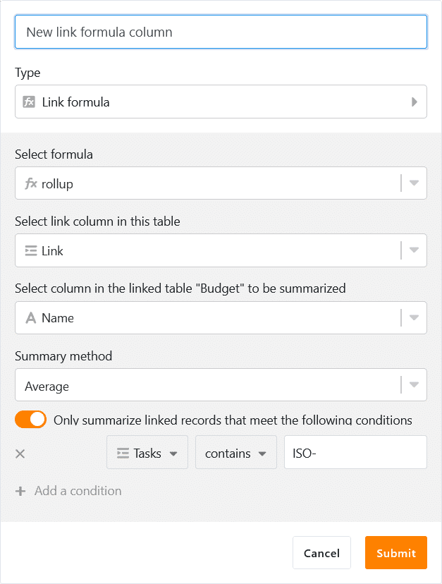

Версия SeaTable 1.0 увидела свет 1 июля 2020 года. С тех пор его скачали более 100 000 раз с сайта Docker Hub. Этот огромный интерес к SeaTable подтолкнул нас, и поэтому мы с радостью и гордостью объявляем об очередной вехе в развитии SeaTable: SeaTable 2.0 сегодня был загружен в [SeaTable Cloud](https://cloud.seatable.io) и выпущен на [Docker](https://hub.docker.com/u/seatable) Hub для частных установок.

Визуально SeaTable 2.0 почти не отличается от своего предшественника. С точки зрения функциональности, пользовательского опыта, стабильности и возможностей интеграции, SeaTable сделал огромный скачок с июля прошлого года. Вы уже нашли версию 1.x интересной? Тогда версия 2.0 вдохновит вас!

SeaTable 2.0 содержит огромное количество улучшений и нововведений - полную документацию всех изменений можно найти в [SeaTable Changelog](https://seatable.io/ru/docs/changelog/version-2-0/). Основными моментами версии 2.0 являются три новых типа колонок, несколько новых вариантов настройки существующих типов колонок, два совершенно новых плагина, а также множество улучшений существующих плагинов SeaTable. Мы не поскупились и на улучшения в машинном отделении SeaTable: SeaTable 2.0 теперь имеет новую среду выполнения для скриптов Python, а системные администраторы оценят возможности мониторинга, предлагаемые новой страницей обзора внешних ссылок.

И это еще не все! Благодаря большому вкладу сообщества, мы теперь можем предложить русский язык в качестве пятого языка пользователя наряду с английским, немецким, французским и китайским.

## Тип колонки #22: Формула для ссылок

Возможность отображения взаимосвязей между записями в разных таблицах является одним из ключевых отличий SeaTable от классических электронных таблиц, таких как Excel и Google Sheets. В то время как последние знают только ссылки на ячейки (например, для формул), в SeaTable 1:1, 1:n и n:m связи могут быть созданы между таблицами в базе.

С помощью новой колонки формул для связей можно оценивать существующие связи и выполнять расчеты. Поддерживаются пять различных запросов: lookup, countlinks, rollup, findmax и findmin. Там, где это имеет смысл, запросы также предлагают опции фильтрации для еще более детальной оценки (например, вычисление среднего значения по связанным записям, возраст которых не превышает 6 месяцев). Благодаря графическому мастеру, использование колонки формул связывания и создание запросов легко осуществимо даже для менее технически опытных пользователей.

## Больше контроля над связыванием записей

SeaTable принципиально не ограничивает тип отношений между таблицами. Однако в некоторых случаях имеет смысл применять отношения 1:1 или 1:n. Система управления запасами - простой пример: проектор в любой момент времени может находиться только в одной комнате или у одного пользователя. Аналогичным образом, испытательная машина не может быть доступна для проведения нескольких испытаний одновременно.

В SeaTable 2.0 в колонках ссылок появилась опция конфигурации "Разрешить ссылки на несколько строк". Активированный по умолчанию, этот переключатель приводит к тому, что запись в текущей таблице может ссылаться только на одну запись в связанной таблице. Для двух приведенных выше примеров это означает: SeaTable избавляет от необходимости искать лучевой аппарат с несколькими людьми или в нескольких комнатах, а также не позволяет не запланировать тестовую машину на два одновременных теста.

В дополнение к опции ограничения _количества связываемых записей_ вторая новая опция позволяет ограничить _тип связываемых записей_. Если активизировать кнопку "Ограничить связи с одним представлением" и выбрать представление, то в связанной таблице могут быть связаны только те записи, которые являются частью выбранного представления. Если запись удалена из представления с помощью фильтра, то она становится недоступной для связывания. Когда речь идет о предотвращении связывания между определенными записями, эта новая опция имеет решающее значение. На примере испытательной машины можно сказать, что если она проходит ежегодное техническое обслуживание, то соответствующий флаг в таблице исключает ее из списка доступного испытательного оборудования. Как следствие, ее нельзя будет связать для использования при планировании испытаний.

## Тип колонки №23: Рейтинг

Веб-формы SeaTable невероятно практичны для простых опросов. Всего за несколько мгновений анкета будет создана и готова к рассылке. Ответы участников опроса попадают в базу данных и могут быть быстро и легко проанализированы с помощью различных инструментов анализа SeaTable.

Новая колонка с оценками - идеальное дополнение для таких опросов: "Остались ли Вы довольны нашей работой?" или "Порекомендовали бы Вы нас своим друзьям?". Пять звезд не оставляют места для сомнений, а две звезды, напротив, открывают широкие возможности для совершенствования. Однако новый тип столбцов подходит не только для опросов об удовлетворенности клиентов. Вы хотите провести голосование в своей команде по поводу названия нового продукта? Новые предложения требуют быстрой оценки для определения приоритетов? Колонка с рейтингом поможет во всех этих случаях!

Шкала оценки может варьироваться от 1 до 10 звезд. Если вам не нравится стандартный оранжевый цвет, среди девяти других цветов вы обязательно найдете тот, который понравится вам больше. Также можно корректировать шкалу оценок ретроспективно. Если шкала расширена, существующие оценки остаются неизменными; если она сокращена, оценки сокращаются до новой максимальной длины.

## Более гибкие веб-формы: Собственный логотип, поддержка колонок ссылок и предварительно заполненных полей

Колонка рейтингов - это лишь одно из нескольких нововведений, которые делают веб-формы SeaTable еще лучше. Встраивание собственного логотипа - самая яркая новая функция в редакторе форм. Логотип или надпись, вставленные в левый верхний угол, создают индивидуальную форму с эффектом узнаваемости.

Менее заметной, но тем более важной в применении, является добавленная в SeaTable 2.0 функция использования колонок ссылок в формах. Этот тип колонок обеспечивает значительно большую гибкость, чем колонки одиночного выбора, и, таким образом, позволяет проводить еще более детальные исследования.

Совершенно незаметной в редакторе, но тем более мощной в приложении, является функция значения по умолчанию для полей формы. Чтобы заполнить поле формы значением по умолчанию, добавьте в URL формы '?prefill_COLUMNNAME=PREFILLVALUE'. (COLUMNAME - это имя столбца, поле которого заполняется; PREFILLVALUE - это значение, которое будет вставлено. Пробелы в именах столбцов записываются как "%20" и чувствительны к регистру). Разумеется, несколько полей формы можно снабдить значениями по умолчанию. Для этого несколько пар COLUMNNAME-PREFILLVALUE соединяются амперсандом ("&").

## Тип колонки №24: Геопозиция

Плагин карты делает отображение географического распределения делом нескольких секунд. Плагин интерпретирует адреса и другие описания местоположения и наносит их на карту Google. Однако в некоторых случаях описания должностей просто недостаточно точны. Еще хуже то, что описания должностей могут меняться с течением времени. Все эти соображения заставили нас сделать колонку геопозиции 24-м типом колонок SeaTable.

Колонка геопозиции хранит координаты долготы и широты в виде значений, разделенных запятыми. Биологи и археологи, которым необходимо точно документировать объекты, или фотографы, которые хотят геокодировать свои снимки, могут легко сделать это с помощью нового типа столбцов: Колонка геопозиции сохраняет положение с максимальной точностью, так что никакие вопросы не остаются без ответа при дальнейшем анализе, при необходимости также с помощью других инструментов для геоанализа.

## Необязательные значения по умолчанию для столбцов

Существуют колонки, в которых при создании новой записи всегда должно вводиться практически одно и то же значение, например, колонка статуса в управлении проектами или текстовая колонка с единообразной ведущей строкой. Не сэкономит ли это много времени, если эти значения будут автоматически устанавливаться для новых записей?

Поскольку это именно так, SeaTable начиная с версии 2.0 позволяет определять значение по умолчанию для трех типов столбцов - текст, число и одиночный выбор. Если такое значение по умолчанию определено, то соответствующая ячейка в новой записи автоматически заполняется значением по умолчанию. Если новая запись является исключением из правил и автоматически установленное значение не подходит, то его можно в любой момент переписать вручную.

## Новый плагин: Дизайн страницы

Плагин дизайна страниц можно использовать для создания одно- и многостраничных PDF-документов, которые динамически получают данные из таблицы SeaTable. В SeaTable мы генерируем лицензионные сертификаты с помощью плагина. Но возможности использования идут гораздо дальше: вы можете создавать сертификаты для своих деловых партнеров или членские карты для членов вашего теннисного клуба. Если вы управляете своим портфелем продуктов в SeaTable, вы можете генерировать привлекательные спецификации для всех ваших продуктов всего несколькими щелчками мыши. В кадровой сфере объявления о вакансиях в формате PDF могут быть созданы легко и быстро, без дополнительных усилий.

Каждый документ основан на шаблоне. Дизайн шаблона выполняется в самом SeaTable. Редактор WYSIWYG является частью плагина, внешний редактор не требуется. Редактор предоставляет выбор статических элементов, таких как тексты, таблицы и изображения, и предлагает различные операции редактирования. Например, изображение можно повернуть, обрезать или выровнять непосредственно в шаблоне. Если ваш шаблон выглядит непривлекательно, это не вина редактора ;-) Редактор сохраняет все шаблоны в формате JSON; функция импорта и экспорта гарантирует переносимость шаблонов.

## Новый плагин: Kanban

Доска Канбан - это отличный инструмент для визуализации, контроля и мониторинга многочисленных операционных функций и задач (например, конвейера продаж). На самом деле, принцип Канбан оказался настолько успешным на практике, что в последние годы появилось множество программ, реализующих различные разновидности досок Канбан.

В новой версии SeaTable также появился плагин Kanban, который можно использовать для отображения данных в таблицах на доске Kanban. Категориями доски Kanban являются либо варианты в одном столбце выбора, либо пользователи в столбце сотрудников. Это позволяет использовать представление Kanban для самых разных областей применения, таких как управление персоналом, производство, продажи, разработка программного обеспечения и управление проектами. Новые категории и новые записи можно создавать непосредственно в представлении Kanban, не выходя из плагина. Интенсивным пользователям понравится поддержка функции drag & drop.

## Улучшенные плагины: Календарь, Временная шкала, Галерея и Карты

Хотя мы приложили много усилий и работы к новым плагинам, мы не упустили из виду и другие плагины. Все четыре основных плагина получили улучшения в SeaTable 2.0.

Плагин "Календарь" теперь предлагает просмотр недели и дня в дополнение к просмотру месяца и года. В режиме просмотра дня, недели и месяца события можно перемещать с помощью мыши и создавать новые события с помощью щелчка и вытягивания. Третье новое представление, представление "Повестка дня", перечисляет все предстоящие события за недельный период в хронологическом порядке. Он отлично подходит для печати календаря в удобном формате. Чтобы завершить работу и сделать ее совместимой с другими плагинами, мы также добавили возможность выбора цвета. Цвет события теперь можно задать с помощью поля выбора одного субъекта.

Новый плагин Timeline Plugin также предлагает такую цветовую опцию. Кроме того, на диаграмме Ганта может быть показана метка. Таким образом, усовершенствованный плагин обеспечивает еще большую ясность при планировании проекта.

Мы обновили галерею для мобильных устройств, чтобы она хорошо отображалась на небольших экранах. Кроме того, мы изменили веб-интерфейс в нескольких местах, чтобы улучшить пользовательский опыт и представление данных.

Чтобы не отставать от развития в области типов колонок, плагин карты в SeaTable 2.0 также может работать с новой колонкой геопозиции.

## Ручные снимки

[Снимки](https://seatable.io/ru/docs/handbuch/seatable-nutzen/versionierung-snapshots/) - это моментальный снимок базы. Они доказывают свою ценность, когда базу необходимо вернуть в предыдущее состояние после значительных изменений.

В прошлом SeaTable знал только автоматические снимки. Такой снимок создавался сервером SeaTable ежедневно, если в течение последних 24 часов в базу вносились изменения. В версии 2.0 SeaTable научился и теперь также умеет делать снимки вручную: Один щелчок - и изображение базы готово. В качестве страховки от непреднамеренной потери данных этот щелчок настоятельно рекомендуется использовать при любой работе над структурой базы (особенно при удалении столбцов и таблиц).

## Папка для баз

Во время ежедневного использования SeaTable накапливается та или иная база. В SeaTable 2.0 мы ввели папки, в которых базы могут быть сгруппированы и организованы. Они возвращают структуру и ясность, когда постоянный рост баз перекрывает вид на главное. Новые базы могут быть созданы в папке или существующие базы могут быть перемещены в папку путем перетаскивания.

## Защита от нежелательной утечки данных

Если база содержит конфиденциальные данные, то защита от ошибочной или злонамеренной утечки данных имеет первостепенное значение. Правовые нормы защиты данных также требуют принятия соответствующих технических мер для защиты персональных данных. Предотвращение утечки данных является неотъемлемой частью этих мер.

Чтобы соответствовать этим высоким требованиям, SeaTable версии 2.0 предлагает дополнительные настройки разрешений для предотвращения утечки данных. В этих новых настройках безопасности владелец базы может решить, разрешено ли другим пользователям печатать, дублировать и/или экспортировать базу. Эти ограничения разрешений могут применяться ко всем пользователям или только к тем, кто имеет разрешение на совместный доступ. В случае базы, принадлежащей группе, владелец группы и администраторы группы могут изменять эти настройки.

## Среда выполнения сценариев Python

Частью привлекательности SeaTable для разработчиков является поддержка сценариев Python и JavaScript (JS). (Продукты наших конкурентов поддерживают только JS-скрипты.) Если JS-скрипты выполняются в браузере, то Python-скрипты выполняются на стороне сервера. В сочетании с возможностью автоматизировать их выполнение, сценарии Python особенно хорошо подходят для более сложных сценариев обработки данных.

Однако такая гибкость имеет свою цену: выполнение Python-скриптов на сервере сопряжено с рисками безопасности. Для оптимальной защиты мы в значительной степени изолировали среду выполнения Python-скриптов от основной системы с помощью двух дополнительных компонентов. Команда, состоящая из SeaTable FAAS Scheduler и Python Runner, обеспечивает не только безопасность, но и оптимальную масштабируемость. При вызове скрипта запускается контейнер Docker , в котором выполняется скрипт. Результат выполнения сценария возвращается в SeaTable, а контейнер Docker уничтожается. Использование нескольких Python-бегунов также позволяет одновременно выполнять множество скриптов без ожидания. (Более подробную информацию можно найти в [руководстве администратора SeaTable](https://manual.seatable.io/docker/Python-Runner/Deploy%20SeaTable%20Python%20Runner/)).

## Обзор внешних ссылок

Внешняя ссылка быстро создается для обмена информацией с внешними партнерами. Опция "Автоматическое истечение срока действия" также может быть использована для ограничения срока действия ссылки. Однако в реальности это происходит не всегда, поэтому внешние ссылки могут сохраняться даже после окончания их использования.

Чтобы администратор команды мог получить представление о существующих внешних ссылках, SeaTable теперь предлагает обзорную страницу внешних ссылок в администрации команды. Существующие внешние ссылки для баз и видов перечислены на двух вкладках. В табличной форме отображается информация о создателе и дате создания, а также о количестве вызовов. Однако администратор команды имеет не только права на чтение. Если ссылка должна быть деактивирована, он также может это сделать.
