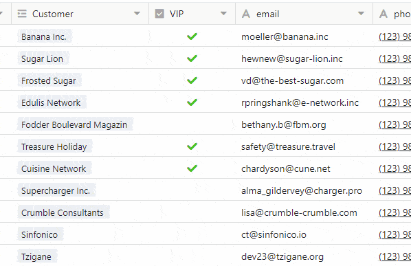

Today, 6 July 2021, we updated [SeaTable Cloud](https://cloud.seatable.io) to SeaTable 2.1 and uploaded the new Docker image to Docker Hub. The highlights of the release are the new table permissions and a new feature called Data Processing. In addition, we have improved the single and multiple selection column types and the checkbox column. In these release notes we present - as always - the key developments and refer to the [SeaTable Changelog]() for the full list of changes.

## Table permissions

SeaTable's advanced sharing (e.g. custom sharing permissions, column permissions, row locking) gives base administrators extensive control over who can view, edit and otherwise work with table data. With the new table permissions , administrators have an additional option to fine-tune access to tables.

table permissions control the access rights of users to a single table in a Base. In the default settings, they do not limit the editing rights of users, i.e. any user with at least write permissions can add rows as well as edit and delete existing rows . If the owner of a Base or an administrator wants to limit these permissions for individual users or groups, they can now do so with SeaTable 2.1. Permissions to add files or delete files can be revoked from all or any non-admin users. Or they can be assigned exclusively to a selection of users. The permission to add and delete can be managed individually and independently.

In future versions, more options will be added for even more granular access control. In SeaTable 2.2, base administrators will be given the option to restrict editing of rows .

## Data processing

With the more than 80 formulas that SeaTable offers, a wide range of calculations and operations can be carried out. However, all SeaTable formulas are subject to one limitation: they only ever take into account data from one row. The new Data Processing function provides an answer to this limitation: it offers actions to perform calculations between rows in a table and between columns of different tables.

SeaTable 2.1 offers three data processing operations:

- _Calculate cumulative values_ sums up the cell values of a column from row 1 to the current row .
- _Calculate changes_ calculates the difference between the numbers in two consecutive rows.
- _Compare and copy_ checks entries in two tables for equality and, if a match is found, transfers one or more values from one table to the other.

Other data processing actions, such as calculating the order or automatically linking entries, will be added in future versions to simplify the processing of ever larger data sets. A memory option for recurring data processing actions will also be available.

## Extended permissions for single and multiple selection columns

The column permissions, which were introduced in [SeaTable 1.2](https://seatable.io/en/seatable-release-1-2/), allow the assignment and control of individual editing rights for individual columns. With SeaTable 2.1, the column authorisation menu of the two column types single selection and multiple selection was extended by a second button. This allows you to control which users may create and edit options in a selection column.

Basically, all users with write permissions can edit options. Owners and admins of bases can now restrict this permission. The editing right can be restricted to _nobody_, _administrators_ or _certain users_. In the setting _Nobody_, not even administrators and owners themselves can create and change new options (but they can change the permission).

## Improved checkbox column

The checkbox column type was somewhat unwieldy in daily use. Probably the most obvious convenience killer was the need for two clicks to check or uncheck a box - one to select the cell, another to check or uncheck the box. The new checkbox column is a huge step forward in usability and appearance.

## Numerous detail improvements

In addition to the major improvements presented, we have also taken care of a large number of smaller improvements, thus eliminating functional deficits and increasing user-friendliness. Here are just the most important ones in cursory form:

New print setting: The new scaling option in the print settings is a convenient way to resize the print output while maintaining the relative column widths. It is particularly useful when the screen view is to be scaled to fit a page.

Date widget for filters: A small widget for selecting the date in the filter settings makes date entry mouse-friendly. The widget also ensures that the date is entered in the correct format.

Group management: Group members can now decide themselves to leave a group. In the past, the group owner had to dismiss group members from the group.

Collective form: As for web forms as their classic counterparts, an expiry date can now also be set for collective forms. If this date expires, then the release link of the collective form automatically becomes invalid.

Excel Import: Importing multiple selections from Excel into SeaTable is now much easier in SeaTable 2.1. Cell contents separated by line breaks are interpreted as different options when inserted into SeaTable.

Improved wizard for link columns: If the selection in a link column is restricted to a view, then the wizard only shows the columns that are part of the linked view. Columns that are hidden in the view are also hidden in the wizard.

View locking: Base administrators now have the option to revoke the right to lock/unlock views from other users.
