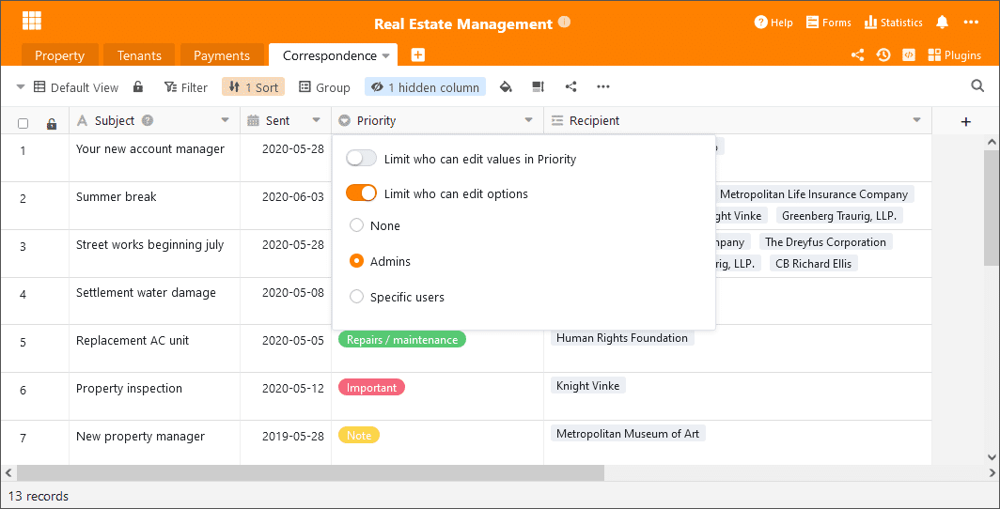

Hoy, 6 de julio de 2021, hemos actualizado [SeaTable Cloud](https://cloud.seatable.io) a SeaTable 2.1 y hemos subido la nueva imagen Docker a Docker Hub. Lo más destacado de la versión son los nuevos permisos para las tablas y una nueva función llamada Procesamiento de Datos. Además, hemos mejorado los tipos de columna de selección simple y múltiple y la columna de casilla de verificación. En estas notas de la versión presentamos, como siempre, las principales novedades y remitimos al [registro de cambios de SeaTable]() para ver la lista completa de cambios.

## Autorizaciones de mesa

Los permisos avanzados de SeaTable (por ejemplo, permisos de uso compartido personalizados, permisos de columna, bloqueo de filas) dan a los administradores de la base un amplio control sobre quién puede ver, editar y trabajar de otra manera con los datos de la tabla. Con los nuevos permisos para las tablas, los administradores tienen una opción adicional para afinar el acceso a las tablas.

Los permisos de tabla controlan los derechos de acceso de los usuarios a una única tabla de una base. En la configuración por defecto, no limitan los derechos de edición de los usuarios, es decir, cualquier usuario con al menos derechos de escritura puede añadir filas, así como editar y eliminar las existentes. Si el propietario de una base o un administrador quiere limitar estos derechos para usuarios individuales o grupos, ahora puede hacerlo con SeaTable 2.1. Los permisos para añadir archivos o eliminar archivos pueden ser revocados a todos o a cualquier usuario no administrador. O pueden asignarse exclusivamente a una selección de usuarios. Los permisos para añadir y eliminar pueden gestionarse de forma individual e independiente.

En futuras versiones, se añadirán más opciones para un control de acceso aún más granular. En SeaTable 2.2, los administradores de la base tendrán la opción de restringir la edición de filas.

## Procesamiento de datos

Con las más de 80 fórmulas que ofrece SeaTable, se puede realizar una amplia gama de cálculos y operaciones. Sin embargo, todas las fórmulas de SeaTable están sujetas a una limitación: sólo consideran los datos de una fila. La nueva función de Procesamiento de Datos proporciona una respuesta a esta limitación: ofrece acciones para realizar cálculos entre filas de una tabla y entre columnas de diferentes tablas.

SeaTable 2.1 ofrece tres operaciones de procesamiento de datos:

- _Calcular valores acumulados_ suma los valores de las celdas de una columna desde la fila 1 hasta la fila actual.
- _Calcular cambios_ calcula la diferencia entre los números de dos filas consecutivas.
- _Comparar y copiar_ comprueba la igualdad de las entradas en dos tablas y, si se encuentra una coincidencia, transfiere uno o más valores de una tabla a la otra.

En futuras versiones se añadirán otras acciones de procesamiento de datos, como el cálculo del orden o la vinculación automática de las entradas, para simplificar el tratamiento de conjuntos de datos cada vez más grandes. También estará disponible una opción de memoria para las acciones de procesamiento de datos recurrentes.

## Permisos ampliados para columnas de selección única y múltiple

Los permisos de columna introducidos en [SeaTable 1.2]() permiten la asignación y el control de los derechos de edición individuales para cada columna. Con SeaTable 2.1, el menú de permisos de columna de los dos tipos de columna selección simple y selección múltiple se amplió con un segundo botón. Esto le permite controlar qué usuarios pueden crear y editar opciones en una columna de selección.

Básicamente, todos los usuarios con permisos de escritura pueden editar las opciones. Los propietarios y administradores de las bases pueden ahora restringir este permiso. El derecho de edición puede restringirse a _nadie_, a _los administradores_ o a _determinados usuarios_. En la configuración _Nadie_, ni siquiera los administradores y propietarios pueden crear y cambiar nuevas opciones (pero sí pueden cambiar el permiso).

## Mejora de la columna de casillas de verificación

El tipo de columna de casillas de verificación era algo poco manejable en el uso diario. Probablemente, el factor más obvio de comodidad era la necesidad de hacer dos clics para marcar o desmarcar una casilla: uno para seleccionar la celda y otro para marcar o desmarcar la casilla. La nueva columna de casillas de verificación es un gran paso adelante en cuanto a usabilidad y apariencia.

## Numerosas mejoras en los detalles

Además de las principales mejoras presentadas, también nos hemos ocupado de un gran número de mejoras menores, eliminando así los déficits funcionales y aumentando la facilidad de uso. Aquí están los más importantes en forma de resumen:

Nueva configuración de impresión: La nueva opción de escalado en la configuración de impresión es una forma cómoda de cambiar el tamaño de la salida de impresión manteniendo los anchos de columna relativos. Es particularmente útil cuando la vista de la pantalla debe ser escalada para ajustarse a una página.

Widget de fecha para los filtros: Un pequeño widget para seleccionar la fecha en los ajustes del filtro hace que la entrada de la fecha sea fácil de manejar. El widget también garantiza que la fecha se introduzca en el formato correcto.

Gestión de grupos: ahora los miembros del grupo pueden decidir por sí mismos abandonar un grupo. Antes, el propietario del grupo tenía que despedir a los miembros del grupo.

Forma colectiva: En cuanto a los formularios web, al igual que sus homólogos clásicos, ahora también se puede establecer una fecha de caducidad para los formularios colectivos. Si esta fecha expira, el enlace de liberación del formulario colectivo pierde automáticamente su validez.

Importación de Excel: La importación de selecciones múltiples desde Excel a SeaTable es ahora mucho más fácil en SeaTable 2.1. Los contenidos de las celdas separadas por saltos de línea se interpretan como opciones diferentes cuando se insertan en SeaTable.

Asistente mejorado para las columnas de enlace: Si la selección en una columna de enlace está restringida a una vista, el asistente sólo muestra las columnas que forman parte de la vista enlazada. Las columnas que se ocultan en la vista también se ocultan en el asistente.

Bloqueo de vistas: los administradores de la base ahora tienen la opción de revocar el derecho a bloquear/desbloquear vistas de otros usuarios.
