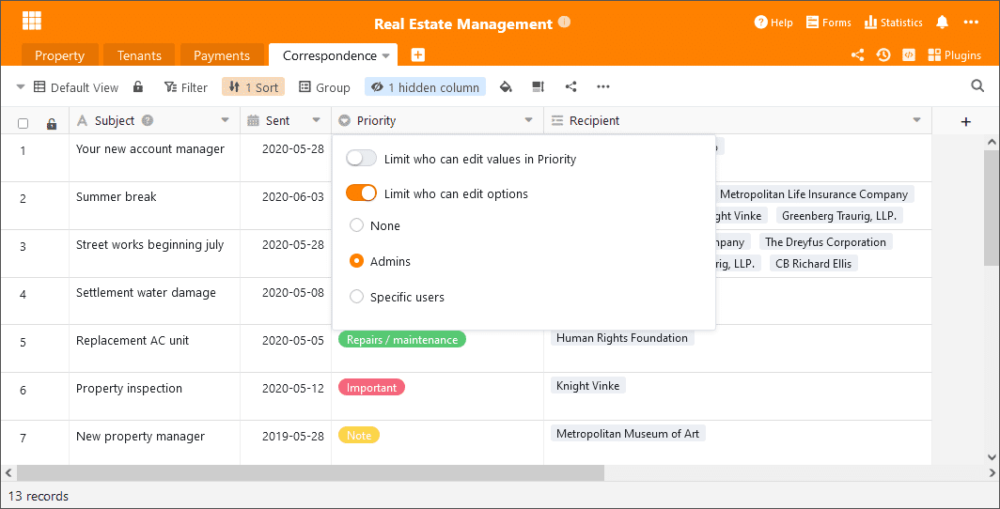
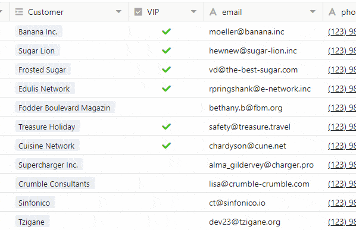

Aujourd'hui, 6 juillet 2021, nous avons mis à jour [SeaTable Cloud](https://cloud.seatable.io) en SeaTable 2.1 et téléchargé la nouvelle image Docker sur Docker Hub. Les points forts de cette version sont les nouvelles autorisations de table et une nouvelle fonction appelée Traitement des données. En outre, nous avons amélioré les types de colonnes sélection simple et multiple ainsi que la colonne case à cocher. Dans ces notes de mise à jour, nous présentons - comme toujours - les développements centraux et renvoyons au [changelog de SeaTable](https://seatable.io/fr/docs/changelog/version-2-1/) (disponible uniquement en anglais) pour la liste complète des changements.

## Autorisations de table

Les autorisations avancées de SeaTable (par exemple, les autorisations de partage personnalisé, les autorisations de colonne, le verrouillage de ligne) donnent aux administrateurs de la base un contrôle étendu sur les personnes qui peuvent voir, modifier et travailler avec les données de la table. Avec les nouvelles autorisations pour les tables, les administrateurs disposent d'une option supplémentaire pour affiner l'accès aux tables.

Les autorisations de tableau contrôlent les droits d'accès des utilisateurs à un seul tableau dans une base. Par défaut, elles ne limitent pas les droits d'édition des utilisateurs, c'est-à-dire que tout utilisateur ayant au moins des droits d'écriture peut ajouter des lignes, modifier et supprimer des lignes existantes. Si le propriétaire d'une base ou un administrateur souhaite limiter ces droits pour certains utilisateurs ou groupes, il peut désormais le faire avec SeaTable 2.1. Les droits d'ajouter des fichiers ou d'en supprimer peuvent être retirés à tous les utilisateurs ou à tous les utilisateurs non administrateurs. Ou elles peuvent être attribuées exclusivement à une sélection d'utilisateurs. Les autorisations d'ajout et de suppression peuvent être gérées individuellement et indépendamment les unes des autres.

Dans les futures versions, d'autres options seront ajoutées pour un contrôle d'accès encore plus granulaire. Dans SeaTable 2.2, les administrateurs de base auront la possibilité de restreindre l'édition des lignes.

## Traitement des données

Avec les plus de 80 formules que SeaTable propose, un large éventail de calculs et d'opérations peut être effectué. Cependant, toutes les formules de SeaTable sont soumises à une limitation : elles ne prennent en compte que les données d'une seule ligne. La nouvelle fonction Traitement des données apporte une réponse à cette limitation : elle propose des actions permettant d'effectuer des calculs entre les lignes d'un tableau et entre les colonnes de différents tableaux.

SeaTable 2.1 propose trois opérations de traitement des données :

- _Calculer les valeurs cumulées_ additionne les valeurs des cellules d'une colonne de la ligne 1 à la ligne actuelle.
- _Calculer les changements_ calcule la différence entre les chiffres de deux lignes consécutives.
- La fonction de*comparaison et de copie* vérifie l'égalité des entrées de deux tables et, si une correspondance est trouvée, transfère une ou plusieurs valeurs d'une table à l'autre.

D'autres actions de traitement des données, telles que le calcul de l'ordre ou la liaison automatique des entrées, seront ajoutées dans les versions futures afin de simplifier le traitement d'ensembles de données toujours plus importants. Une option de mémoire pour les actions récurrentes de traitement des données sera également disponible.

## Permissions étendues pour les colonnes de sélection simple et multiple

Les autorisations de colonnes introduites dans [SeaTable 1.2](https://seatable.io/fr/seatable-release-1-2/) permettent d'attribuer et de contrôler des droits d'édition individuels pour des colonnes individuelles. Avec SeaTable 2.1, le menu d'autorisation des deux types de colonnes, sélection unique et sélection multiple, a été étendu par un second bouton. Cela vous permet de contrôler quels utilisateurs peuvent créer et modifier les options d'une colonne de sélection.

Fondamentalement, tous les utilisateurs ayant des droits d'écriture peuvent modifier les options. Les propriétaires et les administrateurs de bases peuvent désormais restreindre cette autorisation. Le droit d'édition peut être limité à _personne_, aux _administrateurs_ ou à _certains utilisateurs_. Dans le paramètre _Personne_, les administrateurs et les propriétaires eux-mêmes ne peuvent pas créer et modifier de nouvelles options (mais ils peuvent modifier l'autorisation).

## Amélioration de la colonne des cases à cocher

Le type de colonne "case à cocher" était quelque peu difficile à manier au quotidien. L'inconvénient le plus évident était la nécessité de cliquer deux fois pour cocher ou décocher une case - un clic pour sélectionner la cellule, un autre pour cocher ou décocher la case. La nouvelle colonne de cases à cocher constitue un énorme progrès en termes de convivialité et d'apparence.

## Nombreuses améliorations des détails

En plus des améliorations majeures présentées, nous avons également pris soin d'un grand nombre d'améliorations plus modestes, éliminant ainsi les déficits fonctionnels et augmentant la convivialité. Voici les plus importantes d'entre elles, sous une forme sommaire :

Nouveau paramètre d'impression : la nouvelle option de mise à l'échelle dans les paramètres d'impression est un moyen pratique de redimensionner la sortie imprimée tout en conservant la largeur relative des colonnes. Elle est particulièrement utile lorsque la vue de l'écran doit être redimensionnée pour s'adapter à une page.

Widget de date pour les filtres : un petit widget permettant de sélectionner la date dans les paramètres du filtre rend la saisie de la date conviviale. Le widget veille également à ce que la date soit saisie dans le bon format.

Gestion des groupes : les membres d'un groupe peuvent désormais décider eux-mêmes de quitter un groupe. Auparavant, le propriétaire du groupe devait renvoyer les membres du groupe.

Forme collective : En ce qui concerne les formulaires web comme leurs homologues classiques, il est désormais possible de fixer une date d'expiration pour les formulaires collectifs. Si cette date expire, le lien de validation du formulaire collectif devient automatiquement invalide.

Importation d'Excel : L'importation de sélections multiples d'Excel dans SeaTable est maintenant beaucoup plus facile dans SeaTable 2.1. Les contenus de cellules séparés par des sauts de ligne sont interprétés comme des options différentes lorsqu'ils sont insérés dans SeaTable.

Amélioration de l'assistant pour les colonnes de liens : Si la sélection dans une colonne de lien est limitée à une vue, l'assistant ne montre que les colonnes qui font partie de la vue liée. Les colonnes qui sont masquées dans la vue le sont également dans l'assistant.

Verrouillage des vues : les administrateurs de la base ont désormais la possibilité de révoquer le droit de verrouiller/déverrouiller les vues des autres utilisateurs.
