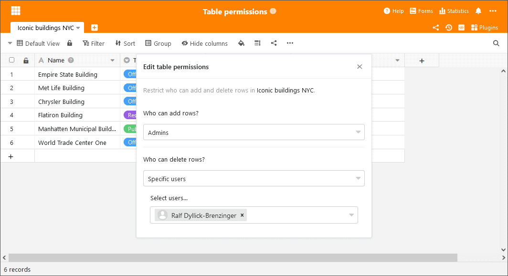

Hoje, 6 de Julho de 2021, actualizámos o [SeaTable Cloud](https://cloud.seatable.io) para SeaTable 2.1 e carregámos a nova imagem Docker para Docker Hub. Os destaques do lançamento são as novas permissões de tabela e uma nova funcionalidade chamada Processamento de Dados. Além disso, melhorámos os tipos de colunas de selecção única e múltipla e a coluna da caixa de verificação. Nestas notas de lançamento apresentamos - como sempre - os principais desenvolvimentos e remetemos para o [SeaTable Changelog](https://seatable.io/pt/docs/changelog/version-2-1/) para a lista completa de alterações.

## Autorizações de tabelas

As permissões avançadas do SeaTable (por exemplo, permissões de partilha personalizadas, permissões de coluna, bloqueio de linha) dão aos administradores da base um controlo extensivo sobre quem pode ver, editar e trabalhar com dados de tabela. Com as novas permissões de tabelas, os administradores têm uma opção adicional para afinar o acesso às tabelas.

As permissões das tabelas controlam os direitos de acesso dos utilizadores a uma única tabela numa base. Nas configurações padrão, não limitam os direitos de edição dos utilizadores, ou seja, qualquer utilizador com pelo menos direitos de escrita pode adicionar linhas, assim como editar e apagar linhas existentes. Se o proprietário de uma base ou um administrador quiser limitar estes direitos para utilizadores individuais ou grupos, pode agora fazê-lo com o SeaTable 2.1. As permissões para adicionar ou eliminar ficheiros podem ser revogadas a todos ou a quaisquer utilizadores não administradores. Ou podem ser atribuídos exclusivamente a uma selecção de utilizadores. A permissão para adicionar e apagar pode ser gerida individualmente e independentemente uma da outra.

Nas versões futuras, serão acrescentadas mais opções para um controlo de acesso ainda mais granular. No SeaTable 2.2, será dada aos administradores de base a opção de restringir a edição de filas.

## Processamento de dados

Com as mais de 80 fórmulas que a SeaTable oferece, uma vasta gama de cálculos e operações pode ser levada a cabo. No entanto, todas as fórmulas SeaTable estão sujeitas a uma limitação: consideram sempre apenas dados de uma fila. A nova função de Processamento de Dados dá uma resposta a esta limitação: oferece acções para efectuar cálculos entre linhas numa tabela e entre colunas em diferentes tabelas.

A SeaTable 2.1 oferece três operações de processamento de dados:

- _Calcular valores acumulados_ soma os valores das células de uma coluna da linha 1 até à linha actual.
- _Calcular alterações_ calcula a diferença entre os números em duas filas consecutivas.
- _Comparar e copiar_ as entradas de verificação em duas tabelas para a igualdade e, se for encontrada uma correspondência, transferir um ou mais valores de uma tabela para a outra.

Outras acções de processamento de dados, como o cálculo da ordem ou a ligação automática de entradas, serão acrescentadas em versões futuras para simplificar o processamento de conjuntos de dados cada vez maiores. Estará também disponível uma opção de memória para acções recorrentes de processamento de dados.

## Permissões alargadas para colunas de selecção simples e múltiplas

As permissões de coluna introduzidas no [SeaTable 1.2](https://seatable.io/pt/seatable-release-1-2/) permitem a atribuição e controlo dos direitos de edição individuais para as colunas individuais. Com SeaTable 2.1, o menu de permissão de colunas dos dois tipos de selecção simples e selecção múltipla foi alargado por um segundo botão. Isto permite-lhe controlar quais os utilizadores que podem criar e editar opções numa coluna de selecção.

Basicamente, todos os utilizadores com permissões de escrita podem editar opções. Os proprietários e administradores de bases podem agora restringir esta permissão. O direito de edição pode ser restrito a _ninguém_, _administradores_ ou _certos utilizadores_. No cenário _Ninguém_, nem mesmo os próprios administradores e proprietários podem criar e alterar novas opções (mas podem alterar a permissão).

## Coluna de caixa de verificação melhorada

O tipo de coluna da caixa de verificação era um pouco difícil de utilizar no dia-a-dia. Provavelmente o assassino de conveniência mais óbvio foi a necessidade de dois cliques para verificar ou desmarcar uma caixa - um para seleccionar a célula, outro para verificar ou desmarcar a caixa. A nova coluna da caixa de verificação é um enorme passo em frente na usabilidade e aparência.

## Numerosas melhorias de detalhe

Para além das grandes melhorias apresentadas, também nos ocupámos de um grande número de pequenas melhorias, eliminando assim os défices funcionais e aumentando a facilidade de utilização. Aqui estão apenas os mais importantes em forma superficial:

Nova configuração de impressão: A nova opção de escala nas configurações de impressão é uma forma conveniente de redimensionar a saída de impressão, mantendo as larguras relativas das colunas. É particularmente útil quando a vista do ecrã deve ser dimensionada para caber numa página.

Widget de data para filtros: Um pequeno widget para seleccionar a data nas definições do filtro torna a entrada da data amigável ao rato. O widget também assegura que a data é introduzida no formato correcto.

Gestão de grupo: Os membros do grupo podem agora decidir por si próprios abandonar um grupo. No passado, o proprietário do grupo tinha de demitir os membros do grupo.

Forma colectiva: Quanto aos formulários web como seus equivalentes clássicos, pode agora também ser fixada uma data de expiração para os formulários colectivos. Se esta data expirar, então o link de liberação do formulário colectivo torna-se automaticamente inválido.

Importação de Excel: Importar múltiplas selecções de Excel para SeaTable é agora muito mais fácil em SeaTable 2.1. Os conteúdos celulares que são separados por quebras de linha são interpretados como opções diferentes quando inseridos no SeaTable.

Assistente melhorado para colunas de ligação: Se a selecção numa coluna de ligação estiver restrita a uma vista, então o assistente apenas mostra as colunas que fazem parte da vista ligada. As colunas que estão escondidas na vista também estão escondidas no feiticeiro.

Ver bloqueio: Os administradores da base têm agora a opção de revogar o direito de bloquear/desbloquear vistas de outros utilizadores.
