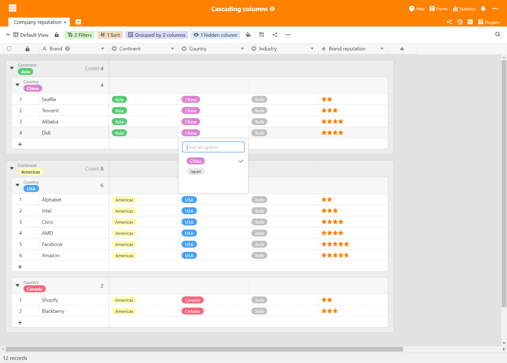
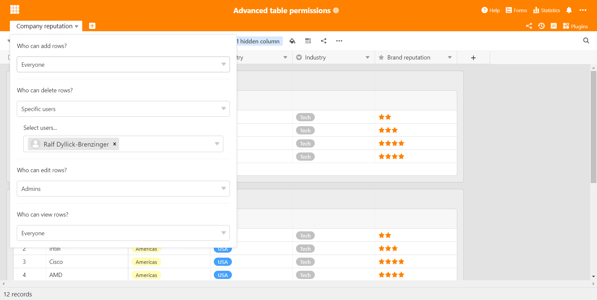

Bei SeaTable gibt es keine Sommerpause! Wir behalten unseren monatlichen Release Rhythmus bei und so profitieren seit heute alle [SeaTable Cloud](https://cloud.seatable.io) Benutzer von den Vorteilen der Version 2.2. Automationen und externe Apps sind zwei neue Features, die in dieser Version eingeführt werden. In kommenden Release Notes werden wir über diese aber noch häufiger berichten. Weitere Highlights des neuen Releases sind verschachtelte Gruppen, kaskadierende Auswahlfelder sowie erweiterte Tabellenberechtigungen und verbesserte Datenverarbeitungsfunktionen. Diese Neuerungen stellen wir in diesen Release Notes vor. Die deutlich umfangreichere, vollständige Liste der Änderungen finden Sie – wie immer – im [SeaTable Changelog](). Auf Docker Hub wird SeaTable 2.2 – in beiden Editionen des SeaTable Servers – morgen verfügbar sein.

## Automationen (nur für Enterprise Abos)

Automationen machen den Kopf frei für das Wesentliche, indem bestimmte Aufgaben autonom durch die Anwendung erledigt werden. Die Möglichkeiten zur Automatisierung werden in SeaTable 2.2 deutlich erweitert. In zukünftigen Versionen werden wir diese weiter ausbauen.

Vier Automationen unterstützt SeaTable in der Version 2.2: _Benachrichtigung versenden_, _Zeile sperren_, _Zeile hinzufügen_ und _Zeile bearbeiten_. Der Versand von E-Mails und die Ausführung von Skripten werden als Automationen in Kürze folgen.

Eine Automation kann auf zweierlei Art getriggert werden: Mit der periodischen Ausführung können Aufgaben wiederholt täglich, wöchentlich oder monatlich ausgeführt werden, jeweils zu einem bestimmten Tag und Uhrzeit. So lassen sich beispielsweise wiederkehrende Aufgaben erstellen. Die konditionale Ausführung wird ausgelöst, wenn eine oder mehrere Bedingungen erfüllt sind. Sind beispielsweise alle Zellen einer Zeile ausgefüllt, dann wird die Zeile automatisch gesperrt.

## Externe Apps (nur für Enterprise Abos)

Sie haben einen größeren Datensatz, den Sie als solchen nicht mit anderen teilen, über den Sie aber bestimmte Abfragen zulassen wollen – idealerweise über eine Webseite integriert in das bestehende Informationsangebot, ein Produktkatalog zum Beispiel?

Mit den in SeaTable 2.2 eingeführten externen Apps können Sie genau dies nun tun. Eine externe App ist über eine URL erreichbar und erlaubt es Besuchern, Abfragen über einen ausgewählten Datensatz auszuführen. Dieser Datensatz kann eine Tabelle oder nur eine Ansicht einer Tabelle sein. Die externe App führt die Abfrage aus und stellt die Ergebnisse in einer bestimmten Form dar.

Aktuell bietet SeaTable eine tabellarische Ergebnisdarstellung. In Zukunft werden weitere Darstellungsoptionen ergänzt (z.B. eine Galerieansicht).

## Verschachtelte Gruppen

Seit der Version 1.0 unterstützt SeaTable die Gruppierung von Daten. Mit der aktuellen Version erfährt diese beliebte Funktion eine massive Verbesserung: In SeaTable 2.2 lassen sich Daten nach bis zu drei Spalten gruppieren. Gruppen auf zweiter und dritter Ebene werden als Untergruppen der übergeordneten Ebene dargestellt. Natürlich werden auch für diese Untergruppen aggregierte Spaltenwerte wie Summe oder Durchschnitt automatisch berechnet und angezeigt. Gerade in Kombination mit Filtern und Sortierungen wird die Gruppierung damit ein noch mächtigeres Analysewerkzeug.

Eine weitere kleinere Verbesserung in Sachen Gruppen: Beim Export einer Ansicht in Excel werden die Gruppen ebenfalls exportiert. In früheren Versionen berücksichtigte die Exportfunktion Gruppen nicht.

## Kaskadierende Einfachauswahlfelder

Sie haben sich schon in der Einleitung gefragt, was kaskadierende Auswahlfelder sind? Hier die Erklärung: Bei kaskadierenden Auswahlfeldern determiniert der Wert in einem übergeordneten Auswahlfeld die zur Wahl stehenden Optionen in einem untergeordneten Auswahlfeld. Zur Verdeutlichung ein fiktives Beispiel: In Auswahlfeld 1 wählen Sie den Kontinent aus. Wenn Sie Europa wählen, dann können Sie im zweiten Auswahlfeld zwischen Frankreich, Deutschland und Italien wählen. Wenn Sie aber als Kontinent Asien wählen, dann stehen China und Indien zur Auswahl.

Angesichts der Vorteile von Kaskaden für die Dateneingabe und -auswertung ist es erstaunlich, dass nur wenige Anwendungen diese direkt unterstützen. In Excel beispielsweise lassen sich kaskadische Auswahlen nur mit Mühen umsetzen. Wir sind guter Hoffnung, dass mit der einfachen Implementierung von kaskadierenden Auswahlfeldern in SeaTable der Begriff rasch Verbreitung finden wird.

## Mehr Tabellenberechtigungen

In SeaTable 2.1 wurden die Tabellenberechtigungen eingeführt. In Version 2.2 werden sie um zwei weitere Berechtigungen erweitert. In der aktuellen Version können Sie nun festlegen, welche Benutzer in einer Tabelle

- Zeilen anlegen,
- Zeilen löschen,
- Zeilen bearbeiten und
- Zeilen sehen dürfen.

Die Berechtigungen lassen sich unabhängig voneinander definieren und jede Berechtigung kann auf Niemanden, Administratoren und bestimmte Benutzer beschränkt werden.

## Zusätzliche Datenbearbeitungsoperation

Die Datenverarbeitung wurde ebenfalls in SeaTable 2.1 eingeführt und auch sie wird in SeaTable 2.2 verbessert. Die neue Datenverarbeitungsoperation _Vergleichen und verknüpfen_ prüft Werte in zwei Tabellen und erstellt automatisch eine Verknüpfung zwischen Zeilen mit identischen Werten. Sind die beteiligten Tabellen noch nicht verknüpft, dann werden entsprechende Spalten automatisch erstellt. Diese Datenverarbeitung ist insbesondere beim Import von tabellarischen Daten aus anderen Anwendungen praktisch. Denken Sie an zwei Excel Tabellen, die miteinander verknüpft werden sollen. Mit dieser neuen Datenverarbeitungsoperation ist das mit geringstem Aufwand möglich.

Dies ist aber nur eine von zwei Verbesserungen: Datenverarbeitungsoperationen lassen sich nun auch für eine zukünftige Verwendung speichern. Unter einem Namen abgespeichert können Sie jederzeit modifiziert und erneut ausgeführt werden.

## Vier erwähnenswerte Detailverbesserungen

Wie in jeden Release Notes haben wir angesichts der Vielzahl der Verbesserungen die Qual der Wahl. Die detaillierte Vorstellung aller Neuerungen und Verbesserungen würde den Rahmen sprengen. Vier weitere Verbesserungen wollen wir aber noch in aller Kürze erwähnen.

Textspalten nutzen nun bei der Bearbeitung die gesamte verfügbare Zeilenhöhe. Bei der Eingabe wird Text automatisch umgebrochen und Sie behalten auch bei wortreicheren Dateneinträgen einfach die Übersicht.

Die in einer Verknüpfungsspalte verlinkten Werte lassen sich in SeaTable 2.2 dank einer neuen Schaltfläche einfacher aufrufen und verwalten. Bisher war dafür ein Klick in den weißen Bereich rechts des letzten verknüpften Eintrags notwendig, was in Zellen mit vielen Einträgen unnötig kompliziert war.

SeaTable verfügt nun über einen Log der gesendeten E-Mails. Dadurch wird der Versand von E-Mails durch SeaTable nachvollziehbar und transparent.

Der Code für den CSV und Excel Import wurde optimiert. Der Importvorgang ist dadurch deutlich schneller und zuverlässiger. Der Export von Excel-Dateien erfolgt nun über eine neue interne API.
