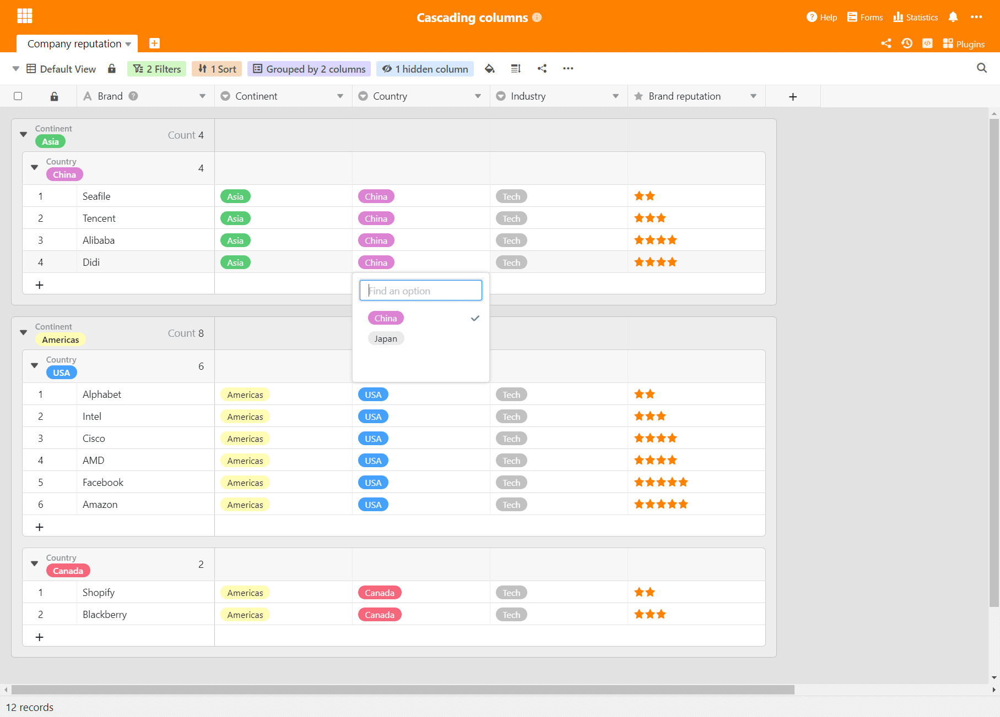
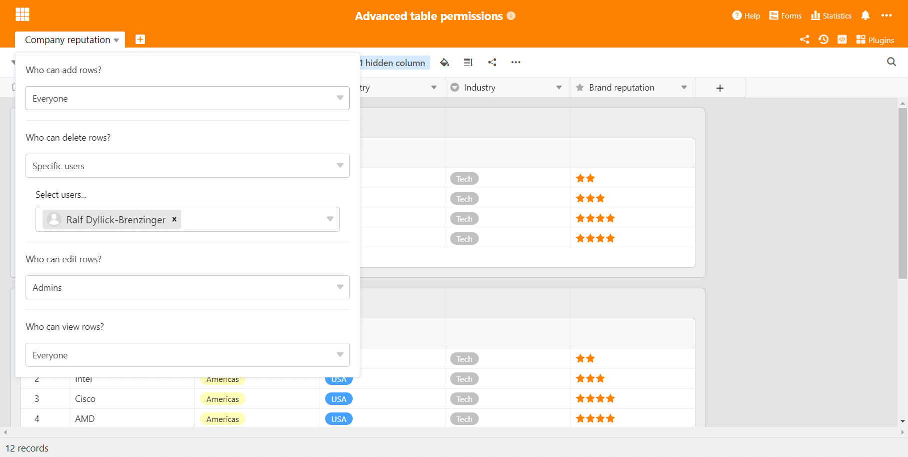

Chez SeaTable, il n'y a pas de pause estivale ! Nous maintenons notre rythme de publication mensuel et, dès aujourd'hui, tous les utilisateurs [de SeaTable Cloud](https://cloud.seatable.io) bénéficient des avantages de la version 2.2. Les automatisations et les applications externes sont deux nouvelles fonctionnalités introduites dans cette version. Nous en parlerons plus souvent dans les prochaines notes de version. Les autres points forts de la nouvelle version sont les groupes imbriqués, les champs de sélection en cascade ainsi que les autorisations de table étendues et les fonctions de traitement des données améliorées. Nous présentons ces nouveautés dans ces notes de version. Comme toujours, vous trouverez la liste complète des modifications dans le [changelog de SeaTable](https://seatable.io/docs/changelog/version-2-2/?lang=auto). Sur Docker Hub, SeaTable 2.2 - dans les deux éditions du serveur SeaTable - sera disponible demain.

## Automations (uniquement pour les abonnements Enterprise)

Les automatisations permettent de se libérer l'esprit pour se concentrer sur l'essentiel en laissant l'application effectuer certaines tâches de manière autonome. Les possibilités d'automatisation sont considérablement étendues dans SeaTable 2.2. Nous continuerons à les développer dans les versions futures.

Quatre automatisations sont prises en charge par SeaTable dans la version 2.2 : _Envoyer une notification_, _Verrouiller une ligne_, _Ajouter une ligne_ et _Modifier une ligne_. L'envoi d'e-mails et l'exécution de scripts suivront prochainement en tant qu'automatisations.

Une automatisation peut être déclenchée de deux manières différentes : Avec l'exécution périodique, les tâches peuvent être exécutées de manière répétée tous les jours, toutes les semaines ou tous les mois, à chaque fois à un jour et une heure donnés. Cela permet par exemple de créer des tâches récurrentes. L'exécution conditionnelle est déclenchée lorsqu'une ou plusieurs conditions sont remplies. Par exemple, si toutes les cellules d'une ligne sont remplies, la ligne est automatiquement bloquée.

## Apps externes (uniquement pour les abonnements Enterprise)

Vous disposez d'un ensemble de données plus important que vous ne souhaitez pas partager en tant que tel, mais sur lequel vous souhaitez autoriser certaines requêtes - idéalement via une page web intégrée à l'offre d'informations existante, un catalogue de produits par exemple ?

C'est exactement ce que vous pouvez désormais faire avec les apps externes introduites dans SeaTable 2.2. Une app externe est accessible via une URL et permet aux visiteurs d'effectuer des requêtes sur un ensemble de données sélectionné. Cet ensemble de données peut être un tableau ou simplement une vue d'un tableau. L'app externe exécute la requête et présente les résultats sous une forme spécifique.

Actuellement, SeaTable propose une présentation des résultats sous forme de tableau. D'autres options de présentation seront ajoutées à l'avenir (par ex. une vue galerie).

## Groupes imbriqués

Depuis la version 1.0, SeaTable permet de regrouper des données. Dans la version actuelle, cette fonction très appréciée a été considérablement améliorée : SeaTable 2.2 permet de regrouper les données selon trois colonnes au maximum. Les groupes de deuxième et troisième niveau sont représentés comme des sous-groupes du niveau supérieur. Bien entendu, les valeurs de colonnes agrégées telles que la somme ou la moyenne sont également calculées et affichées automatiquement pour ces sous-groupes. En combinaison avec des filtres et des tris, le regroupement devient ainsi un outil d'analyse encore plus puissant.

Une autre petite amélioration concernant les groupes : Lors de l'exportation d'une vue vers Excel, les groupes sont également exportés. Dans les versions précédentes, la fonction d'exportation ne prenait pas en compte les groupes.

## Champs de sélection simples en cascade

Vous vous êtes déjà demandé dans l'introduction ce que sont les champs de sélection en cascade ? Voici l'explication : dans les champs de sélection en cascade, la valeur d'un champ de sélection supérieur détermine les options disponibles dans un champ de sélection inférieur. Voici un exemple fictif pour illustrer ce point : Dans le champ de sélection 1, vous choisissez le continent. Si vous choisissez l'Europe, vous pouvez choisir entre la France, l'Allemagne et l'Italie dans le deuxième champ de sélection. Mais si vous choisissez l'Asie comme continent, vous avez le choix entre la Chine et l'Inde.

Compte tenu des avantages des cascades pour la saisie et l'analyse des données, il est étonnant de constater que peu d'applications les prennent directement en charge. Dans Excel, par exemple, les sélections en cascade ne peuvent être mises en œuvre qu'avec difficulté. Nous avons bon espoir qu'avec l'implémentation simple de champs de sélection en cascade dans SeaTable, cette notion se répandra rapidement.

## Plus d'autorisations de tableaux

Les autorisations de table ont été introduites dans SeaTable 2.1. Dans la version 2.2, elles sont complétées par deux autres autorisations. Dans la version actuelle, il est désormais possible de définir quels utilisateurs peuvent accéder à une table

- Créer des lignes,
- Supprimer des lignes,
- Modifier les lignes et
- voir les lignes.

Les autorisations peuvent être définies indépendamment les unes des autres et chaque autorisation peut être limitée à personne, aux administrateurs et à certains utilisateurs.

## Opération supplémentaire de traitement des données

Le traitement des données a également été introduit dans SeaTable 2.1 et il est également amélioré dans SeaTable 2.2. La nouvelle opération de traitement des données _Comparer et relier_ vérifie les valeurs dans deux tableaux et crée automatiquement un lien entre les lignes contenant des valeurs identiques. Si les tables concernées ne sont pas encore liées, les colonnes correspondantes sont créées automatiquement. Ce traitement des données est particulièrement pratique lors de l'importation de données tabulaires à partir d'autres applications. Pensez à deux tableaux Excel qui doivent être reliés entre eux. Cette nouvelle opération de traitement des données permet de le faire avec un minimum d'effort.

Il ne s'agit toutefois que de l'une des deux améliorations : Les opérations de traitement des données peuvent désormais être enregistrées pour une utilisation future. Une fois enregistrées sous un nom, elles peuvent être modifiées et exécutées à nouveau à tout moment.

## Quatre améliorations de détail qui méritent d'être mentionnées

Comme dans toutes les notes de version, nous n'avons que l'embarras du choix face à la multitude d'améliorations. Une présentation détaillée de toutes les nouveautés et améliorations dépasserait notre cadre. Nous souhaitons toutefois mentionner brièvement quatre autres améliorations.

Les colonnes de texte utilisent désormais toute la hauteur de ligne disponible lors de l'édition. Lors de la saisie, le texte est automatiquement coupé en deux et vous gardez facilement une vue d'ensemble, même pour les entrées de données riches en mots.

Les valeurs liées dans une colonne de liaison peuvent être appelées et gérées plus facilement dans SeaTable 2.2 grâce à un nouveau bouton. Jusqu'à présent, il fallait pour cela cliquer dans la zone blanche à droite de la dernière entrée liée, ce qui était inutilement compliqué dans les cellules comportant de nombreuses entrées.

SeaTable dispose désormais d'un journal des e-mails envoyés. Cela rend l'envoi d'e-mails par SeaTable traçable et transparent.

Le code pour l'importation CSV et Excel a été optimisé. Le processus d'importation est ainsi nettement plus rapide et plus fiable. L'exportation de fichiers Excel s'effectue désormais via une nouvelle API interne.
