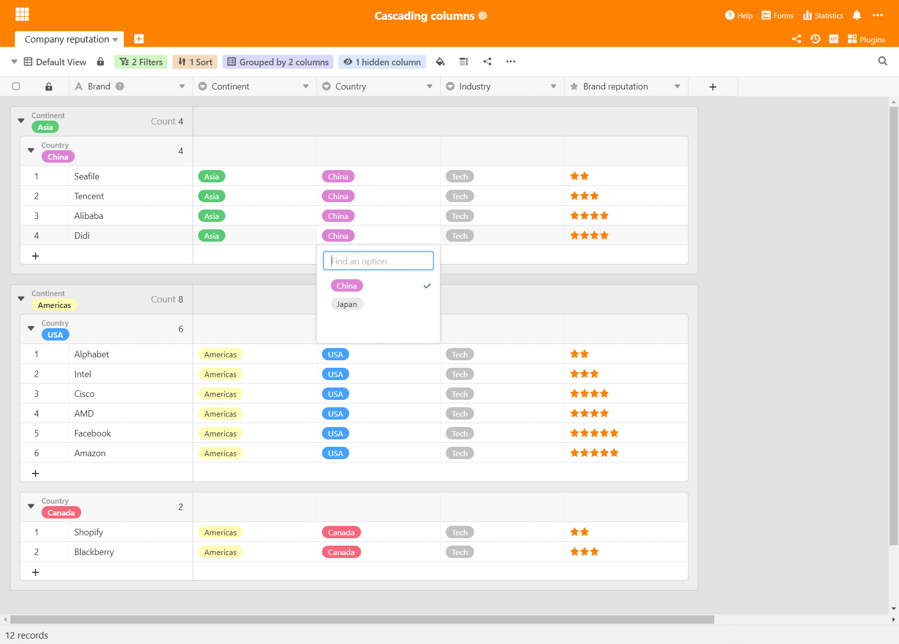

В SeaTable нет летних каникул! Мы поддерживаем ритм ежемесячных релизов, и на сегодняшний день все пользователи [SeaTable Cloud](https://cloud.seatable.io) могут воспользоваться преимуществами версии 2.2. Автоматизация и внешние приложения - две новые функции, представленные в этой версии. Однако мы будем сообщать о них чаще в ближайших выпусках. Среди других особенностей нового выпуска - вложенные группы, каскадные поля выбора, а также расширенные права доступа к таблицам и улучшенные функции обработки данных. Мы представляем эти нововведения в настоящих заметках о выпуске. Гораздо более полный, исчерпывающий список изменений можно найти - как всегда - в [SeaTable Changelog](/ru/docs/changelog/version-2-2/). SeaTable 2.2 - в обеих редакциях SeaTable Server - будет доступен завтра на Docker Hub.

## Автоматизация (только для подписки Enterprise)

Автоматизация освобождает ум для самого необходимого, автономно выполняя определенные задачи с помощью приложения. Возможности автоматизации значительно расширены в SeaTable 2.2. В будущих версиях мы будем расширять их.

В версии 2.2 SeaTable поддерживает четыре автоматизации: _отправка уведомления_, _блокировка строки_, _добавление строки_ и _редактирование_ строки. Отправка электронных писем и выполнение сценариев вскоре будут автоматизированы.

Автоматизация может быть запущена двумя способами: При периодическом выполнении задачи могут выполняться многократно на ежедневной, еженедельной или ежемесячной основе, каждая в определенный день и время. Таким образом, можно создавать повторяющиеся задачи, например. Условное выполнение запускается при выполнении одного или нескольких условий. Например, если все ячейки строки заполнены, то строка автоматически блокируется.

## Внешние приложения (только для корпоративных подписок)

Есть ли у вас большой набор данных, который вы не хотите передавать другим как таковой, но через который вы хотите разрешить определенные запросы - в идеале через веб-сайт, интегрированный в существующее информационное предложение, например, каталог продукции?

С помощью внешних приложений, представленных в SeaTable 2.2, вы теперь можете сделать именно это. Внешнее приложение доступно по URL-адресу и позволяет посетителям выполнять запросы на выбранном наборе данных. Эта запись может быть таблицей или просто представлением таблицы. Внешнее приложение выполняет запрос и отображает результаты в определенной форме.

В настоящее время SeaTable предлагает табличное отображение результатов. В будущем будут добавлены дополнительные варианты отображения (например, вид галереи).

## Вложенные группы

SeaTable поддерживает группировку данных с версии 1.0. В текущей версии эта популярная функция претерпела значительные изменения: в SeaTable 2.2 данные можно группировать по трем столбцам. Группы на втором и третьем уровне отображаются как подгруппы родительского уровня. Конечно, агрегированные значения столбцов, такие как сумма или среднее, также автоматически рассчитываются и отображаются для этих подгрупп. Особенно в сочетании с фильтрами и сортировкой, группировка становится еще более мощным инструментом анализа.

Еще одно незначительное улучшение в плане групп: При экспорте представления в Excel экспортируются и группы. В предыдущих версиях функция экспорта не учитывала группы.

## Каскадные поля одиночного выбора

Во введении вы уже спрашивали себя, что такое каскадные поля выбора? Вот объяснение: В каскадных полях выбора значение в поле выбора более высокого уровня определяет варианты, доступные для выбора в поле выбора более низкого уровня. Для пояснения - вымышленный пример: В поле выбора 1 вы выбираете континент. Если вы выбрали Европу, во втором поле выбора вы можете выбрать между Францией, Германией и Италией. Однако если в качестве континента вы выберете Азию, то для выбора будут доступны Китай и Индия.

Учитывая преимущества каскадов для ввода и оценки данных, удивительно, что лишь немногие приложения поддерживают их напрямую. В Excel, например, каскадные выделения можно реализовать только с усилием. Мы надеемся, что благодаря простой реализации каскадных полей выбора в SeaTable это понятие быстро распространится.

## Дополнительные разрешения для таблиц

В SeaTable 2.1 были введены права доступа к таблицам. В версии 2.2 они расширены еще двумя разрешениями. В текущей версии теперь можно определить, какие пользователи в таблице имеют

- Создавайте линии,
- Удалите строки,
- Редактирование линий и
- линии, которые разрешено видеть.

Разрешения могут быть определены независимо, и каждое разрешение может быть ограничено никем, администраторами и конкретными пользователями.

## Дополнительная операция по обработке данных

Обработка данных также была представлена в SeaTable 2.1, и она также улучшена в SeaTable 2.2. Новая операция обработки данных _Compare and Link_ проверяет значения в двух таблицах и автоматически создает связь между строками с одинаковыми значениями. Если соответствующие таблицы еще не связаны, то соответствующие столбцы создаются автоматически. Такая обработка данных особенно полезна при импорте табличных данных из других приложений. Представьте две таблицы Excel, которые необходимо связать. С помощью новой операции по обработке данных это возможно с наименьшими усилиями.

Однако это лишь одно из двух улучшений: Теперь операции по обработке данных можно сохранять для дальнейшего использования. Сохраненные под именем, они могут быть изменены и выполнены снова в любое время.

## Стоит отметить четыре улучшения в деталях

Как и в каждом выпуске, мы избалованы выбором в связи с большим количеством улучшений. Подробное изложение всех инноваций и усовершенствований вышло бы за рамки данной статьи. Однако мы хотели бы очень коротко упомянуть еще о четырех усовершенствованиях.

Текстовые колонки теперь используют всю доступную высоту строки при редактировании. Текст автоматически заворачивается по мере ввода, и вы можете легко отслеживать многословные записи данных.

В SeaTable 2.2 значения, связанные в колонке ссылок, могут быть вызваны и управляться более легко благодаря новой кнопке. Раньше для этого требовалось щелкнуть в белой области справа от последней связанной записи, что было неоправданно сложно в ячейках с большим количеством записей.

В SeaTable теперь есть журнал отправленных электронных писем. Это делает отправку электронных писем компанией SeaTable отслеживаемой и прозрачной.

Код для импорта CSV и Excel был оптимизирован. Теперь процесс импорта стал намного быстрее и надежнее. Экспорт файлов Excel теперь осуществляется через новый внутренний API.
