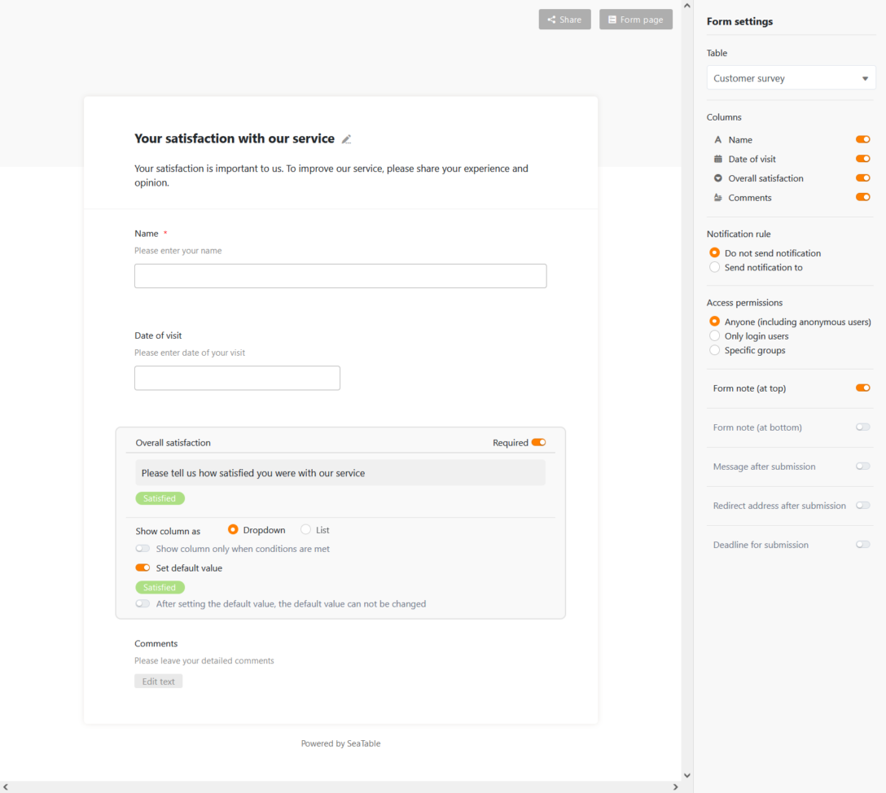

SeaTable version 2.3, available since today, is getting ready to conquer new fields of application. With the archive function, which is presented as a beta in this release, SeaTable is now also recommended for data-intensive use cases: Tables with millions of data records can be stored and evaluated in SeaTable. It is the focus of these release notes. Further innovations and improvements are presented in an overview. The complete list of changes can be found - as always - in the [SeaTable Changelog]().

## Archive function (beta)

Very large tables lead to long loading times and affect the user experience - your own and, in the worst case, that of other users as well. Therefore, SeaTable currently has a hard limit of 150,000 rows per table. In the web interface, it even ends earlier: from 100,000 rows , the table editor no longer allows any write operations.

The new archive function removes this restriction! In addition to the 150,000 rows in the active data stock, millions of rows can be stored in the archive. The archive function thus offers a solution for all those applications for which SeaTable's previous limits were not sufficient.

In terms of evaluation and analysis options, the differences between active and archived rows are manageable: The archive supports all column types. Filters and sorting allow quick evaluation of the data in the archive. And access via API and through [external apps]() is also possible. A search function and full plug-in support is under development.

The central difference is the support of online collaboration in real time: The active rows are completely loaded into the working memory when the table is called up. Every change in a table can thus be transmitted immediately to other users. Archived data is different: When a table is opened, only the first 1,000 rows are loaded from the archive. Additional data can be retrieved page by page. This renunciation of complete loading allows fast display in the web interface, even of tables with many hundreds of thousands rows, but also means renouncing real-time collaboration.

|                              | Normal view | View incl. archived data |
| ---------------------------- | ----------- | ------------------------ |
| Collaborative work           | ✓           |                          |
| Support for all column types | ✓           | ✓#                       |
| Plugin support               | ✓           | ✓ \*                     |
| Read and write access        | ✓           | ✓ \*                     |
| Sorting                      | ✓           | ✓                        |
| Filtering                    | ✓           | ✓                        |
| Grouping                     | ✓           |                          |
| Hide                         | ✓           | ✓ \*                     |
| Search                       | ✓           | ✓ \*                     |

\# In version 2.3, all column types are supported with the exception of formulas and links.  
\* These functions are not yet available in version 2.3.

The archive function is currently in the beta phase and is available immediately in the SeaTable Server. It has not yet been activated in the SeaTable Cloud. It is expected to go live for Enterprise subscribers at the end of Q3/2021.

### Line archiving

The archiving of rows is done manually by the user or automatically by rule.

The new function _Archive view_ was created for manual archiving. It moves all data in the current view to the archive. For example, to archive all rows older than 3 months, simply create a new view, filter by creation date and then call the function.

Automatic archiving moves the oldest 10,000 rows to the archive as soon as the number of rows in a table exceeds the 70,000 mark. Automatic archiving is deactivated by default; it is activated via a switch in the new archive management. The option of controlling archiving individually via a rule set will be added in future versions as required.

Archived rows cannot currently be moved back into the active dataset. Archived data can currently only be accessed in read-only mode. These restrictions will also be removed in the future.

### Evaluation of archived data

Access to the data in the archive is via the new view type Archive View. Once rows has been archived, such an archive view - like other views - can be created via the view menu. Archive views are easily recognised by their own icon in the view navigation.

The archive view shows archived and non-archived rows and allows evaluations of the entire - archived and active - data stock of the table. The familiar analysis tools are available for this purpose. With a plug-in for advanced statistics, there will soon also be a tool with which very large amounts of data can be comprehensively evaluated. For the evaluation possibilities, it is therefore almost irrelevant whether rows is archived or not.

## More improvements

### External links without logs and comments

The table history and comments are not part of the information that one would normally want to make quasi-public via an [external link](). Therefore, logs and comments are no longer displayed in the row details of external links in SeaTable from version 2.3.

### Default values for forms

After [default values for columns](), there are now also default values for form fields in version 2.3. And not only static default values are supported: The variables _creator.id_ and _creator.name_ automatically insert the user ID or user name in the form field for logged-in users.

### Preview for the column type formatted text

The column type formatted text now offers a preview function. If you move the mouse pointer over a cell, the preview window shows the content including all formatting. This way you can get a quick overview without opening the editor.

### Improved page design plugin

The page design plugin can now create and export PDF documents. The file name of the generated PDFs can be defined in the template settings. The file name can be dynamised via variables (e.g. {column name}).

### Column duplication

Tables can be duplicated, views can be duplicated and rows as well. With version 2.3, columns can now also be duplicated.

### Further automation: Send e-mail

The new version extended the automation possibilities of SeaTable: The automation Send email complements the four [automations introduced in version 2.2]() _Send notification_, _Lockrow_ , _Addrow_ and _Editrow_ . Emails are sent via an email account configured in Base.

### First column supports single selections

The first column becomes more flexible! In addition to the column types text, number, date and automatic number, it can now also accept the type single selection.
