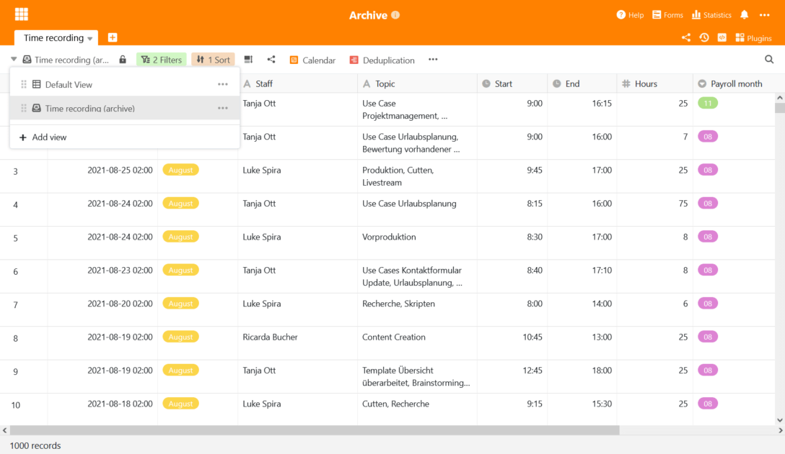

La versión 2.3 de SeaTable, disponible desde hoy, se prepara para conquistar nuevos campos de aplicación. Con la función de archivo, que se presenta como beta en esta versión, SeaTable se recomienda ahora también para casos de uso intensivo de datos: En SeaTable se pueden almacenar y evaluar tablas con millones de registros de datos. Es el objetivo de estas notas de la versión. Otras innovaciones y mejoras se presentan en un resumen. La lista completa de cambios se puede encontrar - como siempre - en el [Changelog de SeaTable](https://seatable.io/es/docs/changelog/version-2-3/).

## Función de archivo (beta)

Las tablas muy grandes provocan largos tiempos de carga y afectan a la experiencia del usuario, la suya propia y, en el peor de los casos, también la de los demás usuarios. Por lo tanto, SeaTable tiene actualmente un límite duro de 150.000 filas por tabla. En la interfaz web, incluso termina antes: a partir de 100.000 filas, el editor de tablas ya no permite ninguna operación de escritura.

La nueva función de archivo elimina esta restricción. Además de las 150.000 filas del conjunto de datos activo, se pueden almacenar millones de filas en el archivo. La función de archivo ofrece así una solución para todas aquellas aplicaciones para las que los límites anteriores de SeaTable no eran suficientes.

En cuanto a las opciones de evaluación y análisis, las diferencias entre las filas activas y las archivadas son manejables: el archivo admite todos los tipos de columnas. Los filtros y la clasificación permiten evaluar rápidamente los datos del archivo. Y también es posible el acceso a través de la API y de [aplicaciones externas](https://seatable.io/es/seatable-release-2-2#Externe_Apps_nur_fuer_Enterprise_Abos/?lang=auto). Se está desarrollando una función de búsqueda y un soporte completo de plug-ins.

La diferencia central es el apoyo a la colaboración en línea en tiempo real: las filas activas se cargan completamente en la memoria de trabajo cuando se llama a la tabla. Así, cada cambio en una tabla puede transmitirse inmediatamente a otros usuarios. Los datos archivados son diferentes: Cuando se abre una tabla, sólo se cargan las primeras 1.000 filas desde el archivo. Los datos adicionales se pueden recuperar página por página. Esta renuncia a la carga completa permite una visualización rápida en la interfaz web, incluso de tablas con muchos cientos de miles de filas, pero también supone renunciar a la colaboración en tiempo real.

|                                          | Vista normal | Ver incl. datos archivados |
| ---------------------------------------- | ------------ | -------------------------- |
| Trabajo en colaboración                  | ✓            |                            |
| Soporte para todos los tipos de columnas | ✓            | ✓#                         |
| Soporte de plugins                       | ✓            | ✓ \*                       |
| Acceso de lectura y escritura            | ✓            | ✓ \*                       |
| Clasificación                            | ✓            | ✓                          |
| Filtrado                                 | ✓            | ✓                          |
| Agrupación                               | ✓            |                            |
| Ocultar                                  | ✓            | ✓ \*                       |
| Buscar en                                | ✓            | ✓ \*                       |

\# En la versión 2.3, se admiten todos los tipos de columnas, a excepción de las fórmulas y los enlaces.  
\* Estas funciones aún no están disponibles en la versión 2.3.

La función de archivo está actualmente en fase beta y está disponible de inmediato en el servidor SeaTable. Todavía no se ha activado en la nube de SeaTable. Se espera que entre en funcionamiento para los abonados de empresas a finales del tercer trimestre de 2021.

### Archivo de líneas

Las líneas se archivan manualmente por el usuario o automáticamente por regla.

Se ha creado la nueva función _Vista de archivo_ para archivar manualmente. Mueve todos los datos de la vista actual al archivo. Por ejemplo, para archivar todas las filas con más de 3 meses de antigüedad, basta con crear una nueva vista, filtrar por la fecha de creación y luego llamar a la función.

El archivado automático mueve las 10.000 filas más antiguas al archivo en cuanto el número de filas de una tabla supera la marca de 70.000. El archivo automático está desactivado por defecto; se activa mediante un interruptor en la nueva gestión de archivos. En futuras versiones se añadirá la posibilidad de controlar el archivo de forma individual a través de un conjunto de reglas, según sea necesario.

Actualmente, las líneas archivadas no se pueden volver a mover al conjunto de datos activo. Actualmente sólo se puede acceder a los datos archivados en modo de sólo lectura. Estas restricciones también se eliminarán en el futuro.

### Evaluación de los datos archivados

El acceso a los datos del archivo se realiza a través del nuevo tipo de vista Vista de Archivo. Una vez archivadas las filas, dicha vista de archivo -como otras vistas- puede crearse a través del menú de vistas. Las vistas de archivo se reconocen fácilmente por su propio icono en la navegación de vistas.

La vista de archivo muestra las filas archivadas y no archivadas y permite evaluar todo el stock de datos -archivados y activos- de la tabla. Para ello se dispone de las conocidas herramientas de análisis. Con un complemento para estadísticas avanzadas, pronto se dispondrá de una herramienta que podrá utilizarse para evaluar exhaustivamente cantidades muy grandes de datos. Por lo tanto, para las posibilidades de evaluación, es casi irrelevante que las filas se archiven o no.

## Otras mejoras

### Enlaces externos sin registros ni comentarios

El historial de la mesa y los comentarios no forman parte de la información que normalmente se quiere hacer casi pública a través de un [enlace externo](). Por lo tanto, los registros y los comentarios ya no se muestran en los detalles de las filas de los enlaces externos en SeaTable a partir de la versión 2.3.

### Valores por defecto de los formularios

Después de los [valores por defecto para las columnas](), ahora también hay valores por defecto para los campos del formulario en la versión 2.3. Y no sólo se admiten valores estáticos por defecto: Las variables _creator.id_ y _creator._ name insertan automáticamente el ID de usuario o el nombre de usuario en el campo del formulario para los usuarios conectados.

### Vista previa del texto formateado del tipo de columna

El texto formateado de tipo columna ofrece ahora una función de vista previa. Si mueve el puntero del ratón sobre una celda, la ventana de vista previa muestra el contenido incluyendo todo el formato. De este modo, puede obtener una visión general rápida sin necesidad de abrir el editor.

### Plugin de diseño de páginas mejorado

El plugin de diseño de páginas ahora puede crear y exportar documentos PDF. El nombre del archivo de los PDF generados puede definirse en la configuración de la plantilla. El nombre del archivo se puede dinamizar mediante variables (por ejemplo, {nombre de la columna}).

### Duplicación de columnas

Las tablas se pueden duplicar, las vistas se pueden duplicar y las filas también. Con la versión 2.3, ahora también se pueden duplicar las columnas.

### Más automatización: Enviar correo electrónico

La nueva versión amplía las opciones de automatización de SeaTable: la automatización Enviar correo electrónico complementa las cuatro [automatizaciones introducidas en la versión 2.2](https://seatable.io/es/seatable-release-2-2#Automationen_nur_fuer_Enterprise_Abos/?lang=auto): _Enviar notificación_, _Bloquear fila_, _Añadir fila_ y _Editar_ fila. Los correos electrónicos se envían a través de una cuenta de correo electrónico configurada en Base.

### La primera columna admite selecciones simples

La primera columna se vuelve más flexible. Además de los tipos de columna texto, número, fecha y número automático, ahora también puede aceptar el tipo selección única.
