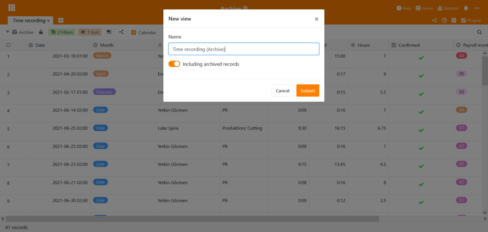
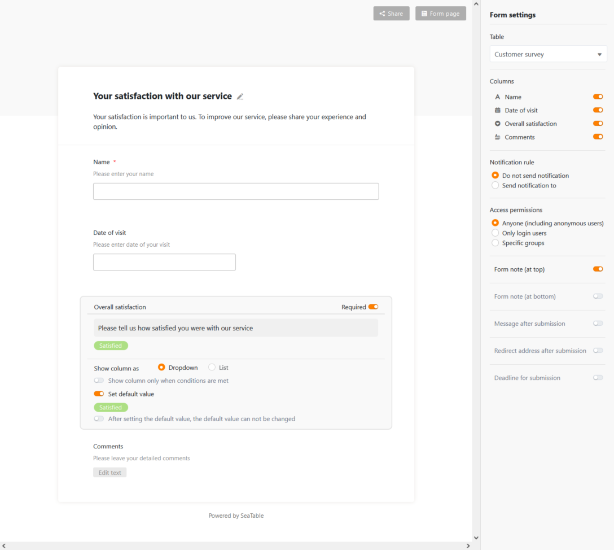

La version 2.3 de SeaTable, disponible depuis aujourd'hui, s'apprête à conquérir de nouveaux champs d'application. Avec la fonction d'archivage, qui est présentée en version bêta dans cette version, SeaTable est désormais également recommandé pour les cas d'utilisation intensive des données : Des tableaux contenant des millions d'enregistrements de données peuvent être stockés et analysés dans SeaTable. C'est l'objet de ces notes de mise à jour. D'autres innovations et améliorations sont présentées dans un aperçu. La liste complète des changements peut être trouvée - comme toujours - dans le [Changelog de SeaTable]().

## Fonction d'archivage (bêta)

Les tableaux très volumineux entraînent des temps de chargement longs et nuisent à l'expérience des utilisateurs - la vôtre et, dans le pire des cas, celle des autres utilisateurs. Par conséquent, SeaTable a actuellement une limite stricte de 150.000 lignes par table. Dans l'interface web, cela se termine même plus tôt : à partir de 100 000 lignes, l'éditeur de tableaux ne permet plus aucune opération d'écriture.

La nouvelle fonction d'archivage élimine cette restriction ! En plus des 150 000 lignes de l'ensemble de données actif, des millions de lignes peuvent être stockées dans l'archive. La fonction d'archivage offre donc une solution pour toutes les applications pour lesquelles les limites précédentes de SeaTable n'étaient pas suffisantes.

En ce qui concerne les possibilités d'évaluation et d'analyse, les différences entre les lignes actives et les lignes archivées sont minimes : les archives prennent en charge tous les types de colonnes. Des filtres et des tris permettent d'évaluer rapidement les données dans les archives. Et l'accès par API et par des [apps externes]() est également possible. Une fonction de recherche et la prise en charge complète des plugins sont en cours de développement.

La principale différence réside dans la prise en charge de la collaboration en ligne en temps réel : les lignes actives sont entièrement chargées dans la mémoire de travail lorsque le tableau est appelé. Chaque modification d'une table peut ainsi être transmise immédiatement aux autres utilisateurs. Les données archivées sont différentes : Lorsqu'une table est ouverte, seules les 1 000 premières lignes sont chargées à partir de l'archive. Des données supplémentaires peuvent être récupérées page par page. Ce renoncement au chargement complet permet un affichage rapide dans l'interface web, même de tableaux comportant plusieurs centaines de milliers de lignes, mais il implique également de renoncer à la collaboration en temps réel.

|                                               | Vue normale | Vue incluse. données archivées |
| --------------------------------------------- | ----------- | ------------------------------ |
| Travail en collaboration                      | ✓ ;         |                                |
| Prise en charge de tous les types de colonnes | ✓ ;         | ✓ ;#                           |
| Support des plugins                           | ✓ ;         | ✓ ; \*                         |
| Accès en lecture et en écriture               | ✓ ;         | ✓ ; \*                         |
| Triage                                        | ✓ ;         | ✓ ;                            |
| Filtrage                                      | ✓ ;         | ✓ ;                            |
| Regroupement                                  | ✓ ;         |                                |
| Cacher                                        | ✓ ;         | ✓ ; \*                         |
| Recherche                                     | ✓ ;         | ✓ ; \*                         |

\# Dans la version 2.3, tous les types de colonnes sont supportés à l'exception des formules et des liens.  
\* Ces fonctions ne sont pas encore disponibles dans la version 2.3.

La fonction d'archivage est actuellement en phase bêta et est disponible immédiatement dans le serveur SeaTable. Il n'a pas encore été activé dans le nuage SeaTable. Il devrait être mis en service pour les abonnés de l'entreprise à la fin du troisième trimestre 2021.

### Archivage de lignes

Les lignes sont archivées manuellement par l'utilisateur ou automatiquement par règle.

La nouvelle fonction _Vue des archives_ a été créée pour l'archivage manuel. Il déplace toutes les données de la vue actuelle vers l'archive. Par exemple, pour archiver toutes les lignes de plus de 3 mois, il suffit de créer une nouvelle vue, de filtrer par la date de création, puis d'appeler la fonction.

L'archivage automatique déplace les 10 000 lignes les plus anciennes vers l'archive dès que le nombre de lignes d'une table dépasse la barre des 70 000. L'archivage automatique est désactivé par défaut ; il est activé par un commutateur dans la nouvelle gestion des archives. La possibilité de contrôler l'archivage individuellement par le biais d'un ensemble de règles sera ajoutée dans les futures versions, selon les besoins.

Les lignes archivées ne peuvent actuellement pas être replacées dans l'ensemble de données actif. Les données archivées ne sont actuellement accessibles qu'en mode lecture seule. Ces restrictions seront également supprimées à l'avenir.

### Évaluation des données archivées

L'accès aux données dans les archives se fait via le nouveau type de vue Vue des archives. Une fois que les lignes ont été archivées, une telle vue d'archives - comme les autres vues - peut être créée via le menu des vues. Les vues d'archives sont facilement reconnaissables grâce à leur propre icône dans la navigation des vues.

La vue des archives montre les lignes archivées et non archivées et permet d'évaluer l'ensemble du stock de données - archivé et actif - de la table. Les outils d'analyse familiers sont disponibles à cet effet. Avec un plug-in pour les statistiques avancées, on disposera bientôt d'un outil permettant d'évaluer de manière exhaustive de très grandes quantités de données. Pour les possibilités d'évaluation, il est donc presque sans importance que les lignes soient archivées ou non.

## Nouvelles améliorations

### Liens externes sans journaux ni commentaires

L'historique de la table et les commentaires ne font pas partie des informations que l'on souhaite normalement rendre quasi-publiques via un [lien externe](). Par conséquent, les journaux et les commentaires ne sont plus affichés dans les détails des lignes des liens externes dans SeaTable à partir de la version 2.3.

### Valeurs par défaut pour les formulaires

Après les [valeurs par défaut pour les colonnes](), il y a maintenant aussi des valeurs par défaut pour les champs de formulaire dans la version 2.3. Et les valeurs statiques par défaut ne sont pas les seules à être prises en charge : Les variables _creator.id_ et _creator.name_ insèrent automatiquement l'ID ou le nom de l'utilisateur dans le champ du formulaire pour les utilisateurs connectés.

### Aperçu du texte formaté du type de colonne

Le texte formaté de type colonne offre désormais une fonction d'aperçu. Si vous déplacez le pointeur de la souris sur une cellule, la fenêtre d'aperçu affiche le contenu, y compris le formatage. De cette façon, vous pouvez obtenir un aperçu rapide sans ouvrir l'éditeur.

### Amélioration du plugin de conception de pages

Le plugin de conception de pages peut désormais créer et exporter des documents PDF. Le nom de fichier des PDF générés peut être défini dans les paramètres du modèle. Le nom du fichier peut être dynamisé par des variables (par exemple, {nom de la colonne}).

### Duplication des colonnes

Les tables peuvent être dupliquées, les vues peuvent être dupliquées et les rangées également. Avec la version 2.3, les colonnes peuvent désormais être dupliquées.

### Automatisation supplémentaire : Envoyer un e-mail

La nouvelle version a étendu les possibilités d'automatisation de SeaTable : l'automatisation Envoyer un e-mail complète les quatre [automatismes introduits]() dans la [version 2.2](), à savoir _Envoyer une notification_, _Verrouiller_ une ligne, _Ajouter_ une ligne et _Modifier une ligne_. L'envoi des e-mails se fait via un compte e-mail configuré dans la base.

### La première colonne prend en charge les sélections simples

La première colonne devient plus flexible ! En plus des types de colonnes texte, nombre, date et nombre automatique, elle peut désormais accepter le type sélection unique.
