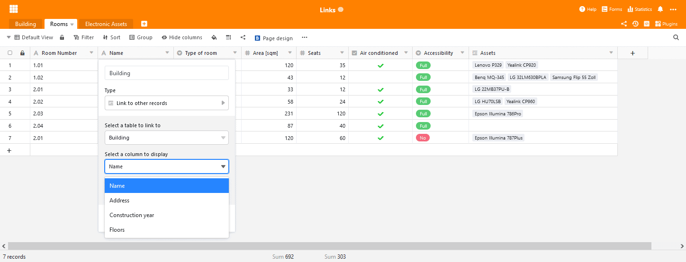
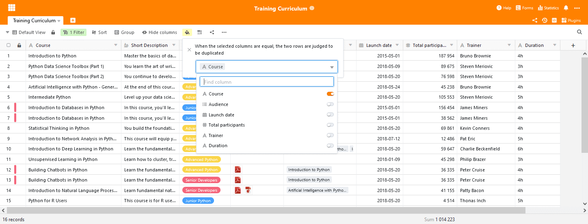

SeaTable 2.4 hat das Licht der Welt erblickt! Die jüngste Inkarnation des SeaTable Servers wurde Ende vergangener Woche auf [Docker Hub](https://hub.docker.com/u/seatable) hochgeladen und SeaTable Cloud wurde heute Morgen aktualisiert. Die neue Version bietet eine Vielzahl von Verbesserungen und neuen Funktionen: Die Ansichtsnavigation ist nun andockbar, der Spaltentyp Verknüpfung zu anderen Einträgen bietet erweiterte Einstellungen, eine neue und eine verbesserte Datenverarbeitungsoperation machen die quantitative Analyse einfacher. Außerdem bietet eine neue bedingte Formatierung Hilfe mit großen Datensätzen. Und dies sind nur die Funktionen, die aus der Masse hervorstechen. SeaTable 2.4 bietet darüber hinaus noch viel mehr. Sie finden die wichtigsten Informationen über das neue Release in diesen Release Notes. Sie finden die komplette Änderungsliste – wie immer im [Changelog](https://seatable.io/docs/changelog/version-2-4/).

## Andockbare Ansichtsnavigation

Ansichten bieten einzigartige Perspektiven auf die Daten in einer SeaTable Tabelle und sind fantastische Tools für die Datenanalyse. Aber, so das Feedback von Nutzerseite, der Wechsel zwischen den Ansichten ist unnötig kompliziert.

Mit SeaTable 2.4 führen wir die andockbare Ansichtsnavigation ein, die die Auswahl und den Wechsel zwischen Ansichten so einfach macht wie die Navigation in Ordnern in einem Dateimanager à la Windows Explorer oder dem Finder auf dem Mac. Bei angedockter Navigation wird die Liste der Ansichten über die vollständige linke Seite des Tabelleneditors aufgezogen, so dass die Ansichten direkt zur Auswahl zur Verfügung stehen. Um unterschiedliche Bedürfnisse berücksichtigen zu können, ist die Weite der angedockten Navigation individuell je nach Bedarf einstellbar. Wenn Sie häufig zwischen Ansichten wechseln müssen, dann wird Ihnen diese Neuerung viel Klick- und Mausarbeit ersparen.

## Verknüpfung zu anderen Einträgen viel flexibler

Der Spaltentyp Verknüpfung zu anderen Einträgen ist vermutlich SeaTables wichtigster. SeaTable ist eben nicht einfach ein weiteres [Online-Spreadsheet](die-online-tabellenkalkulation-fuer-alle-ihre-aufgaben/)! Wie kein anderer Spaltentypen steht dieser Spaltentyp dafür. Und in SeaTable 2.4 haben wir diesen Spaltentyp nun noch besser gemacht.

In früheren SeaTable Versionen hat die Verknüpfung immer den Wert der ersten Spalte des verlinkten Eintrags gezeigt. Von nun ab können Sie auswählen, welcher Spaltenwert der verknüpften Zeile angezeigt werden soll. Diese Auswahl erfolgt einfach über ein Dropdown-Menü in der Konfiguration der Verknüpfungsspalte. Was klein klingt, ist von großer Bedeutung! Stellen Sie sich vor, die erste Spalte in der verknüpften Tabelle ist eine Autonummernspalte. Diese Werte sind für Sie ohne relevante Information, die Anzeige ohne nennenswerte Bedeutung. In der neuen Version wählen Sie nun eine Spalte die aussagekräftigere Informationen enthält. So wird die Erstellung von Verknüpfung vereinfacht und die Tabelle wird mit weniger Lookup-Spalten kompakter. Schließlich macht die überarbeitete Verknüpfungsspalte auch Webformulare leistungsfähiger für Umfragen und Erhebungen. Die ausgewählte Anzeigespalte ist auch die, die ein Besucher im Webformular sieht und aus denen er auswählen kann. Wir sind überzeugt, dass Sie von der neuen Funktion genauso angetan sein werden wie wir.

## Duplikate automatisch hervorheben

Sie wollen alle Duplikate in Ihrer Tabelle ermitteln? Mit SeaTable 2.4 haben Sie ab sofort nicht eine, sondern zwei Möglichkeiten, dies zu tun: Sie können das Plugin für Datendeduplizierung verwenden oder die neue bedingte Formatierungsoption “Duplikate hervorheben”. Diese Formatierungsoption markiert alle Duplikatzeilen in der aktiven Tabelle. Durch die Auswahl der Vergleichsspalten können Sie exakt definieren, was ein Duplikat ausmacht.

Der große Vorteil der bedingten Formatierung im Vergleich zum Plugin ist die Tatsache, dass Sie den Tabelleneditor nicht verlassen. Die Anzeige der Duplikate erfolgt dort, wo Sie Zeilen bearbeiten, Zeilen löschen als auch Filter und Sortierungen verwenden können. (Das Plugin bleibt weiterhin Mittel der Wahl wenn Sie automatisch alle Duplikate löschen wollen.)

## Mehr Datenverarbeitungsoperationen

Die Datenverarbeitungsoperationen wurden in SeaTable 2.1 eingeführt und wurden seitdem kontinuierlich verbessert. SeaTable 2.4 ist keine Ausnahme in dieser Hinsicht. SeaTable 2.4 bietet mit “Prozentualen Anteil berechnen” eine ganz neue Datenverarbeitungsoperation und verbessert die bestehende Operation “Vergleichen und verknüpfen”.

Die Operation “Prozentualen Anteil berechnen” ermittelt für jede Zeile in der aktiven Ansicht den Anteil des Spaltenwert an der Spaltensumme. Wenn die Operation für eine gruppierte Ansicht ausgeführt wird, dann bezieht sich der Anteilswert auf die Spaltensumme der Gruppe. Natürlich kann die Operation, einmal eingerichtet, unter einem Namen für die spätere Wiederverwendung abgespeichert werden.

Die verbesserte Operation “Vergleichen und verknüpfen” bietet nun mehr Kontrolle über die Verknüpfung von Einträgen. Bisher erstellte SeaTable Verknüpfungen zwischen Einträgen mit identischen Werten einer Spalte. Beginnend mit SeaTable 2.4 können nun mehrere Spaltenpaare ausgewählt werden. Eine Verknüpfung wird nur dann erstellt, wenn die Zeilen identischen Werten in allen ausgewählten Spalten haben.

## Unzählige Detailverbesserungen

Abschließend noch einige weitere Verbesserungen, die in diesen Release Notes nicht unerwähnt bleiben sollten:

SeaTable 2.4 erweiterte die Liste der Bilddateiformate mit Vorschaufunktion um das TIFF-Format. Nun können JPG/JGEG, PNG, GIF und TIFF Bilddatei direkt in SeaTable betrachtet werden.

Weil Minimum, Maximum, Summe und Durchschnitt nicht immer aussagekräftige Summenwerte für Spalten darstellen, bietet SeaTable nun auch eine Option “Keine Berechnung”. Wenn gewählt, dann berechnet SeaTable keinen Werte, weder für die gesamt Spalte noch für einzelne Gruppen.

SeaTable rendert den Inhalt einer Zelle mit formatierten Text direkt im Tabelleneditor, wenn die Zeilenhöhe auf vierfach eingestellt ist.

Schaltflächen haben mit der Version 2.4 einen neuen Trick gelernt: Mit nur einem Mausklick erstellt SeaTable ein PDF-Dokument mit dem Seitendesign-Plugin und speichert es in einer Spalte vom Typ Datei.
