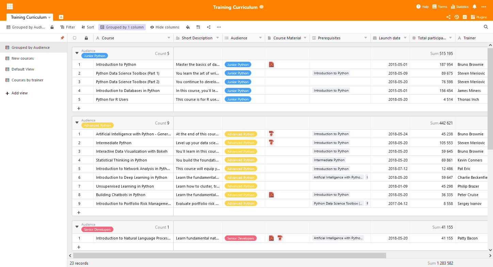
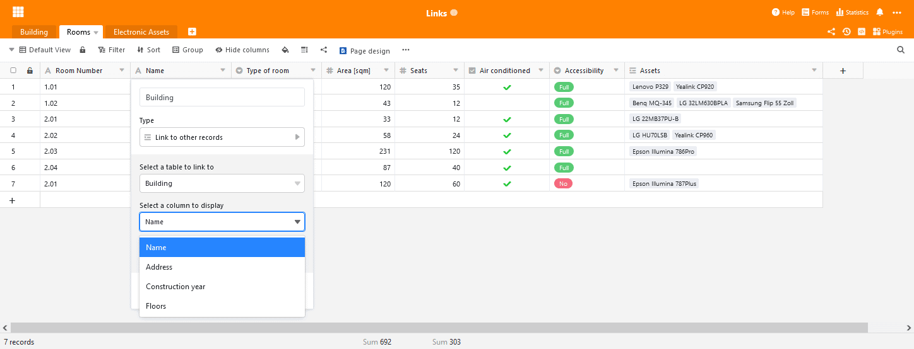
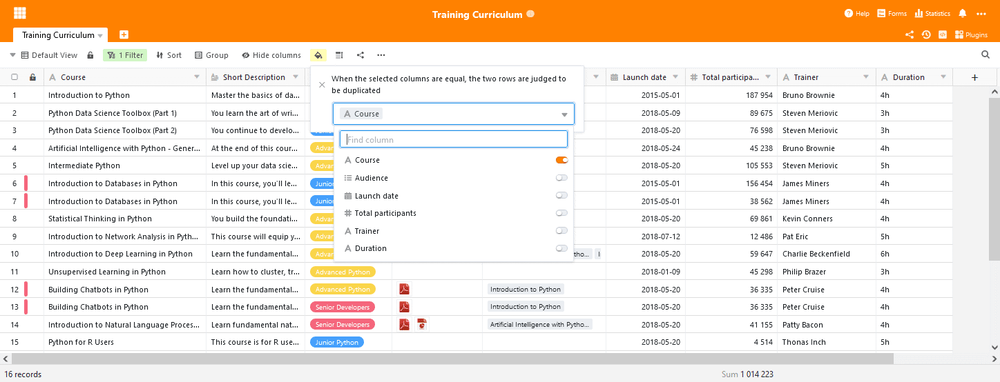

SeaTable 2.4 has seen the light of day! The latest incarnation of the SeaTable Server was uploaded to [Docker](https://hub.docker.com/u/seatable) Hub at the end of last week and SeaTable Cloud was updated this morning. The new version offers a number of improvements and new features: View navigation is now dockable, the Link to Other Entries column type offers enhanced settings, a new and improved data processing operation make quantitative analysis easier. In addition, a new conditional formatting offers help with large data sets. And these are just the features that stand out from the crowd. SeaTable 2.4 also offers much more. You will find the most important information about the new release in these release notes. You will find the complete list of changes - as always in the [changelog]().

## Dockable view navigation

Views provide unique perspectives on the data in a SeaTable table and are fantastic tools for data analysis. But, according to user feedback, switching between views is unnecessarily complicated.

With SeaTable 2.4 we introduce dockable view navigation, which makes selecting and switching between views as easy as navigating folders in a file manager à la Windows Explorer or the Finder on the Mac. With the navigation docked, the list of views is expanded across the full left side of the table editor, making the views directly available for selection. To accommodate different needs, the width of the docked navigation can be set individually according to requirements. If you have to switch between views frequently, this innovation will save you a lot of clicking and mouse work.

## Linking to other entries much more flexible

The column type Link to other entries is probably SeaTable's most important. SeaTable is not just another online spreadsheet! Like no other column type, this column type stands for that. And in SeaTable 2.4 we have made this column type even better.

In previous SeaTable versions, the link always showed the value of the first column of the linked entry. From now on you can select which column value of the linked row should be shown. This selection is easily done via a dropdown menu in the link column configuration. What sounds small is of great importance! Imagine that the first column in the linked table is an autonumber column. These values are without relevant information for you, the display without significant meaning. In the new version you now choose a column that contains more meaningful information. This simplifies link creation and makes the table more compact with fewer lookup columns. Finally, the revised link column also makes web forms more powerful for polls and surveys. The selected display column is also the one that a visitor sees and can choose from in the web form. We are confident that you will be as excited about the new feature as we are.

## Automatically highlight duplicates

Want to identify all duplicates in your table? With SeaTable 2.4 you now have not one, but two ways to do this: you can use the data deduplication plugin or the new conditional formatting option "Highlight duplicates". This formatting option highlights all duplicate rows in the active table. By selecting the comparison columns, you can define exactly what constitutes a duplicate.

The big advantage of conditional formatting compared to the plugin is the fact that you do not leave the table editor. The duplicates are displayed where you can edit rows , delete rows as well as use filters and sorting. (The plugin remains the tool of choice if you want to automatically delete all duplicates).

## More data processing operations

Data processing operations were introduced in SeaTable 2.1 and have been continuously improved since then. SeaTable 2.4 is no exception in this regard. SeaTable 2.4 offers a brand new data processing operation, "Calculate Percentage", and improves the existing "Compare and Concatenate" operation.

The operation "Calculate percentage" determines for each row in the active view the proportion of the column value to the column total. If the operation is performed for a grouped view, then the proportion value refers to the column total of the group. Of course, once set up, the operation can be saved under a name for later reuse.

The improved operation "Compare and Link" now provides more control over the linking of entries. Previously, SeaTable created links between entries with identical values of a column. Starting with SeaTable 2.4, multiple pairs of columns can now be selected. A link is only created if the rows have identical values in all selected columns.

## Countless detail improvements

Finally, a few more improvements that should not go unmentioned in these release notes:

SeaTable 2.4 extended the list of image file formats with preview function by the TIFF format. Now JPG/JGEG, PNG, GIF and TIFF image files can be viewed directly in SeaTable.

Because minimum, maximum, sum and average do not always represent meaningful sum values for columns, SeaTable now also offers a "No calculation" option. If selected, SeaTable will not calculate any values, neither for the whole column nor for single groups.

SeaTable renders the contents of a cell with formatted text directly in the table editor when the row height is set to quad.

Buttons have learned a new trick with version 2.4: With just one mouse click, SeaTable creates a PDF document with the page design plugin and saves it in a column of the type file.
