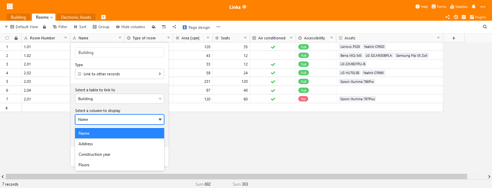

O SeaTable 2.4 viu a luz do dia! A última encarnação do SeaTable Server foi carregada em [Docker](https://hub.docker.com/u/seatable) Hub no final da semana passada e o SeaTable Cloud foi actualizado esta manhã. A nova versão oferece uma série de melhorias e novas funcionalidades: Ver navegação está agora acoplável, o tipo de coluna Link to Other Entries oferece configurações melhoradas, uma nova e melhorada operação de processamento de dados torna a análise quantitativa mais fácil. Além disso, uma nova formatação condicional oferece ajuda com grandes conjuntos de dados. E estas são apenas as características que se destacam da multidão. A SeaTable 2.4 também oferece muito mais. Encontrará as informações mais importantes sobre a nova versão nestas notas de lançamento. Encontrará a lista completa de alterações - como sempre no [changelog](https://seatable.io/pt/docs/changelog/version-2-4/).

## Navegação com vista de doca

As vistas fornecem perspectivas únicas sobre os dados de uma tabela SeaTable e são ferramentas fantásticas para a análise de dados. Mas, de acordo com o feedback do utilizador, mudar de opinião é desnecessariamente complicado.

Com o SeaTable 2.4 introduzimos a navegação com vista docável, o que torna a selecção e comutação entre vistas tão fácil como a navegação em pastas num gestor de ficheiros à la Windows Explorer ou no Finder no Mac. Com a navegação acoplada, a lista de vistas é expandida por todo o lado esquerdo do editor de tabelas, tornando as vistas directamente disponíveis para selecção. Para acomodar diferentes necessidades, a largura da navegação ancorada pode ser definida individualmente de acordo com os requisitos. Se tiver de mudar frequentemente de opinião, esta inovação irá poupar-lhe muitos cliques e trabalho com o rato.

## Ligação a outras entradas muito mais flexível

O tipo de coluna Ligação a outras entradas é provavelmente a mais importante do SeaTable. O SeaTable não é apenas mais uma folha de cálculo online! Como nenhum outro tipo de coluna, este tipo de coluna representa isso. E no SeaTable 2.4 tornámos este tipo de coluna ainda melhor.

Nas versões anteriores do SeaTable, a ligação mostrava sempre o valor da primeira coluna da entrada ligada. A partir de agora, pode seleccionar qual o valor da coluna da linha ligada que deve ser exibido. Esta selecção é feita facilmente através de um menu dropdown na configuração da coluna de ligação. O que parece pequeno é de grande importância! Imagine que a primeira coluna na tabela ligada é uma coluna de números automáticos. Estes valores não têm informação relevante para si, a exibição sem significado significativo. Na nova versão, selecciona agora uma coluna que contém informações mais significativas. Isto simplifica a criação de ligações e torna a tabela mais compacta com menos colunas de pesquisa. Finalmente, a coluna de ligação revista também torna os formulários web mais poderosos para inquéritos e sondagens. A coluna de pesquisa seleccionada é também a que um visitante vê e pode escolher no formulário web. Estamos convencidos de que será tão apreciado com a nova característica como nós somos.

## Destacar automaticamente as duplicações

Pretende identificar todos os dados duplicados na sua tabela? Com o SeaTable 2.4, tem agora não uma, mas duas formas de o fazer: pode utilizar o plug-in de desduplicação de dados ou a nova opção de formatação condicional "Destacar duplicados". Esta opção de formatação destaca todas as linhas duplicadas na tabela ativa. Ao selecionar as colunas de comparação, pode definir exatamente o que constitui um duplicado.

A grande vantagem da formatação condicional em comparação com o plugin é o facto de não se abandonar o editor de tabelas. Os duplicados são exibidos onde se pode editar linhas, apagar linhas e utilizar filtros e triagem. (O plugin continua a ser a ferramenta de escolha se se pretender eliminar automaticamente todas as duplicações).

## Mais operações de tratamento de dados

As operações de processamento de dados foram introduzidas no SeaTable 2.1 e têm sido continuamente melhoradas desde então. O SeaTable 2.4 não é exceção a este respeito. O SeaTable 2.4 oferece uma nova operação de processamento de dados, "Calcular Percentagem", e melhora a operação existente "Comparar e Concatenar".

A operação "Calcular quota percentual" determina a quota do valor da coluna no total da coluna para cada linha na vista ativa. Se a operação for executada para uma visão agrupada, então o valor da proporção refere-se ao total da coluna do grupo. Naturalmente, uma vez configurada, a operação pode ser guardada com um nome para ser reutilizada mais tarde.

A operação melhorada "Comparar e ligar" oferece agora mais controlo sobre a ligação de entradas. Anteriormente, o SeaTable criava ligações entre entradas com valores idênticos numa coluna. A partir do SeaTable 2.4, podem agora ser seleccionados vários pares de colunas. Uma ligação só é criada se as linhas tiverem valores idênticos em todas as colunas seleccionadas.

## Melhorias incontáveis nos detalhes

Finalmente, mais algumas melhorias que não devem passar despercebidas nestas notas de lançamento:

SeaTable 2.4 ampliou a lista de formatos de ficheiros de imagem com função de pré-visualização pelo formato TIFF. Agora os ficheiros de imagem JPG/JGEG, PNG, GIF e TIFF podem ser visualizados directamente em SeaTable.

Uma vez que o mínimo, o máximo, a soma e a média nem sempre representam valores de soma significativos para as colunas, o SeaTable oferece agora também uma opção "Sem cálculo". Se selecionada, o SeaTable não calcula quaisquer valores, nem para toda a coluna nem para grupos individuais.

SeaTable torna o conteúdo de uma célula com texto formatado directamente no editor de tabela quando a altura da linha está definida para quad.

Os botões aprenderam um novo truque com a versão 2.4: Com apenas um clique do rato, o SeaTable cria um documento PDF com o plugin de desenho da página e guarda-o numa coluna do tipo ficheiro.
