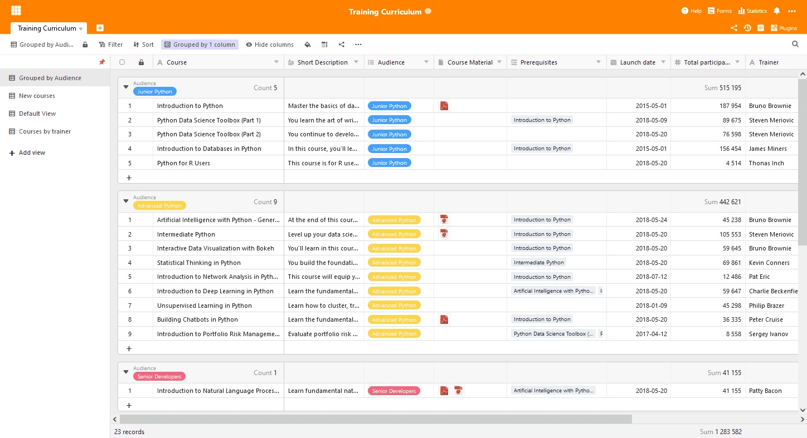
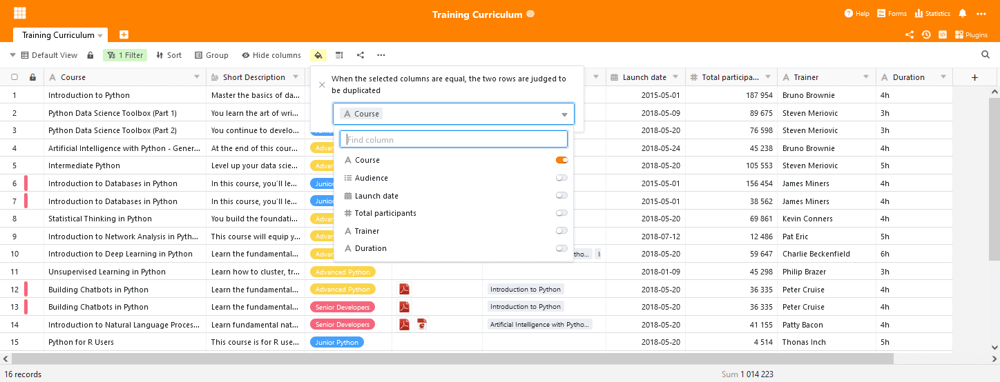

SeaTable 2.4 увидел свет! Последняя инкарнация сервера SeaTable Server была загружена на [Docker](https://hub.docker.com/u/seatable) Hub в конце прошлой недели, а SeaTable Cloud был обновлен сегодня утром. Новая версия предлагает ряд улучшений и новых возможностей: Навигация по просмотрам стала докстанционной, тип колонки "Ссылка на другие записи" предлагает расширенные настройки, новая и улучшенная операция обработки данных упрощает количественный анализ. Кроме того, новое условное форматирование помогает работать с большими наборами данных. И это только те характеристики, которые выделяют его из толпы. SeaTable 2.4 также предлагает гораздо больше. Самую важную информацию о новом выпуске вы найдете в этих примечаниях к выпуску. Полный список изменений вы найдете, как всегда, в [журнале изменений](https://seatable.io/ru/docs/changelog/version-2-4/).

## Навигация по док-станциям

Представления обеспечивают уникальный взгляд на данные в таблице SeaTable и являются фантастическими инструментами для анализа данных. Но, по отзывам пользователей, переключение между видами неоправданно усложнено.

В SeaTable 2.4 мы ввели навигацию по представлениям в доке, что делает выбор и переключение между представлениями таким же простым, как навигация по папкам в файловом менеджере, например, в Проводнике Windows или Finder на Mac. Когда навигация пристыкована, список представлений разворачивается на всю левую сторону редактора таблиц, делая представления непосредственно доступными для выбора. Для удовлетворения различных потребностей ширина пристыкованной навигации может быть установлена индивидуально в соответствии с требованиями. Если вам приходится часто переключаться между видами, это нововведение сэкономит вам много щелчков и работы с мышью.

## Ссылки на другие записи стали более гибкими

Тип столбца Ссылка на другие записи, вероятно, является самым важным в SeaTable. SeaTable - это не просто еще одна электронная таблица! Как никакой другой тип колонок, этот тип колонок обозначает именно это. А в SeaTable 2.4 мы сделали этот тип колонок еще лучше.

В предыдущих версиях SeaTable ссылка всегда показывала значение первого столбца связанной записи. С этого момента вы можете выбрать, значение какого столбца связанной строки должно отображаться. Этот выбор легко осуществляется с помощью выпадающего меню в конфигурации колонки ссылок. То, что кажется незначительным, имеет огромное значение! Представьте, что первый столбец в связанной таблице - это столбец с автонумерацией. Эти значения не несут никакой значимой информации для вас, отображение не имеет существенного значения. В новой версии теперь можно выбрать столбец, содержащий более значимую информацию. Это упрощает создание ссылок и делает таблицу более компактной с меньшим количеством столбцов поиска. Наконец, пересмотренный столбец ссылок также делает веб-формы более мощными для проведения опросов и анкетирования. Выбранный столбец поиска - это также столбец, который посетитель видит и может выбрать в веб-форме. Мы уверены, что новая функция понравится вам так же, как и нам.

## Автоматическое выделение дубликатов

Вы хотите выявить все дубликаты в своей таблице? В SeaTable 2.4 у вас есть не один, а два способа сделать это: воспользоваться плагином дедупликации данных или новой опцией условного форматирования "Выделить дубликаты". Эта опция форматирования выделяет все дублирующиеся строки в активной таблице. Выбрав столбцы сравнения, можно определить, что именно является дубликатом.

Большим преимуществом условного форматирования по сравнению с плагином является тот факт, что вы не покидаете редактор таблиц. Дубликаты отображаются на экране, где вы можете редактировать строки, удалять строки, использовать фильтры и сортировку. (Плагин остается инструментом выбора, если вы хотите автоматически удалять все дубликаты).

## Больше операций по обработке данных

Операции обработки данных были введены в SeaTable 2.1 и с тех пор постоянно совершенствуются. SeaTable 2.4 в этом отношении не является исключением. В SeaTable 2.4 появилась совершенно новая операция обработки данных "Вычислить процент" и усовершенствована существующая операция "Сравнение и конкатенация".

Операция "Вычислить процентную долю" определяет долю значения столбца в итоговом значении столбца для каждой строки активного представления. Если операция выполняется для сгруппированного представления, то значение доли относится к итогу столбца группы. Разумеется, после настройки операция может быть сохранена под именем для последующего повторного использования.

Улучшенная операция "Сравнить и связать" теперь предоставляет больше возможностей для управления связью записей. Ранее SeaTable создавал связи между записями с одинаковыми значениями в столбце. Начиная с версии SeaTable 2.4, теперь можно выбирать несколько пар столбцов. Связь создается только в том случае, если строки имеют одинаковые значения во всех выбранных столбцах.

## Бесчисленные улучшения деталей

Наконец, еще несколько улучшений, которые не должны остаться неупомянутыми в этих заметках о выпуске:

SeaTable 2.4 расширил список форматов графических файлов с функцией предварительного просмотра за счет формата TIFF. Теперь файлы изображений JPG/JGEG, PNG, GIF и TIFF можно просматривать непосредственно в SeaTable.

Поскольку минимум, максимум, сумма и среднее не всегда представляют собой значимые суммарные значения для столбцов, SeaTable теперь предлагает также опцию "Без вычисления". Если эта опция выбрана, SeaTable не вычисляет никаких значений ни для всего столбца, ни для отдельных групп.

SeaTable отображает содержимое ячейки с форматированным текстом непосредственно в редакторе таблицы, когда высота строки установлена на quad.

В версии 2.4 кнопки научились новому трюку: одним щелчком мыши SeaTable создает PDF-документ с плагином оформления страниц и сохраняет его в колонке файла типа.
