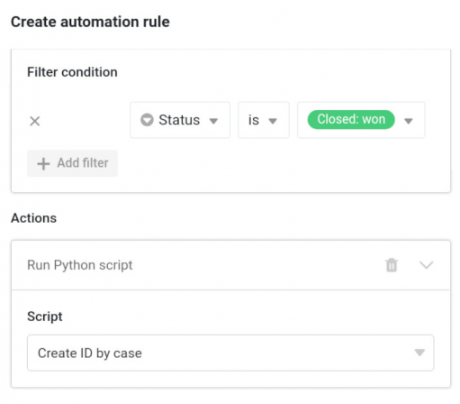

SeaTable 2.5 is out now! The new Docker image was uploaded to Docker Hub at the end of last week and SeaTable Cloud was updated this morning. The new release makes numerous SeaTable features even better! The maturing archive function lends itself to more and more use cases, the data processing operations become more flexible, the integrated automations and the rating column offer more options. Last but not least, link and link formula columns are now fully supported in external links for views. Read on, if you want to know more. For a complete list of changes, have a look at the [SeaTable Changelog]().

## Upgraded archive function

Introduced in [SeaTable 2.3]() as a beta function, our developers have been working tirelessly to push the archive function towards production-readiness. Although we are not quite there yet, SeaTable 2.5 makes great strides in this direction!

The archive function now supports all 24 columns, including the three column types formula, link and formula for link. The lack of write access to the archive data remains a limitation in SeaTable 2.5, but these three columns are special cases: Values in the two formula columns are calculated dynamically, depending on the specification of the formula. If a formula is changed, then the values in the archived rows are recalculated. If the user changes the look-up column in a formula for links, the archive data reflects this change. The same applies to the link column. A change in the display column is made equally in the entire dataset, archive included. In this way, the archived data remains comparable with the non-archived data.

SeaTable 2.5 also adds a print function for archive views and supports hiding columns. A search function as well as an export to Excel function were already implemented in [SeaTable 2.4]().

## Optimized data processing operations

SeaTable's data processing operations are often needed for migrating Excel applications to SeaTable. In SeaTable 2.5 two operations have been improved.

The Compare and Link operation automatically creates links between similar rows in two tables. With it, the conversion of Excel tables into a relational database is done in no time. New in SeaTable 2.5 is the support of all important column types (incl. single selection columns) for the definition of the compare rule. In addition, the operation now also offers more flexibility in the event that the tables are already double-linked. In this case, the user is prompted to select the columns in which the links are to be added via a drop-down menu.

The Calculate Cumulative Values operation calculates totals across rows for columns of numeric data - a standard function in Excel. The operation has been available since the introduction of the data processing function in [SeaTable 2.1,]() but has now been adapted based on user feedback. Specifically, the handling of the very first column was criticised. Now after the revision, the operation sums exclusively via the source column and writes the results to the result column.

## New automation actions and triggers

> **SeaTable now supports four process automation platforms**:  
> Automation has been a key focus over the past weeks and months. We are proud to announce that SeaTable is now available on four integration platforms: In addition to [Zapier](https://zapier.com/apps/seatable/integrations), on which SeaTable has already been present since the beginning of 2021, sophisticated workflows can now also be built with [Integromat](https://www.integromat.com/en/integrations/seatable), [n8n](https://n8n.io/integrations/seatable/) and [Locoia](https://www.locoia.com/connector/seatable-integration).

With all the attention on external [integrations](), we have not lost sight of SeaTable's own automations. The central innovation is the Run Python Script action. It can be triggered by the triggers "New row", "Entries meet a certain condition after change" and "Execute periodically". The automated execution of Python scripts for a single row or a whole dataset using a clear set of rules is almost a superpower!

The existing action "row lock " gets the new trigger event "Periodically execute for rows, which fulfill a certain condition". In combination with the two other triggers "New row" and "Entries meet certain conditions after change", the user now has optimal control over the automatic locking of rows.

Finally, the two scheduled events "Execute periodically" and "Execute periodically for rows, which meet a certain condition" have been given a manual execution option. This makes it convenient to test automations with these triggers.

## More options for the rating column

We all love a wide selection! The new Rating column fulfills exactly this longing for "more". In SeaTable the rating column now offers four styles. Besides the star as the default icon, you can now also choose the heart, the thumbs-up or the flag as the icon. Also, the icon no longer has to be orange.

But the improved rating column is not only about choice, it's also about convenience: SeaTable now automatically calculates summary values at the bottom of the table - min, max, average, and sum. In grouped views, SeaTable computes the summary for each group too.

Using the rating column on mobile devices has become easier and more convenient too. Users can now add rating columns on their mobile phones. In previous versions, SeaTable did not show any reaction when trying to do that. Additionally, the rating icons were enlarged to make their use on small screens more comfortable.

Another improvement of the rating column under development unfortunately didn't make it into this release. So here the announcement: Beginning with SeaTable 2.6, the rating column will have a default value option.

## More improvements

The new function countitems counts the elements in column types that can contain multiple values. These include the File, Image, Employee, and Multiple Selection column types. It is the counterpart of the countlinks function for non-linked elements.

The Excel export and import function has been revised in several places. Exporting formula columns now works smoothly with SeaTable 2.5, even if columns used in the formula are hidden. Another new feature is that new data can be imported from both CSV and XLSX files and that new tables can be created from XLSX files. Users transferring data from SeaTable to Excel will be pleased to hear that the export routine now handles multiple selection fields correctly.

The settings of the gallery plugin have been extended by a setting option. The "Show column names" button can be used to show and hide the headings above the column values. Even though this is not necessary in many cases, it prevents confusion in cases where columns of the same type are directly below each other.
