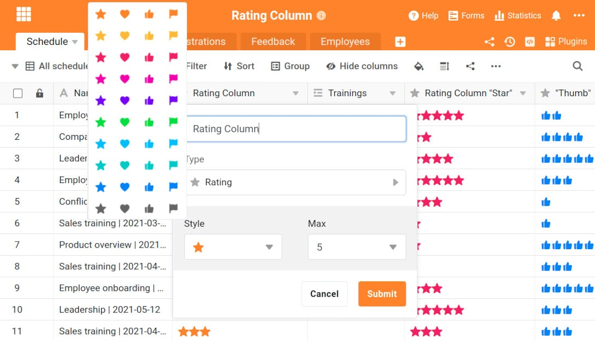

¡SeaTable 2.5 ya está aquí! La nueva imagen Docker se puso a disposición en Docker Hub a finales de la semana pasada y esta mañana SeaTable Cloud se ha actualizado a la última versión. La nueva versión hace que muchas de las funciones de SeaTable sean aún mejores. La función de archivo, con su creciente gama de funciones, se recomienda para un número cada vez mayor de casos de uso, las funciones de procesamiento de datos disponibles se vuelven más flexibles y las automatizaciones integradas, así como la columna de calificación, ofrecen nuevas opciones. También merece una mención: las columnas de tipo de enlace y la fórmula para los enlaces son ahora totalmente compatibles con las vistas externas. Siga leyendo para saber más sobre estas nuevas funciones. La lista completa de cambios se puede encontrar - como siempre - en el [Changelog de SeaTable]().

## Función de archivo revisada

Desde la introducción del archivo como función beta en [la versión 2.3,]() nuestros desarrolladores han trabajado sin descanso para que la función de archivo esté lista para un uso productivo. Con la versión 2.5 aún no hemos alcanzado este objetivo, pero la nueva versión representa un gran paso en esta dirección.

La función de archivo admite ahora las 24 columnas, incluidos los tres tipos de columnas: fórmula, enlace y fórmula para el enlace. La falta de acceso de escritura a los datos del archivo sigue siendo una limitación en SeaTable 2.5, pero estas tres columnas son casos especiales: Los valores de las dos columnas de la fórmula se calculan dinámicamente, en función de la especificación de la fórmula. Si se modifica una fórmula, se recalculan los valores de las filas archivadas. Si el usuario cambia la columna de búsqueda en una fórmula de enlaces, los datos archivados reflejan este cambio. Lo mismo ocurre con la columna de enlaces. Un cambio en la columna de visualización se produce por igual en todo el conjunto de datos, archivo incluido. De este modo, los datos archivados siguen siendo comparables con los no archivados.

SeaTable 2.5 también añade una función de impresión para las vistas de archivo y ahora también permite ocultar columnas individuales en dicha vista. En la [versión 2.4 de SeaTable]() ya se había implementado una función de búsqueda y una función de exportación a Excel.

## Operaciones de procesamiento de datos optimizadas

Las operaciones de procesamiento de datos de SeaTable suelen ser necesarias para migrar las aplicaciones de Excel a SeaTable. En SeaTable 2.5 se han mejorado dos operaciones.

La operación de Comparación y Enlace crea automáticamente enlaces entre filas similares en dos tablas. Con él, la conversión de las tablas de Excel en una base de datos relacional se realiza en muy poco tiempo. La novedad de SeaTable 2.5 es el soporte de todos los tipos de columnas importantes (incluidas las columnas de selección simple) para la definición de la regla de comparación. Además, la operación ahora también ofrece más flexibilidad en el caso de que las tablas ya estén enlazadas dos veces. En este caso, se pide al usuario que seleccione las columnas en las que deben añadirse los enlaces mediante un menú desplegable.

La operación Calcular Valores Acumulados calcula los totales a través de las filas para las columnas de datos numéricos - una función estándar en Excel. La operación ha estado disponible desde la introducción de la función de procesamiento de datos en [SeaTable 2.1,]() pero ahora se ha adaptado en base a los comentarios de los usuarios. En concreto, se criticó la gestión de la primera columna. Ahora, tras la revisión, la operación suma exclusivamente a través de la columna de origen y escribe los resultados en la columna de resultado.

## Nuevos automatismos y activadores

> **SeaTable es ahora compatible con cuatro plataformas de automatización de procesos**:  
> La automatización ha sido un punto clave en las últimas semanas y meses. Estamos orgullosos de anunciar que SeaTable ya está disponible en cuatro plataformas de integración: Además de [Zapier](https://zapier.com/apps/seatable/integrations), en el que SeaTable ya está presente desde principios de 2021, ahora también se pueden construir flujos de trabajo sofisticados con [Integromat](https://www.integromat.com/en/integrations/seatable), [n8n](https://n8n.io/integrations/seatable/) y [Locoia](https://www.locoia.com/connector/seatable-integration).

Con toda la atención puesta en [las integraciones]() externas, no hemos perdido de vista las automatizaciones propias de SeaTable. La innovación central es la acción Ejecutar script Python. Puede activarse mediante los disparadores "Nueva fila", "Las entradas cumplen una determinada condición tras el cambio" y "Ejecutar periódicamente". La ejecución automatizada de scripts de Python para una sola fila o para todo un conjunto de datos utilizando un conjunto de reglas claras es casi una superpotencia.

La acción existente "Bloquear fila" recibe el nuevo evento desencadenante "Ejecutar periódicamente para filas que cumplan una determinada condición". En combinación con los otros dos desencadenantes "Nueva fila" y "Las entradas cumplen determinadas condiciones tras la modificación", el usuario dispone ahora de un control óptimo sobre el bloqueo automático de filas.

Por último, los dos eventos programados "Ejecutar periódicamente" y "Ejecutar periódicamente para filas que cumplan una determinada condición" han recibido una opción de ejecución manual. Esto facilita las pruebas de automatización con estos disparadores.

## Más opciones para la columna de valoración

A todos nos gusta poder elegir. La nueva columna de puntuación satisface exactamente este anhelo de "más". En SeaTable, la columna de valoración ofrece ahora cuatro estilos. Además de la estrella como icono estándar, ahora también puede elegir el corazón, el pulgar hacia arriba o la bandera como icono. Además, el icono ya no tiene que ser naranja.

La columna de valoración revisada no es sólo una cuestión de estética, sino también de comodidad. Al igual que con otras columnas numéricas, SeaTable calcula ahora los valores agregados de las columnas de calificación en la parte inferior de la tabla: mínimo, máximo, media y total. En las vistas agrupadas, SeaTable también calcula valores agregados para los grupos individuales.

Por último, la columna de puntuación se ha optimizado para su uso en dispositivos móviles. Con la última versión, se pueden crear en un teléfono móvil sin problemas. En el pasado, SeaTable se negó a hacerlo. Además, los iconos de la columna de valoración se han ampliado ligeramente, lo que hace más cómodo su uso en pantallas pequeñas.

Otro desarrollo de la columna de valoración no llegó a la versión 2.5. Por lo tanto, aquí está el anuncio: A partir de SeaTable 2.6, las columnas de calificación también podrán tener un valor por defecto.

## Otras mejoras

La nueva función countitems cuenta los elementos de los tipos de columna que pueden contener valores múltiples. Entre ellos se incluyen los tipos de columna archivo, imagen, personal y selección múltiple. Es la contrapartida de la función "countlinks" para elementos no enlazados.

La función de exportación e importación de Excel se ha revisado en varios puntos. La exportación de columnas de fórmulas ahora funciona sin problemas con SeaTable 2.5, incluso si las columnas utilizadas en la fórmula están ocultas. Otra novedad es que se pueden importar nuevos datos tanto de archivos CSV como XLSX y que se pueden crear nuevas tablas a partir de archivos XLSX. Los usuarios que transfieran datos de SeaTable a Excel estarán encantados de saber que la rutina de exportación ahora maneja correctamente los campos de selección múltiple.

Los ajustes del plugin de galería se han ampliado con una opción de configuración. El botón "Mostrar nombres de columnas" permite mostrar u ocultar los títulos situados encima de los valores de las columnas. Aunque esto no sea necesario en muchos casos, evita confusiones en los casos en los que columnas del mismo tipo están directamente una debajo de otra.
